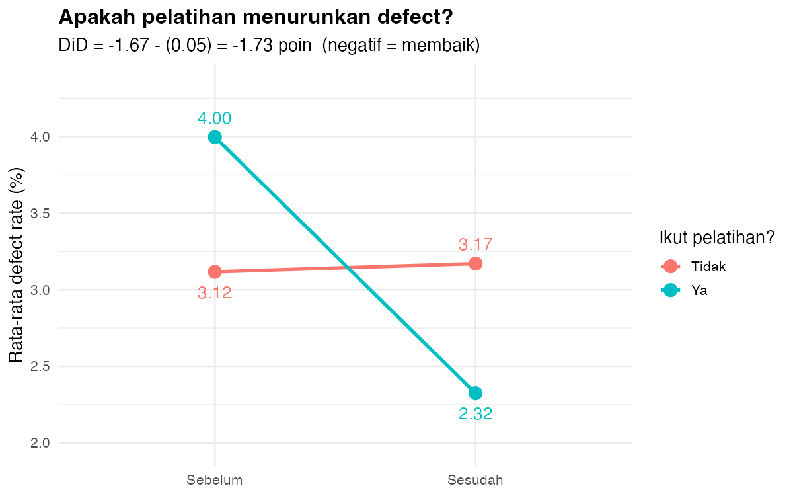

# 🎯 Volume 5 — Causal Inference Sederhana (Studi Kasus Pelatihan Operator)

> Versi **paling simpel**: 1 pertanyaan, 1 metode (Difference-in-Differences), 1 grafik utama.
> Prasyarat: bisa `filter/summarise` (Volume 0) dan baca scatter/line chart.
> Perluasan (opsional): V1–V6 — 4 visual deskriptif + 2 visual what-if untuk diskusi manajer.

---

## 1. Cerita (1 paragraf)

Manajer melatih 20 operator yang defect-nya tinggi. Sesudah pelatihan, defect mereka
turun. **Apakah pelatihan yang menyebabkan penurunan itu?** Tidak bisa langsung
disimpulkan — mungkin defect turun sendiri (musim, mesin baru, dll). Kita butuh
**grup pembanding** (20 operator tak dilatih) dan bandingkan **perubahannya**.

## 2. Data — `data/causal_simple.csv` (80 baris × 5 kolom)

| Kolom | Isi |
|---|---|
| `Operator` | OP-T01…T20 (dilatih), OP-C01…C20 (kontrol) |
| `Dilatih` | Ya / Tidak |
| `Periode` | Sebelum / Sesudah |
| `DefectRate` | defect rate (%) tiap operator tiap periode |
| `Produksi` | unit (kontrol tambahan, tidak dipakai di versi simpel) |

Jebakan yang sengaja ditanam: grup latih **memang mulai lebih buruk** (rata-rata
4,00% vs 3,12%). Jadi perbandingan "sesudah saja" (2,32 vs 3,17, selisih −0,85)
**melebih-lebihkan** efek pelatihan. Inilah *selection bias* — alasan kita butuh DiD.

Buat ulang data kapan saja: `Rscript "Archive/Volume 5 - Causal Inference Sederhana/R/00_buat_data.R"`

## 3. Metode — Difference-in-Differences (1 rumus)

```text
Efek kausal = (Latih_sesudah − Latih_sebelum) − (Kontrol_sesudah − Kontrol_sebelum)
            =        PERUBAHAN grup latih    −      PERUBAHAN grup kontrol
```

Logika: perubahan grup kontrol = "yang akan terjadi tanpa pelatihan".
Mengurangkannya membuang tren umum, menyisakan efek murni pelatihan.
Asumsi satu-satunya: **tren paralel** — tanpa pelatihan, kedua grup akan bergerak
sejajar (masuk akal di sini karena periode pendek & pabrik yang sama).

## 4. Hasil (angka aktual dari data, presisi penuh)

| Grup | Sebelum | Sesudah | Perubahan |
|---|---|---|---|
| Dilatih | 4,00% | 2,32% | **−1,67** |
| Kontrol | 3,12% | 3,17% | **+0,05** |

**Efek kausal = −1,67 − (+0,05) = −1,73 poin defect** (p < 0,001, signifikan).
Angka tampil dibulatkan 2 desimal; regresi `lm(DefectRate ~ Treat + Sesudah + Treat:Sesudah)`
memakai presisi penuh dan memberi **−1,726** — koefisien interaksi
`Treat:Sesudah` itulah efek kausal (sama dengan hitungan manual presisi penuh).



> Catatan file: grafik utama `01_did_sederhana.R` menyimpan `output/did_tren.png`
> (yang ditampilkan di atas). File `R/02_enam_visual.R` menyimpan ulang grafik
> yang sama sebagai `output/V1_did_tren.png` agar berurutan V1–V6.

## 5. Kesimpulan Manajer (1 kalimat)

> Pelatihan menurunkan defect sekitar **1,7 poin** — operator yang tadinya terburuk
> (4%) kini jadi terbaik (2,3%), jadi **lanjutkan & luaskan pelatihan ke semua shift**.

## 6. Cara Menjalankan (dari root repo "Power BI dan R")

Urutan yang disarankan — versi simpel dulu (1 grafik), lalu paket 6 visual:

```bash
Rscript "Archive/Volume 5 - Causal Inference Sederhana/R/00_buat_data.R"    # opsional (buat ulang data)
Rscript "Archive/Volume 5 - Causal Inference Sederhana/R/01_did_sederhana.R" # inti: DiD + output/did_tren.png
Rscript "Archive/Volume 5 - Causal Inference Sederhana/R/02_enam_visual.R"   # V1-V3
Rscript "Archive/Volume 5 - Causal Inference Sederhana/R/03_whatif_visual.R" # V4-V6 (what-if)
```

Luaran: `output/did_tren.png` (grafik utama) + `output/V1_*.png … V6_*.png`
(V1 = salinan bernomor dari `did_tren.png`; V2–V4 deskriptif; V5–V6 what-if).

| # | File | Jenis | Pertanyaan yang dijawab |
|---|---|---|---|
| V1 | `V1_did_tren.png` | Line tren 2 grup | Apakah pelatihan menurunkan defect? (grafik DiD utama) |
| V2 | `V2_bar_perubahan.png` | Bar perubahan | Seberapa besar PERUBAHAN tiap grup? (rumus divisualkan) |
| V3 | `V3_spaghetti_operator.png` | Spaghetti per operator | Apakah efeknya merata ke semua operator? |
| V4 | `V4_distribusi_delta.png` | Histogram delta | Bagaimana sebaran perubahan tiap operator? |
| V5 | `V5_whatif_rollout.png` | What-if rollout | Kalau diluaskan ke semua operator, berapa unit cacat dicegah? |
| V6 | `V6_whatif_sensitivitas.png` | What-if sensitivitas | Bagaimana jika asumsi tren paralel salah? |

## 7. Latihan (3 soal cepat)

1. Hitung manual di kertas: (2,32 − 4,00) − (3,17 − 3,12) = …? (jawaban: −1,73)
2. Mengapa "bandingkan sesudah saja" (2,32 vs 3,17 = selisih −0,85) salah? (petunjuk: level awal beda)
3. Kapan asumsi tren paralel rusak? (contoh: mesin grup latih diganti berbarengan dengan pelatihan)
