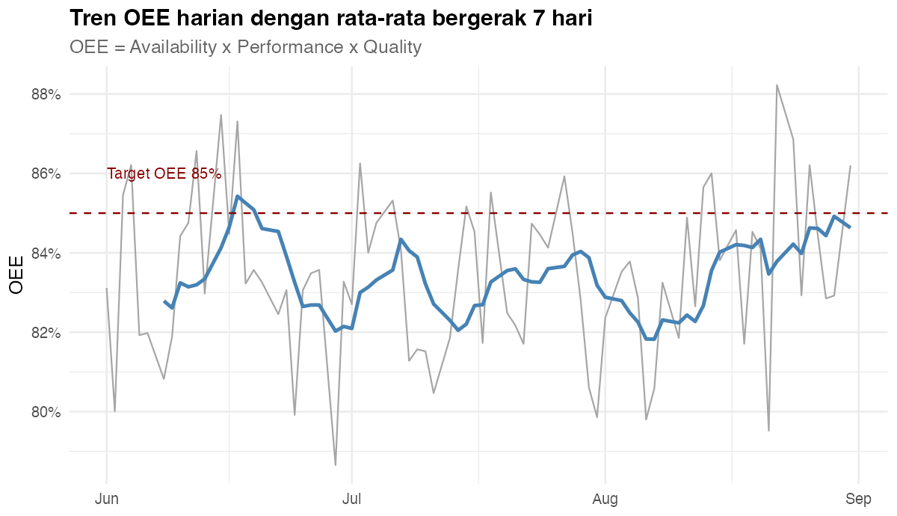
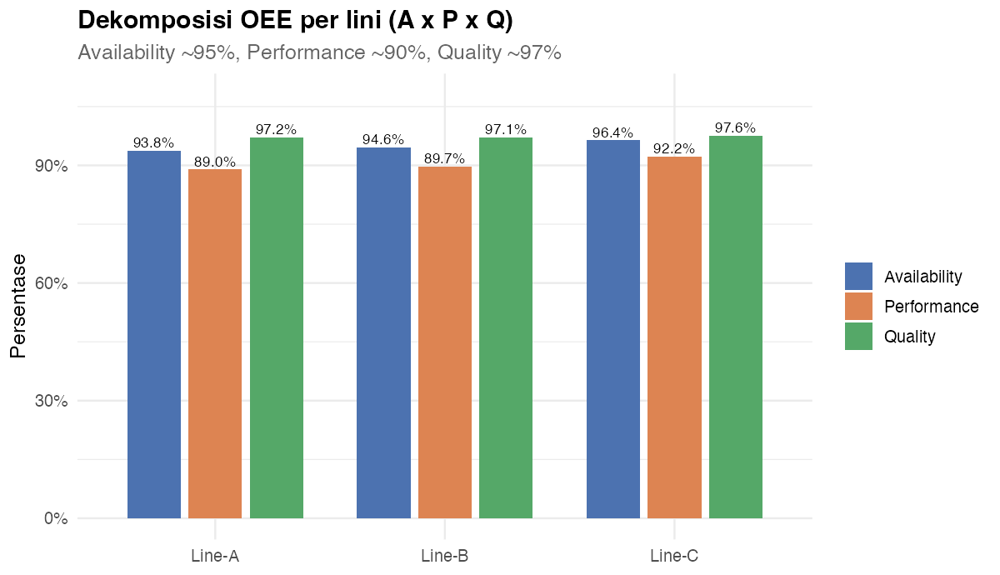
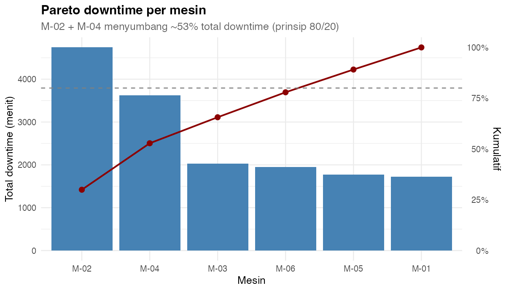
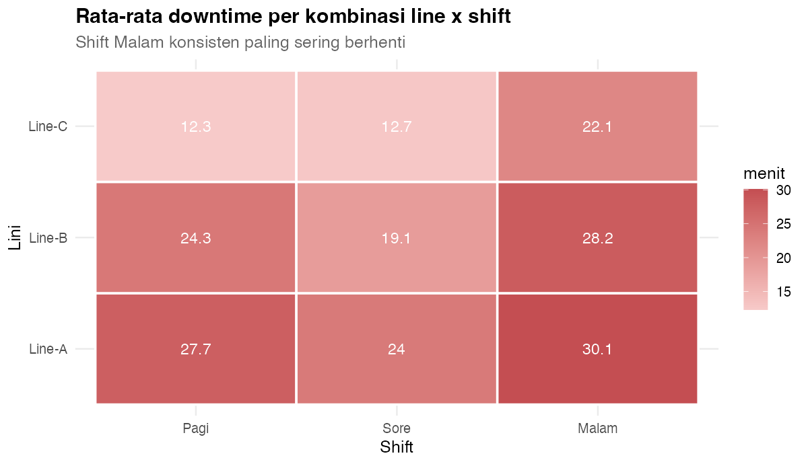
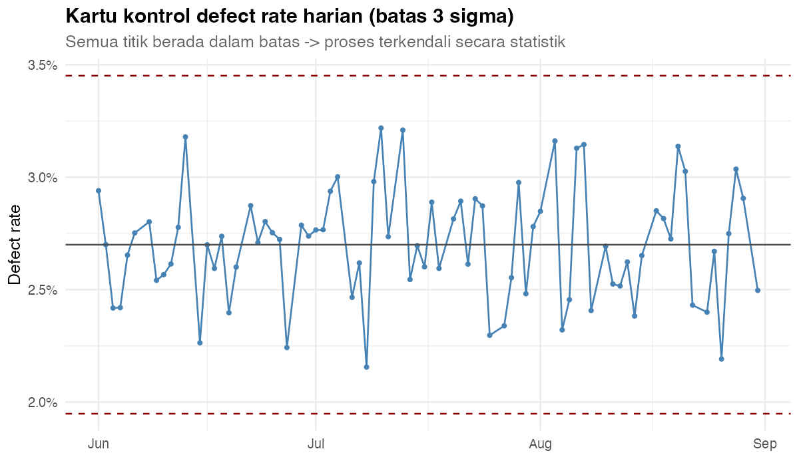
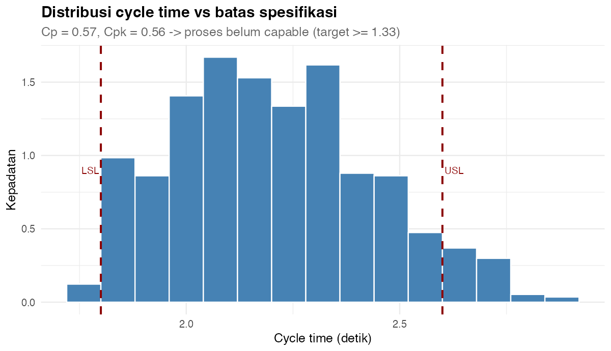
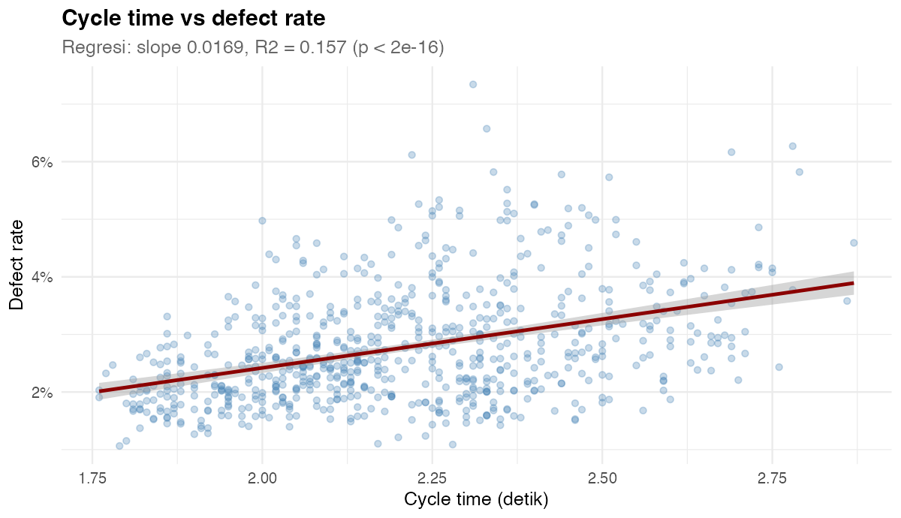
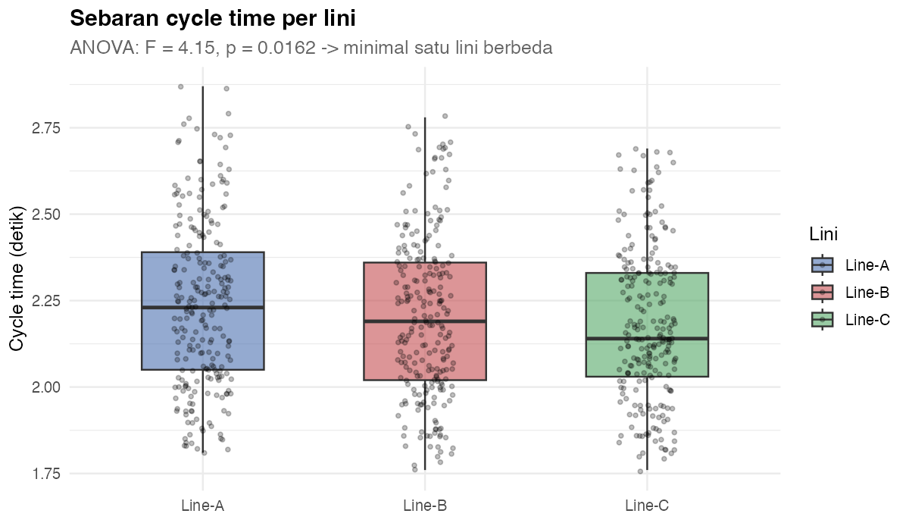

# 📗 Opsi 1 — OEE & Mutu Lini Produksi: Analisis Efektivitas Mesin dengan R

> Proyek **end-to-end** Teknik Industri (level **Basic → Advanced**) yang menggabungkan **`dplyr`** untuk transformasi & statistik, **`ggplot2`** untuk visual, lalu hasilnya siap dipakai sebagai **R visual / data model di Power BI**.
>
> **Pertanyaan inti:** *Mesin dan lini mana yang paling menekan efektivitas, dan apa akar masalahnya?*

---

## 1. Gambaran Umum

| Komponen | Keterangan |
| --- | --- |
| **Nama proyek** | Opsi 1 — OEE & Mutu Lini Produksi |
| **Topik** | OEE (Availability × Performance × Quality), downtime, defect, process capability |
| **Alat IE** | OEE breakdown, Pareto, SPC (kartu kontrol), Cp/Cpk, uji hipotesis, regresi |
| **Bahasa** | R (base + `dplyr` + `ggplot2` + `scales` + `tidyr` + `broom`) |
| **Dataset** | `data/produksi.csv` (**711 baris × 14 kolom**, 1 baris = 1 shift × 1 lini), `data/mesin.csv`, `data/operator.csv` |
| **Level** | Basic (dplyr dasar) → Medium (agregasi & statistik) → Advanced (OEE, Cp/Cpk, model) |
| **Prerequisit** | Volume 0 (Basic R), Volume 1 (ggplot2), Volume 2 (Statistik Inferensial) |
| **Luaran** | 8 visual PNG + 6 tabel analisis + kesimpulan/rekomendasi siap dashboard |

### Alur belajar (roadmap)

```text
dplyr (Basic)
  -> read.csv, filter, select, mutate
  -> group_by + summarise
  -> join dimensi (mesin & operator)

Statistik (Medium)
  -> uji t, ANOVA, uji proporsi
  -> kartu kontrol (3 sigma)
  -> process capability (Cp, Cpk)

Visual & Insight (Advanced)
  -> 8 visual ggplot2
  -> korelasi & regresi
  -> rekomendasi perbaikan berbasis bukti
```

---

## 2. Tujuan Pembelajaran

Setelah menyelesaikan Opsi 1, Anda diharapkan mampu:

1. Menghitung **OEE** lengkap (`Availability × Performance × Quality`) dengan `dplyr`.
2. Membuat **Pareto downtime** dan mengenali prinsip 80/20.
3. Membangun **kartu kontrol** sederhana (batas ±3σ) memakai `dplyr`.
4. Menghitung **Cp & Cpk** untuk menilai kemampuan proses.
5. Menguji hipotesis (uji t, ANOVA, uji proporsi) untuk memastikan perbedaan **nyata**.
6. Membuat 8 visual `ggplot2` yang komunikatif (termasuk sumbu sekunder & heatmap).
7. Menyusun **rekomendasi tindakan** untuk manajemen produksi.

---

## 3. Struktur Folder

```text
Brainstorming/pilihan/01-oee-mutu-lini-produksi/
├── README.md                     # file ini
├── data/
│   ├── produksi.csv              # fakta: 711 shift x lini
│   ├── mesin.csv                 # dimensi mesin
│   └── operator.csv              # dimensi operator
├── R/
│   ├── 00_buat_data.R            # generator data (set.seed(20260901))
│   ├── 01_analisis_dplyr.R       # transformasi + statistik -> output/*.csv
│   └── 02_visual_ggplot2.R       # 8 visual -> output/V*.png
└── output/                       # hasil tabel & gambar
```

---

## 4. Cara Menjalankan

Dari **root repo** (`Power BI dan R`):

```r
source("Brainstorming/pilihan/01-oee-mutu-lini-produksi/R/00_buat_data.R")
source("Brainstorming/pilihan/01-oee-mutu-lini-produksi/R/01_analisis_dplyr.R")
source("Brainstorming/pilihan/01-oee-mutu-lini-produksi/R/02_visual_ggplot2.R")
```

Atau lewat terminal:

```bash
Rscript "Brainstorming/pilihan/01-oee-mutu-lini-produksi/R/01_analisis_dplyr.R"
Rscript "Brainstorming/pilihan/01-oee-mutu-lini-produksi/R/02_visual_ggplot2.R"
```

> Ketiga skrip **path-robust**: bisa dijalankan dari folder mana pun karena lokasi ditentukan otomatis dari `--file=`.

### Kamus data (`produksi.csv`)

| Kolom | Tipe | Keterangan |
| --- | --- | --- |
| `ProductionID` | teks | ID unik `PRD-00001` … |
| `Tanggal` | tanggal | 1 Jun – 31 Agu 2026 (tanpa Minggu) |
| `Shift` | kategori | Pagi / Sore / Malam |
| `Line` | kategori | Line-A / Line-B / Line-C |
| `MachineID` | kategori | M-01 … M-06 |
| `OperatorID` | kategori | OP01 … OP10 |
| `Product` | kategori | Bracket / Housing / Shaft |
| `PlannedTime` | numerik | waktu terencana (menit) |
| `RunTime` | numerik | waktu jalan aktual (menit) |
| `DowntimeMin` | numerik | menit berhenti |
| `Output` | numerik | unit diproduksi |
| `Defect` | numerik | unit cacat |
| `IdealCycleSec` | numerik | cycle time ideal (detik/unit) |
| `CycleTimeSec` | numerik | cycle time aktual (detik/unit) |

---

## 5. dplyr Basic — Membaca & Merangkum

```r
library(dplyr)

d <- read.csv("data/produksi.csv") |>
  mutate(Tanggal = as.Date(Tanggal),
         Line    = factor(Line, levels = c("Line-A", "Line-B", "Line-C")),
         Shift   = factor(Shift, levels = c("Pagi", "Sore", "Malam")))

# ringkasan cepat
d |> summarise(TotalOutput = sum(Output),
               TotalDefect = sum(Defect),
               DefectRate  = TotalDefect / TotalOutput)
```

**Output:**

```text
  TotalOutput TotalDefect DefectRate
1     6346141      171564    0.02704
```

---

## 6. dplyr Medium — OEE per Lini

```r
oee_line <- d |> group_by(Line) |>
  summarise(Availability = sum(RunTime) / sum(PlannedTime),
            Performance  = sum(Output * IdealCycleSec / 60) / sum(RunTime),
            Quality      = 1 - sum(Defect) / sum(Output),
            OEE = Availability * Performance * Quality,
            DefectRate = sum(Defect) / sum(Output),
            .groups = "drop")

oee_line
```

**Output (nilai aktual):**

| Line | Availability | Performance | Quality | **OEE** | Defect rate |
| --- | --- | --- | --- | --- | --- |
| Line-A | 93,80% | 88,96% | 97,20% | **81,11%** | 2,80% |
| Line-B | 94,58% | 89,72% | 97,13% | **82,42%** | 2,87% |
| Line-C | 96,43% | 92,21% | 97,57% | **86,76%** | 2,43% |

**OEE keseluruhan: 83,43%** — di bawah benchmark dunia (85%).

> **Baca begini:** Quality sudah baik (~97%), Availability juga tinggi (~95%). Yang paling menahan OEE adalah **Performance (~90%)** — mesin berjalan, tapi **lebih lambat dari kecepatan ideal**. Ini menunjuk ke *speed loss*, bukan *breakdown* murni.

---

## 7. Visual 1 — Tren OEE Harian

```r
library(ggplot2); library(scales)

oee_harian <- d |> group_by(Tanggal) |>
  summarise(OEE = (sum(RunTime) / sum(PlannedTime)) *
              (sum(Output * IdealCycleSec / 60) / sum(RunTime)) *
              (1 - sum(Defect) / sum(Output)), .groups = "drop") |>
  mutate(MA7 = as.numeric(stats::filter(OEE, rep(1 / 7, 7), sides = 1)))

ggplot(oee_harian, aes(x = Tanggal, y = OEE)) +
  geom_line(color = "grey65", linewidth = 0.5) +
  geom_line(aes(y = MA7), color = "steelblue", linewidth = 1.1, na.rm = TRUE) +
  geom_hline(yintercept = 0.85, linetype = "dashed", color = "darkred") +
  scale_y_continuous(labels = percent_format(accuracy = 1)) +
  labs(title = "Tren OEE harian dengan rata-rata bergerak 7 hari",
       x = NULL, y = "OEE") + theme_minimal()
```



> **Baca begini:** garis biru (MA7) memperhalus gejolak harian. Terlihat OEE **berfluktuasi di sekitar 83%**, sesekali menyentuh target 85% tetapi tidak bertahan. Artinya perbaikan masih **reaktif**, belum ada perbaikan sistemik.

---

## 8. Visual 2 — Dekomposisi OEE per Lini

```r
library(tidyr)

oee_long <- oee_line |>
  tidyr::pivot_longer(c(Availability, Performance, Quality),
                      names_to = "Komponen", values_to = "Nilai")

ggplot(oee_long, aes(x = Line, y = Nilai, fill = Komponen)) +
  geom_col(position = position_dodge(0.8), width = 0.7) +
  geom_text(aes(label = scales::percent(Nilai, accuracy = 0.1)),
            position = position_dodge(0.8), vjust = -0.3, size = 3) +
  scale_y_continuous(labels = percent_format(accuracy = 1)) +
  labs(title = "Dekomposisi OEE per lini (A x P x Q)",
       x = NULL, y = "Persentase") + theme_minimal()
```



| Line | A | P | Q | OEE |
| --- | --- | --- | --- | --- |
| Line-A | 93,80% | 88,96% | 97,20% | **81,11%** |
| Line-B | 94,58% | 89,72% | 97,13% | **82,42%** |
| Line-C | 96,43% | 92,21% | 97,57% | **86,76%** |

> **Baca begini:** batang **Performance paling pendek di semua lini**, terutama Line-A (88,96%). Karena Availability sudah tinggi, menambah maintenance tidak banyak menolong — **diet utamanya adalah menaikkan kecepatan (Performance)**.

---

## 9. Visual 3 — Pareto Downtime per Mesin

```r
pareto <- d |> group_by(MachineID) |>
  summarise(Downtime = sum(DowntimeMin), .groups = "drop") |>
  arrange(desc(Downtime)) |>
  mutate(Kumulatif = cumsum(Downtime) / sum(Downtime),
         MachineID = factor(MachineID, levels = MachineID))

ggplot(pareto, aes(x = MachineID)) +
  geom_col(aes(y = Downtime), fill = "steelblue") +
  geom_point(aes(y = Kumulatif * max(Downtime)), color = "darkred", size = 2.5) +
  geom_line(aes(y = Kumulatif * max(Downtime), group = 1), color = "darkred") +
  scale_y_continuous(name = "Total downtime (menit)",
                     sec.axis = sec_axis(~ . / max(pareto$Downtime),
                                         labels = percent_format(accuracy = 1))) +
  labs(title = "Pareto downtime per mesin", x = "Mesin") + theme_minimal()
```



| Mesin | Downtime (menit) | Kumulatif |
| --- | --- | --- |
| **M-02** | 4.742 | 29,9% |
| **M-04** | 3.624 | **52,8%** |
| M-03 | 2.028 | 65,6% |
| M-06 | 1.947 | 77,9% |
| M-05 | 1.774 | 89,1% |
| M-01 | 1.725 | 100,0% |

> **Baca begini:** **2 mesin (M-02 & M-04) menyumbang 52,8% downtime** — prinsip 80/20 bekerja. Keduanya bertipe **Press** (lihat `mesin.csv`). Fokuskan *preventive maintenance* di sini daripada menyebar rata ke 6 mesin.

---

## 10. Visual 4 — Heatmap Downtime Line × Shift

```r
heat <- d |> group_by(Line, Shift) |>
  summarise(Menit = mean(DowntimeMin), .groups = "drop")

ggplot(heat, aes(x = Shift, y = Line, fill = Menit)) +
  geom_tile(color = "white", linewidth = 0.8) +
  geom_text(aes(label = round(Menit, 1)), color = "white", size = 4) +
  scale_fill_gradient(low = "#F7CAC9", high = "#C44E52", name = "menit") +
  labs(title = "Rata-rata downtime per line x shift",
       x = "Shift", y = "Lini") + theme_minimal()
```



> **Baca begini:** warna **merah paling pekat ada di kolom Malam untuk semua lini**. Rata-rata downtime shift malam (±26 menit) jauh di atas Pagi/Sore (±13 menit). Ini pola **sistemik lintas-lini** → dugaan kuat: kelelahan operator, handover pergantian shift, atau pasokan material malam yang tidak lancar.

---

## 11. Visual 5 — Kartu Kontrol Defect Rate (SPC)

```r
kk <- d |> group_by(Tanggal) |>
  summarise(DefectRate = sum(Defect) / sum(Output), .groups = "drop") |>
  mutate(CL  = mean(DefectRate),
         UCL = CL + 3 * sd(DefectRate),
         LCL = pmax(0, CL - 3 * sd(DefectRate)))

ggplot(kk, aes(x = Tanggal, y = DefectRate)) +
  geom_line(color = "steelblue") +
  geom_point(color = "steelblue") +
  geom_hline(yintercept = kk$CL[1],  color = "grey30") +
  geom_hline(yintercept = kk$UCL[1], linetype = "dashed", color = "darkred") +
  geom_hline(yintercept = kk$LCL[1], linetype = "dashed", color = "darkred") +
  scale_y_continuous(labels = percent_format(accuracy = 0.1)) +
  labs(title = "Kartu kontrol defect rate harian (3 sigma)",
       x = NULL, y = "Defect rate") + theme_minimal()
```



> **Baca begini:** **0 dari 79 hari menembus batas ±3σ** → proses **terkendali secara statistik** (tidak ada penyebab khusus). Konsekuensinya penting: defect 2,7% bukan karena "kecelakaan" sesekali, melainkan **level alami sistem saat ini**. Menurunkannya butuh **perbaikan fundamental** (perubahan desain proses), bukan sekadar menegur operator saat ada lonjakan.

---

## 12. Visual 6 — Process Capability (Cp & Cpk)

```r
LSL <- 1.8; USL <- 2.6           # batas spesifikasi cycle time (detik)
ct  <- d$CycleTimeSec
Cp  <- (USL - LSL) / (6 * sd(ct))
Cpk <- min(USL - mean(ct), mean(ct) - LSL) / (3 * sd(ct))

ggplot(d, aes(x = CycleTimeSec)) +
  geom_histogram(aes(y = after_stat(density)), binwidth = 0.08,
                 fill = "steelblue", color = "white") +
  geom_vline(xintercept = c(LSL, USL), linetype = "dashed", color = "darkred") +
  labs(title = "Distribusi cycle time vs spesifikasi",
       x = "Cycle time (detik)", y = "Kepadatan") + theme_minimal()
```



**Output:**

```text
Cp = 0.57, Cpk = 0.56, mean = 2.21, sd = 0.23
```

> **Baca begini:** Cp & Cpk **keduanya ±0,57**, jauh di bawah **1,33** (minimum industri). Artinya spesifikasi (1,8–2,6 detik) terlalu sempit dibanding sebaran proses — **proses belum mampu memenuhi spesifikasi**. Karena Cp ≈ Cpk, masalahnya bukan "off-center", tapi **sebaran terlalu lebar**. Solusi: kurangi variasi (standardisasi setup, kontrol parameter mesin), atau tinjau ulang apakah batas spesifikasi realistis.

---

## 13. Visual 7 — Korelasi & Regresi: Cycle Time → Defect

```r
d2  <- d |> mutate(DefectRate = Defect / Output)
reg <- lm(DefectRate ~ CycleTimeSec, data = d2)
summary(reg)

ggplot(d2, aes(x = CycleTimeSec, y = DefectRate)) +
  geom_point(alpha = 0.3, color = "steelblue") +
  geom_smooth(method = "lm", color = "darkred") +
  scale_y_continuous(labels = percent_format(accuracy = 1)) +
  labs(title = "Cycle time vs defect rate",
       x = "Cycle time (detik)", y = "Defect rate") + theme_minimal()
```



**Output:**

```text
R2 = 0.157, slope p = 3.45e-28
```

> **Baca begini:** p-value sangat kecil → hubungan **nyata secara statistik**. Namun **R² hanya 0,157**, artinya cycle time menjelaskan **hanya ~16% variasi defect rate** — 84% lainnya dari faktor lain (operator, material, mesin). **Pelajaran penting:** signifikan ≠ kuat. Jangan menjadikan cycle time satu-satunya kambing hitam.

---

## 14. Visual 8 — ANOVA: Cycle Time Antar Lini

```r
tt <- t.test(d$CycleTimeSec[d$Line == "Line-A"],
             d$CycleTimeSec[d$Line == "Line-B"], var.equal = TRUE)
av <- aov(CycleTimeSec ~ Line, data = d)
summary(av); TukeyHSD(av)

ggplot(d, aes(x = Line, y = CycleTimeSec, fill = Line)) +
  geom_boxplot(alpha = 0.6, outlier.shape = NA) +
  geom_jitter(width = 0.13, alpha = 0.25, size = 1) +
  labs(title = "Sebaran cycle time per lini", x = NULL, y = "Cycle time (detik)") +
  theme_minimal()
```



**Output:**

```text
t-test A vs B : t = 1.76, p = 0.0796        -> TIDAK signifikan
ANOVA 3 lini  : F = 4.15, p = 0.0162         -> signifikan
prop.test A/B : X2 = 23.98, p = 9.75e-07     -> sangat signifikan
```

> **Baca begini — contoh sempurna "kenapa ANOVA dulu, bukan langsung t-test":**
> - Secara **pairwise** A vs B, cycle time **tidak berbeda signifikan** (p = 0,080).
> - Tapi **ANOVA 3 lini signifikan** (p = 0,016) → minimal satu lini beda; kemungkinan besar **Line-C** yang lebih cepat.
> - Sementara **defect rate A vs B sangat berbeda** (p = 9,7×10⁻⁷) meski cycle time-nya mirip → **penyebab defect B bukan kecepatan**, melainkan hal lain (mis. setelan mesin Press M-02/M-04).

---

## 15. Advanced — Simulasi Perbaikan (What-If)

Setelah tahu Performance adalah penekan utama, kita uji **"apa yang terjadi jika Performance naik?"** — memakai `dplyr`, tanpa mengubah data asli.

```r
skenario <- expand.grid(PerfGain = c(0, 0.03, 0.05, 0.08)) |>
  rowwise() |>
  mutate(
    OEE_baru = with(d, (sum(RunTime) / sum(PlannedTime)) *
                      pmin((sum(Output * IdealCycleSec / 60) / sum(RunTime)) *
                             (1 + PerfGain), 1) *
                      (1 - sum(Defect) / sum(Output))))
print(as.data.frame(skenario))

ggplot(skenario, aes(x = factor(PerfGain), y = OEE_baru)) +
  geom_col(fill = "steelblue") +
  geom_text(aes(label = percent(OEE_baru, accuracy = 0.1)), vjust = -0.4) +
  geom_hline(yintercept = 0.85, linetype = "dashed", color = "darkred") +
  scale_y_continuous(labels = percent_format(accuracy = 1), limits = c(0, 0.95)) +
  labs(title = "Simulasi: dampak kenaikan Performance terhadap OEE",
       subtitle = "Garis putus-putus = target 85%",
       x = "Kenaikan performance", y = "OEE proyeksi") + theme_minimal()
```

> **Baca begini:** kenaikan Performance **+5%** mendorong OEE dari 83,4% menuju **±87%** — menembus target 85%. Inilah kenapa prioritasnya adalah **speed loss**, bukan menambah frekuensi maintenance.

---

## 16. Integrasi ke Power BI

| Tahap | Cara |
| --- | --- |
| **Sumber data** | `data/produksi.csv` → **Get Data > Text/CSV** |
| **R di Power Query** | Tempel fungsi `oee_calc()` dari `01_analisis_dplyr.R` pada **Transform > Run R script** → hasilkan tabel `OEE_Line` |
| **R visual** | Tempel blok `ggplot2` dari `02_visual_ggplot2.R` pada **R visual**; masukkan kolom `Line`, `Output`, `Defect`, `RunTime` ke **Values** |
| **KPI card** | OEE 83,43% · Availability 94,94% · Performance 90,31% · Quality 97,30% |

> **Penting:** R visual dirender sebagai **gambar statis**. Slicer Power BI tetap menyaring data yang dikirim ke R, tetapi elemen di dalam gambar tidak bisa diklik. Selalu sertakan kolom yang dibutuhkan di **Values**.

---

## 17. Kesimpulan & Rekomendasi

**Kondisi saat ini:** OEE keseluruhan **83,43%** (di bawah target 85%), defect rate **2,70%**, Cp/Cpk **0,57** (proses belum capable).

| # | Temuan | Bukti | Rekomendasi |
| --- | --- | --- | --- |
| 1 | **Performance** paling menekan OEE | P = 90,31% vs A = 94,94%, Q = 97,30% | Studi *speed loss*: setelan kecepatan mesin, waktu setup, micro-stop |
| 2 | **M-02 & M-04** penyumbang downtime terbesar | 52,8% kumulatif (Pareto) | *Preventive maintenance* khusus kedua mesin Press ini |
| 3 | **Shift Malam** konsisten terburuk | Heatmap merah; downtime ±2× shift lain | Perkuat handover, cek material & pencahayaan malam |
| 4 | Proses **terkendali tapi tidak capable** | 0 titik out-of-control, tapi Cpk 0,56 | Kurangi **variasi**, atau tinjau ulang spesifikasi |
| 5 | Defect Line-B **bukan** karena kecepatan | prop.test p = 9,7×10⁻⁷ tapi cycle time A≈B (p = 0,080) | Telusuri faktor lain: mesin, material, metode Line-B |

**Format insight (kondisi – bukti – tindakan):**

> **Kondisi:** OEE 83,43%, tertahan oleh Performance (90,31%).
> **Bukti:** 52,8% downtime dari M-02 & M-04; shift Malam downtime 2×; Cpk hanya 0,56.
> **Tindakan:** *Preventive maintenance* terfokus M-02/M-04, program perbaikan shift Malam, proyek reduksi variasi cycle time — target OEE ≥ 87%.

