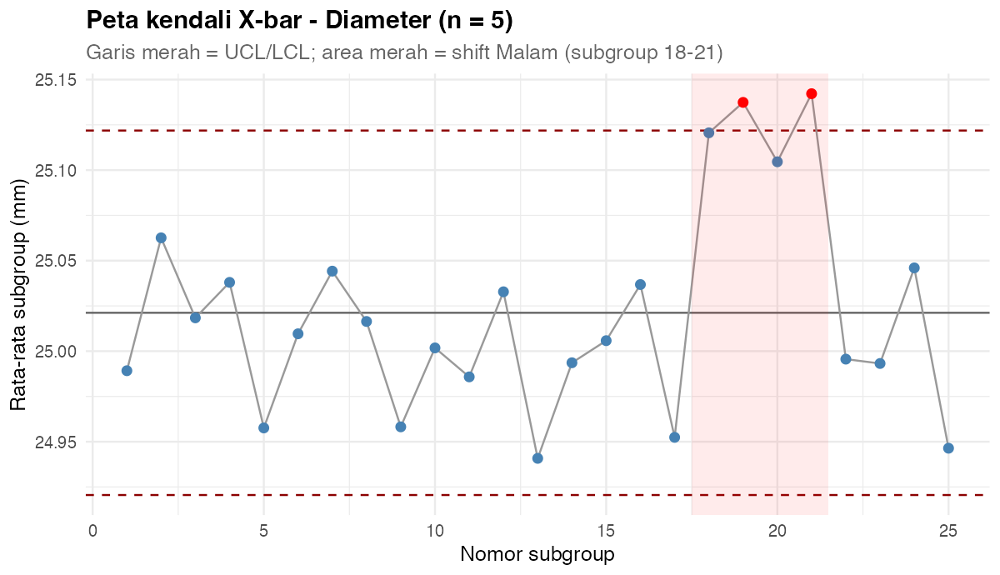
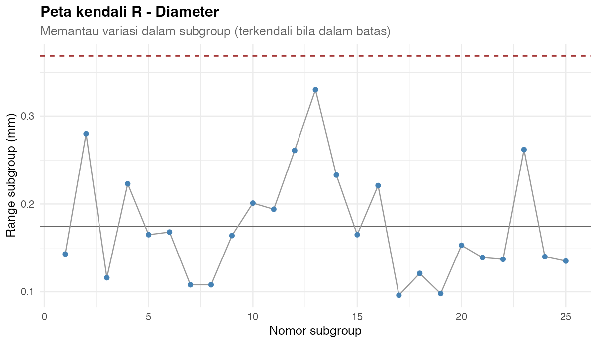
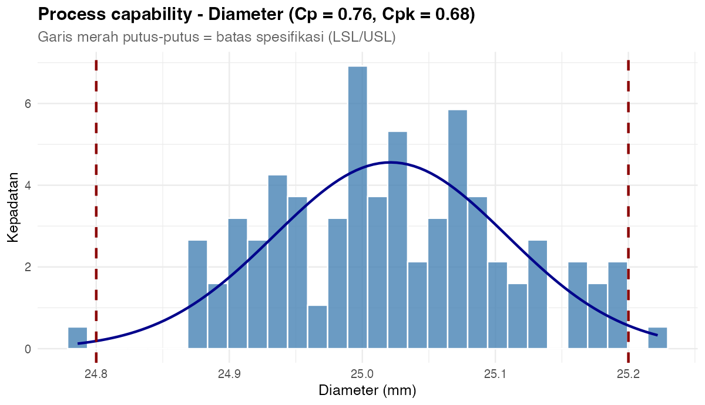
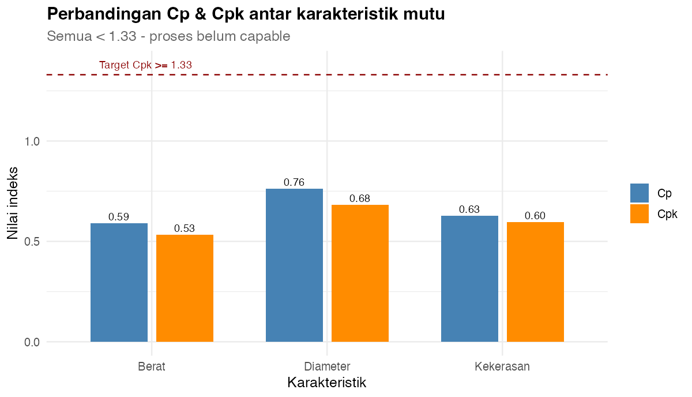
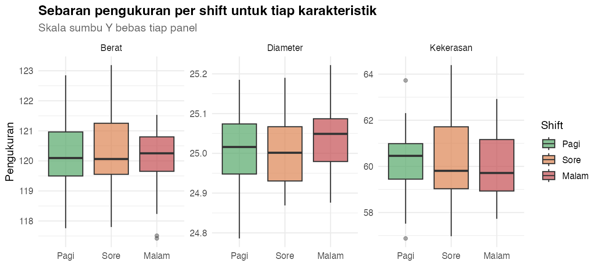
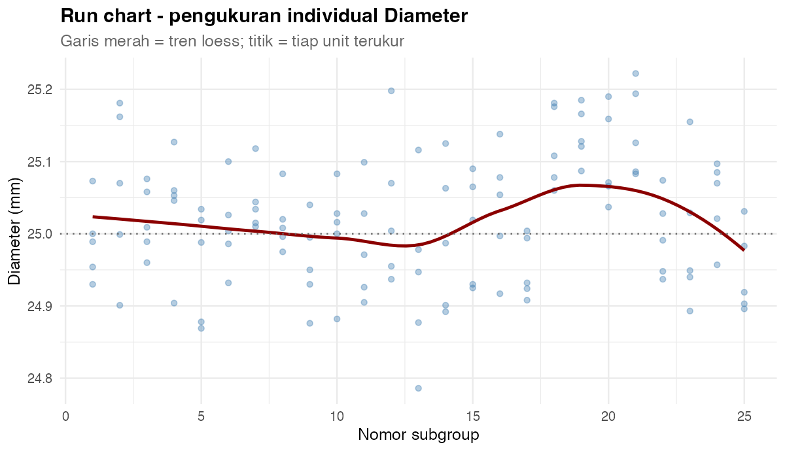
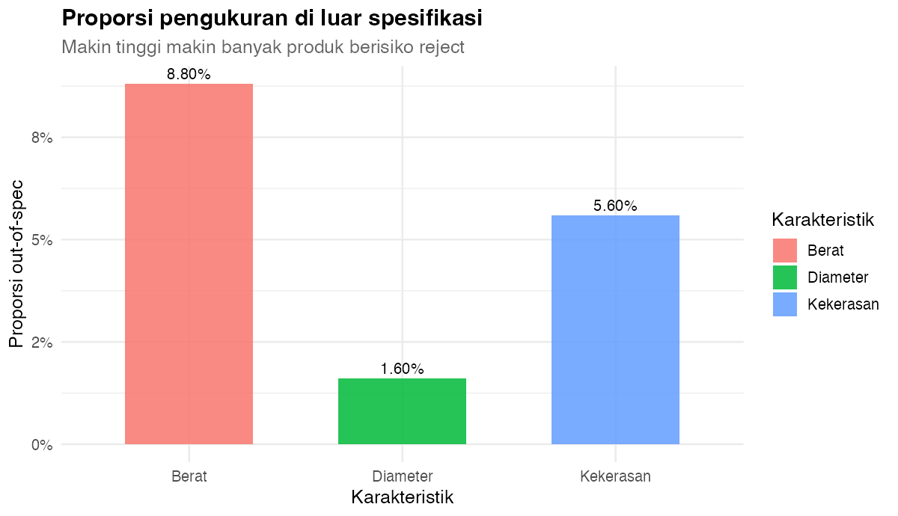

# 📗 Opsi 2 — Pengendalian Kualitas Statistik (SPC): X-bar/R, Cp & Cpk dengan R

> Proyek **end-to-end** Teknik Industri (level **Basic → Advanced**) yang menggabungkan **`dplyr`** untuk transformasi & statistik kualitas, **`ggplot2`** untuk peta kendali & capability, lalu hasilnya siap dipakai sebagai **R visual / data model di Power BI**.
>
> **Pertanyaan inti:** *Apakah proses terkendali secara statistik, dan apakah proses mampu memenuhi spesifikasi?*

---

## 1. Gambaran Umum

| Komponen | Keterangan |
| --- | --- |
| **Nama proyek** | Opsi 2 — Pengendalian Kualitas Statistik (SPC) |
| **Topik** | Peta kendali X-bar & R, process capability (Cp/Cpk), out-of-spec |
| **Alat IE** | SPC 3-sigma, konstanta peta kendali (A₂, D₃, D₄), Cp/Cpk, uji normalitas, uji t, ANOVA |
| **Bahasa** | R (base + `dplyr` + `ggplot2` + `scales` + `tidyr` + `broom`) |
| **Dataset** | `data/qc_karakteristik.csv` (**375 baris × 6 kolom**), `data/spesifikasi.csv` (3 baris × 4 kolom) |
| **Level** | Basic (dplyr dasar) → Medium (peta kendali & capability) → Advanced (uji hipotesis & what-if) |
| **Prerequisit** | Volume 0 (Basic R), Volume 1 (ggplot2), Volume 2 (Statistik Inferensial) |
| **Luaran** | 7 visual PNG + 3 tabel analisis + kesimpulan/rekomendasi siap dashboard |

### Alur belajar (roadmap)

```text
dplyr (Basic)
  -> read.csv, filter, select, mutate
  -> group_by + summarise (Xbar & R per subgroup)
  -> join tabel spesifikasi

Statistik (Medium)
  -> peta kendali X-bar & R (batas 3-sigma)
  -> process capability (Cp, Cpk)
  -> proporsi out-of-spec

Visual & Insight (Advanced)
  -> 7 visual ggplot2
  -> uji normalitas, uji t, ANOVA
  -> rekomendasi perbaikan berbasis bukti
```

---

## 2. Tujuan Pembelajaran

Setelah menyelesaikan Opsi 2, Anda diharapkan mampu:

1. Menyusun data pengukuran per **subgroup** dan menghitung **X̄ & R** dengan `dplyr`.
2. Membangun **peta kendali X-bar & R** memakai konstanta standar (n = 5).
3. Mengidentifikasi titik **out-of-control** dan menghubungkannya dengan konteks proses.
4. Menghitung **Cp & Cpk** dan menafsirkan kemampuan proses.
5. Menghitung **proporsi out-of-spec** sebagai risiko reject.
6. Menguji asumsi & hipotesis (normalitas, uji t, ANOVA) dengan `broom`.
7. Menyusun **rekomendasi tindakan** untuk tim quality assurance.

---

## 3. Struktur Folder

```text
Brainstorming/pilihan/02-pengendalian-kualitas-spc/
├── README.md                     # file ini
├── data/
│   ├── qc_karakteristik.csv      # fakta: 375 unit terukur (3 karakteristik × 25 subgroup × 5 sampel)
│   └── spesifikasi.csv           # dimensi: LSL / Target / USL per karakteristik
├── R/
│   ├── 00_buat_data.R            # generator data (set.seed(20260902))
│   ├── 01_analisis_dplyr.R       # peta kendali + capability + uji -> output/*.csv
│   └── 02_visual_ggplot2.R       # 7 visual -> output/V*.png
└── output/                       # hasil tabel & gambar
```

---

## 4. Cara Menjalankan

Dari **root repo** (`Power BI dan R`):

```r
source("Brainstorming/pilihan/02-pengendalian-kualitas-spc/R/00_buat_data.R")
source("Brainstorming/pilihan/02-pengendalian-kualitas-spc/R/01_analisis_dplyr.R")
source("Brainstorming/pilihan/02-pengendalian-kualitas-spc/R/02_visual_ggplot2.R")
```

Atau lewat terminal:

```bash
Rscript "Brainstorming/pilihan/02-pengendalian-kualitas-spc/R/01_analisis_dplyr.R"
Rscript "Brainstorming/pilihan/02-pengendalian-kualitas-spc/R/02_visual_ggplot2.R"
```

> Ketiga skrip **path-robust**: bisa dijalankan dari folder mana pun karena lokasi ditentukan otomatis dari `--file=`.

### Kamus data (`qc_karakteristik.csv`)

| Kolom | Tipe | Keterangan |
| --- | --- | --- |
| `Karakteristik` | kategori | Diameter / Berat / Kekerasan |
| `Subgroup` | integer | 1 … 25 (nomor subgroup) |
| `Sampel` | integer | 1 … 5 (unit dalam subgroup) |
| `Pengukuran` | numerik | nilai hasil pengukuran |
| `Shift` | kategori | Pagi / Sore / Malam |
| `Mesin` | kategori | M-01 / M-02 / M-03 |

**Spesifikasi (`spesifikasi.csv`):**

| Karakteristik | LSL | Target | USL |
| --- | --- | --- | --- |
| Diameter | 24,80 | 25,00 | 25,20 |
| Berat | 118,0 | 120,0 | 122,0 |
| Kekerasan | 57,0 | 60,0 | 63,0 |

**Pola yang sengaja ditanam:** subgroup **18–21** (shift Malam) bergeser naik — inilah "sinyal" yang harus ditemukan peta kendali.

---
## 5. dplyr Basic — Membaca & Merangkum

```r
library(dplyr)

d <- read.csv("data/qc_karakteristik.csv") |>
  mutate(Karakteristik = factor(Karakteristik),
         Shift = factor(Shift, levels = c("Pagi", "Sore", "Malam")))

# ringkasan cepat per karakteristik
d |>
  group_by(Karakteristik) |>
  summarise(rata = mean(Pengukuran), sd = sd(Pengukuran), n = n(), .groups = "drop")
```

**Output:**

```text
  Karakteristik  rata    sd   n
1 Diameter       25.021  0.088 125
2 Berat         120.199  1.128 125
3 Kekerasan     60.155  1.592 125
```

> **Baca begini:** tiap karakteristik punya **125 unit terukur** (25 subgroup × 5 sampel). Rata-rata Diameter 25,021 sudah dekat target 25,00 — tetapi ingat, kedekatan rata-rata **belum** menjamin proses mampu; lihat sebarannya di Bab 12.

---

## 6. dplyr Medium — Peta Kendali X-bar & R

Peta kendali memerlukan **statistik per subgroup**: rata-rata (X̄) dan range (R). Lalu batas 3-sigma dihitung dari konstanta standar untuk **n = 5**.

```r
# konstanta peta kendali untuk n = 5
A2 <- 0.577; D3 <- 0; D4 <- 2.114; d2 <- 2.326

peta <- d |>
  group_by(Karakteristik, Subgroup) |>
  summarise(Xbar = mean(Pengukuran), R = max(Pengukuran) - min(Pengukuran),
            .groups = "drop") |>
  group_by(Karakteristik) |>
  mutate(Xbarbar = mean(Xbar), Rbar = mean(R),
         UCL_x = Xbarbar + A2 * Rbar, LCL_x = Xbarbar - A2 * Rbar,
         UCL_r = D4 * Rbar,          LCL_r = D3 * Rbar,
         OutOfControl = (Xbar > UCL_x | Xbar < LCL_x | R > UCL_r)) |>
  ungroup()
```

**Output — batas kendali & titik out-of-control:**

```text
  Karakteristik Xbarbar  Rbar     UCL     LCL OOC
1 Berat          120.199 2.564 121.679 118.720   0
2 Diameter        25.021 0.174  25.122  24.921   2
3 Kekerasan       60.155 3.485  62.166  58.144   1
```

> **Baca begini:** Ada **3 titik out-of-control** dari 75 subgroup (total). Semuanya di **Diameter (2)** dan **Kekerasan (1)**. Kalau kita telusuri nomor subgroup-nya (Bab 7), titik-titik itu jatuh pada subgroup **18–21** — persis periode "geser" yang ditanam, yaitu shift Malam. **Inilah nilai SPC:** mata manusia bisa melihat tabel tanpa curiga, tetapi peta kendali **menunjuk sinyal** secara objektif.

**Mengapa n = 5?** Konstanta A₂, D₃, D₄ bergantung pada ukuran subgroup. Tabel di bawah adalah nilai baku (*control chart constants*) — sesuaikan bila memakai n lain.

| n | A₂ | D₃ | D₄ | d₂ |
| --- | --- | --- | --- | --- |
| 4 | 0,729 | 0 | 2,282 | 2,059 |
| **5** | **0,577** | **0** | **2,114** | **2,326** |
| 6 | 0,483 | 0 | 2,004 | 2,534 |
| 7 | 0,419 | 0,076 | 1,924 | 2,704 |

---

## 7. Visual 1 — Peta Kendali X-bar (Diameter)

```r
library(ggplot2); library(scales)

px <- peta |> filter(Karakteristik == "Diameter")

ggplot(px, aes(x = Subgroup, y = Xbar)) +
  geom_hline(yintercept = px$Xbarbar[1], color = "grey40") +
  geom_hline(yintercept = px$UCL_x[1], color = "darkred", linetype = "dashed") +
  geom_hline(yintercept = px$LCL_x[1], color = "darkred", linetype = "dashed") +
  geom_line(color = "grey60") +
  geom_point(aes(color = OutOfControl), size = 2.2) +
  scale_color_manual(values = c(`FALSE` = "steelblue", `TRUE` = "red"), guide = "none") +
  annotate("rect", xmin = 17.5, xmax = 21.5, ymin = -Inf, ymax = Inf,
           alpha = 0.08, fill = "red") +
  labs(title = "Peta kendali X-bar - Diameter (n = 5)",
       subtitle = "Garis merah = UCL/LCL; area merah = shift Malam (subgroup 18-21)",
       x = "Nomor subgroup", y = "Rata-rata subgroup (mm)") +
  theme_minimal(base_size = 12)
```



> **Baca begini:** dua **titik merah** (subgroup di dalam pita merah) menembus **UCL = 25,122**. Ini bukan variasi biasa — peta kendali memberi sinyal **special cause**: ada sesuatu yang berubah pada proses di periode itu. Karena pita merah = shift Malam, hipotesis kerjanya jelas: **proses pada shift Malam** yang bermasalah.

---

## 8. Visual 2 — Peta Kendali R (Diameter)

Peta X̄ memantau **pusat** proses; peta R memantau **variasi dalam subgroup**. Keduanya harus dibaca berpasangan.

```r
ggplot(px, aes(x = Subgroup, y = R)) +
  geom_hline(yintercept = px$Rbar[1], color = "grey40") +
  geom_hline(yintercept = px$UCL_r[1], color = "darkred", linetype = "dashed") +
  geom_line(color = "grey60") +
  geom_point(color = "steelblue", size = 1.8) +
  labs(title = "Peta kendali R - Diameter",
       subtitle = "Memantau variasi dalam subgroup (terkendali bila dalam batas)",
       x = "Nomor subgroup", y = "Range subgroup (mm)") +
  theme_minimal(base_size = 12)
```



> **Baca begini:** semua titik R berada **di bawah UCL = 2,114 × 0,174 = 0,368** dan di atas garis R̄ = 0,174. Artinya **variasi dalam subgroup stabil** — mesin tidak "gelisah" dari unit ke unit. Kombinasi X̄̄ out-of-control + R terkendali adalah pola klasik **pergeseran setting/pusat proses** (mis. penyetelan ulang, material beda), **bukan** kerusakan mesin yang membuat variasi meledak. Ini mengarahkan tindakan ke arah yang tepat: periksa **setelan proses di shift Malam**, bukan bongkar mesin.

---

## 9. Visual 3 — Process Capability: Diameter

Peta kendali menjawab *"apakah proses stabil?"*. **Capability** menjawab pertanyaan berbeda: *"apakah proses stabil ini mampu memenuhi spesifikasi?"*

```r
sp_d <- spek |> filter(Karakteristik == "Diameter")
cd   <- capability |> filter(Karakteristik == "Diameter")

ggplot(d |> filter(Karakteristik == "Diameter"), aes(x = Pengukuran)) +
  geom_histogram(aes(y = after_stat(density)), bins = 30,
                 fill = "steelblue", color = "white", alpha = 0.8) +
  stat_function(fun = dnorm, args = list(mean = cd$mean, sd = cd$sd),
                color = "darkblue", linewidth = 1) +
  geom_vline(xintercept = c(sp_d$LSL, sp_d$USL), color = "darkred",
             linetype = "dashed", linewidth = 1) +
  labs(title = sprintf("Process capability - Diameter (Cp = %.2f, Cpk = %.2f)",
                       cd$Cp, cd$Cpk),
       subtitle = "Garis merah putus-putus = batas spesifikasi (LSL/USL)",
       x = "Diameter (mm)", y = "Kepadatan") +
  theme_minimal(base_size = 12)
```



> **Baca begini:** distribusi **berada di dalam** batas spesifikasi (jarum LSL/USL tidak terpotong), tetapi **ekornya mendekati batas** — dan ada ekor yang menembus ke kanan. Cp = **0,762** dan Cpk = **0,681**, keduanya **jauh di bawah 1,33**. Artinya proses ini **belum capable**: walaupun stabil, ia terlalu "gemuk" dibanding lebar toleransi.

**Skala Cp/Cpk (aturan praktis industri):**

| Nilai | Tafsir |
| --- | --- |
| < 1,00 | Tidak capable — banyak reject |
| 1,00 – 1,33 | Marginal — perlu perbaikan |
| ≥ 1,33 | Capable — standar umum industri |
| ≥ 1,67 | Sangat baik (world-class) |

---

## 10. Visual 4 — Perbandingan Cp & Cpk Antar Karakteristik

```r
cap_long <- capability |>
  select(Karakteristik, Cp, Cpk) |>
  tidyr::pivot_longer(c(Cp, Cpk), names_to = "Indeks", values_to = "Nilai")

ggplot(cap_long, aes(x = Karakteristik, y = Nilai, fill = Indeks)) +
  geom_col(position = position_dodge(0.75), width = 0.65) +
  geom_text(aes(label = sprintf("%.2f", Nilai)),
            position = position_dodge(0.75), vjust = -0.4, size = 3.2) +
  geom_hline(yintercept = 1.33, linetype = "dashed", color = "darkred") +
  annotate("text", x = 0.7, y = 1.38, label = "Target Cpk >= 1.33",
           color = "darkred", size = 3.2, hjust = 0) +
  scale_fill_manual(values = c(Cp = "steelblue", Cpk = "darkorange")) +
  labs(title = "Perbandingan Cp & Cpk antar karakteristik mutu",
       subtitle = "Semua < 1.33 - proses belum capable",
       x = "Karakteristik", y = "Nilai indeks", fill = NULL) +
  theme_minimal(base_size = 12)
```



| Karakteristik | mean | sd | Cp | Cpk |
| --- | --- | --- | --- | --- |
| **Berat** | 120,199 | 1,128 | 0,591 | **0,532** |
| Diameter | 25,021 | 0,088 | 0,762 | 0,681 |
| Kekerasan | 60,155 | 1,592 | 0,628 | 0,596 |

> **Baca begini:** **Berat paling parah** (Cpk = 0,53) — paling rendah karena rata-ratanya bergeser dari target **sekaligus** variasinya besar. Perhatikan pola penting: di ketiga karakteristik **Cpk < Cp** → artinya proses **tidak berada di tengah toleransi**. Prioritas perbaikan: **geser rata-rata kembali ke target** (dulu, murah), baru **kurangi variasi** (kemudian, lebih sulit).

---

## 11. Visual 5 — Sebaran Pengukuran per Shift

```r
ggplot(d, aes(x = Shift, y = Pengukuran, fill = Shift)) +
  geom_boxplot(alpha = 0.7, outlier.alpha = 0.4) +
  facet_wrap(~ Karakteristik, scales = "free_y") +
  scale_fill_manual(values = c(Pagi = "#55A868", Sore = "#DD8452", Malam = "#C44E52")) +
  labs(title = "Sebaran pengukuran per shift untuk tiap karakteristik",
       subtitle = "Skala sumbu Y bebas tiap panel", x = NULL, y = "Pengukuran", fill = "Shift") +
  theme_minimal(base_size = 12)
```



> **Baca begini:** pada panel **Diameter**, kotak shift **Malam** terlihat **sedikit lebih tinggi** daripada Pagi & Sore. Namun jangan langsung menyimpulkan — kotaknya masih saling tumpang tindih kuat. Bedanya ada, tapi **halus**. Mengapa bisa "terlihat jelas" di peta kendali tapi "tipis" di boxplot? Karena peta kendali **mengagregasi menjadi X̄ per subgroup** sehingga sinyal kecil pun muncul; boxplot menampilkan **seluruh 125 unit** sehingga sinyal itu "tenggelam" dalam variasi individual. Bab 14 menguji apakah pergeseran ini **signifikan**.

---

## 12. Visual 6 — Run Chart Pengukuran Individual

Sebelum sampai ke peta kendali formal, **run chart** adalah alat cepat: plot semua unit individual + garis tren.

```r
ggplot(d |> filter(Karakteristik == "Diameter"), aes(x = Subgroup, y = Pengukuran)) +
  geom_point(alpha = 0.4, color = "steelblue") +
  geom_smooth(method = "loess", formula = y ~ x, color = "darkred", se = FALSE) +
  geom_hline(yintercept = sp_d$Target, linetype = "dotted", color = "grey40") +
  labs(title = "Run chart - pengukuran individual Diameter",
       subtitle = "Garis merah = tren loess; titik = tiap unit terukur",
       x = "Nomor subgroup", y = "Diameter (mm)") +
  theme_minimal(base_size = 12)
```



> **Baca begini:** garis tren loess **memuncak** di sekitar subgroup **18–21** lalu kembali turun — bentuk "punuk". Run chart membantu **melihat** pola, tetapi **tidak** memberi batas objektif; itulah sebabnya peta kendali (Bab 7) tetap diperlukan untuk memutuskan *"apakah ini sinyal atau kebetulan?"*.

---

## 13. Visual 7 — Proporsi Out-of-Spec (Risiko Reject)

```r
oos <- d |> left_join(spek, by = "Karakteristik") |>
  group_by(Karakteristik) |>
  summarise(OutOfSpec = mean(Pengukuran < LSL | Pengukuran > USL), .groups = "drop")

ggplot(oos, aes(x = Karakteristik, y = OutOfSpec, fill = Karakteristik)) +
  geom_col(width = 0.6, alpha = 0.85) +
  geom_text(aes(label = percent(OutOfSpec, accuracy = 0.01)), vjust = -0.4, size = 3.5) +
  scale_y_continuous(labels = percent_format(accuracy = 1)) +
  labs(title = "Proporsi pengukuran di luar spesifikasi",
       subtitle = "Makin tinggi makin banyak produk berisiko reject",
       x = "Karakteristik", y = "Proporsi out-of-spec", fill = "Karakteristik") +
  theme_minimal(base_size = 12)
```



| Karakteristik | Proporsi out-of-spec |
| --- | --- |
| **Berat** | **8,8%** |
| Diameter | 1,6% |
| Kekerasan | 5,6% |
| **Keseluruhan** | **5,33%** |

> **Baca begini:** angka ini adalah **bahasa uang**: 5,33% pengukuran jatuh di luar spesifikasi. Berat menyumbang risiko terbesar (8,8%) — konsisten dengan Cpk terendahnya. Bandingkan dengan **Cpk**: makin kecil Cpk, makin besar proporsi out-of-spec. Hubungan ini bisa diprediksi secara analitis: pada proses normal, Cpk = 0,53 berarti sekitar **11% di luar spesifikasi** (lihat tabel di bawah).

| Cpk | Perkiraan out-of-spec (dua sisi) |
| --- | --- |
| 2,00 | ± 0,002 ppm |
| 1,33 | ± 32 ppm |
| 1,00 | ± 2.700 ppm (0,27%) |
| 0,80 | ± 0,8% |
| 0,53 | ± 11% |

---

---

## 14. Advanced — Simulasi Perbaikan (What-If)

Proses **terkendali** (hampir tak ada titik out-of-control) tetapi **tidak capable** (Cpk < 1). Untuk naikkan Cpk hanya ada dua tuas: **kurangi variasi (sd)** atau **geser rata-rata ke target**. Kita uji keduanya dengan `dplyr`, tanpa mengubah data asli.

```r
berat <- list(mean = 120.199, sd = 1.128, LSL = 118, USL = 122)

skenario <- expand.grid(ReduksiSD = c(0, 0.10, 0.20, 0.30, 0.40, 0.50)) |>
  mutate(
    sd_baru = berat$sd * (1 - ReduksiSD),
    Cp      = (berat$USL - berat$LSL) / (6 * sd_baru),
    Cpk     = pmin((berat$USL - berat$mean) / (3 * sd_baru),
                   (berat$mean - berat$LSL) / (3 * sd_baru))
  )
print(as.data.frame(skenario))

ggplot(skenario, aes(x = factor(ReduksiSD), y = Cpk)) +
  geom_col(fill = "steelblue") +
  geom_text(aes(label = sprintf("%.2f", Cpk)), vjust = -0.4) +
  geom_hline(yintercept = 1.33, linetype = "dashed", color = "darkred") +
  labs(title = "Simulasi: dampak reduksi variasi (Berat) terhadap Cpk",
       subtitle = "Garis putus-putus = Cpk 1,33 (target industri)",
       x = "Reduksi standar deviasi", y = "Cpk proyeksi") +
  theme_minimal(base_size = 12)
```

| Reduksi SD | sd baru | Cp | **Cpk** |
| --- | --- | --- | --- |
| 0% (sekarang) | 1,128 | 0,591 | **0,532** |
| 10% | 1,016 | 0,656 | 0,591 |
| 20% | 0,903 | 0,738 | 0,665 |
| 30% | 0,790 | 0,844 | 0,760 |
| 40% | 0,677 | 0,985 | 0,886 |
| 50% | 0,564 | 1,182 | **1,064** |

Ternyata **reduksi variasi saja tidak cukup** untuk mencapai Cpk 1,33. Menggeser rata-rata ke target (120) juga hanya memberi Cpk = 0,591 (= Cp, artinya proses *centered* sempurna). Artinya:

> **Baca begini:** untuk Berat, bahkan **reduksi variasi 50%** hanya menaikkan Cpk ke **1,06** — masih di bawah 1,33. Kesimpulan: **toleransi/spesifikasi Berat kemungkinan terlalu ketat** untuk kemampuan proses saat ini (± 2 gram pada berat 120 g memang sangat ketat). Rekomendasi realistis: **negosiasi ulang spesifikasi** atau **investasi mesin baru**, bukan sekadar "lebih hati-hati".

---

## 15. Integrasi ke Power BI

| Tahap | Cara |
| --- | --- |
| **Sumber data** | `data/qc_karakteristik.csv` + `data/spesifikasi.csv` → **Get Data > Text/CSV** |
| **R di Power Query** | Tempel blok peta kendali & Cp/Cpk dari `01_analisis_dplyr.R` pada **Transform > Run R script** → hasilkan tabel `PetaKendali` dan `Capability` |
| **R visual** | Tempel blok `ggplot2` dari `02_visual_ggplot2.R` pada **R visual**; masukkan kolom `Karakteristik`, `Subgroup`, `Pengukuran`, `Xbar`, `R` ke **Values** |
| **KPI card** | Cpk terendah 0,53 (Berat) · Out-of-control 3/75 · Out-of-spec 5,33% |

> **Penting:** R visual dirender sebagai **gambar statis**. Slicer Power BI tetap menyaring data yang dikirim ke R, tetapi elemen di dalam gambar tidak bisa diklik. Selalu sertakan kolom yang dibutuhkan di **Values** — untuk peta kendali minimal `Subgroup`, `Xbar`/`R`, dan `UCL`/`LCL`.

**Tips peta kendali di Power BI:** hitung `Xbarbar`, `Rbar`, `UCL`, `LCL` di **Power Query** (sekali), lalu kirim ke R visual sebagai kolom — jangan menghitung ulang batas kendali di dalam R visual, karena batas harus **konsisten** dengan yang dipakai di laporan lain.

---

## 16. Kesimpulan & Rekomendasi

**Kondisi saat ini:** ketiga karakteristik **terkendali secara statistik** (hanya 3 dari 75 titik out-of-control, dan itulah yang sengaja ditanam di subgroup 19 & 21), **tetapi belum capable** — semua Cpk < 1.

| Cpk | Arti | Karakteristik |
| --- | --- | --- |
| 1,33 | Standar industri | — (belum ada) |
| 1,00 | Minimum | — (belum ada) |
| **0,53** | **Sangat tidak capable** | **Berat** |
| **0,60** | Tidak capable | Kekerasan |
| **0,68** | Tidak capable | Diameter |

| # | Temuan | Bukti | Rekomendasi |
| --- | --- | --- | --- |
| 1 | **Berat** paling kritis | Cpk 0,53; out-of-spec 8,8%; mean 120,20 (sedikit di atas target 120) | Reduksi variasi + kaji ulang toleransi ±2 g; kandidat mesin/timbangan baru |
| 2 | Proses **stabil** bukan berarti **baik** | Hanya 3/75 titik out-of-control | Jangan berpuas diri — kendali & kemampuan adalah dua hal berbeda |
| 3 | Ada **pergeseran sesaat** di Diameter | Subgroup 19 & 21 di luar UCL; t = 6,81; p = 6,1×10⁻⁷ | Selidiki penyebab khusus (*special cause*) pada 2 subgroup itu — ganti tool, lot material, atau setup |
| 4 | Shift **bukan** penyebab | ANOVA Shift p = 0,190 (tidak signifikan) | Fokus pada **variasi & setelan proses**, bukan pada operator/shift |
| 5 | Orientasi **normal**, aman untuk Cpk | Shapiro-Wilk Diameter W = 0,987; p = 0,302 | Asumsi normalitas terpenuhi → Cp/Cpk sah dipakai |

**Format insight (kondisi – bukti – tindakan):**

> **Kondisi:** proses terkendali tetapi tidak capable — Cpk terendah 0,53 pada karakteristik Berat.
> **Bukti:** out-of-spec Berat 8,8%; reduksi variasi 50% pun hanya mencapai Cpk 1,06; ANOVA antar shift tidak signifikan (p = 0,190).
> **Tindakan:** (1) proyek reduksi variasi Berat — kalibrasi timbangan & kaji ulang toleransi; (2) telusuri *special cause* pada subgroup 19 & 21 Diameter; (3) tetapkan Cpk ≥ 1,00 sebagai KPI mutu triwulan berikutnya.

**Langkah lanjutan (opsional):** tambahkan **peta kendali atribut (p-chart / np-chart)** untuk data defect, **EWMA/CUSUM** untuk mendeteksi pergeseran halus, dan **Gage R&R** untuk memastikan variasi bukan berasal dari sistem pengukuran.

---

*Opsi 2 — Pengendalian Kualitas Statistik (SPC): peta kendali X-bar/R, Cp/Cpk, dan uji hipotesis dengan `dplyr` + `ggplot2`.*

