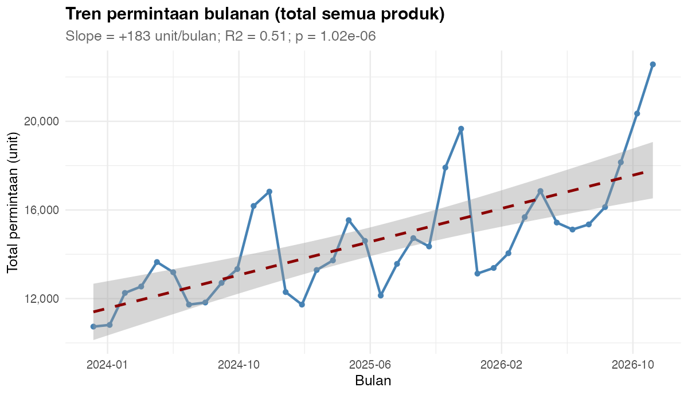
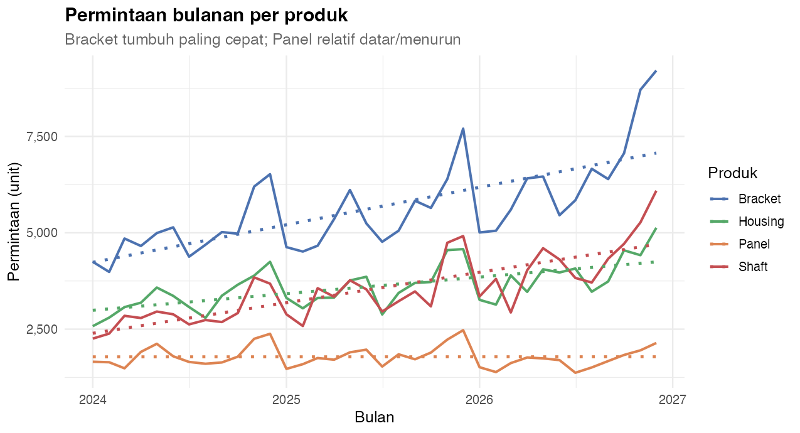
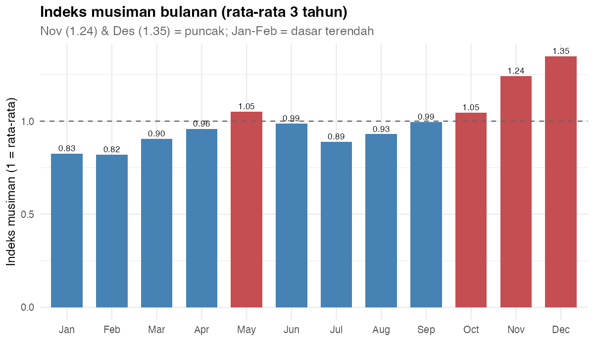
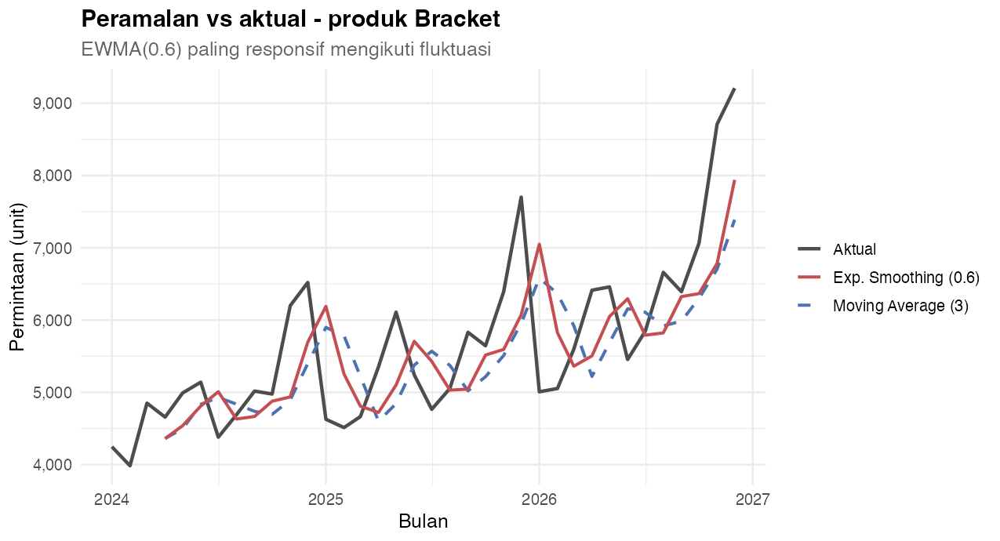
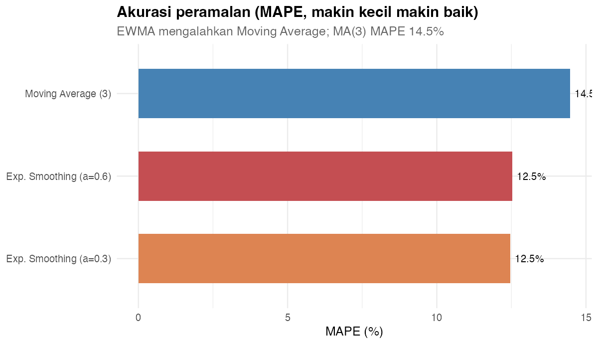
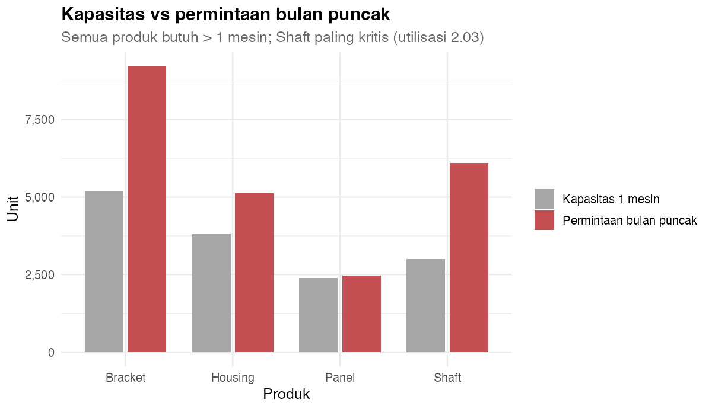
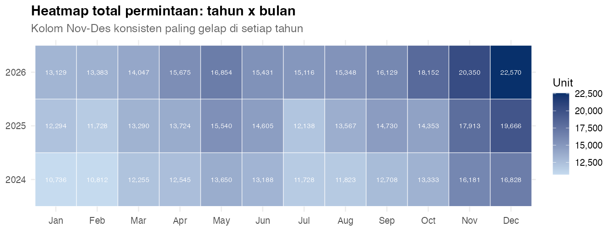

# 📗 Opsi 3 — Peramalan Permintaan & Perencanaan Produksi: Tren & Musiman dengan R

> Proyek **end-to-end** Teknik Industri (level **Basic → Advanced**) yang menggabungkan **`dplyr`** untuk transformasi & statistik, **`ggplot2`** untuk visual, lalu hasilnya siap dipakai sebagai **R visual / data model di Power BI**.
>
> **Pertanyaan inti:** *Berapa permintaan bulan depan, dan berapa kapasitas mesin yang harus disiapkan untuk menghadapi puncak musiman?*

---

## 1. Gambaran Umum

| Komponen | Keterangan |
| --- | --- |
| **Nama proyek** | Opsi 3 — Peramalan Permintaan & Perencanaan Produksi |
| **Topik** | Tren, musiman, peramalan (MA & exponential smoothing), akurasi, perencanaan kapasitas |
| **Alat IE** | Dekomposisi deret waktu, Moving Average, Exponential Smoothing, MAPE/MAE/RMSE, uji tren & musiman, perencanaan kapasitas |
| **Bahasa** | R (base + `dplyr` + `ggplot2` + `scales` + `tidyr` + `broom`) |
| **Dataset** | `data/permintaan.csv` (**144 baris × 3 kolom**, 1 baris = 1 bulan × 1 produk), `data/produk.csv` (dimensi) |
| **Level** | Basic (dplyr dasar) → Medium (agregasi & uji hipotesis) → Advanced (peramalan & kapasitas) |
| **Prerequisit** | Volume 0 (Basic R), Volume 1 (ggplot2), Volume 2 (Statistik Inferensial) |
| **Luaran** | 7 visual PNG + 6 tabel analisis + kesimpulan/rekomendasi siap dashboard |

### Alur belajar (roadmap)

```text
dplyr (Basic)
  -> read.csv, mutate, filter
  -> group_by + summarise per produk & per tahun
  -> join dimensi produk

Statistik (Medium)
  -> regresi tren linear (slope, R2, p)
  -> ANOVA & uji t musiman (puncak vs biasa)
  -> indeks musiman

Peramalan & Visual (Advanced)
  -> Moving Average & Exponential Smoothing
  -> akurasi MAPE / MAE / RMSE
  -> perencanaan kapasitas + 7 visual ggplot2
  -> rekomendasi berbasis bukti
```

---

## 2. Tujuan Pembelajaran

Setelah menyelesaikan Opsi 3, Anda diharapkan mampu:

1. Mengagregasi permintaan **per produk, per tahun, per bulan kalender** dengan `dplyr`.
2. Mengukur **tren** dengan regresi linear (slope, R², p-value).
3. Menguji **musiman** secara statistik (ANOVA + uji t puncak vs biasa).
4. Membangun **indeks musiman** untuk perencanaan.
5. Membuat **peramalan sederhana** (Moving Average & Exponential Smoothing) tanpa package tambahan.
6. Menilai akurasi peramalan dengan **MAPE, MAE, RMSE** dan memilih model terbaik.
7. Menghitung kebutuhan **kapasitas mesin** pada bulan puncak.
8. Membuat 7 visual `ggplot2` yang komunikatif dan menyusun **rekomendasi tindakan**.

---

## 3. Struktur Folder

```text
Brainstorming/pilihan/03-peramalan-permintaan/
├── README.md                     # file ini
├── data/
│   ├── permintaan.csv            # fakta: 144 bulan x produk
│   └── produk.csv                # dimensi produk (harga, kapasitas, lead time)
├── R/
│   ├── 00_buat_data.R            # generator data (set.seed(20260903))
│   ├── 01_analisis_dplyr.R       # transformasi + statistik -> output/*.csv
│   └── 02_visual_ggplot2.R       # 7 visual -> output/V*.png
└── output/                       # hasil tabel & gambar
```

---

## 4. Cara Menjalankan

Dari **root repo** (`Power BI dan R`):

```r
source("Brainstorming/pilihan/03-peramalan-permintaan/R/00_buat_data.R")
source("Brainstorming/pilihan/03-peramalan-permintaan/R/01_analisis_dplyr.R")
source("Brainstorming/pilihan/03-peramalan-permintaan/R/02_visual_ggplot2.R")
```

Atau lewat terminal:

```bash
Rscript "Brainstorming/pilihan/03-peramalan-permintaan/R/01_analisis_dplyr.R"
Rscript "Brainstorming/pilihan/03-peramalan-permintaan/R/02_visual_ggplot2.R"
```

> Ketiga skrip **path-robust**: bisa dijalankan dari folder mana pun karena lokasi ditentukan otomatis dari `--file=`.

### Kamus data (`permintaan.csv`)

| Kolom | Tipe | Keterangan |
| --- | --- | --- |
| `Bulan` | tanggal | 2024-01 … 2026-12 (36 bulan) |
| `Produk` | kategori | Bracket / Housing / Shaft / Panel |
| `Permintaan` | numerik | unit permintaan bulanan |

### Kamus data (`produk.csv`)

| Kolom | Tipe | Keterangan |
| --- | --- | --- |
| `Produk` | kategori | kunci join |
| `Kategori` | teks | Komponen / Presisi / Rangkaian |
| `HargaSatuan` | numerik | harga jual (Rp) |
| `KapasitasMesin` | numerik | kapasitas 1 mesin (unit/bulan) |
| `LeadTimeHari` | numerik | waktu tunggu (hari) |

> **Pola yang sengaja ditanam:** ada **tren naik** (Bracket +1,2%/bln, Shaft +1,8%/bln, Panel −0,4%/bln) **dan musiman** (puncak Nov–Des, dasar Jan–Feb), supaya analisis benar-benar "menemukan" sesuatu.

---
## 5. dplyr Basic — Membaca & Merangkum

```r
library(dplyr)

d <- read.csv("data/permintaan.csv") |>
  mutate(Bulan  = as.Date(Bulan),
         BulanKe = as.integer(format(Bulan, "%m")),
         Tahun   = format(Bulan, "%Y"),
         Produk  = factor(Produk))
produk <- read.csv("data/produk.csv")

# ringkasan cepat total 3 tahun
d |> summarise(TotalPermintaan = sum(Permintaan),
               RataBulanan     = mean(Permintaan),
               RataPerProduk   = sum(Permintaan) / 4)

# permintaan per tahun + pertumbuhan
d |> group_by(Tahun) |>
  summarise(Total = sum(Permintaan), .groups = "drop") |>
  mutate(Pertumbuhan = round((Total / lag(Total) - 1) * 100, 1))
```

**Output:**

```text
  TotalPermintaan RataBulanan RataPerProduk
1          525519    3649.438     131379.75

  Tahun  Total Pertumbuhan
1  2024 155787          NA
2  2025 173548        11.4
3  2026 196184        13.0
```

> **Baca begini:** permintaan **tumbuh dua tahun berturut-turut** (+11,4% lalu +13,0%). Ini sinyal penting: kapasitas yang cukup hari ini **belum tentu cukup tahun depan**.

---

## 6. dplyr Medium — Per Produk, Tren & Musiman

### 6.1 Permintaan per produk + join dimensi

```r
per_produk <- d |> group_by(Produk) |>
  summarise(Total = sum(Permintaan), Rata = mean(Permintaan),
            Min = min(Permintaan), Max = max(Permintaan), .groups = "drop") |>
  left_join(produk, by = "Produk") |>              # ambil harga & kapasitas mesin
  mutate(PangsaPasar = Total / sum(Total))
```

| Produk | Total | Rata/bulan | Min | Max | Kategori | Pangsa |
| --- | --- | --- | --- | --- | --- | --- |
| **Bracket** | **203.429** | 5.651 | 3.985 | 9.208 | Komponen | **38,7%** |
| Housing | 130.238 | 3.618 | 2.578 | 5.129 | Komponen | 24,8% |
| Shaft | 127.653 | 3.546 | 2.255 | 6.091 | Presisi | 24,3% |
| Panel | 64.199 | 1.783 | 1.369 | 2.474 | Rangkaian | 12,2% |

> **Baca begini:** **Bracket** mendominasi hampir 4 dari 10 unit. Perhatikan `Max` Bracket = **9.208** — jauh di atas rata-ratanya (5.651), tanda puncak musiman yang tajam.

### 6.2 Indeks musiman & uji tren

```r
# indeks musiman = rata-rata bulan itu / rata-rata keseluruhan
musiman <- d |> group_by(BulanKe) |>
  summarise(Rata = mean(Permintaan), .groups = "drop") |>
  mutate(Indeks = Rata / mean(Rata), NamaBulan = month.abb[BulanKe])

# tren: regresi total permintaan bulanan terhadap waktu
total_bulan <- d |> group_by(Bulan) |>
  summarise(Total = sum(Permintaan), .groups = "drop") |> mutate(t = row_number())
tren_fit <- lm(Total ~ t, data = total_bulan)

# musiman: uji t puncak (Okt–Des) vs bulan biasa
total_bulan <- total_bulan |>
  mutate(BulanKe = as.integer(format(Bulan, "%m")),
         Puncak  = factor(ifelse(BulanKe %in% 10:12, "Puncak", "Biasa")))
t.test(Total ~ Puncak, data = total_bulan, var.equal = TRUE)
```

**Output:**

```text
Tren linear : slope = +182.7 unit/bulan, R2 = 0.510, p = 1.02e-06
ANOVA musiman (data mentah)      : F = 1.68, p = 0.085
Uji t puncak vs biasa (agregat)  : selisih = +4143 unit, t = 5.33, p = 6.4e-06
```

**Indeks musiman (ringkas):**

| Bulan | Jan | Feb | … | Okt | **Nov** | **Des** |
| --- | --- | --- | --- | --- | --- | --- |
| Indeks | 0,83 | 0,82 | … | 1,05 | **1,24** | **1,35** |

> **Baca begini:**
> - **Tren nyata** — slope +182,7 unit/bulan, p = 1,0×10⁻⁶, R² = 0,51 (tren menjelaskan ~51% variasi).
> - **Musiman nyata** — uji t agregat: puncak **+4.143 unit** di atas bulan biasa, p = 6,4×10⁻⁶. (ANOVA pada data mentah p = 0,085 tidak signifikan karena **noise per produk** menutupi sinyal; mengagregasi ke level bulanan jauh lebih sensitif — pelajaran penting soal *level analisis*.)
> - **Desember & November** adalah puncak (indeks 1,35 & 1,24); **Januari–Februari** dasar terendah (~0,82).

---

## 7. Visual 1 — Tren Permintaan Bulanan

```r
library(ggplot2); library(scales)

tb <- total_bulan |> mutate(waktu = as.numeric(Bulan))

ggplot(tb, aes(x = waktu, y = Total)) +
  geom_line(color = "steelblue", linewidth = 1) +
  geom_point(color = "steelblue", size = 1.6) +
  geom_smooth(method = "lm", formula = y ~ x, color = "darkred",
              linetype = "dashed", se = TRUE) +
  scale_x_continuous(labels = function(v) format(as.Date(v, origin = "1970-01-01"), "%Y-%m")) +
  scale_y_continuous(labels = label_comma()) +
  labs(title = "Tren permintaan bulanan (total semua produk)",
       subtitle = "Slope = +182 unit/bulan; R2 = 0.51; p = 1.02e-06",
       x = "Bulan", y = "Total permintaan (unit)") + theme_minimal(base_size = 12)
```



> **Baca begini:** garis putus-putus merah (regresi) naik mantap, pita abu-abu sempit → **tren naik sangat pasti**. Puncak-puncak di ujung tahun (Nov–Des) naik **di atas** garis tren; itulah komponen musiman yang akan kita perlakukan terpisah.

---

## 8. Visual 2 — Permintaan per Produk

```r
warna_produk <- c(Bracket = "#4C72B0", Housing = "#55A868",
                  Shaft = "#C44E52", Panel = "#DD8452")

ggplot(d, aes(x = Bulan, y = Permintaan, color = Produk)) +
  geom_line(linewidth = 0.9) +
  geom_smooth(method = "lm", formula = y ~ x, se = FALSE, linetype = "dotted") +
  scale_color_manual(values = warna_produk) +
  scale_y_continuous(labels = label_comma()) +
  labs(title = "Permintaan bulanan per produk",
       subtitle = "Bracket tumbuh paling cepat; Panel relatif datar/menurun",
       x = "Bulan", y = "Permintaan (unit)", color = "Produk") + theme_minimal(base_size = 12)
```



> **Baca begini:** keempat produk naik-turun bersama (musiman yang sama), tetapi **kemiringan trennya berbeda** — Bracket & Shaft garis putus-putusnya paling curam, Panel hampir datar. Artinya perencanaan kapasitas **tidak bisa disamaratakan**; tiap produk punya laju pertumbuhan sendiri.

---

## 9. Visual 3 — Indeks Musiman

```r
musiman$NamaBulan <- factor(musiman$NamaBulan, levels = month.abb)

ggplot(musiman, aes(x = NamaBulan, y = Indeks, fill = Indeks > 1)) +
  geom_col(width = 0.7) +
  geom_hline(yintercept = 1, linetype = "dashed", color = "grey40") +
  geom_text(aes(label = sprintf("%.2f", Indeks)), vjust = -0.4, size = 3) +
  scale_fill_manual(values = c(`TRUE` = "#C44E52", `FALSE` = "steelblue"), guide = "none") +
  labs(title = "Indeks musiman bulanan (rata-rata 3 tahun)",
       subtitle = "Nov (1.24) & Des (1.35) = puncak; Jan-Feb = dasar terendah",
       x = NULL, y = "Indeks musiman (1 = rata-rata)") + theme_minimal(base_size = 12)
```



> **Baca begini:** batang **Desember (1,35)** dan **November (1,24)** berwarna merah karena di atas garis 1,00 — permintaan di bulan-bulan itu **24–35% di atas rata-rata**. Sebaliknya Jan–Feb hanya ~82%. Inilah dasar **perencanaan kapasitas musiman**: siapkan mesin menghadapi Nov–Des, bukan merata sepanjang tahun.

---

## 10. Visual 4 — Peramalan vs Aktual

Kita bandingkan dua metode sederhana yang dibangun sendiri (tanpa package tambahan): **Moving Average MA(3)** dan **Exponential Smoothing (EWMA)**.

```r
# EWMA manual: ramalan t = alpha * aktual(t-1) + (1-alpha) * ramalan(t-1)
ewma <- function(x, alpha) {
  out <- rep(NA_real_, length(x))
  if (length(x) < 4) return(out)
  out[4] <- mean(x[1:3])                      # seed, agar basis sama dgn MA(3)
  for (i in 5:length(x)) out[i] <- alpha * x[i - 1] + (1 - alpha) * out[i - 1]
  out
}

ma_ewma <- d |> arrange(Produk, Bulan) |> group_by(Produk) |>
  mutate(MA3    = (lag(Permintaan,1) + lag(Permintaan,2) + lag(Permintaan,3)) / 3,
         EWMA06 = ewma(Permintaan, 0.6)) |> ungroup()

ex <- ma_ewma |> filter(Produk == "Bracket")
ggplot(ex, aes(x = Bulan)) +
  geom_line(aes(y = Permintaan, color = "Aktual"), linewidth = 1) +
  geom_line(aes(y = MA3, color = "Moving Average (3)"), linewidth = 0.9,
            linetype = "dashed", na.rm = TRUE) +
  geom_line(aes(y = EWMA06, color = "Exp. Smoothing (0.6)"), linewidth = 0.9, na.rm = TRUE) +
  scale_color_manual(values = c("Aktual" = "grey30", "Moving Average (3)" = "#4C72B0",
                                "Exp. Smoothing (0.6)" = "#C44E52")) +
  scale_y_continuous(labels = label_comma()) +
  labs(title = "Peramalan vs aktual - produk Bracket",
       subtitle = "EWMA(0.6) paling responsif mengikuti fluktuasi",
       x = "Bulan", y = "Permintaan (unit)", color = NULL) + theme_minimal(base_size = 12)
```



> **Baca begini:** garis **hitam** = aktual. Garis **biru putus-putus (MA3)** halus tetapi **terlambat** merespons puncak — ia "tertinggal" karena merata-ratakan 3 bulan lalu. Garis **merah (EWMA 0,6)** lebih **cepat menangkap** puncak karena memberi bobot besar pada bulan terakhir. Ini trade-off klasik: *halus vs responsif*.

---

## 11. Visual 5 — Akurasi Peramalan (MAPE)

```r
akurasi <- function(aktual, ramalan, nama) {
  ok <- !is.na(ramalan); a <- aktual[ok]; f <- ramalan[ok]
  data.frame(Model = nama, MAE = mean(abs(a - f)),
             MAPE = mean(abs((a - f) / a)) * 100, RMSE = sqrt(mean((a - f)^2)))
}
acc <- bind_rows(
  akurasi(ma_ewma$Permintaan, ma_ewma$MA3,    "Moving Average (3)"),
  akurasi(ma_ewma$Permintaan, ma_ewma$EWMA03, "Exp. Smoothing (a=0.3)"),
  akurasi(ma_ewma$Permintaan, ma_ewma$EWMA06, "Exp. Smoothing (a=0.6)"))

ggplot(acc, aes(x = reorder(Model, MAPE), y = MAPE, fill = Model)) +
  geom_col(width = 0.6) +
  geom_text(aes(label = sprintf("%.1f%%", MAPE)), hjust = -0.15, size = 3.5) +
  coord_flip() +
  scale_fill_manual(values = c("Moving Average (3)" = "steelblue",
                               "Exp. Smoothing (a=0.3)" = "#DD8452",
                               "Exp. Smoothing (a=0.6)" = "#C44E52"), guide = "none") +
  labs(title = "Akurasi peramalan (MAPE, makin kecil makin baik)",
       subtitle = "EWMA mengalahkan Moving Average; MA(3) MAPE 14.5%",
       x = NULL, y = "MAPE (%)") + theme_minimal(base_size = 12)
```



| Model | MAE | **MAPE** | RMSE |
| --- | --- | --- | --- |
| Moving Average (3) | 535,45 | 14,47% | 673,74 |
| Exp. Smoothing (α = 0,3) | 475,93 | **12,47%** | 634,70 |
| Exp. Smoothing (α = 0,6) | 462,19 | 12,54% | **613,87** |

> **Baca begini:** ketiga model MAPE ~12–14%. Model **terbaik berdasarkan MAPE adalah EWMA(0,3)** (12,47%), sedangkan berdasarkan RMSE adalah **EWMA(0,6)** (613,87) — MAE-nya pun terkecil (462). Perhatikan: **pilihan "terbaik" bisa berbeda tergantung metrik**. Untuk perencanaan produksi, **MAPE** (error relatif %) biasanya lebih bermakna karena tidak terpengaruh skala besar Bracket.

---

## 12. Visual 6 — Kapasitas vs Permintaan Puncak

```r
kapasitas <- d |> group_by(Produk) |>
  summarise(PuncakBulanan = max(Permintaan), RataBulanan = mean(Permintaan), .groups = "drop") |>
  left_join(produk, by = "Produk") |>
  mutate(Utilisasi = PuncakBulanan / KapasitasMesin,
         MesinDibutuhkan = ceiling(Utilisasi),
         KekuranganMesin = MesinDibutuhkan - 1)

kap_long <- kapasitas |>
  select(Produk, KapasitasMesin, PuncakBulanan) |>
  pivot_longer(c(KapasitasMesin, PuncakBulanan), names_to = "Seri", values_to = "Unit") |>
  mutate(Seri = factor(Seri, levels = c("KapasitasMesin", "PuncakBulanan"),
                       labels = c("Kapasitas 1 mesin", "Permintaan bulan puncak")))

ggplot(kap_long, aes(x = Produk, y = Unit, fill = Seri)) +
  geom_col(position = position_dodge(0.8), width = 0.72) +
  scale_fill_manual(values = c("Kapasitas 1 mesin" = "grey65",
                               "Permintaan bulan puncak" = "#C44E52")) +
  scale_y_continuous(labels = label_comma()) +
  labs(title = "Kapasitas vs permintaan bulan puncak",
       subtitle = "Semua produk butuh > 1 mesin; Shaft paling kritis (utilisasi 2.03)",
       x = "Produk", y = "Unit", fill = NULL) + theme_minimal(base_size = 12)
```



| Produk | Kapasitas 1 mesin | Puncak bulanan | Utilisasi | Mesin dibutuhkan | **Kekurangan** |
| --- | --- | --- | --- | --- | --- |
| Bracket | 5.200 | 9.208 | 1,77 | 2 | **1** |
| Housing | 3.800 | 5.129 | 1,35 | 2 | **1** |
| Panel | 2.400 | 2.474 | 1,03 | 2 | **1** |
| Shaft | 3.000 | 6.091 | **2,03** | 3 | **2** |

> **Baca begini:** batang merah (puncak) **lebih tinggi dari** batang abu-abu (kapasitas 1 mesin) untuk **semua produk** — artinya satu mesin tidak cukup saat puncak. Yang paling kritis adalah **Shaft**: utilisasi 2,03 → butuh **3 mesin** (kekurangan **2**). Bracket, Housing, Panel masing-masing butuh minimal **2 mesin** pada puncak.

---

## 13. Visual 7 — Heatmap Tahun × Bulan

```r
hm <- d |>
  mutate(Tahun = format(Bulan, "%Y")) |>
  group_by(Tahun, BulanKe = as.integer(format(Bulan, "%m"))) |>
  summarise(Total = sum(Permintaan), .groups = "drop") |>
  mutate(Bulan_nama = factor(month.abb[BulanKe], levels = month.abb))

ggplot(hm, aes(x = Bulan_nama, y = Tahun, fill = Total)) +
  geom_tile(color = "white") +
  geom_text(aes(label = label_comma()(Total)), size = 2.6, color = "white") +
  scale_fill_gradient(low = "#c6dbef", high = "#08306b", labels = label_comma()) +
  labs(title = "Heatmap total permintaan: tahun x bulan",
       subtitle = "Kolom Nov-Des konsisten paling gelap di setiap tahun",
       x = NULL, y = NULL, fill = "Unit") + theme_minimal(base_size = 12)
```



> **Baca begini:** pola musiman **konsisten di ketiga tahun** — kolom **Nov & Des** selalu paling gelap, kolom **Jan–Feb** paling terang. Ini bukan kebetulan satu tahun; ini pola yang bisa **direncanakan**. Manfaat praktisnya: jadwalkan *preventive maintenance* besar dan cuti di **Q1 (musim sepi)**, bukan di Q4.

---

## 14. Advanced — Simulasi Perbaikan (What-If)

Setelah tahu bahwa **kapasitas puncak** adalah masalah (Shaft butuh 3 mesin), kita uji **"apa yang terjadi jika puncak musiman diredam?"** — mis. lewat kampanye *pre-order* atau kontrak pengiriman yang meratakan permintaan.

```r
rata <- mean(total_bulan$Total); puncak <- max(total_bulan$Total)

skenario <- data.frame(RedamPuncak = c(0, 0.05, 0.10, 0.15)) |>
  mutate(PuncakBaru   = puncak * (1 - RedamPuncak),
         TotalTahunan = rata * 9 + PuncakBaru * 3,
         MesinShaft   = ceiling(PuncakBaru * (6091 / puncak) / 3000))
print(as.data.frame(skenario))
```

**Output:**

```text
  RedamPuncak PuncakBaru TotalTahunan MesinShaft
1        0.00      22570     199090          3
2        0.05      21442     195704          2
3        0.10      20313     192319          2
4        0.15      19185     188933          2
```

> **Baca begini:** rasio **puncak ÷ rata-rata** = 22.570 ÷ 14.598 = **1,55×**. Artinya satu bulan puncak meminta **55% lebih banyak** kapasitas daripada bulan biasa. Jika puncak cukup diredam **5%** saja, kebutuhan mesin Shaft turun dari **3 → 2 unit** — penghematan investasi besar **tanpa** kehilangan total penjualan (total tahunan hanya turun ~1,7%). Rata-rata Q4 menyumbang **30,3%** dari total permintaan tahunan.

---

## 15. Integrasi ke Power BI

| Tahap | Cara |
| --- | --- |
| **Sumber data** | `data/permintaan.csv` → **Get Data > Text/CSV** |
| **R di Power Query** | Tempel blok agregasi dari `01_analisis_dplyr.R` (per produk, musiman, tren) pada **Transform > Run R script** → hasilkan tabel `Peramalan` & `Musiman` |
| **R visual** | Tempel blok `ggplot2` dari `02_visual_ggplot2.R` pada **R visual**; masukkan kolom `Bulan`, `Permintaan`, `Produk` ke **Values** |
| **Slicer** | `Produk` dan `Tahun` → visual R otomatis menyaring sesuai pilihan |
| **KPI card** | Total 3 tahun 525.519 unit · Pertumbuhan +13,0% · MAPE terbaik 12,47% · Utilisasi Shaft 2,03× |

> **Penting:** R visual dirender sebagai **gambar statis**. Slicer Power BI tetap menyaring data yang dikirim ke R, tetapi elemen di dalam gambar tidak bisa diklik. Selalu sertakan kolom yang dibutuhkan di **Values**.

---

## 16. Kesimpulan & Rekomendasi

**Kondisi saat ini:** permintaan tumbuh **+13,0%** (2026) dan berpuncak di **Nov–Des** (indeks 1,24 & 1,35). Model peramalan terbaik adalah **Exponential Smoothing (α = 0,3)** dengan **MAPE 12,47%**. Kapasitas 1 mesin **tidak cukup** untuk semua produk saat puncak (Shaft paling kritis, utilisasi **2,03×**).

| # | Temuan | Bukti | Rekomendasi |
| --- | --- | --- | --- |
| 1 | **Tren naik konsisten** | slope +182,7 unit/bulan; p = 1,0×10⁻⁶; R² = 0,51 | Rencanakan ekspansi kapasitas jangka menengah (bukan reaktif) |
| 2 | **Musiman kuat & terprediksi** | Uji t puncak vs biasa: +4.143 unit, p = 6,4×10⁻⁶ | Bangun *build-to-stock* sebelum Okt; jadwalkan maintenance di Q1 |
| 3 | **EWMA mengalahkan MA(3)** | MAPE 12,47% vs 14,47% | Pakai EWMA(0,3) sebagai basis perencanaan produksi bulanan |
| 4 | **Shaft butuh 3 mesin saat puncak** | Utilisasi 2,03×; kekurangan 2 unit | Tambah 1 mesin Shaft **atau** redam puncak (lihat #5) |
| 5 | **Meratakan puncak lebih murah** | Redam 5% → kebutuhan Shaft turun 3 → 2 mesin | Program *pre-order*/diskon awal musim untuk Shaft & Bracket |
| 6 | **Bracket dominan** | 38,7% pangsa, tumbuh tercepat | Prioritaskan alokasi material & operator untuk Bracket |

**Format insight (kondisi – bukti – tindakan):**

> **Kondisi:** permintaan naik 13% dengan puncak tajam Nov–Des (1,55× rata-rata) sehingga kapasitas Shaft kritis.
> **Bukti:** slope +182,7 unit/bulan (p = 1,0×10⁻⁶); uji t musiman p = 6,4×10⁻⁶; utilisasi Shaft 2,03×; EWMA MAPE 12,47%.
> **Tindakan:** adopsi peramalan EWMA(0,3) untuk perencanaan, tambah/optimalkan mesin Shaft, dan jalankan program perataan permintaan (redam puncak 5%) — target: kebutuhan mesin Shaft turun ke 2 unit dan *service level* tetap ≥ 95%.

---

*README Opsi 3 — Peramalan Permintaan & Perencanaan Produksi. Bagian dari `Brainstorming/pilihan/`.*

