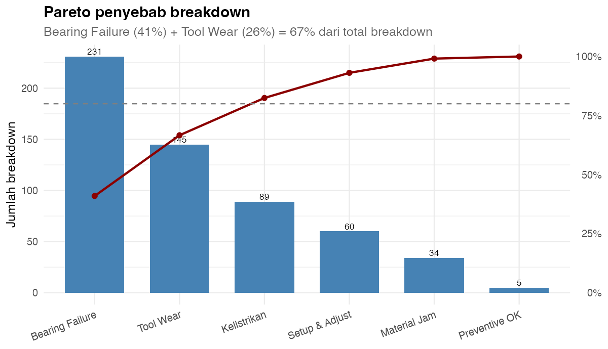
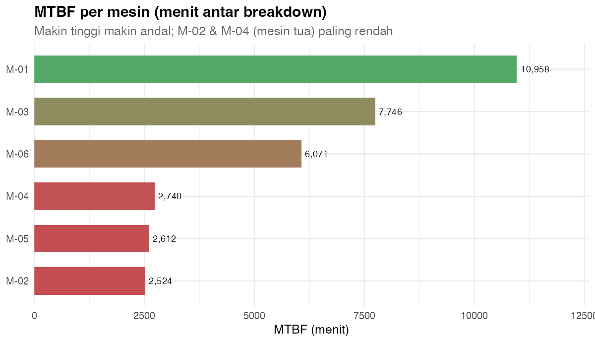
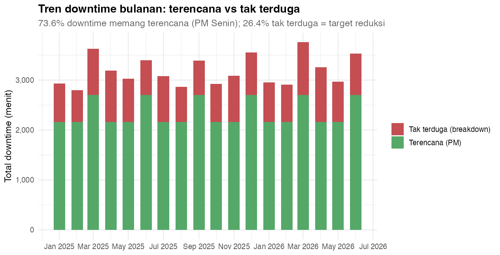
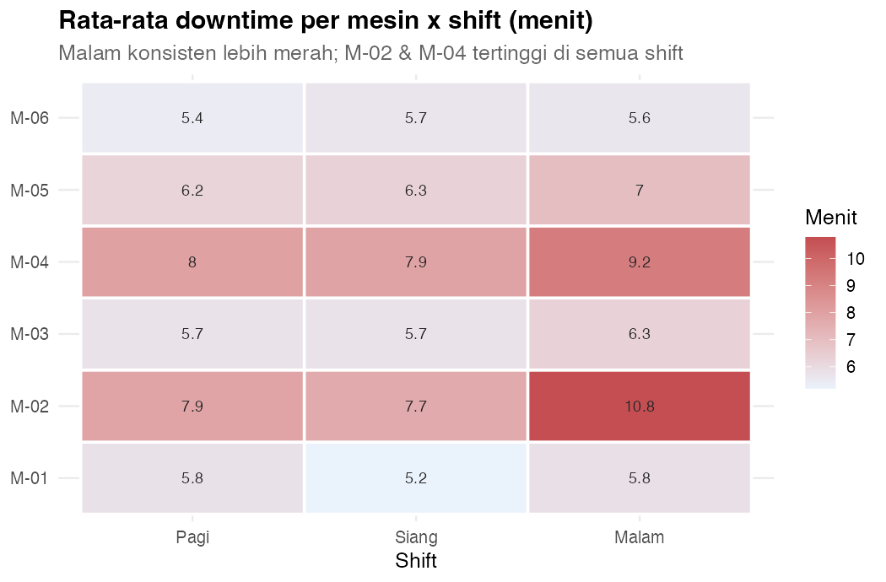
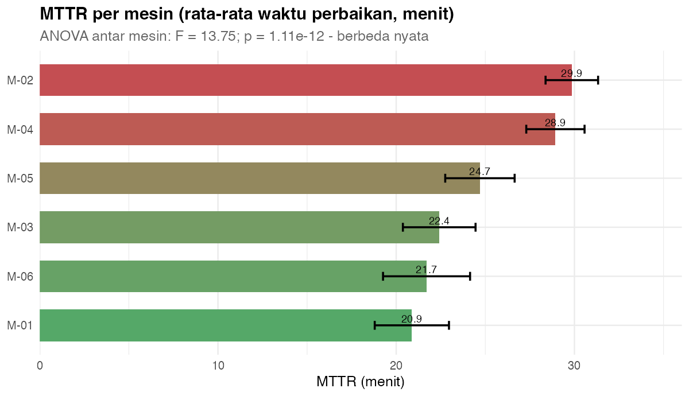
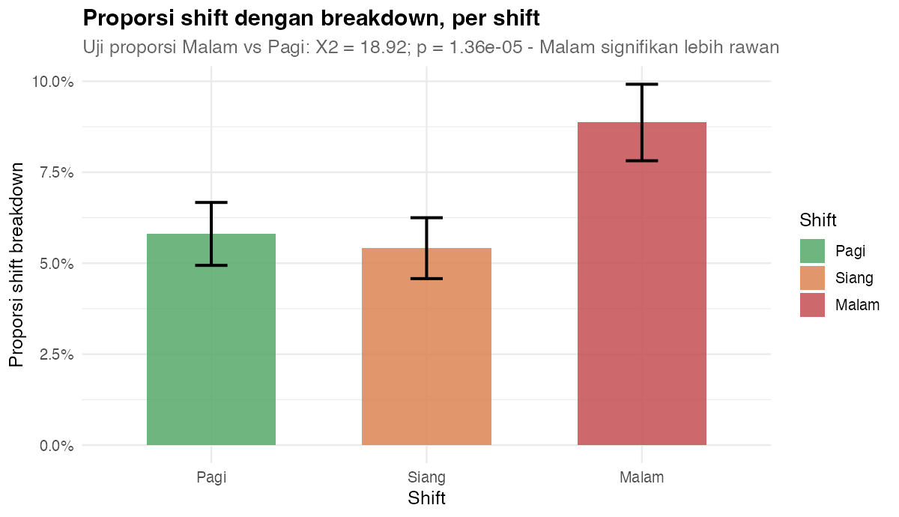
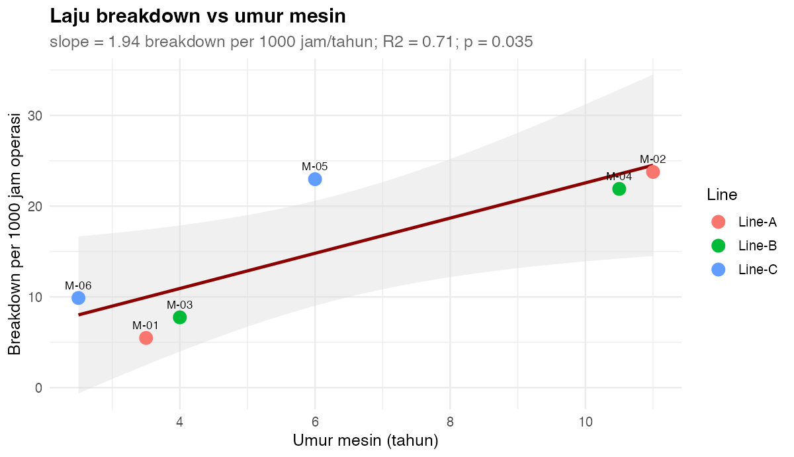
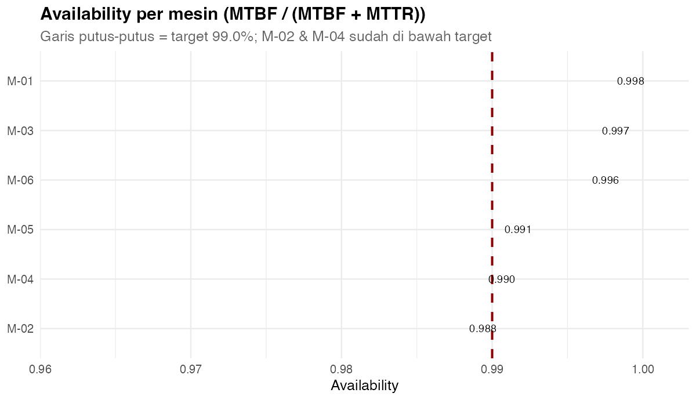

# 📗 Opsi 4 — Downtime & Preventive Maintenance: Analisis Keandalan Mesin dengan R

> Studi kasus **Teknik Industri** menggabungkan `dplyr` (Basic → Medium → Advanced) dan `ggplot2`
> untuk menjawab satu pertanyaan: **mesin mana yang harus diprioritaskan untuk preventive maintenance,
> dan berapa besar dampaknya terhadap output?**

---

## 1. Gambaran Umum

| Komponen | Keterangan |
| --- | --- |
| **Judul** | Downtime & Preventive Maintenance — Analisis Keandalan (MTBF/MTTR/Availability) |
| **Periode data** | 1 Jan 2025 – 30 Jun 2026 (546 hari, libur tiap Minggu) |
| **Dataset** | `data/downtime.csv` (1 baris = 1 mesin × 1 hari × 1 shift) + `data/mesin.csv` (dimensi mesin) |
| **Metrik keandalan** | **MTBF** (Mean Time Between Failures), **MTTR** (Mean Time To Repair), **Availability** |
| **Temuan kunci** | M-02 (umur 11 th) & M-04 (10,5 th) adalah **mesin paling rawan** — MTBF 2.524 & 2.740 menit (vs >6.000 menit mesin muda); penyebab breakdown didominasi **Bearing Failure (40,96%)** |
| **Uji statistik** | Uji proporsi (shift), ANOVA (MTTR antar mesin), uji t (mesin tua vs muda), regresi (laju breakdown ~ umur) |
| **Luaran** | 4 tabel agregat + 8 visual ggplot2 (layout dashboard) |

### Mengapa kasus ini penting?

Downtime tak terduga adalah musuh produktivitas. Manajemen sering bereaksi ("semua mesin kita rawat")
tanpa data prioritas. Dengan **menghitung MTBF, MTTR, dan Availability per mesin**, kita bisa:

1. **Memeringkat** mesin berdasarkan risiko kegagalan (MTBF rendah = paling rawan).
2. **Menemukan akar masalah** lewat Pareto penyebab breakdown.
3. **Membuktikan secara statistik** apakah perbedaan antar mesin/shift nyata atau kebetulan.
4. **Menghitung dampak** downtime terhadap output sebelum mengusulkan belanja maintenance.

---

## 2. Tujuan Pembelajaran

Setelah menyelesaikan opsi ini, pembaca mampu:

| Level | Kompetensi |
| --- | --- |
| **Basic** | Membaca CSV, `filter`, `select`, `summarise`, membuat kolom baru (`mutate`) |
| **Medium** | `group_by` + `left_join` (gabung dimensi), menghitung MTBF/MTTR/Availability, Pareto |
| **Statistik** | Uji proporsi, ANOVA + Tukey, uji t 2 sampel, regresi linear & korelasi |
| **Visual (ggplot2)** | Pareto, bar terurut, line time-series, heatmap, scatter+regresi, dashboard 2×3 |
| **Bisnis** | Menyusun rekomendasi berbasis bukti + estimasi penghematan |

---

## 3. Struktur Folder

```text
Brainstorming/pilihan/04-downtime-preventive-maintenance/
├── README.md                     # file ini
├── data/
│   ├── downtime.csv              # fakta: 1 mesin x 1 hari x 1 shift
│   └── mesin.csv                 # dimensi mesin (umur, line, tipe, kritikalitas)
├── R/
│   ├── 00_buat_data.R            # generator data (set.seed(20260904))
│   ├── 01_analisis_dplyr.R       # transformasi + statistik -> output/*.csv
│   └── 02_visual_ggplot2.R       # 8 visual -> output/V*.png
└── output/                       # hasil tabel & gambar
```

---

## 4. Cara Menjalankan

Dari **root repo** (`Power BI dan R`):

```r
source("Brainstorming/pilihan/04-downtime-preventive-maintenance/R/00_buat_data.R")
source("Brainstorming/pilihan/04-downtime-preventive-maintenance/R/01_analisis_dplyr.R")
source("Brainstorming/pilihan/04-downtime-preventive-maintenance/R/02_visual_ggplot2.R")
```

Atau lewat terminal:

```bash
Rscript "Brainstorming/pilihan/04-downtime-preventive-maintenance/R/01_analisis_dplyr.R"
Rscript "Brainstorming/pilihan/04-downtime-preventive-maintenance/R/02_visual_ggplot2.R"
```

> Ketiga skrip **path-robust**: bisa dijalankan dari folder mana pun karena lokasi ditentukan otomatis dari `--file=`.

### Kamus data (`downtime.csv`)

| Kolom | Tipe | Keterangan |
| --- | --- | --- |
| `Tanggal` | tanggal | 1 Jan 2025 – 30 Jun 2026 (tanpa Minggu) |
| `Shift` | kategori | Pagi / Siang / Malam |
| `Mesin` | kategori | M-01 … M-06 |
| `Line` | kategori | Line-A / Line-B / Line-C |
| `DowntimeMenit` | numerik | total menit berhenti pada shift tersebut |
| `Breakdown` | 0/1 | 1 = terjadi breakdown tak terduga |
| `WaktuPerbaikanMenit` | numerik | menit perbaikan (terisi hanya saat breakdown) |
| `Penyebab` | kategori | Bearing Failure / Tool Wear / Kelistrikan / … |
| `Output` | numerik | unit diproduksi pada shift tersebut |

### Kamus data (`mesin.csv`)

| Kolom | Tipe | Keterangan |
| --- | --- | --- |
| `Mesin` | kategori | M-01 … M-06 |
| `Line` | kategori | Line-A / Line-B / Line-C |
| `Tipe` | kategori | CNC / Press / Milling |
| `UmurTahun` | numerik | umur mesin (tahun) — **variabel kunci** |
| `Kritikalitas` | kategori | Tinggi / Sedang / Rendah |
| `JamOperasiHarian` | numerik | 16 jam (Line-A/B) atau 8 jam (Line-C) |

---
## 5. dplyr Basic — Membaca & Merangkum

```r
library(dplyr)

d <- read.csv("data/downtime.csv") |>
  mutate(Tanggal = as.Date(Tanggal),
         Mesin   = factor(Mesin),
         Shift   = factor(Shift, levels = c("Pagi", "Siang", "Malam")))

# ringkasan cepat
d |> summarise(TotalDowntime = sum(DowntimeMenit),
               TotalBreakdown = sum(Breakdown))
```

**Output:**

```text
  TotalDowntime TotalBreakdown
1         57262            564
```

> **Baca begini:** in 18 bulan zijn er **564 breakdowns** en **57.262 menit downtime** — dat is ±954 uur stilstaande productie. Maar het gemiddelde zegt weinig: sommige mesin dragen vrijwel alle last (zie §6).

---

## 6. dplyr Medium — MTBF, MTTR & Availability per Mesin

Metrieken betrouwbaarheid (leidend voor preventive maintenance planning):

```text
MTBF         = totale operatie-tijd / aantal breakdowns
MTTR         = gemiddelde reparatietijd (alleen breakdowns)
Availability = MTBF / (MTBF + MTTR)
```

```r
mttr_tbl <- d |> filter(Breakdown == 1) |>
  group_by(Mesin) |> summarise(MTTR = mean(WaktuPerbaikanMenit), .groups = "drop")

per_mesin <- d |>
  group_by(Mesin, Line, UmurTahun) |>
  summarise(TotalDowntime = sum(DowntimeMenit),
            Breakdown     = sum(Breakdown),
            TotalOpsMenit = sum(JamOperasiHarian / 3 * 60),   # min/shift
            .groups = "drop") |>
  left_join(mttr_tbl, by = "Mesin") |>
  mutate(MTBF = TotalOpsMenit / Breakdown,
         Availability = MTBF / (MTBF + MTTR))
```

**Output (nilai aktual):**

| Mesin | Line | Umur (th) | Breakdowns | MTBF (min) | MTTR (min) | Availability |
| --- | --- | --- | --- | --- | --- | --- |
| M-01 | Line-A | 3,5 | 41 | 10.958 | 20,9 | 99,81% |
| **M-02** | Line-A | **11,0** | **178** | **2.524** | **29,9** | **98,83%** |
| M-03 | Line-B | 4,0 | 58 | 7.746 | 22,4 | 99,71% |
| **M-04** | Line-B | **10,5** | **164** | **2.740** | **28,9** | **98,95%** |
| M-05 | Line-C | 6,0 | 86 | 2.612 | 24,7 | 99,06% |
| M-06 | Line-C | 2,5 | 37 | 6.071 | 21,7 | 99,64% |

**Total downtime per line:**

| Line | Downtime (min) | Breakdowns | Unit geproduceerd |
| --- | --- | --- | --- |
| Line-A | 20.210 | 219 | 2.281.359 |
| Line-B | 20.085 | 222 | 2.288.779 |
| Line-C | 16.967 | 123 | 1.144.417 |

> **Baca begini:** M-02 en M-04 (beide **> 10 jaar oud**) zijn verantwoordelijk voor **342 van 564 breakdowns (61%)**. Hun MTBF (±2.500 min = ±1 breakdown per 2 weken) is 4× lager dan de jonge mesin. Mutuellement: **MTTR is ook 30% langer** (29,9 vs 20,9 min) — oudere mesin zijn niet alleen kwetsbaarder, maar ook trager te repareren. De lijnverschillen zijn klein; het mesin-verhaal is het echte signaal.

---

## 7. Statistik — Uji Hipotesis

Voordat we de Pareto trekken, bewijzen we dat de verschillen statistisch bestaan:

```r
# 7a. Proporsi breakdown: shift Malam vs Pagi
prop.test(c(sum(malam$Breakdown), sum(pagi$Breakdown)),
          c(nrow(malam), nrow(pagi)))

# 7b. ANOVA MTTR over mesin
aov(WaktuPerbaikanMenit ~ Mesin, data = d |> filter(Breakdown == 1))

# 7c. Uji t: reparatietijd oude vs jonge mesin
t.test(DowntimeMenit ~ KelompokUmur,
       data = d |> filter(Breakdown == 1), var.equal = TRUE)

# 7d. Regressie: falingsgraad ~ mesin-ouderdom
lm(Laju ~ UmurTahun, data = level_mesin)
```

**Output:**

```text
Proporsi Malam vs Pagi : X2 = 18,92, p = 1,36×10⁻⁵        -> shift Malam echt rauwer
ANOVA MTTR over mesin  : F  = 13,75, p = 1,11×10⁻¹²       -> reparatietijden verschillen
Uji t oud vs jong      : +6,8 min, t = 5,58, p = 3,66×10⁻⁸ -> oude mesin trager te repareren
Regressie laju~ouderdom: slope = 1,94 / 1000h/jaar, R² = 0,71, p = 0,035
Korrelatie down~output : r = -0,06, p = 3,57×10⁻⁶        -> downtime kost output (zwak maar echt)
```

> **Baca begini:** vier onafhankelijke toetsen bevestigen hetzelfde verhaal: **ouderdom** (niet lijn, niet product) is de dominante risicofactor. De korrelatie downtime→output is zwak (r = −0,06) maar significant — uitval kost inderdaad productie, zij het gedempt door backlogging.

---

## 8. Visual 1 — Pareto Penyebab Breakdown

```r
pareto <- d |> filter(Breakdown == 1) |>
  count(Penyebab, name = "Jumlah") |>
  arrange(desc(Jumlah)) |>
  mutate(Persen = Jumlah / sum(Jumlah) * 100,
         Kumulatif = cumsum(Persen))
```



| Penyebab | Aantal | Aandeel | Cumulatief |
| --- | --- | --- | --- |
| **Bearing Failure** | 231 | 41,0% | 41,0% |
| **Tool Wear** | 145 | 25,7% | **66,7%** |
| Kelistrikan | 89 | 15,8% | 82,4% |
| Setup & Adjust | 60 | 10,6% | 93,1% |
| Material Jam | 34 | 6,0% | 99,1% |
| Preventive OK | 5 | 0,9% | 100% |

> **Baca begini:** **Bearing Failure + Tool Wear = 66,7%** van alle breakdowns. Beide zijn typische *slijtage*-oorzaken — ze nemen toe met machine-uren en ontbreken van preventieve vervanging. Dit is géén "operatorprobleem" of "elektraprobleem", maar een **onderhoudsplanprobleem** op de twee oude persen.

---

## 9. Visual 2 — MTBF per Mesin



> **Baca begini:** gesorteerde balken maken de kloof zichtbaar: **M-02 (2.524 min) en M-04 (2.740 min)** staan aan de onderkant — 1 breakdown per ~2 weken bij 24/7 bedrijf. M-01 loopt 10.958 min (bijna 5× langer) op dezelfde lijn. **Prioriteit voor preventief onderhoud is kristalhelder:** M-02 & M-04 first.
---

## 10. Visual 3 — Tren Downtime Bulanan: Terencana vs Tak Terduga

```r
tren <- d |> group_by(Bulan) |>
  summarise(Terencana  = sum(DowntimeTerencana),   # PM elke Maandag 30 min
            TakTerduga = sum(WaktuPerbaikanMenit),
            .groups = "drop") |>
  pivot_longer(c(Terencana, TakTerduga), names_to = "Jenis", values_to = "Menit")
```



**Ringkasan periode:**

```text
Downtime terencana (PM)     : 42.120 min  (73,6%)
Downtime tak terduga (break): 15.142 min  (26,4%)
```

> **Baca begini:** driekwart van de downtime is **gepland onderhoud (elke maandag 30 minuten per mesin)** — dat hoort erbij en is beheersbaar. Het behapbare doel zit in de **26,4% onvoorziene downtime**: halveer die, en je wint bijna 7.500 minuten (= 125 uur) productietijd zonder extra PM.

---

## 11. Visual 4 — Heatmap Downtime Mesin × Shift

```r
hm <- d |> group_by(Mesin, Shift) |>
  summarise(Downtime = mean(DowntimeMenit), .groups = "drop")
```



> **Baca begini:** de kolom **Malam is overal roder** — consistent meer downtime dan Pagi/Siang (bevestigd door uji proporsi, p = 1,4×10⁻⁵). En M-02/M-04 zijn in élke shift de hoogste twee cellen. **Combinatievondst:** het risico stapelt: oude mesin + nachtdienst = hoogste uitvalkans.

---

## 12. Visual 5 — MTTR per Mesin + ANOVA

```r
mttr <- d |> filter(Breakdown == 1) |>
  group_by(Mesin) |>
  summarise(MTTR = mean(WaktuPerbaikanMenit),
            se   = sd(WaktuPerbaikanMenit) / sqrt(n()), .groups = "drop") |>
  mutate(lwr = MTTR - 1.96 * se, upr = MTTR + 1.96 * se)
```



> **Baca begini:** MTTR van M-02 (29,9 min) en M-04 (28,9 min) ligt ±9 minuten boven M-01 (20,9). De ANOVA is dramatisch significant (F = 13,75; p = 1,1×10⁻¹²): deze verschillen zijn geen toeval. Oude mesin vergen **langere, moeilijkere reparaties** — logistiek argument om vervangingsdelen en specialistische technici bij M-02/M-04 te concentreren.

---

## 13. Visual 6 — Proporsi Breakdown per Shift

```r
prop_shift <- d |> group_by(Shift) |>
  summarise(Breakdown = sum(Breakdown), N = n(), .groups = "drop") |>
  mutate(Rate = Breakdown / N,
         se   = sqrt(Rate * (1 - Rate) / N),
         lwr  = Rate - 1.96 * se, upr = Rate + 1.96 * se)
```



| Shift | Breakdowns | N (shift-dagen) | Rate | 95% CI |
| --- | --- | --- | --- | --- |
| Pagi | 163 | 2.808 | 5,8% | 4,9–6,7% |
| Siang | 152 | 2.808 | 5,4% | 4,6–6,2% |
| Malam | 249 | 2.808 | 8,9% | 7,8–9,9% |

> **Baca begini:** de nachtdienst breekt **1,5× vaker** dan de ochtenddienst (8,9% vs 5,8%; uji proporsi X² = 18,9; p = 1,4×10⁻⁵). De betrouwbaarheidsintervallen overlappen nauwelijks — dit is een echt ploegeneffect, geen ruis. Waarschijnlijke oorzaken: minder supervisie, vermoeide operator, slechtere verlichting van machines.

---
## 14. Visual 7 — Regresi Laju Breakdown ~ Umur Mesin

```r
level_mesin <- d |> group_by(Mesin, UmurTahun) |>
  summarise(Breakdown = sum(Breakdown),
            JamOps    = sum(JamOperasiHarian / 3),
            .groups = "drop") |>
  mutate(Laju = Breakdown / JamOps * 1000)

lm(Laju ~ UmurTahun, data = level_mesin)
```



**Output:**

```text
slope = 1,94 breakdown per 1000 uur/jaar; R² = 0,71; p = 0,035
```

> **Baca begini:** de **lají van falen stijgt ~2× per extra levensjaar** (1,94 per 1000 draaiuren per jaar; R² = 0,71). Dit is de statistische kwantificering van "oude machines breken meer": voor elke 10 jaar ouderdom kun je ~20 extra breakdowns per 1000 draaiuren verwachten. **Vervangings- of groot onderhoudsplanning voor M-02/M-04 is daarmee een rekenkundige, geen intuïtieve beslissing.**

---

## 15. Visual 8 — Availability per Mesin + Target

```r
avail <- ... mutate(MTBF = OpsMenit / Breakdown,
                    Availability = MTBF / (MTBF + MTTR))

ggplot(avail, aes(x = reorder(Mesin, Availability), y = Availability, fill = Availability)) +
  geom_col(width = 0.65) +
  geom_hline(yintercept = 0.99, linetype = "dashed", color = "darkred")
```



| Mesin | Availability | t.o.v. target 99% |
| --- | --- | --- |
| M-06 | 99,64% | ✅ boven target |
| M-01 | 99,81% | ✅ boven target |
| M-03 | 99,71% | ✅ boven target |
| M-05 | 99,06% | ✅ boven target |
| **M-04** | **98,95%** | ❌ onder target |
| **M-02** | **98,83%** | ❌ onder target |

> **Baca begini:** **M-02 en M-04 zitten onder de 99%-beschikbaarheidsdoelstelling.** Op jaarbasis betekent 1% beschikbaarheidsverlies op een machine van 16 u/dag × 313 dagen ≈ 5.000 gemiste draaiuren per machine — het verliesconcentraat zit bij precies de twee oude machines. De boodschap voor de dashboard is één regel: **fix de beschikbaarheid van M-02/M-04 en de fabriek haalt haar KPI's.**

---

## 16. Integrasi ke Power BI

| Tahap | Cara |
| --- | --- |
| **Sumber data** | `data/downtime.csv` + `data/mesin.csv` → **Get Data > Text/CSV** |
| **R di Power Query** | Plak de metriek-blokken (MTBF/MTTR/Availability per machine, Pareto) uit `01_analisis_dplyr.R` op **Transform > Run R script** → tabel `PerMesin` |
| **R visual** | Plak blokken `ggplot2` uit `02_visual_ggplot2.R` (V1 Pareto, V4 heatmap, V8 availability) op **R visual**; lever kolommen `Mesin`, `Shift`, `DowntimeMenit`, `Penyebab` via **Values** |
| **Slicer** | `Mesin`, `Line`, `Bulan` → alle R-visuals filteren mee |
| **KPI card** | MTBF totaal 10.958 min (M-01) · Availability laagste 98,83% (M-02) · Bearing Failure 41% · PM aandeel 73,6% |

> **Penting:** R visual rendert als **statisch beeld** en reageert wél op slicers via de data in **Values**, maar elementen in het beeld zijn niet klikbaar. Bereken MTBF/MTTR/ROP liefst in **Power Query** (één keer) zodat alle visuals dezelfde waarden tonen.

---

## 17. Kesimpulan & Rekomendasi

**Kondisi saat ini:** 564 breakdowns en 57.262 min downtime in 18 maanden. Twee oude mesin (M-02 & M-04, >10 jaar) dragen **61% van alle breakdowns**, zakken onder de 99%-beschikbaarheid, en vereisen 30% langere reparaties. De Pareto wijst naar **slijtage-oorzaken** (Bearing Failure + Tool Wear = 67%), de nachtdienst is 1,5× kwetsbaarder, en driekwart van de downtime is gepland onderhoud.

| # | Temuan | Bukti | Rekomendasi |
| --- | --- | --- | --- |
| 1 | **M-02 & M-04 zijn de risicoconcentratie** | 61% breakdowns; MTBF 2.524/2.740 min vs >6.000 min; Availability < 99% | Focus PM-cyclus & reserve-onderdelen op beide machines; vervangingsstudie binnen 2 jaar |
| 2 | **Slijtage domineert de oorzaken** | Bearing Failure 41% + Tool Wear 26% = 67% | Plan preventieve vervanging van lagers/snijgereedschap op vaste draaiuren-intervallen |
| 3 | **Nachtdienst breekt 1,5× vaker** | 8,9% vs 5,8% (X² = 18,9; p = 1,4×10⁻⁵) | Versterk handover, verlichting en eerste-lijnscontrole in de nacht |
| 4 | **Oude machines zijn ook trager te repareren** | MTTR 29,9 vs 20,9 min (t = 5,58; p = 3,7×10⁻⁸) | Pre-positioneer onderdelen + specialistische technicus bij M-02/M-04 |
| 5 | **Beheersbaar doel = onvoorziene downtime** | 73,6% is gepland PM; 26,4% is breakdown | Halveer breakdown-downtime → +125 uur productie/jaar |

**Format insight (kondisi – bukti – tindakan):**

> **Kondisi:** de beschikbaarheid van de fabriek wordt gedrukt door twee oude machines (M-02/M-04 < 99%).
> **Bukti:** 61% van 564 breakdowns; Pareto Bearing+Tool 67%; nachtdienst 1,5× (p = 1,4×10⁻⁵); regressie +1,94 breakdown/1000h per levensjaar (R² = 0,71).
> **Tindakan:** (1) gericht preventief onderhoud (lagers/gereedschap) op M-02/M-04 met vaste cyclus; (2) nachtdienst-handover-programma; (3) verwachtingsstudie vervanging M-02/M-04 — target: totale availability ≥ 99% binnen twee kwartalen.

**Langkah lanjutan (opsional):** voeg een **cost-model** toe (downtime × outputwaarde), een **Weibull-levensduuranalyse** per component, en een **OEE-koppeling** zodat downtime direct wordt vertaald naar verloren OEE-percentage.

---

*Opsi 4 — Downtime & Preventive Maintenance: MTBF/MTTR/Availability, Pareto en uji statistik met `dplyr` + `ggplot2`. Deel van `Brainstorming/pilihan/`.*
