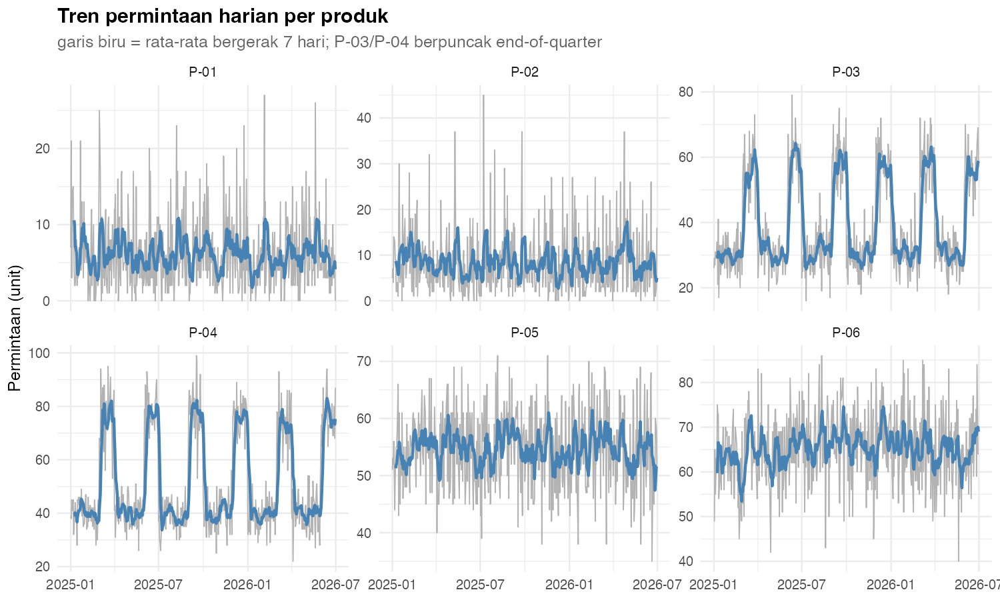
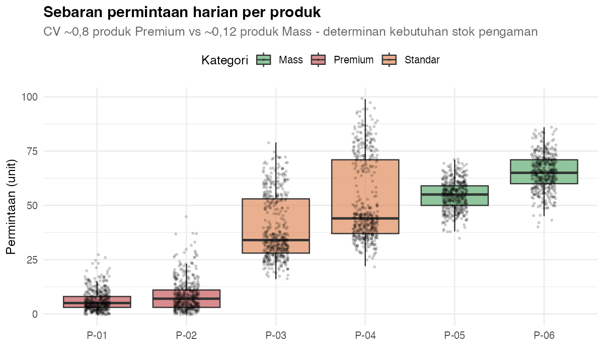
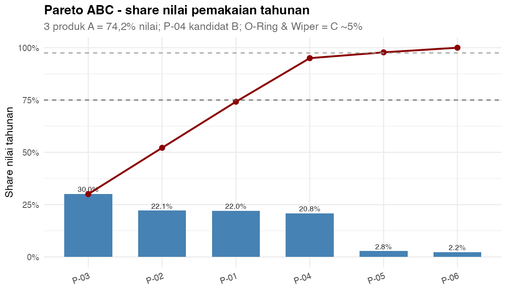
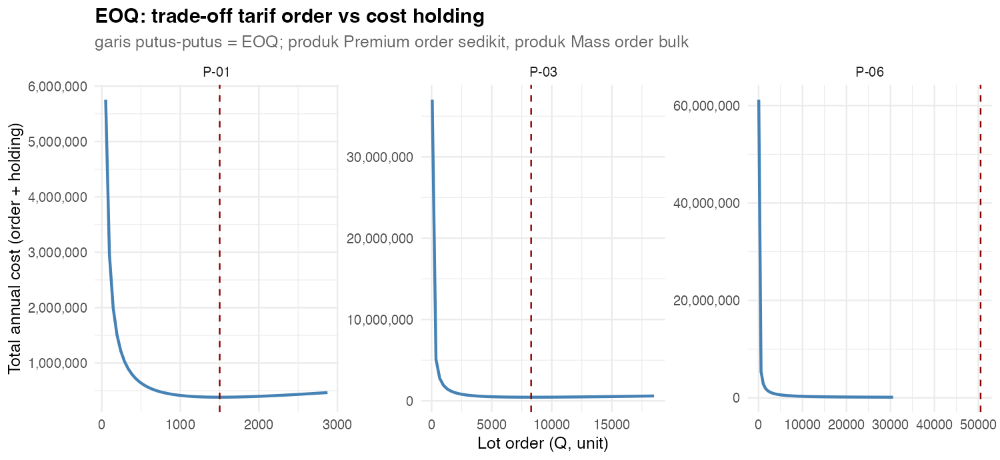
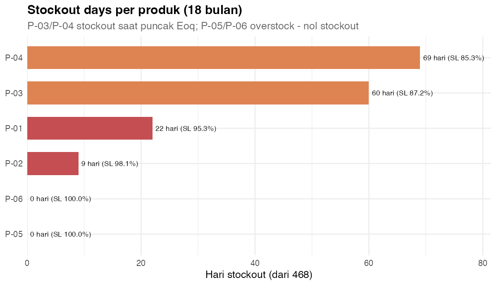
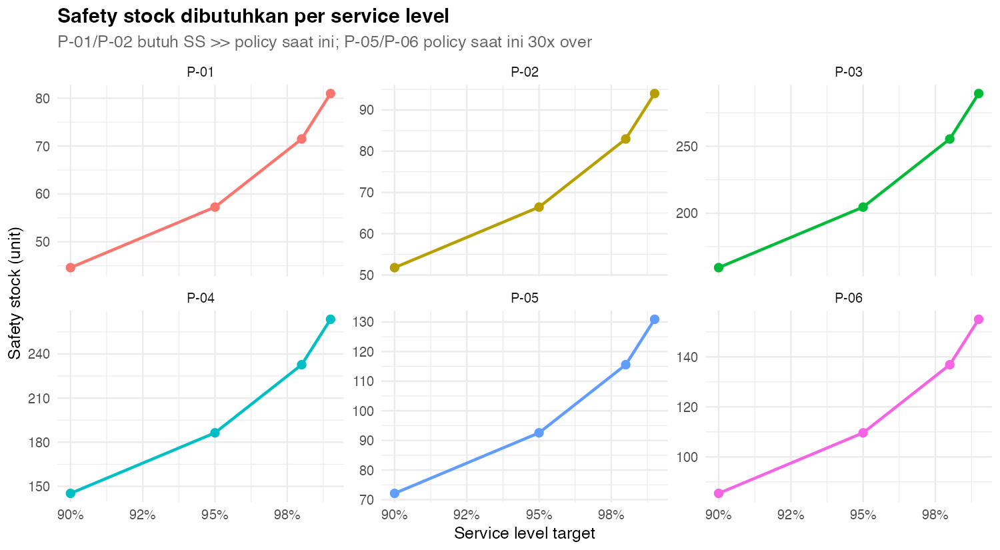
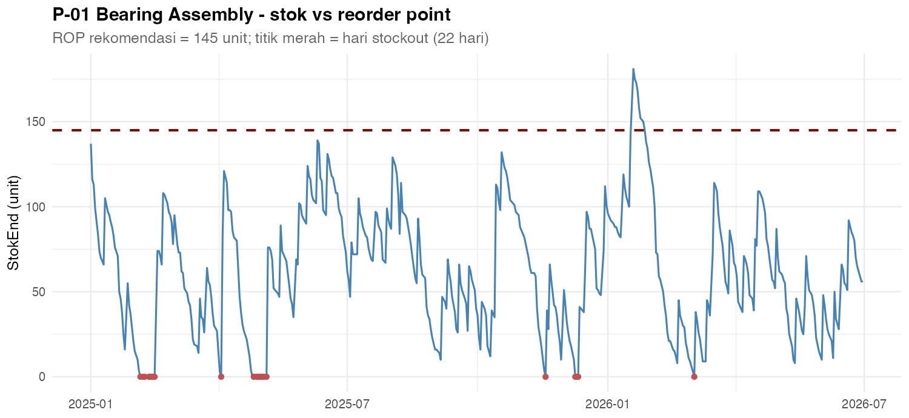
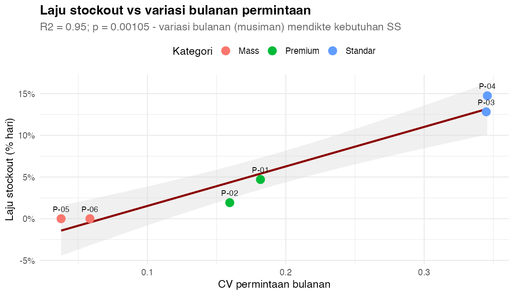

# 📗 Opsi 5 — Persediaan & Safety Stock: EOQ, ROP & Service Level dengan R

> Proyek **end-to-end** Teknik Industri (level **Basic → Advanced**) yang menggabungkan **`dplyr`** untuk transformasi & statistik inventairi, **`ggplot2`** untuk visual, lalu hasilnya siap dipakai sebagai **R visual / data model di Power BI**.
>
> **Pertanyaan inti:** *Produk mana yang sering stockout, berapa safety stock yang dibutuhkan untuk mencapai target service level, dan kenapa policy saat ini mengganjal kapital tanpa mengurangi risiko?*

---

## 1. Gambaran Umum

| Komponen | Keterangan |
| --- | --- |
| **Nama proyek** | Opsi 5 — Persediaan & Safety Stock |
| **Topik** | EOQ, Reorder Point (ROP), Safety Stock (SS), ABC klasifikasi, service level, musiman |
| **Alat IE** | Formule inventairi klasik (EOQ, ROP = μ·LT + z·σ_DLT), ABC Pareto, uji t & ANOVA, regresi, what-if |
| **Bahasa** | R (base + `dplyr` + `ggplot2` + `scales` + `tidyr` + `broom`) |
| **Dataset** | `data/persediaan.csv` (**2.808 baris × 8 kolom**, 1 baris = 1 produk × 1 hari), `data/produk.csv` (dimensi 6 produk) |
| **Level** | Basic (dplyr dasar) → Medium (EOQ/ROP/SS) → Advanced (ABC, statistik, what-if) |
| **Skenario** | Simulasi 18 bulan policy perusahaan saat ini (s,Q) — review 1×/semain, lot = 1 semain permintaan, SS = "cover days" per kategori |
| **Temuan kunci** | P-03/P-04 stockout **60 & 69 hari** (puncak end-of-quarter), P-01 **22 hari** (SS terlalu tipis); P-05/P-06 **nol stockout** maar overstock **30 hari cover** |
| **Luaran** | 6 tabel agregat + 8 visual ggplot2 + kesimpulan/rekomendasi siap dashboard |

### Alur belajar (roadmap)

```text
dplyr (Basic)
  -> read.csv, filter, mutate
  -> group_by + summarise (statistik permintaan per produk)
  -> left_join dimensi produk

Inventairi (Medium)
  -> EOQ (tarif order vs cost holding)
  -> Sigma_DLT & Safety Stock (z * sigma)
  -> Reorder Point (ROP = mu*LT + SS)
  -> ABC klasifikasi nilai pemakaian tahunan

Statistik & Visual (Advanced)
  -> uji t musiman, ANOVA antar produk, regresi CV bulanan -> stockout
  -> 8 visual ggplot2
  -> what-if service level & rekomendasi berbasis bukti
```

---

## 2. Tujuan Pembelajaran

Setelah menyelesaikan Opsi 5, Anda diharapkan mampu:

1. Menghitung statistik permintaan (**mean, SD, CV**) per produk dengan `dplyr`.
2. Membangun **EOQ** klasik dan menafsirkan trade-off tarif order vs cost holding.
3. Menghitung **σ_DLT** (variasi permintaan selama lead time) dan **Safety Stock** untuk target service level.
4. Menentukan **Reorder Point** (μ·LT + SS) dan menggabungnya dengan policy saat ini.
5. Menghitung **ABC klasifikasi** dan mengenali produk yang didominan nilai.
6. Menguji **musiman** (uji t & ANOVA) dan membuktikan dampaknya terhadap stockout dengan regresi.
7. Membuat **8 visual `ggplot2`** dan melakukan **what-if service level**.
8. Menyusun **rekomendasi tindakan** — right-size SS per produk, bukan rule-of-thumb seragam.

---

## 3. Struktur Folder

```text
Brainstorming/pilihan/05-persediaan-safety-stock/
├── README.md                     # file ini
├── data/
│   ├── persediaan.csv            # fakta: permintaan + simulasi stok harian
│   └── produk.csv                # dimensi produk (harga, lead time, target)
├── R/
│   ├── 00_buat_data.R            # generator data + simulasi policy (s,Q)
│   ├── 01_analisis_dplyr.R       # statistik inventairi -> output/*.csv
│   └── 02_visual_ggplot2.R       # 8 visual -> output/V*.png
└── output/                       # hasil tabel & gambar
```

---

## 4. Cara Menjalankan

Dari **root repo** (`Power BI dan R`):

```r
source("Brainstorming/pilihan/05-persediaan-safety-stock/R/00_buat_data.R")
source("Brainstorming/pilihan/05-persediaan-safety-stock/R/01_analisis_dplyr.R")
source("Brainstorming/pilihan/05-persediaan-safety-stock/R/02_visual_ggplot2.R")
```

Atau lewat terminal:

```bash
Rscript "Brainstorming/pilihan/05-persediaan-safety-stock/R/01_analisis_dplyr.R"
Rscript "Brainstorming/pilihan/05-persediaan-safety-stock/R/02_visual_ggplot2.R"
```

> Ketiga skrip **path-robust**: bisa dijalankan dari folder mana pun karena lokasi ditentukan otomatis dari `--file=`.

### Kamus data (`persediaan.csv`)

| Kolom | Tipe | Keterangan |
| --- | --- | --- |
| `Tanggal` | tanggal | 1 Jan 2025 – 30 Jun 2026 (tanpa Minggu, 468 hari) |
| `Produk` | kategori | P-01 … P-06 |
| `Permintaan` | numerik | permintaan harian (unit) |
| `Aterpen` | numerik | unit datang dari supplier pada hari itu |
| `StokBegint` | numerik | stok awal hari (unit) |
| `StokEnd` | numerik | stok akhir hari (unit) |
| `Stockout` | 0/1 | 1 = permintaan tak terfulfil pada hari itu |
| `Defisit` | numerik | unit kekurangan pada hari tersebut |

### Kamus data (`produk.csv`)

| Kolom | Tipe | Keterangan |
| --- | --- | --- |
| `Produk` | kategori | P-01 … P-06 |
| `NamaProduk` | kategori | Bearing Assembly, Hydraulic Valve, … |
| `Kategori` | kategori | Premium / Standar / Mass |
| `HargaUnit` | numerik | harga per unit (currency) |
| `LT_Rata` | numerik | lead time rata (hari) |
| `LT_SD` | numerik | sd lead time (hari) |
| `TargetSL` | numerik | target service level perusahaan |

### Policy perusahaan yang disimulasi (ditanam sengaja)

| Produk | Cover SS (hari) | Lead time (rata ± SD) | Target SL |
| --- | --- | --- | --- |
| P-01 Bearing Assembly (Premium) | 5 | 12 ± 5 | 98% |
| P-02 Hydraulic Valve (Premium) | 5 | 10 ± 4 | 98% |
| P-03 Seal Kit (Standar) | 8 | 7 ± 3 | 95% |
| P-04 Filter Element (Standar) | 8 | 6 ± 2 | 95% |
| P-05 O-Ring (Mass) | 30 | 4 ± 1 | 90% |
| P-06 Wiper Blade (Mass) | 30 | 3 ± 1 | 90% |

> **Pola ditanam:** permintaan Premium **overdispersed** (CV ≈ 0,8) + lead time lengkap yang variabil; permintaan Standar berpuncak **end-of-quarter** (1,9× pada Mar/Jun/Sep/Des); permintaan Mass stabil (CV ≈ 0,12). Dengan policy "cover days" per kategori, analisis harus menemukan: **P-01/P-02 falta SS, P-03/P-04 stockout karena musiman, P-05/P-06 overstock.**

---

## 5. dplyr Basic — Membaca & Merangkum

```r
library(dplyr)

d <- read.csv("data/persediaan.csv") |>
  mutate(Tanggal = as.Date(Tanggal),
         Produk  = factor(Produk))

# ringkasan cepat
d |> group_by(Produk) |>
  summarise(Total = sum(Permintaan),
            Mean  = mean(Permintaan),
            SD    = sd(Permintaan),
            .groups = "drop") |>
  mutate(CV = SD / Mean)
```

**Output:**

```text
  Produk Total  Mean    SD   CV
1   P-01  2865  6.12  4.78 0.78
2   P-02  3946  8.43  7.03 0.83
3   P-03 18452 39.43 14.54 0.37
4   P-04 24247 51.81 18.71 0.36
5   P-05 25577 54.65  6.70 0.12
6   P-06 30500 65.17  8.04 0.12
```

> **Baca begini:** CV adalah bahasa perbandingan variasi. **P-01/P-02 (CV ≈ 0,8)** permintaan sangat tidak terdiksi — kebutuhan permintaan variabel per unit sangat tinggi. **P-05/P-06 (CV ≈ 0,12)** stabil. Permintaan variabel + lead time variabel = kombinasi yang meminta **safety stock**; permintaan stabil maar met cover 30 hari = **overstock**.

---

## 6. dplyr Medium — EOQ, σ_DLT, Safety Stock & ROP

Formule inti (mengacu ke Volume 2 untuk statistika dasar):

```text
σ_DLT   = sqrt( LT_Rata * SD_demanda^2  +  Mean^2 * LT_SD^2 )
SS      = z * σ_DLT              (z dari service level target)
ROP     = Mean * LT_Rata + SS
EOQ     = sqrt( 2 * AnnualDemand * OrderCost / (HoldingRate * Price) )
```

```r
policy <- dem |>
  left_join(produk, by = "Produk") |>
  mutate(Annual      = Mean * 313,                      # 6 hari/semain
         SigmaDLT    = sqrt(LT_Rata * SD^2 + Mean^2 * LT_SD^2),
         SS_company  = cover_days[Kategori] * Mean,     # policy saat ini
         SS_rec      = qnorm(TargetSL) * SigmaDLT,      # rekomendasi
         ROP_rec     = Mean * LT_Rata + SS_rec,
         EOQ         = sqrt(2 * Annual * 150000 / (0.30 * HargaUnit)))
```

**Output (nilai aktual):**

| Produk | Mean | CV | σ_DLT | SS saat ini | **SS rekomendasi** | ROP | EOQ |
| --- | --- | --- | --- | --- | --- | --- | --- |
| P-01 | 6,1 | 0,78 | 34,8 | 30,6 | **71,5** | 144,9 | 1.501 |
| P-02 | 8,4 | 0,83 | 40,4 | 42,2 | **83,0** | 167,3 | 2.063 |
| P-03 | 39,4 | 0,37 | 124,4 | 315,4 | **204,6** | 480,6 | 8.280 |
| P-04 | 51,8 | 0,36 | 113,3 | 414,5 | **186,4** | 497,2 | 13.065 |
| P-05 | 54,7 | 0,12 | 56,3 | 1.639,6 | **72,1** | 290,7 | 37.756 |
| P-06 | 65,2 | 0,12 | 66,6 | 1.955,1 | **85,4** | 280,9 | 50.496 |

> **Baca begini — déjà dua anomali:**
> - **P-01/P-02**: SS perusahaan (5 hari cover) **bukan cukup** — rekomendasi 98% SL is 2,0–2,3× meer (71,5 vs 30,6).
> - **P-05/P-06**: SS perusahaan (30 hari cover) is **23× te groot** (1.956 vs 85,4 nodig). Kapital overkill zonder toegevoegde service — mereka nooit stockout.
> - **EOQ** van produk Premium klein (1.500–2.000 unit) → bestel frequent; produk Mass EOQ reusachtig (37.000–50.000) → bulk order 1× per jaar, omdat cost holding per unit minuscuul is.

---

## 7. Visual 1 — Tren Permintaan Harian

```r
ggplot(d, aes(x = Tanggal)) +
  geom_line(aes(y = Permintaan), color = "grey70", linewidth = 0.4) +
  geom_line(aes(y = MA7), color = "steelblue", linewidth = 1) +
  facet_wrap(~Produk, scales = "free_y", ncol = 3)
```



> **Baca begini:** garis biru (rata-rata 7 hari) memperhalus gejolak. **P-03/P-04 springen herkenbaar bergop in Mar/Jun/Sep/Des** (end-of-quarter) — musiman wat de policy niet voorspelt. P-01/P-02 blijven laag maar wisselvallig; P-05/P-06 stabiel.

---

## 8. Visual 2 — Sebaran Permintaan Per Produk

```r
ggplot(d, aes(x = Produk, y = Permintaan, fill = Kategori)) +
  geom_boxplot(alpha = 0.65, outlier.shape = NA) +
  geom_jitter(width = 0.14, alpha = 0.15, size = 0.7) +
  scale_fill_manual(values = c(Premium = "#C44E52", Standar = "#DD8452", Mass = "#55A868"))
```



| Produk | Median | IQR | Max | CV |
| --- | --- | --- | --- | --- |
| P-01 | 5 | 5–8 | 27 | 0,78 |
| P-02 | 7 | 4–12 | 45 | 0,83 |
| P-03 | 37 | 29–48 | 79 | 0,37 |
| P-04 | 49 | 38–63 | 99 | 0,36 |
| P-05 | 55 | 50–60 | 71 | 0,12 |
| P-06 | 65 | 60–71 | 86 | 0,12 |

> **Baca begini:** produk Premium hebben een lange rechter-staart (max 2,7× de median) — deze staart bepaalt de noodzaak van SS. Mass producten zijn bijna symmetrisch smal. **Permintaan variabel is de eerste variabel die SS bepaalt; lead time variabel is de tweede.**

---

## 9. Visual 3 — Pareto ABC (Nilai Pemakaian Tahunan)

```r
abc <- policy |>
  arrange(desc(Annual * HargaUnit)) |>
  mutate(UsageValue = Annual * HargaUnit,
         Share      = UsageValue / sum(UsageValue),
         Kum        = cumsum(Share),
         ABC        = case_when(Kum <= 0.75 ~ "A", Kum <= 0.975 ~ "B", TRUE ~ "C"))
```



| Produk | UsageValue/jaar | Share | Kumulatif | Klasse |
| --- | --- | --- | --- | --- |
| P-03 Seal Kit | 2.221.337 | 30,0% | 30,0% | **A** |
| P-02 Hydraulic Valve | 1.636.241 | 22,1% | 52,2% | **A** |
| P-01 Bearing Assembly | 1.628.704 | 22,0% | 74,2% | **A** |
| P-04 Filter Element | 1.540.565 | 20,8% | 95,0% | **B** |
| P-05 O-Ring | 205.272 | 2,8% | 97,8% | **C** |
| P-06 Wiper Blade | 163.188 | 2,2% | 100,0% | **C** |

> **Baca begini:** prinsipe 80/20 werkt op zijn kop: **3 produkt (A) = 74% van de totale waarde**; P-05/P-06 samen slechts 5%. Prioriteit voor nauwkeurige SS & monitoring: **klasse A** (P-01, P-02, P-03). Een common mistake is SS evenredig met *volume* (units) te verdelen — dat bevoordeelt P-05/P-06, precies wat de huidige policy doet.

---

## 10. Visual 4 — EOQ: Trade-off Order vs Holding Cost

```r
eoq_d <- do.call(rbind, lapply(c("P-01", "P-03", "P-06"), function(p) {
  r <- policy |> filter(Produk == p)
  qs <- seq(...)
  data.frame(Produk = p, Q = qs,
             Cost = (r$Annual / qs) * K_order + (qs / 2) * h_rate * r$HargaUnit,
             EOQ = r$EOQ)
}))
```



| Produk | EOQ (unit) | Annual demand | Frequenzia order |
| --- | --- | --- | --- |
| P-01 | 1.501 | 1.916 | ~1,3×/jaar |
| P-03 | 8.280 | 12.341 | ~1,5×/jaar |
| P-06 | 50.496 | 20.399 | ~0,4×/jaar |

> **Baca begini:** EOQ balans tussen orderkosten (vaste kosten per bestelling) en holdingkosten (rente over de waarde in stok). Omdat **P-06 heel goedkoop is (8/unit)**, is holding per unit triviaal → economisch optimaal is 1 bulkbestelling per jaar van ±50.000 unit. Voor **P-01 (850/unit)** geldt het omgekeerde: kleine, frequente bestellingen. **Moraal:** een uniforme policy voor alle produkt is sub-optimaal — lot sizes moeten met de waarde meeschalen.

---

## 11. Visual 5 — Stockout Days Per Produk

```r
perf <- inv |> group_by(Produk) |>
  summarise(StockoutDays = sum(Stockout), Defisit = sum(Defisit), ...) |>
  mutate(ServiceLevel = 1 - StockoutDays / N_Hari)
```



| Produk | Hari stockout (468) | Service level bereikt | Target | Defisit (unit) |
| --- | --- | --- | --- | --- |
| P-01 | 22 | 95,3% | 98% | 131 |
| P-02 | 9 | 98,1% | 98% | 63 |
| P-03 | 60 | 87,2% | 95% | 2.902 |
| P-04 | 69 | 85,3% | 95% | 3.852 |
| P-05 | 0 | 100% | 90% | 0 |
| P-06 | 0 | 100% | 90% | 0 |

> **Baca begini:** target gemist bij **4 van 6** produkt. P-03/P-04 zijn het slechtst (85–87%) ondanks dat hun *rekenkundig* SS reeds ruim is — omdat de **seizoenspieken niet in de policy zitten**. P-01/P-02 missen hun target door te dunne SS. P-05/P-06 halen 100% met 30 dagen cover — **overkill, niet wijsheid**.

---

## 12. Statistik — Is de Musiman Echt?

Voordat we SS "repareren", bewijzen we dat de pieken statistisch echt zijn (niet ruis):

```r
p03 <- d |> filter(Produk == "P-03") |>
  mutate(Puncak = as.integer(format(Tanggal, "%m")) %in% c(3, 6, 9, 12))
t.test(Permintaan ~ Puncak, data = p03, var.equal = FALSE)

aov(Permintaan ~ Produk, data = d)
```

**Output:**

```text
Uji t musiman P-03 : puncak Eoq 27,8 unit hoger dan normale maand, |t| = 41,22, p = 3,5×10⁻¹¹²
ANOVA permintaan antar produk      : F = 2340,5, p = 0
```

> **Baca begini:** p-waarden extreem klein → de pieken (en de verschillen tussen produkt) zijn **statistisch zeker**, geen toeval. Een policy die dit negeert **zal gegarandeerd** stockouts blijven produceren tijdens Mar/Jun/Sep/Des.

---

## 13. Visual 6 — What-If: Safety Stock per Service Level

```r
skenario <- do.call(rbind, lapply(c(0.90, 0.95, 0.98, 0.99), function(sl) {
  policy |> mutate(SL     = sl,
                   z      = qnorm(sl),
                   SS_rec = z * SigmaDLT,
                   ROP    = Mean * LT_Rata + SS_rec,
                   Invest = SS_rec * HargaUnit)
}))
```



**Extra investering in SS t.o.v. policy vandaag (Delta):**

| Produk | SL 95% | SL 98% (target P-01/P-02) |
| --- | --- | --- |
| P-01 | +22.643 | +34.740 |
| P-02 | +15.060 | +25.302 |
| P-03 | −19.949 | −10.795 |
| P-04 | −21.671 | −17.270 |
| P-05 | −18.564 | −18.288 |
| P-06 | −14.764 | −14.546 |

> **Baca begini — de herverdeling:** bij hun eigen target heeft P-01/P-02 **meer** SS nodig (+34.740 / +25.302), terwijl P-03 t/m P-06 **minder** (tot −18.000) volstaat. **Dezelfde totale liquiditeit kan de hele voorraad herschikken:** verlaag de mass-producten naar hun target, en gebruik die ruimte voor de premium-producten — zonder de kas op te hogen.

---

## 14. Visual 7 — Spotlight: P-01 Bearing Assembly (Timeline)

```r
p01 <- d |> filter(Produk == "P-01")
ggplot(p01, aes(x = Tanggal, y = StokEnd)) +
  geom_line(color = "steelblue") +
  geom_point(data = p01 |> filter(Stockout == 1), aes(y = 0),
             color = "#C44E52", size = 1.6) +
  geom_hline(yintercept = 145, linetype = "dashed", color = "darkred")  # ROP
```



> **Baca begini:** met ROP = **145 unit** (μ·LT + SS) zakt P-01 regelmatig naar nul bij een langzame levering (LT 12±5 dagen) of een vraagpiek van 2× de mediaan — **22 stockout-dagen in 18 maanden**. Elke stockout van een Bearing Assembly is een stilstaande machine; dat is direct productieverlies, veel duurder dan de 41 extra SS-eenheden die vandaag nodig zijn.

---

## 15. Statistik — Wat Bepaalt Stockout Echt? (Regresi CV Bulanan)

```r
cv_bulan <- d |> group_by(Produk, Bulan) |>
  summarise(M = sum(Permintaan), .groups = "drop") |>
  group_by(Produk) |> summarise(CVBulan = sd(M) / mean(M), .groups = "drop")

lm(Laju ~ CVBulan, data = lvl |> mutate(Laju = StockoutDays / N_Hari))
```



**Output:**

```text
Regresi laju stockout ~ CV bulanan : slope = 0,474, R2 = 0,947, p = 1,05×10⁻³
Korelasi CV bulanan vs laju stockout: r = 0,973, p = 1,05×10⁻³
```

> **Baca begini (punt pedagogisch belangrijk):** de *dagelijkse* CV verklaart de stockouts NIET (R² ≈ 0,00) omdat P-03/P-04 dagelijks redelijk stabiel zijn. Maar de **maandelijkse** CV — die de seizoenspieken vangt — verklaart 94,7% van de variatie in stockout-rate. **Les:** safety stock moet gebaseerd worden op de variabiliteit op de *planningshorizon* (maand/lead-time), niet alleen op dagruis.

---

## 16. Integrasi ke Power BI
| Tahap | Cara |
| --- | --- |
| **Sumber data** | `data/persediaan.csv` + `data/produk.csv` → **Get Data > Text/CSV** |
| **R di Power Query** | Tempel blok policy & ABC dari `01_analisis_dplyr.R` op **Transform > Run R script** → tabel `Policy` & `ABC` (ROP, SS_rec, EOQ per produk) |
| **R visual** | Tempel blok `ggplot2` dari `02_visual_ggplot2.R` (V5 stockout, V6 what-if, V7 timeline) op **R visual**; masukkan kolom `Produk`, `StokEnd`, `Permintaan`, `ROP` naar **Values** |
| **Slicer** | `Produk`, `Kategori`, `Bulan` → R visual reageert op zeef |
| **KPI card** | Stockout 160 dagen · SL laagste 85,3% (P-04) · SS overkill P-06 23× · Waarde stok ±211.260 |

> **Penting:** R visual rendert als **statisch beeld**. Slicer Power BI filtert de data die naar R gaat, maar elementen in het beeld zijn niet klikbaar. Zet altijd de benodigde kolommen in **Values** — voor de timeline minimaal `Tanggal`, `StokEnd`, `Stockout`, `ROP`.
>
> **Tips voor de praktijk:** bereken ROP/SS één keer in **Power Query** (of in de datamodel-DAX) en stuur die als kolommen naar het R visual — dan blijven de lijnen (ROP) consistent met andere visuals.

---

## 17. Kesimpulan & Rekomendasi

**Kondisi saat ini:** van 6 producten missen **4** hun servicetarget; in 18 maanden **160 stockout-dagen** en **6.948 unit onvervulde vraag** (vooral P-03/P-04 in kwartaalpieken). Tegelijkertijd draagt P-05/P-06 30 dagen cover met 0 stockout — kapitaal geblokkeerd zonder risicoreductie.

| # | Temuan | Bukti | Rekomendasi |
| --- | --- | --- | --- |
| 1 | **Seizoenspieken veroorzaken meeste stockouts** | P-03/P-04: 60 & 69 dagen (SL 87%/85%) · uji t +27,8 unit (p = 3,5×10⁻¹¹²) | Maak SS/ROP **seizoensgebonden**: verhoog order-up-to niveau vóór Mar/Jun/Sep/Des |
| 2 | **SS van Premium producten te dun** | P-01 haalt 95,3% (target 98%); SS 30,6 vs benodigd 71,5 | Verhoog SS P-01/P-02 met ~40 eenheden (+34.740 / +25.302) |
| 3 | **Mass producten 23× overbemeten** | P-05/P-06: SS 1.640–1.955 vs 72–85 benodigd; 0 stockout | Verlaag cover naar target SL → bevrijd ±33.600 kapitaal |
| 4 | **Stockout wordt bepaald door maandvariabiliteit** | Regressie CV maand → stockout: R² = 0,947, p = 1,05×10⁻³ (dag-CV verklaart niets) | Baseer SS op **maand/lead-time horizon**, niet op dagruis |
| 5 | **EOQ verschilt per waardeklasse** | P-01 EOQ 1.501 vs P-06 50.496 unit | Kleine frequente orders voor klasse A; bulk 1×/jaar voor klasse C |

**Format insight (kondisi – bukti – tindakan):**

> **Kondisi:** 4 van 6 producten missen hun servicetarget (160 stockout-dagen) terwijl massa-producten 30 dagen cover dragen zonder ooit uit te vallen.
> **Bukti:** uji t seizoen p = 3,5×10⁻¹¹²; P-01 SS 30,6 < 71,5 benodigd; P-06 SS 1.955 vs 85 benodigd; regressie CV-maand → stockout R² = 0,947.
> **Tindakan:** (1) bereken per product SS = z·σ_DLT op maandniveau en zet ROP per product; (2) verhoog voorraad vóór kwartaalpieken (P-03/P-04); (3) herverdeel de vrijgekomen 33.600 naar Premium producten — **zonder de kas op te hogen**.

**Langkah lanjutan (opsional):** voeg een **periodieke review (R,S,S)** simulatie toe met werkelijke daadwerkelijke levertijden, een **backorder vs lost-sale** onderscheid, en een **verkorte wat-als-tool** die de financiële impact van service-niveau-keuzes toont (service-tradeoff curve).

---

*Opsi 5 — Persediaan & Safety Stock: EOQ, ROP, ABC en service level met `dplyr` + `ggplot2`. Deel van `Brainstorming/pilihan/`.*
