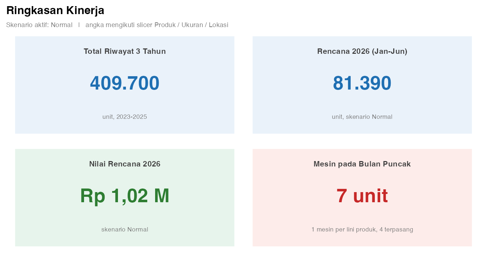
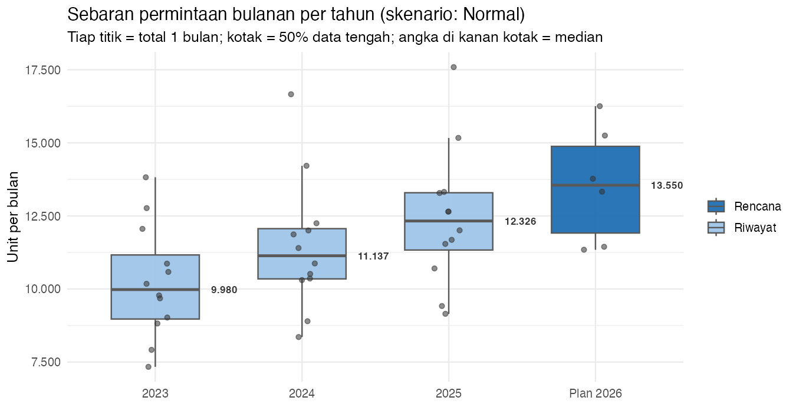
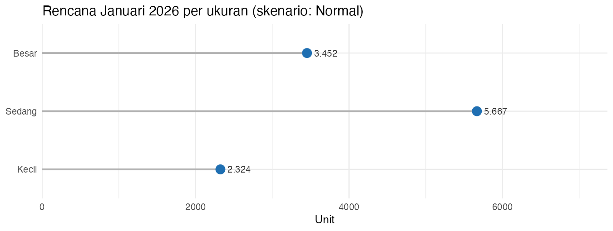
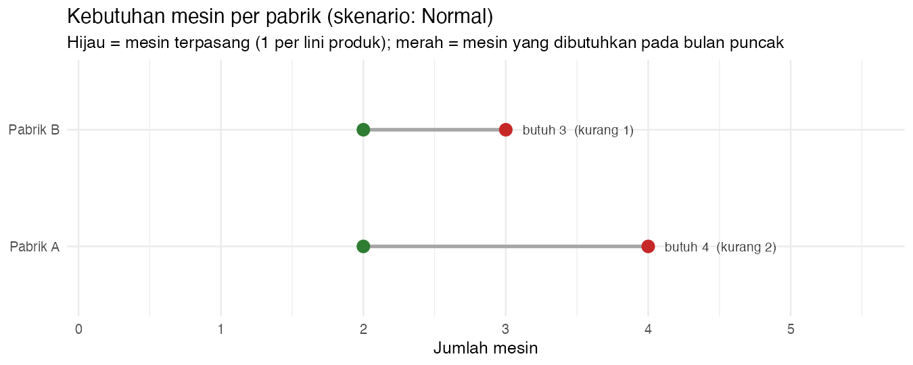
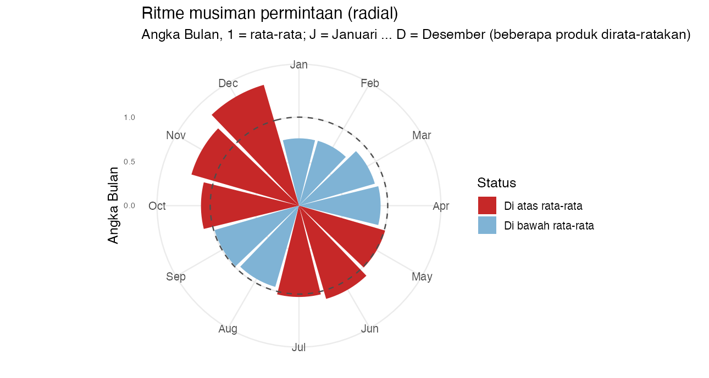
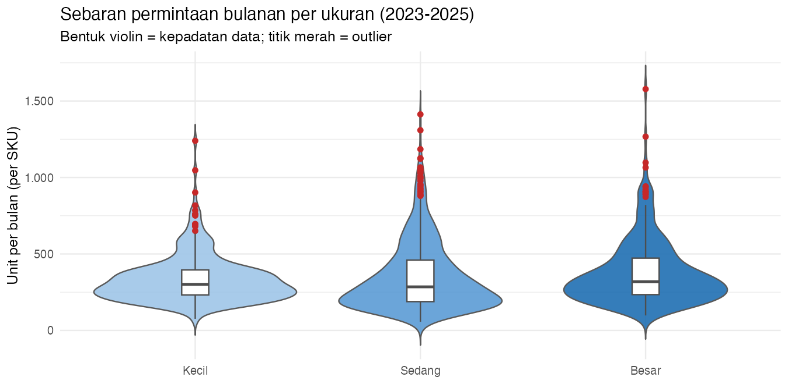
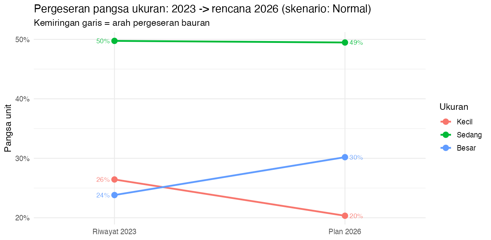
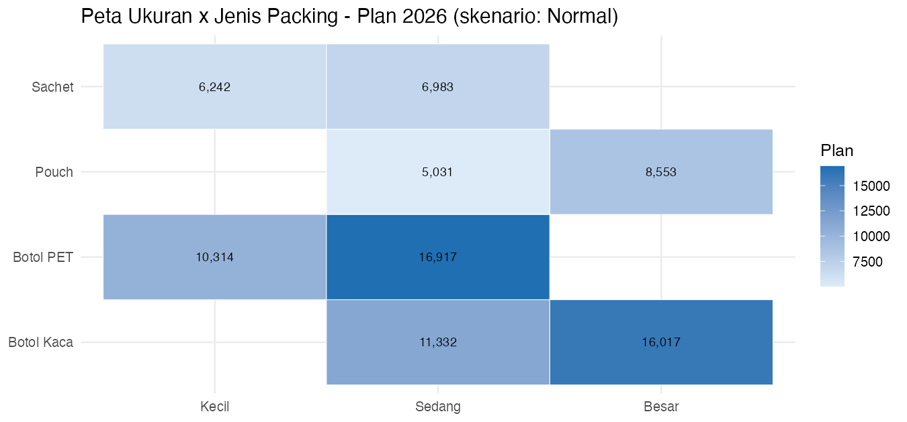
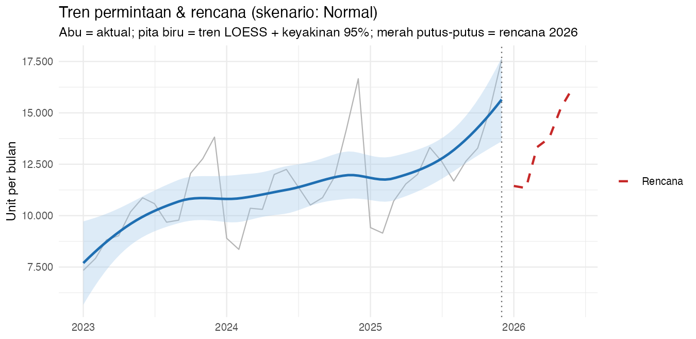
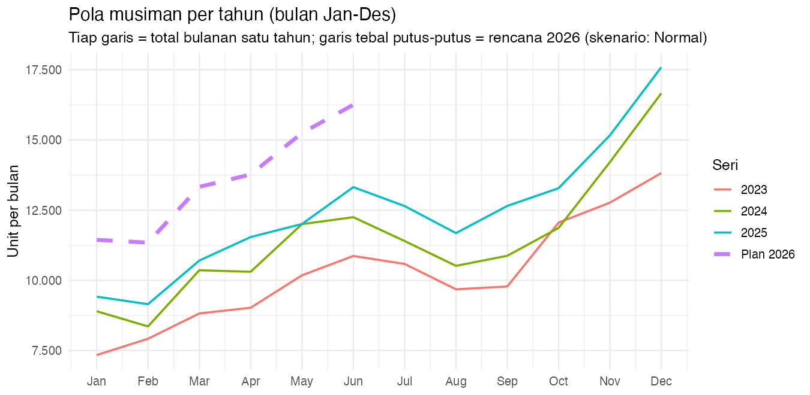

# 🧪 Training R di Power BI — 90 Menit
## Use Case: Peramalan Permintaan CV Segar Jaya

> **Tujuan sesi:** peserta mampu (1) **mentransformasi data dengan R di Power Query**,
> (2) membuat **R visual (`ggplot2`)** berbentuk grafik yang **tidak ada** di Power BI,
> dan (3) membaca **insight bisnis** dari hasilnya.
>
> **Konteks bisnis (1 paragraf):** CV Segar Jaya menjual 16 SKU (Teh Botol & Keripik
> Kentang; ukuran Kecil/Sedang/Besar) ke 2 pabrik. Rencana produksi masih memakai
> rata-rata, sehingga stok menumpuk di bulan sepi (Januari) dan mesin penuh di bulan
> puncak (November–Desember). Kita membangun **satu tabel rencana** yang menjawab:
> *produksi bulan depan berapa, mesin cukup tidak, dan packing mana yang diprioritaskan?*

| Info | Nilai |
| --- | --- |
| **Durasi** | **90 menit** (agenda di bawah) |
| **Level** | R dasar; Power BI dasar–menengah |
| **Dataset** | `data/permintaan.csv` (1.152 baris) + `produk.csv` (16) + `lokasi.csv` (2) |
| **Metode** | `Plan = median 3 bulan × angka bulan` — **tanpa statistika** |
| **Prasyarat R** | `install.packages(c("dplyr", "tidyr", "ggplot2", "scales"))` |
| **Hasil akhir** | tabel `ramalan` **4.032 baris** + **10 R visual** + 1 halaman dashboard |

> **Cara membaca:** setiap tahap berisi **Tujuan → Kode R → Hasil**. Kode boleh langsung
> disalin ke Power BI. Semua blok diuji otomatis oleh `R/03_validasi.R` (0 warning).

## Agenda

| Menit | Tahap | Hasil yang dilihat peserta |
| ---: | --- | --- |
| 0–5 | **0. Persiapan** | paham data, dimensi, dan outlier |
| 5–25 | **1. Transformasi di Power Query** | tabel `ramalan` (4.032 baris) |
| 25–70 | **2. Sepuluh R visual** | 10 grafik yang ikut slicer |
| 70–85 | **3. Dashboard & insight** | layout + insight kondisi–bukti–tindakan |
| 85–90 | **4. Validasi & penutup** | peserta bisa reproduce sendiri |

---

## Tahap 0 — Persiapan (5 menit)

**Tujuan:** tahu isi data, dan tahu mengapa R dipakai.

### 0.1 Data (star model mini)

```text
  produk (16 SKU) ──┐
                    ├──►  permintaan  (fakta 1.152 baris)  ◄── lokasi (2)
  skenario (3) ─────┘
```

- `permintaan.csv`: `Tanggal, SKU, Lokasi, Permintaan` → 1 baris = 1 bulan × 1 SKU × 1 pabrik.
- `produk.csv`: `SKU, Produk, Kategori, Rasa, Ukuran, UrutanUkuran, JenisPacking, IsiKemasan, HargaSatuan, IsiPerKarton, KapasitasMesin`.
- `lokasi.csv`: `Lokasi, Faktor` → Pabrik A 0,60 dan Pabrik B 0,40.

### 0.2 Dimensi produk (16 SKU)

| Produk | Ukuran (isi) | Packing | Harga | Isi/karton | Kapasitas mesin/bln |
| --- | --- | --- | ---: | ---: | ---: |
| Teh Botol | Kecil (250 ml) | Botol PET | Rp 6.000 | 24 | 4.000 |
| Teh Botol | Sedang (450 ml) | Botol PET / Botol Kaca | Rp 9.000 / 12.000 | 12 | 4.000 |
| Teh Botol | Besar (1.000 ml) | Botol Kaca | Rp 18.000 | 6 | 4.000 |
| Keripik Kentang | Kecil (60 g) | Sachet | Rp 6.500 | 40 | 2.200 |
| Keripik Kentang | Sedang (120 g) | Sachet / Pouch | Rp 11.000 / 15.000 | 24 | 2.200 |
| Keripik Kentang | Besar (250 g) | Pouch | Rp 22.000 | 12 | 2.200 |

### 0.3 Kondisi data: ada outlier

| Kejadian | Faktor | Kapan | Baris |
| --- | --- | --- | ---: |
| Promo | ×1,30 – ×1,85 | lebih sering Mar–Apr & Nov–Des | 34 |
| Gangguan pasokan / mesin | ×0,35 – ×0,65 | acak | 20 |
| Ekstrem (langka) | ×2,20 – ×2,80 | acak | 5 |
| Normal | ×1,00 | — | 1.093 |

Rentang data: **57 – 1.578 unit per baris**; total **59 baris (5,1%)** adalah outlier.

> **Pelajaran kunci #1:** karena ada outlier, sesi ini **tidak memakai rata-rata**, tetapi
> **median**. Rata-rata terseret lonjakan promo; median tidak.

---

## Tahap 1 — Transformasi Data dengan R di Power Query (20 menit)

**Tujuan:** membentuk tabel **`ramalan`** = riwayat 36 bulan **+** rencana 6 bulan × 3 skenario.

### 1.1 Langkah di Power BI Desktop

1. **Get Data > Text/CSV** → impor 3 file CSV.
2. **Transform Data** → klik query `permintaan` → **Merge Queries** dengan `produk`
   (kolom kunci `SKU`) → expand semua kolom produk.
3. Merge lagi dengan `lokasi` (kunci `Lokasi`) → expand `Faktor`
   → rename query menjadi **`ramalan_sumber`** (1.152 baris × 15 kolom).
4. **Transform > Run R script** → tempel kode pada §1.2 → **OK**.
5. Power BI mengenali objek **`output`** → rename query hasilnya menjadi **`ramalan`**.
6. **File > Options and settings > Options > Privacy** → pilih
   *Always ignore privacy levels* → **OK** (agar skrip R tidak diblokir).
7. **Close & Apply**.

### 1.2 Kode R (salin-tempel)

```r
suppressMessages({ library(dplyr); library(tidyr) })

X <- dataset
X$Tanggal <- as.Date(X$Tanggal)
X$BulanKe <- as.integer(format(X$Tanggal, "%m"))
nama_bulan <- c("Januari", "Februari", "Maret", "April", "Mei", "Juni",
                "Juli", "Agustus", "September", "Oktober", "November", "Desember")
X$NamaBulan <- nama_bulan[X$BulanKe]

# Langkah 1: Angka Bulan (ritme per tahun), per produk
# Penyebut memakai median 12 bulan agar bulan ekstrem tidak mendominasi.
angka_bulan <- X |>
  group_by(Produk, BulanKe) |>
  summarise(Total = sum(Permintaan), .groups = "drop") |>
  group_by(Produk) |>
  mutate(AngkaBulan = Total / median(Total)) |>
  ungroup() |>
  select(Produk, BulanKe, AngkaBulan)

# Langkah 2: Level = nilai tengah (median) 3 bulan terakhir (Okt-Des 2025),
#            per SKU + lokasi
level <- X |>
  filter(Tanggal >= as.Date("2025-10-01")) |>
  group_by(SKU, Lokasi) |>
  summarise(Level = median(Permintaan), .groups = "drop")

# Langkah 3: Plan 2026 (6 bulan) = Level x AngkaBulan
plan <- merge(
  expand.grid(
    Tanggal = seq(as.Date("2026-01-01"), as.Date("2026-06-01"), by = "month"),
    Lokasi  = unique(X$Lokasi)
  ),
  distinct(select(X, SKU, Produk, Kategori, Rasa, Ukuran, UrutanUkuran,
                  JenisPacking, IsiKemasan, HargaSatuan, IsiPerKarton,
                  KapasitasMesin))
)
plan$BulanKe <- as.integer(format(plan$Tanggal, "%m"))
plan <- plan |>
  left_join(angka_bulan, by = c("Produk", "BulanKe")) |>
  left_join(level,       by = c("SKU", "Lokasi")) |>
  mutate(NamaBulan = nama_bulan[BulanKe],
         Plan = Level * AngkaBulan,
         Jenis = "Plan", Permintaan = NA_real_)

# Riwayat (3 tahun) memakai kolom yang sama
riwayat <- X |>
  left_join(angka_bulan, by = c("Produk", "BulanKe")) |>
  mutate(Jenis = "Riwayat", Plan = NA_real_)

# Skenario what-if: setiap baris 3x (Pesimis x0,90 / Normal x1,00 / Optimis x1,10)
skenario <- data.frame(
  Skenario = c("Pesimis", "Normal", "Optimis"),
  Faktor   = c(0.90, 1.00, 1.10)
)

kol <- c("Tanggal", "SKU", "Produk", "Kategori", "Rasa", "Ukuran", "UrutanUkuran",
         "JenisPacking", "IsiKemasan", "HargaSatuan", "IsiPerKarton", "KapasitasMesin",
         "Lokasi", "BulanKe", "NamaBulan", "AngkaBulan", "Jenis",
         "Permintaan", "Plan")

output <- bind_rows(riwayat |> select(all_of(kol)),
                    plan    |> select(all_of(kol))) |>
  crossing(skenario) |>
  mutate(Plan = ifelse(Jenis == "Plan", Plan * Faktor, NA_real_),
         UrutanUkuran = as.integer(UrutanUkuran)) |>
  arrange(Produk, Rasa, Ukuran, JenisPacking, Lokasi, Tanggal, Skenario)

output
```

### 1.3 Apa yang dilakukan kode itu

| Langkah | Arti sederhana |
| --- | --- |
| `AngkaBulan` | “bulan ini biasanya berapa kali rata-rata?” (per produk; penyebut = **median 12 bulan**) |
| `Level` | **median** Okt–Des 2025 per SKU per pabrik → tahan terhadap outlier |
| `Plan` | `Level × AngkaBulan` untuk Jan–Jun 2026 |
| `Skenario` | setiap baris dikali 3: Pesimis ×0,90 · Normal ×1,00 · Optimis ×1,10 |

### 1.4 Hasil

```text
dataset (hasil merge) : 1152 baris x 15 kolom
ramalan (output)      : 4032 baris  = (1152 riwayat + 192 rencana) x 3 skenario
```

Contoh isi tabel `ramalan` (satu SKU, satu pabrik):

| Tanggal | SKU | Pabrik | Jenis | Skenario | AngkaBulan | Permintaan | Plan |
| --- | --- | --- | --- | --- | --- | --- | --- |
| 2025-12 | TB-JAS-SED-PET | Pabrik A | Riwayat | Normal | 1,43 | 1.413 | - |
| 2025-12 | TB-JAS-SED-PET | Pabrik A | Riwayat | Optimis | 1,43 | 1.413 | - |
| 2025-12 | TB-JAS-SED-PET | Pabrik A | Riwayat | Pesimis | 1,43 | 1.413 | - |
| 2026-01 | TB-JAS-SED-PET | Pabrik A | Plan | Normal | 0,76 | - | 901 |
| 2026-01 | TB-JAS-SED-PET | Pabrik A | Plan | Optimis | 0,76 | - | 991 |
| 2026-01 | TB-JAS-SED-PET | Pabrik A | Plan | Pesimis | 0,76 | - | 811 |

> `Permintaan` hanya terisi saat `Jenis = "Riwayat"`; `Plan` hanya saat `Jenis = "Plan"`.
> Nama bulan & `AngkaBulan` ikut terbawa agar bisa dipakai visual.

---

## Tahap 2 — Visualisasi dengan R Visual (45 menit)

**Tujuan:** membuat **10 grafik** yang tidak tersedia di galeri native Power BI.

### 2.1 Dua aturan filter

| Kolom | Peran | Perilaku |
| --- | --- | --- |
| `Skenario` | **slicer saja** | grafik menampilkan **1 skenario**; kode memprioritaskan `Normal` |
| `Produk` | **slicer saja** | produk **tidak** dipakai sebagai facet/warna/sumbu; bila 2 produk dipilih, angkanya digabung |

> **Pelajaran kunci #2:** slicer hanya bekerja jika kolomnya ada di **Values** visual R.

### 2.2 Bentuk grafik dan padanannya di Power BI

| Visual | Bentuk | Ada di galeri native Power BI? |
| --- | --- | --- |
| V1 | Kartu KPI 2×2 | ada (Card) — ini versi 1-visual |
| V2 | **Boxplot** + titik + outlier | **tidak** |
| V3 | **Lollipop** (dot & stem) | **tidak** |
| V4 | **Dumbbell** (mesin terpasang vs butuh) | **tidak** |
| V5 | **Radial / rose chart** | **tidak** |
| V6 | **Violin + boxplot** | **tidak** |
| V7 | **Slope chart** | **tidak** |
| V8 | Heatmap ukuran × packing | ada (Matrix) |
| V9 | **Line + penghalus LOESS + pita keyakinan 95%** | **tidak** |
| V10 | **Overlay musiman** 1 garis per tahun | **tidak** |

### 2.3 Cara menempel kode

1. Klik kanvas → **Visualizations > R**.
2. Seret kolom ke **Values** sesuai daftar tiap visual; kolom angka → **Do not summarize**.
3. **Run script** → grafik muncul.
4. Ubah slicer → grafik **rendah ulang** mengikuti filter.

### V1 — Kartu KPI: 4 angka kunci

Menjawab: *berapa total 3 tahun, berapa rencana 2026, berapa nilainya, cukup berapa mesin?*

**Values:** `Tanggal, SKU, Produk, Rasa, Ukuran, JenisPacking, Lokasi, Jenis, Permintaan, Plan, Skenario, HargaSatuan, KapasitasMesin`

```r
# Visual 1 - KARTU KPI: 4 angka kunci dalam 1 tampilan (ikut slicer)
suppressMessages({ library(ggplot2); library(dplyr) })
D  <- dataset
sk <- intersect(c("Normal", "Pesimis", "Optimis"), unique(D$Skenario))[1]

riwayat <- D |>
  filter(Jenis == "Riwayat") |>
  distinct(Tanggal, SKU, Lokasi, Permintaan) |>
  summarise(Unit = sum(Permintaan))

rencana <- D |>
  filter(Jenis == "Plan", Skenario == sk) |>
  summarise(Unit = sum(Plan), Rp = sum(Plan * HargaSatuan))

mesin <- D |>
  filter(Jenis == "Plan", Skenario == sk) |>
  group_by(Produk, Lokasi, Tanggal, KapasitasMesin) |>
  summarise(Bulan = sum(Plan), .groups = "drop") |>
  group_by(Produk, Lokasi, KapasitasMesin) |>
  summarise(Puncak = max(Bulan), .groups = "drop") |>
  mutate(Keb = ceiling(Puncak / KapasitasMesin))

angka <- function(x) formatC(round(x), format = "d", big.mark = ".", decimal.mark = ",")
total_mesin <- sum(mesin$Keb)

kpi <- data.frame(
  Kolom  = c(1, 2, 1, 2),
  Baris  = c(2, 2, 1, 1),
  Judul  = c("Total Riwayat 3 Tahun", "Rencana 2026 (Jan-Jun)",
             "Nilai Rencana 2026", "Mesin pada Bulan Puncak"),
  Nilai  = c(angka(riwayat$Unit), angka(rencana$Unit),
             paste0("Rp ", formatC(rencana$Rp / 1e9, format = "f", digits = 2, decimal.mark = ","), " M"),
             paste0(total_mesin, " unit")),
  Ket    = c("unit, 2023-2025", sprintf("unit, skenario %s", sk),
             sprintf("skenario %s", sk), sprintf("1 mesin per lini produk, 4 terpasang")),
  Latar  = c("#EAF2FA", "#EAF2FA", "#E7F4EC", "#FDECEA"),
  Aksen  = c("#1F6FB2", "#1F6FB2", "#2E7D32", "#C62828")
)

p <- ggplot(kpi, aes(Kolom, Baris)) +
  geom_tile(aes(fill = Latar), width = 0.94, height = 0.90,
            color = "white", linewidth = 2.5) +
  geom_text(aes(y = Baris + 0.30, label = Judul),
            fontface = "bold", size = 3.7, color = "grey25") +
  geom_text(aes(y = Baris + 0.02, label = Nilai),
            fontface = "bold", size = 9, color = kpi$Aksen) +
  geom_text(aes(y = Baris - 0.28, label = Ket),
            size = 3.0, color = "grey45") +
  scale_fill_identity() +
  scale_x_continuous(limits = c(0.5, 2.5), expand = c(0, 0)) +
  scale_y_continuous(limits = c(0.5, 2.5), expand = c(0, 0)) +
  labs(title = "Ringkasan Kinerja",
       subtitle = sprintf("Skenario aktif: %s   |   angka mengikuti slicer Produk / Ukuran / Lokasi", sk)) +
  theme_void(base_size = 12) +
  theme(plot.title    = element_text(face = "bold", size = 15, margin = margin(b = 2)),
        plot.subtitle = element_text(size = 9, color = "grey45"),
        plot.margin   = margin(8, 8, 8, 8))
p
```



### V2 — Boxplot: sebaran permintaan per tahun + sebaran rencana 2026

**Values:** `Tanggal, Produk, SKU, Lokasi, Jenis, Permintaan, Plan, Skenario`

```r
# Visual 2 - BOXPLOT: sebaran permintaan bulanan per tahun + sebaran RENCANA 2026
# (boxplot tidak ada di galeri visual native Power BI)
#
# CATATAN: rencana digambar sebagai BOXPLOT dari 6 nilai bulanan (Jan-Jun 2026),
#   bukan sebagai 1 titik. Kalau dirangkum jadi satu titik, kotaknya kosong.
suppressMessages({ library(ggplot2); library(dplyr) })
D  <- dataset
sk <- intersect(c("Normal", "Pesimis", "Optimis"), unique(D$Skenario))[1]
angka <- function(x) formatC(round(x), format = "d", big.mark = ".", decimal.mark = ",")

riwayat <- D |>
  filter(Jenis == "Riwayat") |>
  distinct(Tanggal, SKU, Lokasi, Permintaan) |>
  group_by(Tanggal) |>
  summarise(Unit = sum(Permintaan), .groups = "drop") |>
  mutate(Periode = format(Tanggal, "%Y"), Grup = "Riwayat")

rencana <- D |>
  filter(Jenis == "Plan", Skenario == sk) |>
  group_by(Tanggal) |>
  summarise(Unit = sum(Plan), .groups = "drop") |>
  mutate(Periode = "Plan 2026", Grup = "Rencana")

Dd <- bind_rows(riwayat, rencana) |>
  mutate(Periode = factor(Periode, levels = c("2023", "2024", "2025", "Plan 2026")))

med <- Dd |>
  group_by(Periode, Grup) |>
  summarise(Med = median(Unit), .groups = "drop")

p <- ggplot(Dd, aes(Periode, Unit, fill = Grup)) +
  geom_boxplot(width = 0.60, color = "grey35", outlier.shape = NA, alpha = 0.95) +
  geom_point(position = position_jitter(width = 0.10, seed = 1),
             size = 1.6, color = "grey20", alpha = 0.55, show.legend = FALSE) +
  geom_text(data = med, aes(y = Med, label = angka(Med)),
            nudge_x = 0.38, hjust = 0, size = 3.0, fontface = "bold", color = "grey20") +
  scale_fill_manual(name = NULL, values = c("Riwayat" = "#9EC5E8", "Rencana" = "#1F6FB2")) +
  scale_y_continuous(labels = function(v) formatC(round(v), format = "d", big.mark = ".", decimal.mark = ",")) +
  labs(title = sprintf("Sebaran permintaan bulanan per tahun (skenario: %s)", sk),
       subtitle = "Tiap titik = total 1 bulan; kotak = 50% data tengah; angka di kanan kotak = median",
       x = NULL, y = "Unit per bulan") +
  theme_minimal(base_size = 12)
p
```



> **Pertanyaan yang sering muncul: “kenapa kotak Plan 2026 kosong?”**
> Karena rencana dulu **dirangkum jadi satu nilai** (median 6 bulan) sehingga tidak ada
> sebaran — yang tergambar hanya 1 titik. Perbaikannya: **biarkan 6 nilai bulanan**
> (Jan–Jun 2026) dan biarkan `geom_boxplot` yang merangkumnya. Sekarang kotaknya terisi,
> dan garis median memisahkan rencana dari riwayat.

---

### V3 — Lollipop: rencana Januari 2026 per ukuran

Menjawab *berapa unit untuk Kecil / Sedang / Besar bulan depan?* Pilih satu produk di
slicer → angkanya persis untuk produk itu.

**Values:** `Tanggal, Produk, Ukuran, SKU, Lokasi, Jenis, Plan, Skenario`

```r
# Visual 3 - LOLLIPOP: rencana Januari 2026 per ukuran
# (lollipop / dot-and-stem tidak ada di galeri visual native Power BI)
suppressMessages({ library(ggplot2); library(dplyr) })
D   <- dataset
sk <- intersect(c("Normal", "Pesimis", "Optimis"), unique(D$Skenario))[1]

Dd <- D |>
  filter(Jenis == "Plan", Tanggal == as.Date("2026-01-01"), Skenario == sk) |>
  group_by(Ukuran) |>
  summarise(Unit = sum(Plan), .groups = "drop") |>
  mutate(Ukuran = factor(Ukuran, levels = c("Kecil", "Sedang", "Besar")),
         Label  = formatC(round(Unit), format = "d", big.mark = ".", decimal.mark = ","))

p <- ggplot(Dd, aes(Unit, Ukuran)) +
  geom_segment(aes(x = 0, xend = Unit, y = Ukuran, yend = Ukuran),
               color = "grey70", linewidth = 0.9) +
  geom_point(size = 4.2, color = "#1F6FB2") +
  geom_text(aes(label = Label), hjust = -0.30, size = 3.5, color = "grey20") +
  scale_x_continuous(expand = expansion(mult = c(0, 0.30))) +
  scale_y_discrete(expand = expansion(add = 0.5)) +
  labs(title = sprintf("Rencana Januari 2026 per ukuran (skenario: %s)", sk),
       x = "Unit", y = NULL) +
  theme_minimal(base_size = 12)
p
```



### V4 — Dumbbell: mesin terpasang vs mesin dibutuhkan per pabrik

Menjawab *kapan mesin tidak cukup dan berapa yang perlu ditambah?* Titik hijau = terpasang,
titik merah = dibutuhkan pada bulan puncak.

**Values:** `Tanggal, Produk, SKU, Lokasi, Jenis, Plan, Skenario, KapasitasMesin`

```r
# Visual 4 - DUMBBELL: jumlah mesin terpasang vs dibutuhkan per pabrik
# (dumbbell / gap chart tidak ada di galeri visual native Power BI)
suppressMessages({ library(ggplot2); library(dplyr) })
D   <- dataset
sk <- intersect(c("Normal", "Pesimis", "Optimis"), unique(D$Skenario))[1]

Dd <- D |>
  filter(Jenis == "Plan", Skenario == sk) |>
  group_by(Produk, Lokasi, Tanggal, KapasitasMesin) |>
  summarise(Unit = sum(Plan), .groups = "drop") |>
  group_by(Produk, Lokasi, KapasitasMesin) |>
  summarise(Puncak = max(Unit), .groups = "drop") |>
  mutate(Mesin = ceiling(Puncak / KapasitasMesin)) |>
  group_by(Lokasi) |>
  summarise(Butuh = sum(Mesin), Terpasang = n(), .groups = "drop") |>
  mutate(Kurang = Butuh - Terpasang,
         Label  = ifelse(Kurang > 0, sprintf("butuh %d  (kurang %d)", Butuh, Kurang),
                         sprintf("butuh %d", Butuh)))

p <- ggplot(Dd, aes(y = Lokasi)) +
  geom_segment(aes(x = Terpasang, xend = Butuh, y = Lokasi, yend = Lokasi),
               color = "grey65", linewidth = 1.2) +
  geom_point(aes(x = Terpasang), color = "#2E7D32", size = 3.8) +
  geom_point(aes(x = Butuh), color = "#C62828", size = 3.8) +
  geom_text(aes(x = pmax(Terpasang, Butuh), label = Label),
            hjust = -0.15, size = 3.3, color = "grey20") +
  scale_x_continuous(breaks = 0:8, limits = c(0, NA),
                     expand = expansion(mult = c(0.02, 0.45))) +
  scale_y_discrete(expand = expansion(add = 0.6)) +
  labs(title = sprintf("Kebutuhan mesin per pabrik (skenario: %s)", sk),
       subtitle = "Hijau = mesin terpasang (1 per lini produk); merah = mesin yang dibutuhkan pada bulan puncak",
       x = "Jumlah mesin", y = NULL) +
  theme_minimal(base_size = 12)
p
```



### V5 — Radial (rose): ritme musiman / Angka Bulan

Menjelaskan **mengapa rencana tidak boleh memakai rata-rata** — Januari ≈ 0,76×,
Desember ≈ 1,4×. Bar merah = bulan di atas rata-rata.

**Values:** `Produk, BulanKe, AngkaBulan`

```r
# Visual 5 - RADIAL (rose chart): ritme musiman / Angka Bulan
# (radial bar / rose chart tidak ada di galeri visual native Power BI)
suppressMessages({ library(ggplot2); library(dplyr) })
D <- dataset |>
  distinct(Produk, BulanKe, AngkaBulan) |>
  group_by(BulanKe) |>
  summarise(AngkaBulan = mean(AngkaBulan), .groups = "drop") |>
  mutate(NM     = factor(month.abb[BulanKe], levels = month.abb),
         Status = ifelse(AngkaBulan >= 1, "Di atas rata-rata", "Di bawah rata-rata"))

p <- ggplot(D, aes(NM, AngkaBulan, fill = Status)) +
  geom_col(width = 0.92) +
  geom_hline(yintercept = 1, linetype = "dashed", color = "grey30") +
  scale_y_continuous(limits = c(0, NA)) +
  scale_fill_manual(values = c("Di atas rata-rata" = "#C62828",
                               "Di bawah rata-rata" = "#7FB3D5")) +
  coord_polar(start = -pi / 12) +
  labs(title = "Ritme musiman permintaan (radial)",
       subtitle = "Angka Bulan, 1 = rata-rata; J = Januari ... D = Desember (beberapa produk dirata-ratakan)",
       x = NULL, y = "Angka Bulan") +
  theme_minimal(base_size = 12) +
  theme(axis.text.y = element_text(size = 7))
p
```



### V6 — Violin: sebaran permintaan per ukuran + outlier

Menunjukkan kepadatan data per ukuran; **titik merah = outlier** promo/gangguan,
sehingga terlihat ukuran mana yang paling terpengaruh.

**Values:** `Tanggal, Produk, SKU, Ukuran, Lokasi, Jenis, Permintaan`

```r
# Visual 6 - VIOLIN: sebaran permintaan bulanan per UKURAN (2023-2025)
# (violin plot tidak ada di galeri visual native Power BI)
suppressMessages({ library(ggplot2); library(dplyr) })
D <- dataset |>
  filter(Jenis == "Riwayat") |>
  distinct(Tanggal, Produk, SKU, Ukuran, Lokasi, Permintaan) |>
  mutate(Ukuran = factor(Ukuran, levels = c("Kecil", "Sedang", "Besar")))

p <- ggplot(D, aes(Ukuran, Permintaan, fill = Ukuran)) +
  geom_violin(trim = FALSE, color = "grey35", alpha = 0.9) +
  geom_boxplot(width = 0.12, fill = "white", color = "grey30",
               outlier.color = "#C62828", outlier.size = 1.8) +
  scale_fill_manual(values = c("Kecil" = "#9EC5E8", "Sedang" = "#5B9BD5",
                               "Besar" = "#1F6FB2")) +
  scale_y_continuous(labels = function(v) formatC(round(v), format = "d", big.mark = ".", decimal.mark = ",")) +
  labs(title = "Sebaran permintaan bulanan per ukuran (2023-2025)",
       subtitle = "Bentuk violin = kepadatan data; titik merah = outlier",
       x = NULL, y = "Unit per bulan (per SKU)") +
  theme_minimal(base_size = 12) +
  theme(legend.position = "none")
p
```



---

### V7 — Slope chart: pergeseran pangsa ukuran 2023 → rencana 2026

Menjawab *bauran bergeser ke mana?* Kemiringan garis = arah pergeseran. Garis **Besar**
naik, **Kecil** turun, **Sedang** relatif stabil.

**Values:** `Tanggal, Produk, Ukuran, SKU, Lokasi, Jenis, Permintaan, Plan, Skenario`

```r
# Visual 7 - SLOPE CHART: pergeseran pangsa ukuran 2023 -> rencana 2026
# (slope chart tidak ada di galeri visual native Power BI)
suppressMessages({ library(ggplot2); library(dplyr); library(scales) })
D   <- dataset
sk <- intersect(c("Normal", "Pesimis", "Optimis"), unique(D$Skenario))[1]

riwayat <- D |>
  filter(Jenis == "Riwayat", format(Tanggal, "%Y") == "2023") |>
  group_by(Ukuran) |>
  summarise(Unit = sum(Permintaan), .groups = "drop") |>
  mutate(Pangsa = Unit / sum(Unit), Periode = "Riwayat 2023")

rencana <- D |>
  filter(Jenis == "Plan", Skenario == sk) |>
  group_by(Ukuran) |>
  summarise(Unit = sum(Plan), .groups = "drop") |>
  mutate(Pangsa = Unit / sum(Unit), Periode = "Plan 2026")

Dd <- bind_rows(riwayat, rencana) |>
  mutate(Periode = factor(Periode, levels = c("Riwayat 2023", "Plan 2026")),
         Ukuran  = factor(Ukuran, levels = c("Kecil", "Sedang", "Besar")))

p <- ggplot(Dd, aes(Periode, Pangsa, group = Ukuran, color = Ukuran)) +
  geom_line(linewidth = 1.1) +
  geom_point(size = 3.2) +
  geom_text(data = filter(Dd, Periode == "Riwayat 2023"),
            aes(label = percent(Pangsa, 1)), hjust = 1.35, size = 3.1, show.legend = FALSE) +
  geom_text(data = filter(Dd, Periode == "Plan 2026"),
            aes(label = percent(Pangsa, 1)), hjust = -0.35, size = 3.1, show.legend = FALSE) +
  scale_y_continuous(labels = percent_format(accuracy = 1)) +
  scale_x_discrete(expand = expansion(mult = 0.35)) +
  labs(title = sprintf("Pergeseran pangsa ukuran: 2023 -> rencana 2026 (skenario: %s)", sk),
       subtitle = "Kemiringan garis = arah pergeseran bauran",
       x = NULL, y = "Pangsa unit") +
  theme_minimal(base_size = 12)
p
```



### V8 — Heatmap: ukuran × jenis packing

Menjawab *packing mana yang volumenya besar?* Sel gelap = volume besar. Sel kosong berarti
kombinasi ukuran–packing itu memang tidak ada.

**Values:** `Produk, Ukuran, JenisPacking, SKU, Lokasi, Jenis, Plan, Skenario`

```r
# Visual 8 - Peta Ukuran x JENIS PACKING pada plan 2026
suppressMessages({ library(ggplot2); library(dplyr); library(scales) })
D  <- dataset
sk <- intersect(c("Normal", "Pesimis", "Optimis"), unique(D$Skenario))[1]

D <- D |>
  filter(Jenis == "Plan", Skenario == sk) |>
  group_by(Ukuran, JenisPacking) |>
  summarise(Plan = sum(Plan), .groups = "drop") |>
  mutate(Ukuran = factor(Ukuran, levels = c("Kecil", "Sedang", "Besar")))

p <- ggplot(D, aes(Ukuran, JenisPacking, fill = Plan)) +
  geom_tile(color = "white") +
  geom_text(aes(label = comma(round(Plan))), size = 3.2) +
  scale_fill_gradient(low = "#DCEBF7", high = "#1F6FB2") +
  labs(title = sprintf("Peta Ukuran x Jenis Packing - Plan 2026 (skenario: %s)", sk),
       x = NULL, y = NULL) +
  theme_minimal(base_size = 12)
p
```



### V9 — Line + penghalus LOESS + pita keyakinan 95%

Tiga lapis: garis abu = aktual bulanan, garis biru + pita = **tren halus beserta rentang
keyakinan**, garis merah putus-putus = rencana 2026. Inilah yang tidak bisa dilakukan
line chart default Power BI.

**Values:** `Tanggal, Produk, SKU, Lokasi, Jenis, Permintaan, Plan, Skenario`

```r
# Visual 9 - TREN + PENGHALUS LOESS (pita keyakinan 95%) + garis rencana
# (line chart default Power BI tidak punya penghalus statistik + pita keyakinan)
suppressMessages({ library(ggplot2); library(dplyr) })
D   <- dataset
sk <- intersect(c("Normal", "Pesimis", "Optimis"), unique(D$Skenario))[1]

aktual <- D |>
  filter(Jenis == "Riwayat") |>
  distinct(Tanggal, Produk, SKU, Lokasi, Permintaan) |>
  group_by(Tanggal) |>
  summarise(Unit = sum(Permintaan), .groups = "drop")

rencana <- D |>
  filter(Jenis == "Plan", Skenario == sk) |>
  group_by(Tanggal) |>
  summarise(Unit = sum(Plan), .groups = "drop")

batas <- max(aktual$Tanggal)

p <- ggplot() +
  geom_line(data = aktual, aes(Tanggal, Unit), color = "grey70", linewidth = 0.5) +
  geom_smooth(data = aktual, aes(Tanggal, Unit), method = "loess", formula = y ~ x,
              span = 0.7, color = "#1F6FB2", fill = "#9EC5E8", alpha = 0.35,
              linewidth = 1.1, show.legend = FALSE) +
  geom_line(data = rencana, aes(Tanggal, Unit, linetype = "Rencana"),
            color = "#C62828", linewidth = 1) +
  geom_vline(xintercept = batas, linetype = "dotted", color = "grey40") +
  scale_linetype_manual(name = NULL, values = c("Rencana" = "dashed")) +
  scale_y_continuous(labels = function(v) formatC(round(v), format = "d", big.mark = ".", decimal.mark = ",")) +
  labs(title = sprintf("Tren permintaan & rencana (skenario: %s)", sk),
       subtitle = "Abu = aktual; pita biru = tren LOESS + keyakinan 95%; merah putus-putus = rencana 2026",
       x = NULL, y = "Unit per bulan") +
  theme_minimal(base_size = 12)
p
```



### V10 — Overlay musiman: satu garis per tahun (Jan–Des)

Sumbu X bukan tanggal, melainkan **bulan 1–12**, sehingga pola musiman semua tahun
langsung **sebanding**. Garis tebal putus-putus = rencana 2026.

**Values:** `Tanggal, Produk, SKU, Lokasi, Jenis, Permintaan, Plan, Skenario`

```r
# Visual 10 - OVERLAY MUSIMAN: satu garis per tahun pada bulan Jan-Des + rencana 2026
# (bentuk ini butuh ukuran DAX khusus di Power BI, bukan default line chart)
suppressMessages({ library(ggplot2); library(dplyr) })
D   <- dataset
sk <- intersect(c("Normal", "Pesimis", "Optimis"), unique(D$Skenario))[1]

riwayat <- D |>
  filter(Jenis == "Riwayat") |>
  distinct(Tanggal, Produk, SKU, Lokasi, Permintaan) |>
  mutate(Seri = format(Tanggal, "%Y"), Bulan = as.integer(format(Tanggal, "%m"))) |>
  group_by(Seri, Bulan) |>
  summarise(Unit = sum(Permintaan), .groups = "drop")

rencana <- D |>
  filter(Jenis == "Plan", Skenario == sk) |>
  mutate(Bulan = as.integer(format(Tanggal, "%m"))) |>
  group_by(Bulan) |>
  summarise(Unit = sum(Plan), .groups = "drop") |>
  mutate(Seri = "Plan 2026")

Dd <- bind_rows(riwayat, rencana) |>
  mutate(Seri = factor(Seri, levels = c("2023", "2024", "2025", "Plan 2026")))

p <- ggplot(Dd, aes(Bulan, Unit, color = Seri, linewidth = Seri, linetype = Seri)) +
  geom_line() +
  scale_linewidth_manual(values = c("2023" = 0.8, "2024" = 0.8,
                                    "2025" = 0.8, "Plan 2026" = 1.5)) +
  scale_linetype_manual(values = c("2023" = "solid", "2024" = "solid",
                                   "2025" = "solid", "Plan 2026" = "dashed")) +
  scale_x_continuous(breaks = 1:12, labels = month.abb) +
  scale_y_continuous(labels = function(v) formatC(round(v), format = "d", big.mark = ".", decimal.mark = ",")) +
  labs(title = "Pola musiman per tahun (bulan Jan-Des)",
       subtitle = sprintf("Tiap garis = total bulanan satu tahun; garis tebal putus-putus = rencana 2026 (skenario: %s)", sk),
       x = NULL, y = "Unit per bulan",
       color = "Seri", linewidth = "Seri", linetype = "Seri") +
  theme_minimal(base_size = 12)
p
```



### 2.4 Rancangan halaman dashboard

| Zona | Isi |
| --- | --- |
| **Atas** | V1 Kartu KPI |
| **Baris 1** | V9 Tren LOESS · V10 Overlay musiman |
| **Baris 2** | V3 Lollipop (rencana per ukuran) · V4 Dumbbell (mesin) |
| **Baris 3** | V2 Boxplot tahunan · V6 Violin ukuran |
| **Baris 4** | V7 Slope pangsa · V8 Heatmap packing |
| **Sisi kanan** | V5 Radial angka bulan |
| **Slicer (kiri atas, tinggi)** | `Produk`, `Skenario`, `Ukuran`, `JenisPacking`, `Lokasi`, `Tanggal` |

---

## Tahap 3 — Dashboard & Insight Bisnis (15 menit)

**Tujuan:** mengubah grafik menjadi keputusan. Format insight: **Kondisi → Bukti → Tindakan**.

### 3.1 Insight utama (dari grafik yang baru dibuat)

| # | Kondisi | Bukti (angka) | Tindakan |
| --- | --- | --- | --- |
| 1 | Rencana produksi seragam sepanjang tahun | Januari hanya **0,76×** rata-rata, Desember **1,43×** (V5, V10) | pakai *Angka Bulan*: turunkan rencana Jan–Mar, naikkan Nov–Des |
| 2 | Kapasitas mesin tidak cukup | butuh **7 mesin** vs **4** terpasang; Pabrik A butuh 4 → **kurang 2** (V4) | tambah 3 mesin sebelum kuartal IV, prioritas Pabrik A lini Teh Botol |
| 3 | Pasar bergeser ke ukuran **Besar** | Kecil 24,3%→**19,0%** (Teh Botol), 30,5%→**24,3%** (Keripik); Besar **+5 poin** (V6, V7) | tambah alokasi ukuran Besar, kurangi tekanan ukuran Kecil |
| 4 | Nilai naik lebih cepat daripada unit | 2025: unit **+8,3%** vs nilai **+11,9%**; ASP naik 11.680 → **12.349** (V9) | pertahankan harga, jaga kecukupan kemasan premium |
| 5 | Packing premium makin dominan | Botol Kaca **65,2%** & Pouch **67,4%** dari nilai 2025 (V8) | kontrak volume kemasan premium lebih awal |
| 6 | Outlier promo/gangguan mengganggu rencana | **59 baris (5,1%)** outlier; selisih metode naik ±1–2 poin bila bulan ekstrem ikut dihitung | pakai **median**, dan tandai bulan promo di kalender |
| 7 | Pergeseran bauran menambah nilai | **+Rp 110 juta (+6,4%)** nilai 2025 dibanding bauran 2023 | jadikan bauran (mix) sebagai KPI komersial |

### 3.2 Rekomendasi prioritas

| Prioritas | Aksi | Ukuran keberhasilan | Tenggat |
| ---: | --- | --- | --- |
| **1** | Jadikan tabel `ramalan` **satu sumber kebenaran** rencana produksi | dipakai pada rapat bulanan | 30 hari |
| **2** | Tambah **3 mesin** (fokus Pabrik A lini Teh Botol) | nol kehabisan stok Nov–Des | sebelum Oktober |
| **3** | Sesuaikan pengadaan kemasan premium (Kaca & Pouch) | selisih pengadaan < 5% | kuartal ini |
| **4** | Kebijakan stok per ukuran: tambah Besar, kurangi Kecil | sisa stok bulan sepi −20% | 60 hari |
| **5** | Tandai bulan promo + refresh model bulanan | selisih rencana < 10% | 90 hari |

### 3.3 Kriteria lulus latihan

- [ ] Tabel **`ramalan`** terbentuk (4.032 baris) dari R di Power Query.
- [ ] Minimal **6 R visual** berhasil dijalankan dan **ikut berubah** saat slicer diubah.
- [ ] Bisa menjelaskan **mengapa median**, bukan rata-rata.
- [ ] Bisa menjelaskan **mengapa bentuk grafik V2–V7, V9, V10 tidak ada** di Power BI.
- [ ] Menuliskan **1 insight** dengan format kondisi–bukti–tindakan.

---

## Tahap 4 — Validasi & Reproduce (5 menit)

**Tujuan:** membuktikan seluruh kode bisa dijalankan **tanpa Power BI** (dan angka selalu sama).

```bash
cd "Brainstorming/selected/demand-forecasting-r-power-bi"
Rscript R/00_buat_data.R     # buat ulang data + outlier (set.seed, angka tetap)
Rscript R/03_validasi.R      # jalankan semua blok dari file R, render 10 PNG
Rscript R/04_buat_readme.R   # hanya bila kode R diubah: regenerate README.md
```

**Hasil (0 warning):**

```text
dataset Power Query : 1152 baris x 15 kolom
ramalan.csv         : 4032 baris
Rendered: V1_kpi.png ... V10_musiman_overlay.png   (10 PNG)

Outlier (|x - median SKU| > 3 x MAD) : 27 baris (2.3%)

Back-test (24 bulan, 576 baris uji):
        semua bulan : median 11,0-12,0%  vs rata-rata 11,8-14,0%
tanpa bulan ekstrem: median 10,3-10,4%  vs rata-rata 11,3-12,6%

Plan 2026 (unit)   : Normal 81.390 | Optimis 89.529 | Pesimis 73.251
Kebutuhan mesin    : 7 unit butuh, 4 terpasang -> kurang 3
```

> **Pelajaran kunci #3:** median selalu lebih baik daripada rata-rata pada data ber-outlier,
> dan `03_validasi.R` mengekstrak blok kode langsung dari file `R/` sehingga kode di README,
> Power Query, dan R visual tidak mungkin berbeda.

---

## Lampiran

### A. Struktur folder

```text
demand-forecasting-r-power-bi/
├── README.md                # tutorial ini (dihasilkan otomatis)
├── data/                    # permintaan.csv (1.152) · produk.csv (16) · lokasi.csv (2)
├── R/
│   ├── 00_buat_data.R       # generator data + outlier (set.seed 20260913)
│   ├── 01_transformasi.R    # BLOK_PQ_01  -> Tahap 1 (Power Query)
│   ├── 02_visual.R          # BLOK_RV_V1..V10 -> Tahap 2 (R visual)
│   ├── 03_validasi.R        # uji semua blok + render 10 PNG
│   └── 04_buat_readme.R     # menyusun README.md dari template/
├── template/                # sumber teks README (5 bagian berurutan)
└── output/                  # ramalan.csv + V1..V10 PNG
```

### B. Kode pendukung

| File | Isi | Kapan dijalankan |
| --- | --- | --- |
| `R/00_buat_data.R` | generator data + penyuntikan outlier | sekali sebelum pelatihan |
| `R/03_validasi.R` | mengekstrak blok dari file R, menjalankannya, mencetak semua angka | Tahap 4 |
| `R/04_buat_readme.R` | menyusun README dari `template/` + menyuntikkan blok kode asli | hanya bila kode R diubah |

> Kode generator & validator **tidak diulang** di README agar dokumen tetap ringkas —
> file-nya ada di folder yang sama dan komentarnya sudah lengkap.
> `Rscript R/04_buat_readme.R` menjamin kode di README **selalu sama** dengan kode di folder `R/`.

### C. Referensi cepat R yang dipakai

| Fungsi | Untuk apa | Muncul di |
| --- | --- | --- |
| `group_by()` + `summarise()` | agregasi per bulan/produk/pabrik | PQ, V3–V8 |
| `filter()` + `distinct()` | memilih baris & membuang duplikat 3 skenario | semua visual |
| `mutate()` | membuat kolom turunan (`Plan`, `AngkaBulan`) | PQ, visual |
| `median()` | peringkas tahan outlier | PQ, back-test |
| `left_join()` / `crossing()` | menggabungkan dimensi & membentuk skenario | PQ |
| `ggplot()` + `geom_*()` | `boxplot`, `violin`, `tile`, `segment`, `point`, `col`, `line`, `smooth` | V1–V10 |
| `scale_*_manual()` / `scale_fill_gradient()` | warna & label format | V1, V2, V5, V6, V7 |
| `facet_wrap()` | — | **tidak dipakai untuk produk** (produk = slicer) |

---

*Akhir dokumen — semua angka dapat direproduksi dari `set.seed(20260913)`.*
