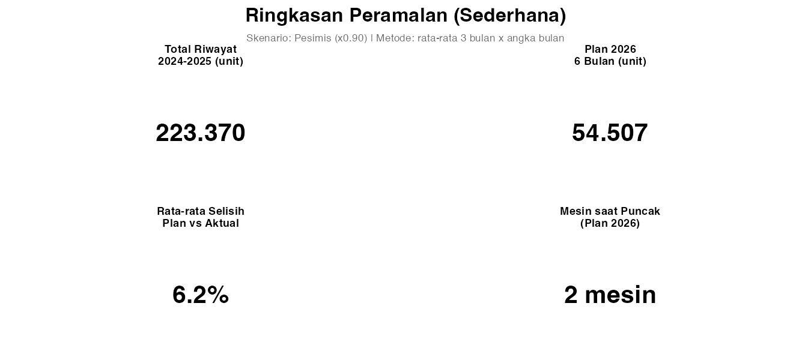
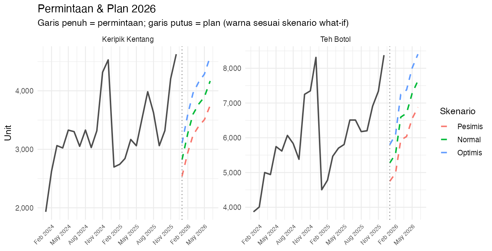
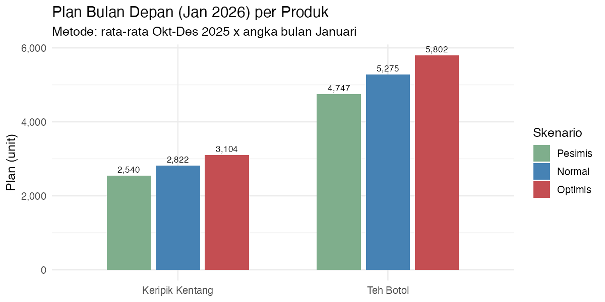
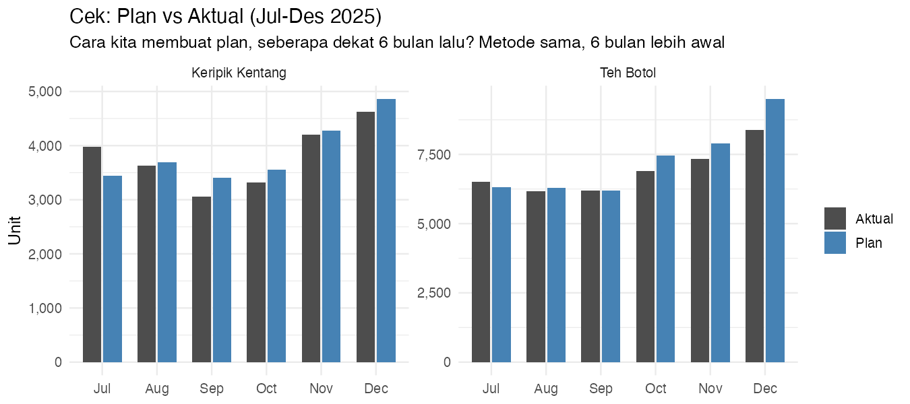
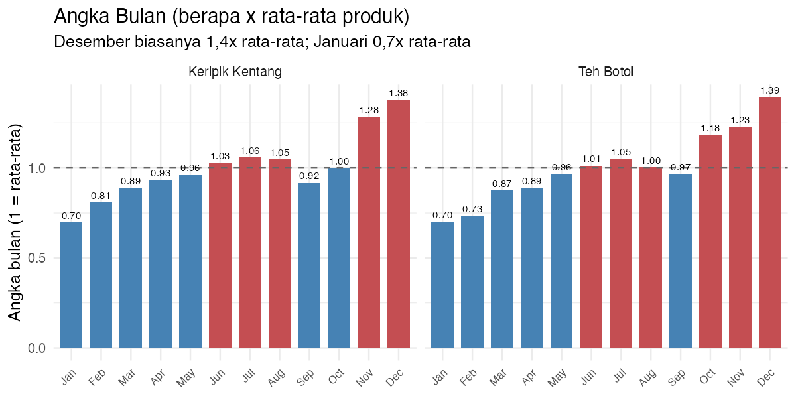
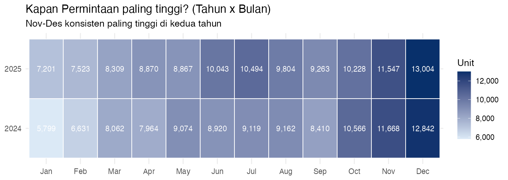
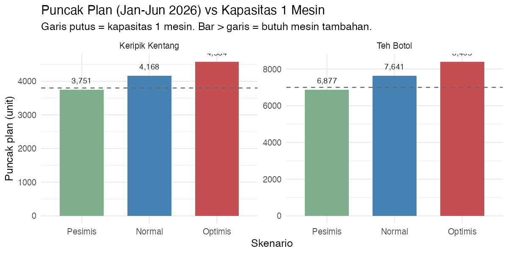
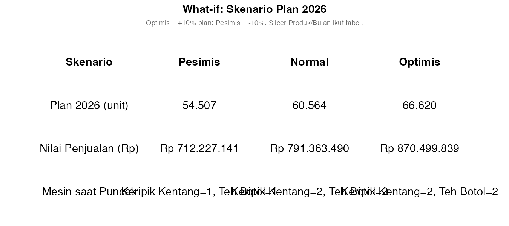

# CV Segar Jaya — Peramalan Permintaan (End-to-End, Power BI + R)

> **Satu README lengkap** untuk business case *"CV Segar Jaya"*: cerita bisnis, **metode
> kalkulasi super sederhana (3 langkah)**, **semua kode R**, 1 bagian per visual
> (**kode + hasil gambar**), **panduan Dashboard Power BI**, dan **glossary**.
>
> **Sasaran:** pemilik / manajemen produksi — **statistika tidak perlu**, hanya
> *rata-rata, kali, dan dibagi*.
>
> **Pertanyaan inti:** *Berapa unit produksi bulan depan? Kapan 1 mesin tidak cukup?*


---

## 1. Business Case: "CV Segar Jaya" (cerita nyata)

CV Segar Jaya adalah perusahaan kecil dengan **2 lini produksi (1 mesin per produk)**:

| Produk | Apa produk ini | Harga | Kapasitas 1 mesin (unit/bulan) | Tren (dari data 2025 vs 2024) |
| --- | --- | ---: | ---: | --- |
| **Teh Botol** | Minuman (botol es teh) | **Rp 12.000** | 7.000 unit | **+7,1%** |
| **Keripik Kentang** | Makanan ringan (snack) | **Rp 15.000** | 3.800 unit | **+5,2%** |

**Data:** penjualan setiap bulan, 24 bulan (Jan 2024 - Des 2025) = 48 baris.

**Ibu Ana (pemilik) tanya setiap bulan 3 pertanyaan:**

1. *Berapa unit produksi **bulan depan**, per produk?*
2. *Bulan berapa **1 mesin tidak cukup**?*
3. *Apa bila promosi **+10%**? Apa bila pasar **-10%**?*

**Kenapa ini studi kasus nyata:** Desember biasanya penjualan **±1,4x** rata-rata; Januari **±0,7x**.
Bila plan setiap bulan pakai rata-rata biasa, di Desember stok tidak cukup dan mesin penuh.
Solusi proyek ini: *"rata-rata 3 bulan terakhir x Angka Bulan"* — perhitungan sederhana yang
setiap pemilik bisa menghitung ulang.


---

## 2. Data (hasil aktual)

| Metrik | Teh Botol | Keripik Kentang |
| --- | ---: | ---: |
| Total 2024 | 69.373 | 38.844 |
| Total 2025 | 74.284 (**+7,1%**) | 40.869 (**+5,2%**) |
| **Total riwayat 2024-2025** | **223.370 unit** | - |

**Angka Bulan:** Desember = **1,39x** rata-rata; Januari = **0,70x** rata-rata (kedua produk).

---

## 3. Kalkulasi — super sederhana, 3 langkah

### Langkah 1 — Angka Bulan ("bulan ini = berapa x rata-rata?")

Dari data 24 bulan (visual 5): Januari = 0,70; Desember = 1,39.

| Angka Bulan | Makna |
| --- | --- |
| 1,00 | penjualan tepat rata-rata |
| 0,70 | penjualan **30% di bawah** rata-rata (bulan sepi) |
| 1,39 | penjualan **39% di atas** rata-rata (bulan puncak) |

### Langkah 2 — Level (rata-rata 3 bulan terakhir)

Teh Botol, 3 bulan terakhir (Okt-Des 2025): **6.909 + 7.341 + 8.378**
= rata-rata **(6.909 + 7.341 + 8.378) : 3 ≈ 7.543**.

### Langkah 3 — Plan = Level x Angka Bulan

| Produk | Level (Okt-Des 2025) | x Angka Bulan Jan | = Plan Jan 2026 |
| --- | ---: | ---: | ---: |
| **Teh Botol** | 7.543 | 0,70 | **≈ 5.275 unit** |
| **Keripik Kentang** | 4.050 | 0,70 | **≈ 2.822 unit** |

> Sangat sederhana. Perhitungan yang sama ada di kode R (bab 8).
> Angka 5.275 dan 2.822 = Plan bulan depan (Normal, tanpa skenario).

### Cek metode (uji kepercayaan): dijalankan 6 bulan lalu

Perhitungan yang sama, tetapi 6 bulan lebih awal (Jul-Des 2025), dibandingkan dengan aktual:

| Produk | Rata-rata selisih (plan vs aktual) |
| --- | ---: |
| Teh Botol | **5,6%** |
| Keripik Kentang | **6,8%** |

> Penjelasan: "bila metode ini dipakai 6 bulan lalu, plan rata-rata selisih **6-7%** dari aktual"
> — cukup akurat untuk rencana produksi.

---

## 4. Hasil & What-if (jawaban untuk Ibu Ana)

| Skenario | Plan 2026 (unit) | Nilai penjualan 2026 (Rp) | Mesin puncak: Teh Botol | Mesin puncak: Keripik |
| --- | ---: | ---: | ---: | ---: |
| **Pesimis** (x0,90) | 54.507 | Rp 712,2 M | 1 | 1 |
| **Normal** (x1,00) | 60.564 | Rp 791,4 M | **2** | **2** |
| **Optimis** (x1,10) | 66.620 | Rp 870,5 M | **2** | **2** |

Angka penting:

- **Teh Botol**: puncak plan (Jun 2026) = **7.641** > kapasitas 7.000 → **1 mesin tidak cukup**
  (hanya pada Pesimis muat: 6.877 < 7.000).
- **Keripik Kentang**: puncak plan = **4.168** > 3.800 → **2 mesin**; pada Pesimis 3.751 < 3.800 → 1 mesin.
- **Plan bulan depan Jan 2026** (Normal): Teh Botol 5.275 · Keripik 2.822 unit.


---

## 5. Cara Menjalankan (lokal, tanpa Power BI)

```bash
cd "Brainstorming/selected/peramalan-permintaan"
Rscript R/00_buat_data.R     # 1x: buat data (set.seed)
Rscript R/03_validasi.R      # jalan blok Power Query + 8 R visual -> output/
```

Hasil: `output/ramalan.csv` (180 baris = riwayat+plan x 3 skenario) + `output/V1...V8.png`.

> Validasi: **0 warning**, test filter 40 kombinasi -> **ALL OK**.
> Kode yang ditempel di Power BI **persis sama** dengan yang dijalankan `R/03_validasi.R`.

---

## 6. Struktur Folder

```text
Brainstorming/selected/peramalan-permintaan/
├── README.md                     # file ini (end-to-end, bahasa sederhana)
├── data/
│   ├── permintaan.csv            # fakta: 48 baris (2 produk x 24 bulan)
│   └── produk.csv                # dimensi produk
├── R/
│   ├── 00_buat_data.R            # generator data (set.seed 20260913)
│   ├── powerquery_01_ramalan.R   # BLOK R -> Power Query -> tabel "ramalan"
│   ├── visual_R_powerbi.R        # 8 BLOK R visual (ggplot2)
│   └── 03_validasi.R             # jalan semua blok lokal -> output/
└── output/                       # ramalan.csv + V1..V8.png (pratinjau)
```

---

## 7. Kode: Generator Data (`R/00_buat_data.R`)

```r
# ============================================================
# Peramalan Permintaan — Versi Super Sederhana (proyek "selected")
# R/00_buat_data.R  --  generator data ringkas
#
# BUSINESS CASE (fikti): "CV Segar Jaya"
#   Pabrik kecil pembuat minuman & makanan ringan. 2 produk:
#     * Teh Botol       (minuman)        -> Tren +1,0%/bulan
#     * Keripik Kentang (makanan ringan) -> Tren +0,4%/bulan
#   Data penjualan aktual 24 bulan (2024-2025), set.seed reproducible.
#   Pola yang ditanam:
#     * TREN naik per produk
#     * MUSIMAN puncak Nov-Des (Angka Bulan tinggi: 1,28 & 1,38)
#     * noise kecil (~7%)
#
# Output: data/permintaan.csv  (Tanggal, Produk, Permintaan)
#         data/produk.csv      (dimensi: Kategori, Harga, Kapasitas, LeadTime)
# ============================================================

set.seed(20260913)

args <- commandArgs(trailingOnly = FALSE)
sp   <- sub("^--file=", "", args[grep("^--file=", args)])
base <- if (length(sp)) dirname(dirname(normalizePath(sp))) else getwd()
dir.create(file.path(base, "data"), showWarnings = FALSE)

bulan   <- seq(as.Date("2024-01-01"), as.Date("2025-12-01"), by = "month")
produk  <- c("Teh Botol", "Keripik Kentang")

# --- parameter dasar ---
base_qty <- c("Teh Botol" = 5000, "Keripik Kentang" = 3000)  # unit/bulan dasar
tren_p   <- c("Teh Botol" = 0.010, "Keripik Kentang" = 0.004)  # tren % per bulan
# Angka Bulan dasar per bulan kalender (1 = rata-rata; puncak Nov & Des)
musim <- c(0.82, 0.85, 0.93, 1.00, 1.08, 1.15, 1.10, 1.02, 1.04, 1.12, 1.28, 1.38)

df <- expand.grid(Tanggal = bulan, Produk = produk, stringsAsFactors = FALSE)
df <- df[order(df$Tanggal, df$Produk), ]

n        <- nrow(df)
bulan_ke <- as.integer(format(df$Tanggal, "%m"))
idx      <- (as.integer(format(df$Tanggal, "%Y")) - 2024) * 12 + bulan_ke

df$Permintaan <- round(
  base_qty[df$Produk] * (1 + tren_p[df$Produk]) ^ idx * musim[bulan_ke] * rnorm(n, 1, 0.07)
)
df$Permintaan <- pmax(df$Permintaan, 200)

# --- dimensi produk ---
produk_dim <- data.frame(
  Produk         = produk,
  Kategori       = c("Minuman", "Makanan Ringan"),
  HargaSatuan    = c(12000, 15000),      # Rp/unit
  KapasitasMesin = c(7000, 3800),        # unit/bulan per mesin
  LeadTimeHari   = c(7, 14),
  stringsAsFactors = FALSE
)

write.csv(df, file.path(base, "data", "permintaan.csv"), row.names = FALSE)
write.csv(produk_dim, file.path(base, "data", "produk.csv"), row.names = FALSE)

cat("permintaan.csv :", nrow(df), "baris x", ncol(df), "kolom\n")
cat("produk.csv     :", nrow(produk_dim), "baris x", ncol(produk_dim), "kolom\n\n")
cat("Total permintaan per tahun:\n")
print(tapply(df$Permintaan, format(df$Tanggal, "%Y"), sum))
cat("\nRata-rata per produk:\n")
print(round(tapply(df$Permintaan, df$Produk, mean)))
cat("\nPuncak musiman (Angka Bulan per bulan kalender):\n")
print(round(tapply(df$Permintaan, bulan_ke, mean) / mean(df$Permintaan), 2))
print(head(df, 4))
```

---

## 8. Kode: Transformasi di Power BI (R di Power Query)

Tempel blok bawah di: **Home > Transform Data > (query `ramalan_sumber`) > Transform > Run R script**.

- **Input** `dataset` = gabung `permintaan` + `produk` (merge by `Produk`).
- **Output** `output` = tabel **`ramalan`** (180 baris, siap visual).

| Langkah R | Penjelasan (bahasa sehari-hari) |
| --- | --- |
| `Rata3` | rata-rata 3 bulan terakhir per produk |
| `AngkaBulan` | "bulan ini biasanya ...x rata-rata produk" |
| `CekPlan` | plan yang dibuat 6 bulan lalu (untuk visual Cek) |
| `Level` | rata-rata Okt-Des 2025 (level terbaru) |
| `Plan` | `Level x AngkaBulan` untuk Jan-Jun 2026 |
| skenario cross join | Pesimis 0,90 / Normal 1,00 / Optimis 1,10 |

### Blok R (`R/powerquery_01_ramalan.R`)

```r
# ============================================================
# BLOK R DI POWER QUERY #1  ->  tabel "ramalan"  (versi sederhana)
# ------------------------------------------------------------
# TEMPEL kode ini pada:  Home > Transform Data (Power Query) >
# buka "ramalan_sumber" > Transform > Run R script > OK
#
# BUSINESS CASE: "CV Segar Jaya" (Teh Botol & Keripik Kentang)
#
# INPUT  (variabel `dataset`, dibuat otomatis Power BI) =
#   hasil gabungan "permintaan" (kiri) + "produk" (kanan) by Produk
#   kolom: Tanggal, Produk, Permintaan, Kategori, HargaSatuan,
#          KapasitasMesin, LeadTimeHari
#
# OUTPUT (variabel `output`, nama WAJIB per Power BI) =
#   tabel "ramalan": riwayat (2024-2025) + PLAN 2026 (Jan-Jun)
#   x 3 skenario what-if (Pesimis / Normal / Optimis)
#
# METODE PLAN (3 langkah, sangat sederhana):
#   1) AngkaBulan : "Desember biasanya 1,4x rata-rata; Januari 0,7x"
#                   = rata-rata bulan kalender : rata-rata produk
#   2) Level      : rata-rata 3 bulan TERAKHIR (Okt-Des 2025)
#   3) PLAN bulan = Level x AngkaBulan
#   CekPlan      : PLAN utk Jul-Des 2025 (rata 3 bln sblmnya x AngkaBulan)
#                  -> untuk visual "Cek: Plan vs Aktual"
# ============================================================

# >>> BLOK_PQ_01_START
suppressMessages({
  library(dplyr)
  library(tidyr)
})

# ---------- 1. normalisasi & kolom dasar ----------
X <- dataset
X$Tanggal    <- as.Date(trimws(as.character(X$Tanggal)))
X$Produk     <- as.character(X$Produk)
X$Permintaan <- as.numeric(X$Permintaan)
X <- X[order(X$Produk, X$Tanggal), ]

X <- X |>
  mutate(
    Tahun      = as.integer(format(Tanggal, "%Y")),
    BulanKe    = as.integer(format(Tanggal, "%m")),
    NamaBulan  = month.abb[BulanKe],
    Jenis      = "Riwayat"          # vs "Plan" (bulan maju)
  )

# ---------- 2. rata-rata 3 bulan terakhir (Level per bulan) ----------
X <- X |>
  group_by(Produk) |>
  arrange(Tanggal) |>
  mutate(Rata3 = (lag(Permintaan, 1) + lag(Permintaan, 2) +
                    lag(Permintaan, 3)) / 3) |>
  ungroup()

# ---------- 3. Angka Bulan (berapa x rata-rata produk) ----------
angka_full <- X |>
  group_by(Produk, BulanKe) |>
  summarise(rb = mean(Permintaan), .groups = "drop") |>
  group_by(Produk) |>
  mutate(AngkaBulan = rb / mean(rb)) |>
  ungroup() |>
  select(Produk, BulanKe, AngkaBulan)

X <- X |>
  left_join(angka_full, by = c("Produk", "BulanKe"))

# ---------- 4. CekPlan: plan yang dibuat 6 bulan lalu -------------
X <- X |>
  mutate(CekPlan = ifelse(Tahun == 2025 & BulanKe >= 7,
                          Rata3 * AngkaBulan, NA_real_))

# ---------- 5. Level terbaru (rata-rata Okt-Des 2025) ----------
level_akhir <- X |>
  filter(Tahun == 2025, BulanKe >= 10) |>
  group_by(Produk) |>
  summarise(Level = mean(Permintaan), .groups = "drop")

# ---------- 6. PLAN maju: 2026 Jan-Jun per produk ----------
plan_grid <- expand.grid(
  Tanggal = seq(as.Date("2026-01-01"), as.Date("2026-06-01"), by = "month"),
  Produk  = c("Teh Botol", "Keripik Kentang"),
  stringsAsFactors = FALSE
) |>
  mutate(
    Tahun     = 2026L,
    BulanKe   = as.integer(format(Tanggal, "%m")),
    NamaBulan = month.abb[as.integer(format(Tanggal, "%m"))],
    Jenis     = "Plan"
  ) |>
  left_join(angka_full, by = c("Produk", "BulanKe")) |>
  left_join(level_akhir, by = "Produk") |>
  mutate(Plan = Level * AngkaBulan) |>
  select(-Level)

# dimensi produk (dari input original)
dims <- X |>
  select(Produk, Kategori, HargaSatuan, KapasitasMesin) |>
  distinct()

plan_grid <- plan_grid |>
  left_join(dims, by = "Produk") |>
  mutate(Permintaan = NA_real_, Rata3 = NA_real_, CekPlan = NA_real_)

# ---------- 7. gabung riwayat + plan, lalu skenario what-if ----------
kols <- c("Tanggal", "Tahun", "BulanKe", "NamaBulan", "Produk", "Kategori",
          "HargaSatuan", "KapasitasMesin", "Jenis", "Permintaan",
          "CekPlan", "Plan", "AngkaBulan")

tbl <- bind_rows(
  X          |> select(any_of(kols)),
  plan_grid  |> select(any_of(kols))
)

skenario <- data.frame(
  Skenario      = c("Pesimis", "Normal", "Optimis"),
  FaktorSkenario = c(0.90, 1.00, 1.10),
  stringsAsFactors = FALSE
)

output <- tbl |>
  crossing(skenario) |>
  arrange(Produk, Tanggal, Skenario) |>
  select(all_of(c(kols, "Skenario", "FaktorSkenario")))
# >>> BLOK_PQ_01_END
```

> Set **Privacy = Public** pada langkah skrip; Power BI mengenali `output` -> query `ramalan`.
> Kolom: `Tanggal` = **Date**; `Permintaan`/`Plan`/`CekPlan`/`AngkaBulan`/`FaktorSkenario` = **Decimal**.


---

## 9. 8 Visual — per visual: kode + hasil gambar

Setiap bagian berikut: **apa yang ditampilkan visual**, **kolom di Values**, **kode R**
(dari `R/visual_R_powerbi.R`), dan **hasil gambar** (dibuat oleh `03_validasi.R`;
di Power BI visual yang sama merespons slicer).

### Visual 1 — Ringkasan (KPI)

**KPI = 4 jawaban pemilik**: total penjualan 2024-2025, **Plan 2026** (unit), **rata-rata selisih** metode plan, dan **berapa mesin dibutuhkan** saat puncak plan.

**Field di Values:** `Produk, Jenis, Tanggal, Permintaan, Plan, CekPlan, FaktorSkenario, Skenario, HargaSatuan, KapasitasMesin`

```r
suppressMessages({ library(ggplot2); library(dplyr); library(scales) })
Tgl <- dataset$Tanggal
Tanggal <- if (is.numeric(Tgl)) as.Date(unclass(Tgl), origin = "1970-01-01") else as.Date(as.character(Tgl))
D <- dataset |> mutate(Tanggal = Tanggal)

if (nrow(D) == 0) {
  p <- ggplot(data.frame(x = 0, y = 0), aes(x, y)) +
    geom_text(label = "Tidak ada data untuk filter ini", size = 7) +
    theme_void()
} else {
  # satu skenario yang ditampilkan (Pesimis -> Normal -> Optimis)
  sk <- D |> distinct(Skenario, FaktorSkenario) |> arrange(FaktorSkenario)
  sk_sel <- as.character(sk$Skenario[1]); f <- sk$FaktorSkenario[1]

  hist <- D |>
    filter(Jenis == "Riwayat") |>
    distinct(Tanggal, Produk, Permintaan) |>
    summarise(Total = sum(Permintaan, na.rm = TRUE), .groups = "drop")

  plan <- D |>
    filter(Jenis == "Plan", Skenario == sk_sel) |>
    distinct(Tanggal, Produk, HargaSatuan, Plan) |>
    mutate(Hasil = Plan * f) |>
    summarise(TotalUnit = sum(Hasil, na.rm = TRUE), .groups = "drop")

  cek <- D |>
    filter(!is.na(CekPlan)) |>
    distinct(Tanggal, Produk, Permintaan, CekPlan) |>
    summarise(k = mean(abs(Permintaan - CekPlan) / Permintaan) * 100,
              .groups = "drop")

  if (nrow(D |> filter(Jenis == "Plan")) == 0) {
    mesin <- data.frame(Keb = 0)
  } else {
    mesin <- D |>
      filter(Jenis == "Plan", Skenario == sk_sel) |>
      distinct(Tanggal, Produk, KapasitasMesin, Plan) |>
      mutate(Hasil = Plan * f) |>
      group_by(Produk, KapasitasMesin) |>
      summarise(Puncak = max(Hasil, na.rm = TRUE), .groups = "drop") |>
      mutate(Keb = ceiling(Puncak / KapasitasMesin))
  }

  fmt <- function(x) format(round(x), big.mark = ".", decimal.mark = ",")
  k_cek <- if (nrow(cek) == 0 || is.na(cek$k[1])) NA_real_ else cek$k[1]
  kpi <- data.frame(
    Label = c("Total Riwayat\n2024-2025 (unit)",
              "Plan 2026\n6 Bulan (unit)",
              "Rata-rata Selisih\nPlan vs Aktual",
              "Mesin saat Puncak\n(Plan 2026)"),
    Nilai = c(fmt(hist$Total), fmt(plan$TotalUnit),
              ifelse(is.na(k_cek), "\u2014", sprintf("%.1f%%", k_cek)),
              paste0(sum(mesin$Keb, na.rm = TRUE), " mesin")),
    stringsAsFactors = FALSE
  )
  kpi$Label <- factor(kpi$Label, levels = as.character(kpi$Label))

  p <- ggplot(kpi, aes(x = 0.5, y = 0.5, label = Nilai)) +
    geom_text(size = 7, fontface = "bold") +
    facet_wrap(~Label) +
    labs(title = "Ringkasan Peramalan (Sederhana)",
         subtitle = sprintf("Skenario: %s (x%.2f) | Metode: rata-rata 3 bulan x angka bulan",
                            sk_sel, f)) +
    theme_void(base_size = 13) +
    theme(strip.text = element_text(face = "bold", size = 9),
          plot.title = element_text(face = "bold", hjust = 0.5),
          plot.subtitle = element_text(hjust = 0.5, color = "grey40", size = 8.5))
}
p
```

**Hasil (pratinjau `output/`):**



---

### Visual 2 — Tren: Penjualan vs Plan

Grafik dalam 1 pandangan: **garis penuh** = penjualan aktual, **garis putus** = plan 2026. Warna = skenario; garis vertikal = mulai plan (Jan 2026).

**Field di Values:** `Tanggal, Produk, Jenis, Permintaan, Plan, FaktorSkenario, Skenario`

```r
suppressMessages({ library(ggplot2); library(dplyr); library(scales) })
Tgl <- dataset$Tanggal
Tanggal <- if (is.numeric(Tgl)) as.Date(unclass(Tgl), origin = "1970-01-01") else as.Date(as.character(Tgl))
D <- dataset |>
  mutate(Tanggal = Tanggal,
         Nilai   = ifelse(Jenis == "Plan", Plan * FaktorSkenario, Permintaan))

if (nrow(D) == 0) {
  p <- ggplot(data.frame(x = 0, y = 0), aes(x, y)) +
    geom_text(label = "Tidak ada data untuk filter ini", size = 7) +
    theme_void()
} else {
  aktual <- D |> filter(Jenis == "Riwayat") |> distinct(Tanggal, Produk, Permintaan)
  plan   <- D |> filter(Jenis == "Plan") |>
    distinct(Tanggal, Produk, Skenario, Nilai) |>
    mutate(Skenario = factor(Skenario, levels = c("Pesimis", "Normal", "Optimis")))

  p <- ggplot() +
    geom_line(data = aktual, aes(Tanggal, Permintaan),
              color = "grey30", linewidth = 0.9, na.rm = TRUE) +
    geom_line(data = plan, aes(Tanggal, Nilai, color = Skenario),
              linewidth = 0.9, linetype = "dashed", na.rm = TRUE) +
    geom_vline(xintercept = as.Date("2026-01-01"),
               linetype = "dotted", color = "grey50") +
    facet_wrap(~Produk, scales = "free_y") +
    scale_y_continuous(labels = label_comma()) +
    scale_x_date(date_labels = "%b %Y", date_breaks = "3 months") +
    labs(title = "Permintaan & Plan 2026",
         subtitle = "Garis penuh = permintaan; garis putus = plan (warna sesuai skenario what-if)",
         x = NULL, y = "Unit") +
    theme_minimal(base_size = 12) +
    theme(axis.text.x = element_text(angle = 45, hjust = 1, size = 8))
}
p
```

**Hasil (pratinjau `output/`):**



---

### Visual 3 — Plan Bulan Depan (Jan 2026)

1 pertanyaan = 1 jawaban: **berapa unit produksi Jan 2026?** Per produk, per skenario.

**Field di Values:** `Jenis, Produk, Tanggal, Plan, FaktorSkenario, Skenario`

```r
suppressMessages({ library(ggplot2); library(dplyr); library(scales) })
Tgl <- dataset$Tanggal
Tanggal <- if (is.numeric(Tgl)) as.Date(unclass(Tgl), origin = "1970-01-01") else as.Date(as.character(Tgl))
D <- dataset |> mutate(Tanggal = Tanggal)

if (nrow(D) == 0 || nrow(D |> filter(Jenis == "Plan")) == 0) {
  p <- ggplot(data.frame(x = 0, y = 0), aes(x, y)) +
    geom_text(label = "Tidak ada data plan (cek filter Tahun/Bulan)", size = 6) +
    theme_void()
} else {
  bd <- D |>
    filter(Jenis == "Plan", Tanggal == as.Date("2026-01-01")) |>
    distinct(Produk, Skenario, FaktorSkenario, Plan) |>
    mutate(Hasil = Plan * FaktorSkenario,
           Skenario = factor(Skenario, levels = c("Pesimis", "Normal", "Optimis")))

  p <- ggplot(bd, aes(Produk, Hasil, fill = Skenario)) +
    geom_col(position = position_dodge2(0.7), width = 0.7) +
    geom_text(aes(label = label_comma()(round(Hasil))),
              position = position_dodge2(0.7), vjust = -0.5, size = 3) +
    scale_fill_manual(values = c(Pesimis = "#7fae8c", Normal = "steelblue",
                                 Optimis = "#C44E52"),
                      name = "Skenario") +
    scale_y_continuous(labels = label_comma()) +
    labs(title = "Plan Bulan Depan (Jan 2026) per Produk",
         subtitle = "Metode: rata-rata Okt-Des 2025 x angka bulan Januari",
         x = NULL, y = "Plan (unit)") +
    theme_minimal(base_size = 12)
}
p
```

**Hasil (pratinjau `output/`):**



---

### Visual 4 — Cek: Plan vs Aktual

**Cek metode**: bila metode ini dijalankan 6 bulan lalu, seberapa dekat (plan vs aktual)? Bar aktual vs plan (Jul-Des 2025).

**Field di Values:** `Jenis, Tanggal, Produk, Permintaan, CekPlan`

```r
suppressMessages({ library(ggplot2); library(dplyr); library(tidyr) })
Tgl <- dataset$Tanggal
Tanggal <- if (is.numeric(Tgl)) as.Date(unclass(Tgl), origin = "1970-01-01") else as.Date(as.character(Tgl))
D <- dataset |> mutate(Tanggal = Tanggal)

if (nrow(D) == 0) {
  p <- ggplot(data.frame(x = 0, y = 0), aes(x, y)) +
    geom_text(label = "Tidak ada data untuk filter ini", size = 7) +
    theme_void()
} else {
  cek <- D |>
    filter(!is.na(CekPlan)) |>
    distinct(Tanggal, Produk, Permintaan, CekPlan) |>
    mutate(NM = factor(month.abb[as.integer(format(Tanggal, "%m"))],
                       levels = month.abb)) |>
    select(Produk, NM, Aktual = Permintaan, Plan = CekPlan) |>
    pivot_longer(c(Aktual, Plan), names_to = "Seri", values_to = "Unit")

  p <- ggplot(cek, aes(NM, Unit, fill = Seri)) +
    geom_col(position = position_dodge2(0.8), width = 0.75) +
    facet_wrap(~Produk, scales = "free_y") +
    scale_fill_manual(values = c(Aktual = "grey30", Plan = "steelblue"),
                      name = NULL) +
    scale_y_continuous(labels = label_comma()) +
    labs(title = "Cek: Plan vs Aktual (Jul-Des 2025)",
         subtitle = "Cara kita membuat plan, seberapa dekat 6 bulan lalu? Metode sama, 6 bulan lebih awal",
         x = NULL, y = "Unit") +
    theme_minimal(base_size = 12)
}
p
```

**Hasil (pratinjau `output/`):**



---

### Visual 5 — Angka Bulan

**Angka Bulan**: Desember biasanya 1,4x rata-rata; Januari 0,7x - kenapa plan tanpa ini bisa salah saat puncak.

**Field di Values:** `Produk, BulanKe, AngkaBulan`

```r
suppressMessages({ library(ggplot2); library(dplyr) })
D <- dataset |> distinct(Produk, BulanKe, AngkaBulan)

if (nrow(D) == 0) {
  p <- ggplot(data.frame(x = 0, y = 0), aes(x, y)) +
    geom_text(label = "Tidak ada data untuk filter ini", size = 7) +
    theme_void()
} else {
  D <- D |>
    mutate(NM   = factor(month.abb[BulanKe], levels = month.abb),
           Naik = AngkaBulan > 1)
  p <- ggplot(D, aes(NM, AngkaBulan, fill = Naik)) +
    geom_col(width = 0.75) +
    geom_hline(yintercept = 1, linetype = "dashed", color = "grey40") +
    geom_text(aes(label = sprintf("%.2f", AngkaBulan)), vjust = -0.5, size = 2.6) +
    facet_wrap(~Produk) +
    scale_fill_manual(values = c(`TRUE` = "#C44E52", `FALSE` = "steelblue"),
                      guide = "none") +
    labs(title = "Angka Bulan (berapa x rata-rata produk)",
         subtitle = "Desember biasanya 1,4x rata-rata; Januari 0,7x rata-rata",
         x = NULL, y = "Angka bulan (1 = rata-rata)") +
    theme_minimal(base_size = 12) +
    theme(axis.text.x = element_text(angle = 45, hjust = 1, size = 8))
}
p
```

**Hasil (pratinjau `output/`):**



---

### Visual 6 — Heatmap (Tahun x Bulan)

Heatmap Tahun x Bulan: dalam 1 pandangan bahwa **Nov-Des** konsisten paling tinggi -> stok sebelum Q4.

**Field di Values:** `Jenis, Tanggal, Permintaan`

```r
suppressMessages({ library(ggplot2); library(dplyr); library(scales) })
Tgl <- dataset$Tanggal
Tanggal <- if (is.numeric(Tgl)) as.Date(unclass(Tgl), origin = "1970-01-01") else as.Date(as.character(Tgl))
D <- dataset |> mutate(Tanggal = Tanggal)

if (nrow(D) == 0) {
  p <- ggplot(data.frame(x = 0, y = 0), aes(x, y)) +
    geom_text(label = "Tidak ada data untuk filter ini", size = 7) +
    theme_void()
} else {
  hm <- D |>
    filter(Jenis == "Riwayat") |>
    distinct(Tanggal, Permintaan) |>
    mutate(Tahun = as.integer(format(Tanggal, "%Y")),
           BN    = as.integer(format(Tanggal, "%m")),
           NM    = factor(month.abb[BN], levels = month.abb)) |>
    group_by(Tahun, NM) |>
    summarise(Total = sum(Permintaan, na.rm = TRUE), .groups = "drop")

  p <- ggplot(hm, aes(NM, factor(Tahun), fill = Total)) +
    geom_tile(color = "white", linewidth = 0.4) +
    geom_text(aes(label = label_comma()(Total)), size = 3.4, color = "white") +
    scale_fill_gradient(low = "#dbe9f6", high = "#08306b", labels = label_comma()) +
    labs(title = "Kapan Permintaan paling tinggi? (Tahun x Bulan)",
         subtitle = "Nov-Des konsisten paling tinggi di kedua tahun",
         x = NULL, y = NULL, fill = "Unit") +
    theme_minimal(base_size = 12)
}
p
```

**Hasil (pratinjau `output/`):**



---

### Visual 7 — Kapasitas vs Puncak Plan

Cek kapasitas: **bar di atas garis = 1 mesin tidak cukup**. Dengan slicer Skenario, diketahui kapan butuh mesin 2.

**Field di Values:** `Jenis, Produk, Tanggal, Skenario, FaktorSkenario, Plan, KapasitasMesin`

```r
suppressMessages({ library(ggplot2); library(dplyr); library(scales) })
D <- dataset

if (nrow(D) == 0 || nrow(D |> filter(Jenis == "Plan")) == 0) {
  p <- ggplot(data.frame(x = 0, y = 0), aes(x, y)) +
    geom_text(label = "Tidak ada data plan (cek filter Tahun/Bulan)", size = 6) +
    theme_void()
} else {
  peak <- D |>
    filter(Jenis == "Plan") |>
    distinct(Tanggal, Produk, Skenario, FaktorSkenario, Plan, KapasitasMesin) |>
    mutate(Hasil = Plan * FaktorSkenario,
           Skenario = factor(Skenario, levels = c("Pesimis", "Normal", "Optimis"))) |>
    group_by(Produk, Skenario, KapasitasMesin) |>
    summarise(Puncak = max(Hasil, na.rm = TRUE), .groups = "drop")
  kap <- distinct(peak, Produk, KapasitasMesin)

  p <- ggplot(peak, aes(Skenario, Puncak, fill = Skenario)) +
    geom_col(width = 0.65) +
    geom_hline(data = kap, aes(yintercept = KapasitasMesin),
               linetype = "dashed", color = "grey40") +
    geom_text(aes(label = label_comma()(round(Puncak))), vjust = -1.1, size = 3.2) +
    facet_wrap(~Produk, scales = "free_y") +
    scale_fill_manual(values = c(Pesimis = "#7fae8c", Normal = "steelblue",
                                 Optimis = "#C44E52"), guide = "none") +
    labs(title = "Puncak Plan (Jan-Jun 2026) vs Kapasitas 1 Mesin",
         subtitle = "Garis putus = kapasitas 1 mesin. Bar > garis = butuh mesin tambahan.",
         x = "Skenario", y = "Puncak plan (unit)") +
    theme_minimal(base_size = 12)
}
p
```

**Hasil (pratinjau `output/`):**



---

### Visual 8 — Tabel What-if

Tabel what-if: **Plan 2026 (unit), nilai penjualan (Rp) dan mesin dibutuhkan** per skenario (Pesimis/Normal/Optimis).

**Field di Values:** `Jenis, Tanggal, Produk, Skenario, FaktorSkenario, Plan, HargaSatuan, KapasitasMesin`

```r
suppressMessages({ library(ggplot2); library(dplyr) })
D <- dataset |> arrange(Tanggal, Produk)

if (nrow(D) == 0 || nrow(D |> filter(Jenis == "Plan")) == 0) {
  p <- ggplot(data.frame(x = 0, y = 0), aes(x, y)) +
    geom_text(label = "Tidak ada data plan (cek filter Tahun/Bulan)", size = 6) +
    theme_void()
} else {
  ram <- D |>
    filter(Jenis == "Plan") |>
    distinct(Tanggal, Produk, Skenario, FaktorSkenario, Plan, HargaSatuan) |>
    mutate(Hasil = Plan * FaktorSkenario) |>
    group_by(Skenario) |>
    summarise(TotalUnit = sum(Hasil, na.rm = TRUE),
              TotalRp   = sum(Hasil * HargaSatuan, na.rm = TRUE),
              .groups = "drop")

  mesin <- D |>
    filter(Jenis == "Plan") |>
    distinct(Tanggal, Produk, Skenario, FaktorSkenario, Plan, KapasitasMesin) |>
    mutate(Hasil = Plan * FaktorSkenario) |>
    group_by(Skenario, Produk, KapasitasMesin) |>
    summarise(Puncak = max(Hasil, na.rm = TRUE), .groups = "drop") |>
    mutate(Keb = ceiling(Puncak / KapasitasMesin)) |>
    group_by(Skenario) |>
    summarise(Mesin = paste0(Produk, "=", Keb, collapse = ", "), .groups = "drop")

  t2 <- ram |>
    left_join(mesin, by = "Skenario") |>
    mutate(Skenario = factor(Skenario, levels = c("Pesimis", "Normal", "Optimis"))) |>
    arrange(Skenario) |>
    mutate(TotalUnit = format(round(TotalUnit), big.mark = ".", decimal.mark = ","),
           TotalRp   = paste0("Rp ",
                              format(round(TotalRp), big.mark = ".", decimal.mark = ",")))

  hdr <- c("Skenario", "Plan 2026 (unit)", "Nilai Penjualan (Rp)", "Mesin saat Puncak")
  tbl <- t2 |>
    mutate(across(everything(), as.character)) |>
    as.data.frame()
  colnames(tbl) <- hdr
  K <- ncol(tbl); R <- nrow(tbl)
  dd <- data.frame(
    x    = rep(seq_len(K), each = R + 1),
    y    = rep(seq(R + 1, 1), times = K),
    teks = as.character(t(as.matrix(rbind(hdr, tbl)))),
    stringsAsFactors = FALSE
  )
  dd$fondo <- ifelse(dd$y == R + 1, "bold", "plain")

  p <- ggplot(dd, aes(x, y, label = teks, fontface = fondo)) +
    geom_text(size = 5) +
    scale_x_continuous(limits = c(0.4, K + 0.6)) +
    scale_y_continuous(limits = c(0.4, R + 1.6)) +
    labs(title = "What-if: Skenario Plan 2026",
         subtitle = "Optimis = +10% plan; Pesimis = -10%. Slicer Produk/Bulan ikut tabel.") +
    theme_void(base_size = 13) +
    theme(plot.title = element_text(face = "bold", hjust = 0.5, size = 14),
          plot.subtitle = element_text(hjust = 0.5, color = "grey40", size = 9))
}
p
```

**Hasil (pratinjau `output/`):**



---


---

## 17. Kode: Validasi Lokal (`R/03_validasi.R`)

Jalan: `Rscript R/03_validasi.R`

- Simulasi gabung Power Query (`permintaan` + `produk` -> `dataset`),
- menjalankan **BLOK_PQ_01** (transformasi -> `ramalan`),
- menjalankan **BLOK_RV_V1...V8** (8 gambar -> `output/V*.png`),
- stdout ringkasan angka kunci.

```r
# ============================================================
# R/03_validasi.R  --  VALIDASI end-to-end (lokal, tanpa Power BI)
# ------------------------------------------------------------
# Skrip ini menjalankan kode R yang SAMA PERSIS dengan blok yang
# ditempel di Power BI:
#   * BLOK_PQ_01  (Power Query -> tabel ramalan)
#   * BLOK_RV_V1..V8 (R visual -> 8 gambar ggplot2)
# Hasil: output/ramalan.csv + output/V*.png (pratinjau)
# ============================================================

args <- commandArgs(trailingOnly = FALSE)
sp   <- sub("^--file=", "", args[grep("^--file=", args)])
base <- if (length(sp)) dirname(dirname(normalizePath(sp))) else getwd()
out  <- file.path(base, "output"); dir.create(out, showWarnings = FALSE)
setwd(base)

extr <- function(path, tag) {
  txt <- readLines(path, warn = FALSE)
  a <- grep(sprintf("# >>> %s_START", tag), txt)
  b <- grep(sprintf("# >>> %s_END",   tag), txt)
  if (!length(a) || !length(b)) stop("Blok ", tag, " tidak ditemukan di ", path)
  paste(txt[(a[1] + 1):(b[1] - 1)], collapse = "\n")
}

jalan <- function(blok, env, tag) {
  tryCatch({
    res <- eval(parse(text = blok), env)
    if (is.null(res)) stop("Blok ", tag, " tidak menghasilkan objek")
    res
  }, error = function(e) {
    stop("ERROR di blok ", tag, ": ", conditionMessage(e))
  })
}

# ---------- 1. simulasi gabungan Power Query (permintaan + produk) ----------
suppressMessages({ library(dplyr); library(tidyr) })

permintaan <- read.csv(file.path(base, "data", "permintaan.csv"))
produk     <- read.csv(file.path(base, "data", "produk.csv"))

dataset <- permintaan |>
  left_join(produk, by = "Produk")

# ---------- 2. BLOK_PQ_01 -> tabel ramalan ----------
ens <- new.env()
assign("dataset", dataset, envir = ens)
ramalan <- jalan(extr("R/powerquery_01_ramalan.R", "BLOK_PQ_01"), ens, "BLOK_PQ_01")
write.csv(ramalan, file.path(out, "ramalan.csv"), row.names = FALSE)

# ---------- 3. BLOK_RV_* -> 8 gambar ggplot2 ----------
suppressMessages({ library(ggplot2); library(scales) })

dim <- list(V1 = c(9, 4.0), V2 = c(9, 4.6), V3 = c(8, 4.0),
            V4 = c(9, 4.0), V5 = c(8, 4.0), V6 = c(9, 3.2),
            V7 = c(8, 4.0), V8 = c(9, 4.0))
nama <- c(V1 = "kpi", V2 = "tren", V3 = "planbulan", V4 = "cek",
          V5 = "angkabulan", V6 = "heatmap", V7 = "kapasitas", V8 = "whatif")

for (nm in names(dim)) {
  tag  <- paste0("BLOK_RV_", nm)
  ensv <- new.env()
  assign("dataset", ramalan, envir = ensv)
  p <- jalan(extr("R/visual_R_powerbi.R", tag), ensv, tag)
  fname <- file.path(out, sprintf("V%s_%s.png", substring(nm, 2), nama[[nm]]))
  ggsave(fname, p, width = dim[[nm]][1], height = dim[[nm]][2],
         dpi = 150, bg = "white")
  cat("Dirender:", fname, "\n")
}

# ---------- 4. Ringkasan angka (untuk dokumentasi) ----------
cat("\n=== RINGKASAN VALIDASI ===\n")
cat("riwayat rows :", nrow(distinct(ramalan |> filter(Jenis == "Riwayat") |> select(Tanggal, Produk))), "\n")
cat("plan rows    :", nrow(distinct(ramalan |> filter(Jenis == "Plan") |> select(Tanggal, Produk))), "\n")
cat("total baris  :", nrow(ramalan), "(x3 skenario)\n")

hist <- ramalan |> filter(Jenis == "Riwayat") |> distinct(Tanggal, Produk, Permintaan)
pln  <- ramalan |> filter(Jenis == "Plan") |>
  distinct(Tanggal, Produk, Skenario, FaktorSkenario, Plan, HargaSatuan, KapasitasMesin) |>
  mutate(Hasil = Plan * FaktorSkenario)

cat(sprintf("Total riwayat 2024-25 : %s unit\n",
            format(sum(hist$Permintaan), big.mark = ".", decimal.mark = ",")))
cat("Plan 2026 per skenario:\n")
print(pln |> group_by(Skenario) |>
        summarise(Unit = sum(Hasil), Rp = sum(Hasil * HargaSatuan), .groups = "drop") |>
        mutate(Unit = format(round(Unit), big.mark = ".", decimal.mark = ","),
               Rp   = format(round(Rp),   big.mark = ".", decimal.mark = ",")))

cat("\nCek plan (Jul-Des 2025): rata-rata selisih per produk\n")
cek <- ramalan |> filter(!is.na(CekPlan)) |>
  distinct(Tanggal, Produk, Permintaan, CekPlan) |>
  group_by(Produk) |>
  summarise(SelisihPct = round(mean(abs(Permintaan - CekPlan) / Permintaan) * 100, 1),
            .groups = "drop")
print(cek |> as.data.frame())

cat("\nKebutuhan mesin (plan puncak Jan-Jun 2026):\n")
print(pln |> group_by(Produk, Skenario, KapasitasMesin) |>
        summarise(Puncak = round(max(Hasil)), .groups = "drop") |>
        mutate(Keb = ceiling(Puncak / KapasitasMesin)) |>
        as.data.frame())

cat("\nPlan Bulan Depan (Jan 2026) per produk:\n")
print(pln |>
        filter(as.integer(format(Tanggal, "%m")) == 1, Skenario == "Normal") |>
        transmute(Produk, Plan = round(Plan)) |>
        as.data.frame())

cat("\nValidasi selesai. File diproduksi di output/.\n")
```


---

## 18. Panduan Dashboard Power BI (±30-45 menit)

### 18.1 Load Data & Gabung

1. **Get Data -> Text/CSV** -> `data/permintaan.csv` -> query `permintaan`.
2. **Get Data -> Text/CSV** -> `data/produk.csv` -> query `produk`.
3. **Transform Data** -> di query `permintaan`: **Home -> Merge Queries**
   (`permintaan` kiri, `produk` kanan, join by `Produk`, **Left Outer**).
4. Expand kolom `produk` -> `Kategori, HargaSatuan, KapasitasMesin, LeadTimeHari`.
5. Ganti nama query: `ramalan_sumber`.

### 18.2 Transformasi dengan R

Di query `ramalan_sumber`: **Transform -> Run R script** -> tempel **bab 8** ->
variabel `output` -> OK -> **Privacy = Public**.

### 18.3 Star Model & Koneksi Tabel (semua terkoneksi)

```text
                 ┌──────────────┐
   produk ──────>│    ramalan   │<────── skenario
 (dimensi 2)     │  (fakta 180)  │     (dimensi 3)
                 └──────────────┘
```

**Buat dimensi `skenario` (3 baris, dari fakta):**

1. Power Query: **klik kanan query `ramalan` -> Reference** -> ganti nama jadi `skenario`.
2. **Transform -> Remove Other Columns** -> pilih `Skenario` dan `FaktorSkenario`.
3. **Home -> Remove Rows -> Remove Duplicates** -> 3 baris (Pesimis/Normal/Optimis).

**Sembunyikan data sumber mentah (opsional):** klik kanan tabel `permintaan` -> uncheck **Include in report**.

**Hubungan (Model view):**

| Dari | Ke | Kardinalitas |
| --- | --- | --- |
| `produk[Produk]` | -> `ramalan[Produk]` | 1 : many |
| `skenario[Skenario]` | -> `ramalan[Skenario]` | 1 : many |

**Kenapa ini membuat semua R visual merasakan slicer:** slicer memfilter baris fakta melalui
relasi, dan R visual menerima hanya baris terfilter sebagai `dataset`.

### 18.4 Slicers

| Slicer | Field | Modus |
| --- | --- | --- |
| Produk | `produk[Produk]` | Dropdown |
| Skenario | `skenario[Skenario]` | **Dropdown, single select** |
| Tahun | `ramalan[Tahun]` | Dropdown multi |
| NamaBulan | `ramalan[NamaBulan]` | Dropdown multi |

### 18.5 Bangun 8 R Visual

Per visual: klik ikon **R** -> Enable -> seret field ke **Values** (tabel bab 9) ->
tempel kode -> **Run script**. Field numerik = **Do not summarize**.

Layout: slicers di atas; V1+V8 baris 1; V2 kiri (besar); V3+V5 kanan; V4+V7 baris di bawahnya; V6 kecil.

### 18.6 Demo What-if (slicer Skenario)

1. **Normal**: V1 "Plan 2026 = 60.564 unit", "Mesin = 4"; V7 Teh Botol 7.641 > 7.000 (2 mesin),
   Keripik 4.168 > 3.800 (2); V8 row Normal.
2. **Optimis**: V1 plan 66.620; V7 Keripik 4.584 -> bar di atas garis.
3. **Pesimis**: V1 plan 54.507; keduanya di bawah kapasitas -> 1 mesin per produk.

### 18.7 Angka pembanding

| Metrik | Nilai |
| --- | --- |
| Total riwayat 2024-2025 | 223.370 unit |
| Plan 2026 Pesimis / Normal / Optimis | 54.507 / 60.564 / 66.620 unit |
| Nilai penjualan 2026 (Rp) | 712,2 M / 791,4 M / 870,5 M |
| Cek selisih (2025) | Teh Botol 5,6% · Keripik 6,8% |
| Mesin puncak (Normal) | Teh Botol 2 · Keripik 2 |

### 18.8 Troubleshooting

| Simptom | Causa | Fix |
| --- | --- | --- |
| R visual tidak merespons slicer | **relasi tidak dibangun** / kolom tidak di Values | bangun relasi (18.3); kolom slicer juga di Values |
| Slicer hanya mengubah 1 visual | Interaksi = None | Format -> **Edit interactions** -> semua = Filter |
| Angka KPI ganda | baris skenario berulang | blok `distinct()`/`group_by()` (kode dari R/*) |
| R visual error saat filter kosong | tidak ada data | blok guard `nrow(dataset)==0` -> pesan |
| R script tidak berjalan | Privacy != Public / R path salah | semua Public; cek Options > R scripting |
| `Tanggal` sebagai teks di R | tipe kolom bukan Date | set Tanggal = Date |
| Refresh gagal di Service | R tidak di cloud | demo/refresh di Desktop |


---

## 19. Kenapa Filter Berjalan di Semua Visual

1. **Slicer memfilter baris fakta.** Slicer `Produk` (dimensi `produk`) & `Skenario` (dimensi `skenario`)
   terkoneksi ke `ramalan` (hubungan 1-many, bab 18.3).
2. **R visual menerima hanya baris yang terfilter.** Skrip ggplot2 membaca `dataset`
   (baris yang lolos filter) -> gambar ikut berubah.
3. **Tidak ada tabel lepas** -> tidak ada visual yang "tidak merasakan slicer".
4. R visual juga *cross-filter* dengan visual lain (perilaku native).

> Penting: R visual = **gambar statis (PNG)**. Yang interaktif adalah **slicer**.
> Sertakan kolom slicer juga di **Values** (bab 9).

---

## 20. Glossary (daftar istilah)

| Istilah | Arti (bahasa sehari-hari) |
| --- | --- |
| **Permintaan** | jumlah yang diminta/terjual (unit) |
| **Riwayat** | bulan yang benar-benar terjual (2024-2025) |
| **Plan** | perkiraan kita untuk 2026 (unit) |
| **Level / Rata3** | rata-rata 3 bulan terakhir ("berapa sekarang ini?") |
| **Angka Bulan** | angka bulan: "desember menjual 1,4x rata-rata" |
| **CekPlan** | uji: plan 6 bulan lalu vs aktual |
| **Jenis** | tipe baris: `Riwayat` atau `Plan` |
| **Skenario / what-if** | "bagaimana jika": x0,90 (Pesimis), x1,00 (Normal), x1,10 (Optimis) |
| **FaktorSkenario** | angka pengali skenario terhadap Plan |
| **Slicer** | tombol filter di Power BI (dropdown/daftar) |
| **R visual** | gambar yang digambar Power BI dengan R; merespons slicer |
| **Power Query + R** | langkah "Run R script": semua perhitungan di R |
| **Star-model** | tabel fakta (ramalan) + dimensi (produk, skenario) |
| **Relasi (hubungan)** | penghubung 1-many sehingga slicer memfilter baris fakta |
| **Values** | kotak di R visual tempat field diseret |
| **Do not summarize** | mode agregasi: baris TIDAK dijumlahkan (skrip menghitungnya sendiri) |
| **KapasitasMesin** | maksimum unit per bulan yang bisa dibuat 1 mesin |
| **KPI** | jawaban terpenting dalam 1 pandangan (Visual 1) |
| **Cek** | rata-rata % selisih plan vs aktual (pada kita: 5,6% / 6,8%) |

---

## 21. Kesimpulan & Rekomendasi

| # | Temuan (bahasa sehari-hari) | Bukti | Rekomendasi |
| --- | --- | --- | --- |
| 1 | Teh Botol tumbuh +7,1% dan memuncak di Desember | penjualan 74.284 (2025) · Angka Bulan Des 1,39 | bangun stok sebelum Q4 |
| 2 | Metode sederhana cukup akurat | Cek selisih 5,6% / 6,8% | plan setiap bulan dengan: Rata3 x Angka Bulan |
| 3 | Puncak plan tidak muat di 1 mesin | Teh Botol 7.641 > 7.000; Keripik 4.168 > 3.800 | tambah 1 mesin atau ratakan puncaknya |
| 4 | What-if membuat pilihan terlihat | Optimis Rp 870,5 M · 2 mesin; Pesimis 1 mesin | gunakan slicer Skenario saat pengambilan keputusan |

**Format insight (kondisi -> bukti -> tindakan):**

> **Kondisi:** penjualan tumbuh dan memuncak di Desember, jadi 1 mesin untuk Teh Botol pada 2026
> tidak cukup (puncak plan 7.641 > kapasitas 7.000).
> **Bukti:** puncak plan Teh Botol = 7.641 (Normal); kapasitas 1 mesin = 7.000; Cek selisih 5,6%.
> **Tindakan:** plan setiap bulan dengan *Rata3 x Angka Bulan*; gunakan slicer Skenario untuk
> mengambil keputusan soal mesin/promosi.

---

## 22. Catatan & Limitasi

| Item | Catatan |
| --- | --- |
| R visual = statis | tidak ada tooltip/klik; yang interaktif = slicer & filter |
| 1 R blok = 1 tabel | transformasi menghasilkan `ramalan`; dimensi `skenario` = reference query (distinct) |
| Tanpa statistika | metode hanya rata-rata, kali, bagi |
| Power BI Service | R tidak di cloud -> demo/refresh di Desktop |
| Data disimulasikan | `R/00_buat_data.R` (set.seed) — ganti dengan data penjualan asli |
| Sumber ide | `Brainstorming/pilihan/03-peramalan-permintaan` (versi lengkap MA/EWMA/MAPE) |

---

*README lengkap — CV Segar Jaya: Peramalan Permintaan (End-to-End, Power BI + R).
Bagian dari `Brainstorming/selected/`.*
