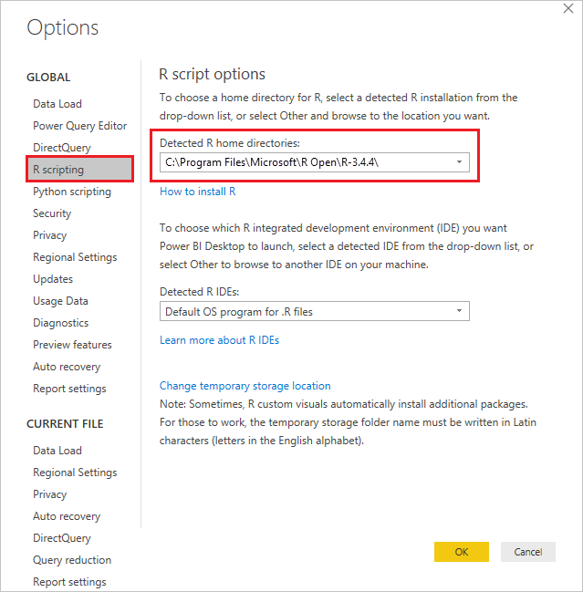
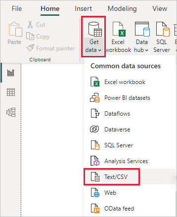
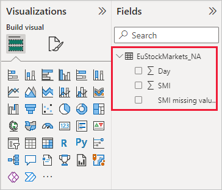
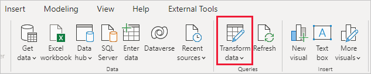
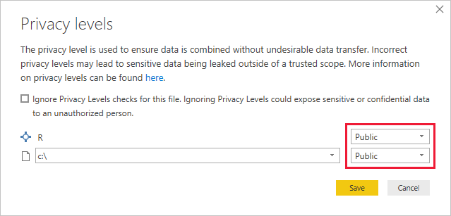
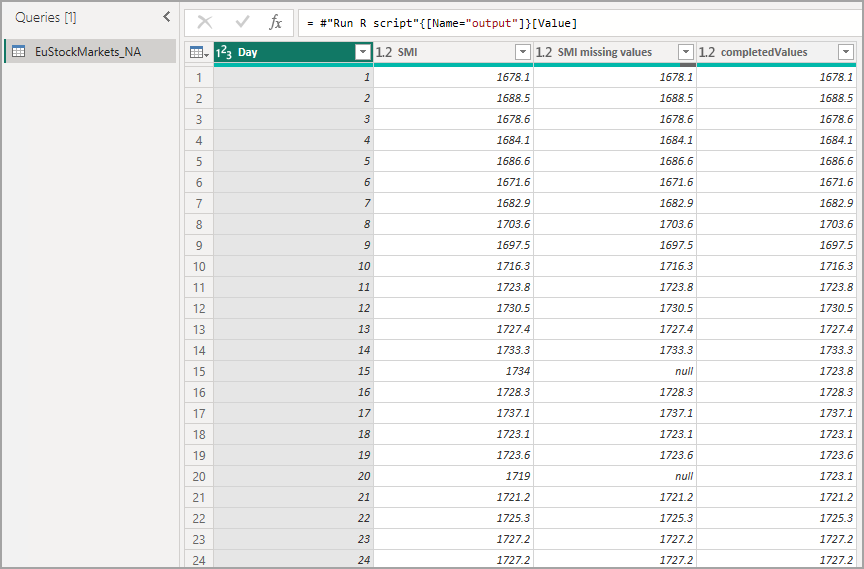
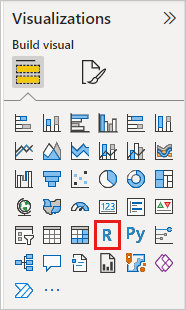
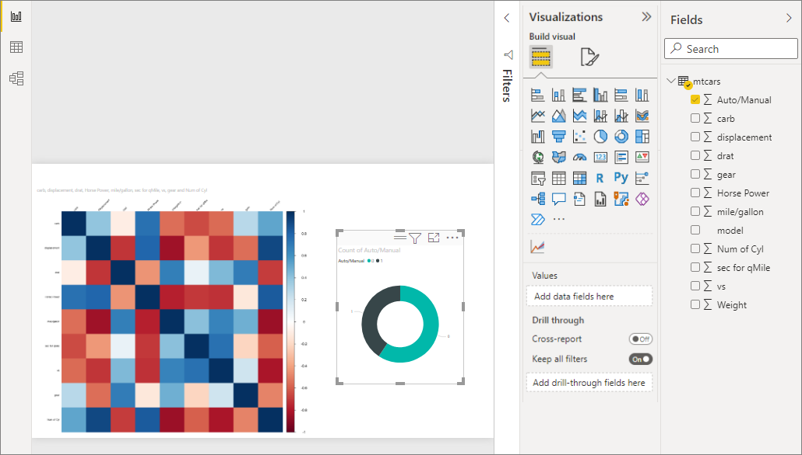
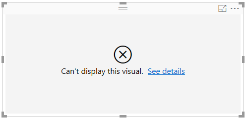
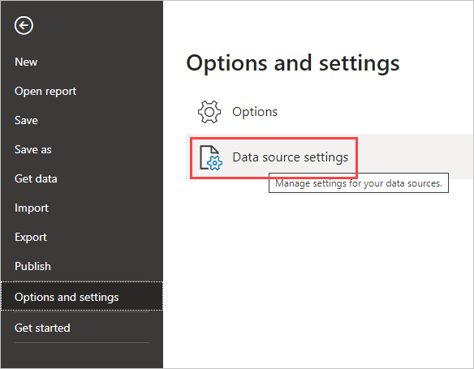

# 📗 README R-Power BI — Menggunakan R (`dplyr` & `ggplot2`) di Power BI

> Folder ini menjelaskan **cara memakai R di dalam Power BI** dengan fokus pada dua library inti: **`dplyr`** untuk transformasi data dan **`ggplot2`** untuk visualisasi.
> Materi disusun mengikuti dokumentasi resmi Microsoft Learn:
> - **Use R in Power Query Editor** — <https://learn.microsoft.com/en-us/power-bi/connect-data/desktop-r-in-query-editor>
> - **Create Power BI visuals using R** — <https://learn.microsoft.com/en-us/power-bi/create-reports/desktop-r-visuals>
>
> R dipakai di dua tempat berbeda di Power BI, dan keduanya dijelaskan di sini:
> 1. **Power Query Editor** — menjalankan skrip R (`dplyr`) untuk *cleaning* dan *shaping* data sebelum masuk ke model data;
> 2. **R visual** — menjalankan skrip R (`ggplot2`) untuk menggambar grafik yang ikut bereaksi terhadap filter Power BI.

---

## 1. Gambaran Umum

| Komponen | Keterangan |
| --- | --- |
| **Nama proyek** | R-Power BI — R (dplyr & ggplot2) di Power BI |
| **Topik materi** | Konfigurasi R, R di Power Query Editor, R visual |
| **Aplikasi** | Power BI Desktop + R (CRAN) |
| **Library utama** | `dplyr` (transformasi), `ggplot2` (visual) |
| **Dataset** | `../quality_inspection.csv` (latihan inspeksi kualitas) |
| **Prerequisit** | Dasar R + `dplyr` + `ggplot2` (lihat `../Volume 0 - Basic R/README.md`) |
| **Luaran** | Tabel bersih hasil skrip R di Power Query, dan R visual `ggplot2` yang merespons filter |
| **Sumber** | Dokumentasi resmi Microsoft Learn (dua artikel di atas) |

### Alur belajar (roadmap)

```text
Konfigurasi R
  -> Instal R dari CRAN
  -> Pasang dplyr & ggplot2
  -> Deteksi R di Power BI Desktop (Options > R scripting)

R di Power Query Editor  (dplyr)
  -> Get data > Text/CSV
  -> Transform data > Run R script
  -> Tabel 'dataset' -> variabel 'output'
  -> Cleaning dengan dplyr
  -> Privacy level = Public
  -> Output table

R visual  (ggplot2)
  -> Pilih ikon R visual
  -> Enable script visuals
  -> Tambahkan field ke Values
  -> Tulis ggplot2 di script editor
  -> Run script
  -> Visual merespons filter
```

---

## 2. Tujuan Pembelajaran

Setelah menyelesaikan modul **R-Power BI**, Anda diharapkan mampu:

1. Menginstal R dan menghubungkannya ke Power BI Desktop.
2. Memahami **dua jalur** pemakaian R di Power BI (Power Query vs R visual) dan memilih yang tepat.
3. Mengaktifkan opsi **R scripting** dan memverifikasi deteksi instalasi R.
4. Menjalankan skrip R di **Power Query Editor** untuk cleaning dan shaping data dengan `dplyr`.
5. Memahami aturan `dataset` (input) dan `output` (hasil) pada R di Power Query.
6. Mengatur **privacy level** agar skrip R berjalan dan bisa di-refresh.
7. Membuat **R visual** dengan `ggplot2` yang merespons slicer dan filter.
8. Mengenali **batasan** R di Power BI agar tidak terjebak saat produksi.

> Modul ini **melanjutkan** Volume 0 (dasar R, `dplyr`, `ggplot2`). Jika pipeline `dplyr` dan layer `ggplot2` sudah Anda kuasai, bab-bab praktik di sini akan terasa familiar.

---

## 3. Konfigurasi R untuk Power BI

### 3.1 Instalasi R

Power BI Desktop **tidak** menyertakan mesin R secara bawaan. Anda harus menginstal R secara terpisah.

| Software | URL | Fungsi |
| --- | --- | --- |
| **R** | <https://cran.r-project.org/> | Mesin (engine) yang menjalankan skrip R |
| **Power BI Desktop** | <https://powerbi.microsoft.com/desktop/> | Aplikasi yang memanggil R (Power Query & R visual) |

- Unduh R dari **CRAN Repository** lalu instal seperti aplikasi biasa.
- Rilis R scripting di Power BI Desktop saat ini **mendukung karakter Unicode dan spasi** pada path instalasi.
- Catat **folder instalasi R** (mis. `C:\Program Files\R\R-4.4.1\`), karena Power BI perlu menunjuk ke sana.

> **Penting:** versi R yang didukung di **Power BI service** adalah **R 4.3.3** (lihat *supported packages*). Untuk hasil yang konsisten antara Desktop dan service, sebaiknya samakan versi.

### 3.2 Package `dplyr` dan `ggplot2`

Skrip R di Power BI berjalan di **instalasi R lokal** Anda, jadi semua package harus terpasang lebih dulu di lokal. Modul ini hanya memakai dua package:

```r
install.packages(c("dplyr", "ggplot2"))
```

| Package | Dipakai untuk | Contoh fungsi |
| --- | --- | --- |
| **`dplyr`** | transformasi data di Power Query Editor | `mutate()`, `filter()`, `select()`, `group_by()`, `summarise()`, `arrange()` |
| **`ggplot2`** | membuat R visual | `ggplot()`, `geom_col()`, `geom_line()`, `geom_point()`, `geom_boxplot()`, `labs()` |

> Power BI Desktop **tidak** menjalankan `library()` secara otomatis. Tulis `library(dplyr)` atau `library(ggplot2)` di bagian atas skrip tiap kali, agar package benar-benar dimuat saat skrip dieksekusi.

### 3.3 Mendeteksi R di Power BI Desktop

Setelah R terpasang, Power BI Desktop biasanya **mengaktifkannya otomatis**. Untuk memastikan Power BI menunjuk ke instalasi R yang benar:

1. Dari menu Power BI Desktop, pilih **File > Options and settings > Options**.
2. Di sisi kiri halaman **Options**, pada bagian **Global**, pilih **R scripting**.
3. Pada bagian **R script options**, periksa kolom **Detected R home directories** dan pastikan sudah menunjuk ke instalasi R yang ingin dipakai.



4. Bila perlu, isi path instalasi R secara manual (mis. `C:\Program Files\R\R-4.4.1\`). Penentuan path manual ini **wajib** untuk beberapa kasus, misalnya instalasi **RRO 32-bit** yang tidak terdeteksi otomatis.

> Setelah instalasi R terverifikasi, Anda siap membuat R visual dan menjalankan R script di Power Query.

---
## 4. Dua Cara Memakai R di Power BI

Ini konsep paling penting sebelum praktik. R muncul di **dua titik** alur kerja Power BI, dan keduanya **berbeda tujuan**:

| Aspek | **R di Power Query Editor** | **R visual** |
| --- | --- | --- |
| Kapan | saat **transformasi data** (sebelum model) | saat **membuat laporan** (visual) |
| Library | **`dplyr`** | **`ggplot2`** |
| Input | tabel bernama **`dataset`** | dataframe **`dataset`** dari field di *Values* |
| Output | tabel bernama **`output`** | gambar (plot) di kanvas |
| Hasil | kolom/tabel baru untuk model data | grafik yang merespons filter |
| Ada di | Home > **Transform data** > **Run R script** | **Visualization pane** > ikon **R visual** |
| Sifat | mengubah data (persisten di query) | hanya menampilkan (gambar statis, non-interaktif) |

Cara mengingat singkat:

```text
R di Power Query  = "bahan mentah" -> diolah dengan dplyr -> jadi tabel bersih
R visual          = "tabel bersih" -> digambar dengan ggplot2 -> jadi grafik
```

> **Aturan praktis:** gunakan **R di Power Query** bila perlu logika cleaning yang sulit dilakukan Power Query native (mis. model statistik, imputasi, perhitungan rumit). Gunakan **R visual** bila perlu jenis grafik yang tak tersedia sebagai visual native (mis. heatmap khusus, violin, plot korelasi). Jika Power Query native atau visual native sudah cukup, **pakai yang native** — lebih cepat dan lebih mudah dirawat.

---

## 5. Transformasi Data dengan R di Power Query Editor (`dplyr`)

### 5.1 Siapa yang cocok memakai jalur ini

R di Power Query Editor cocok untuk:

- **data cleansing** dan **advanced data shaping** yang rumit;
- **analitik model semantik**, termasuk pelengkapan data hilang (*missing data completion*), prediksi, dan clustering;
- pembentukan **kolom turunan** dengan rumus yang lebih nyaman ditulis di `dplyr` daripada lewat UI.

### 5.2 Memuat data (contoh: CSV)

Contoh berikut memakai sebuah file `.csv` sebagai sumber data.

1. Dari tab **Home**, pilih **Get data > Text/CSV**.

   

2. Pilih file CSV, lalu **Open**.

   

3. Pilih **Load** untuk memuat data dari file. Setelah data dimuat, tabel baru muncul di panel **Fields**.

   

> Prasyarat pada contoh Microsoft memakai library `mice` (untuk melengkapi data hilang). Karena modul ini **fokus `dplyr` dan `ggplot2`**, kita mengganti peran `mice` dengan **cleaning berbasis `dplyr`** — tetap sesuai kaidah yang sama: tabel input bernama `dataset`, hasil ditulis ke `output`.

### 5.3 Membuka Power Query Editor

Dari ribbon **Home**, pilih **Transform data** untuk membuka **Power Query Editor**.



### 5.4 Menjalankan R script

Dari tab **Transform**, pilih **Run R script**. Editor **Run R script** akan muncul.


> Perhatikan data yang punya **baris kosong / nilai hilang** — di sinilah skrip R akan bekerja melengkapi atau merapikannya.

### 5.5 Aturan `dataset` dan `output`

Ini aturan wajib R di Power Query Editor:

| Nama | Peran | Aturan |
| --- | --- | --- |
| **`dataset`** | tabel **input** dari langkah Power Query sebelumnya | jangan diubah namanya; baca kolomnya via `dataset$NamaKolom` |
| **`output`** | tabel **hasil** yang dikembalikan ke Power Query | **wajib** diberi nama `output` |

> Anda mungkin perlu **menimpa variabel bernama `output`** agar model semantik baru benar-benar terbentuk dengan filter yang diterapkan.

### 5.6 Contoh `dplyr`: cleaning yang reproducible

Berikut pola cleaning dengan `dplyr`. Semua langkah opsional — sesuaikan kolom dengan data Anda:

```r
library(dplyr)

# 'dataset' = tabel input dari Power Query
output <- dataset |>
  mutate(
    # konversi tipe data
    Tanggal = as.Date(Tanggal),
    Line    = trimws(toupper(Line)),
    DefectType = trimws(DefectType),
    # isi teks kosong dengan label
    DefectType = if_else(is.na(DefectType) | DefectType == "", "NONE", DefectType),
    Inspected   = as.numeric(Inspected),
    Defect      = as.numeric(Defect),
    CycleTimeSec = as.numeric(CycleTimeSec)
  ) |>
  # buang baris tidak valid
  filter(!is.na(Tanggal), Inspected > 0, Defect >= 0, Defect <= Inspected) |>
  # metrik turunan
  mutate(
    DefectRate    = Defect / Inspected,
    FirstPassYield = 1 - DefectRate,
    QualityFlag   = if_else(DefectRate > 0.05, "Above target", "On target")
  ) |>
  arrange(Tanggal, Line)

# hasil wajib bernama 'output'
output
```

Poin penting:

- **`dataset` adalah input, `output` adalah output** — jangan menamai hasil dengan nama lain.
- Gunakan **pipe `|>`** (native R) atau `%>%` (magrittr) — keduanya bekerja.
- Semua `library()` yang dipakai harus dipanggil di dalam skrip (`library(dplyr)`).
- Kolom bertipe teks dengan **spasi/karakter khusus** diakses dengan tanda kutip tunggal, mis. `` dataset$`Horse Power` ``.

---

### 5.7 Privacy levels saat menjalankan skrip

Saat Anda memilih **OK**, Power Query Editor menampilkan **peringatan data privacy**.

1. Di dalam pesan peringatan, pilih **Continue**.

   

2. Pada dialog **Privacy levels** yang muncul, setel **semua sumber data ke `Public`** agar skrip R berjalan benar di Power BI service.

   

3. Pilih **Save** untuk menjalankan skrip.

> Ini bukan sekadar formalitas: **semua** pengaturan sumber data R **harus** `Public`. Bila tidak, skrip bisa gagal atau tidak dapat di-refresh. Detail perubahan permission ada di **Bab 10**.

### 5.8 Melihat hasil

Skrip R menampilkan data yang punya **nilai hilang** dan **nilai yang sudah dilengkapi** — perhatikan bedanya sebelum menekan **OK**:


Setelah skrip berjalan, akan tampil hasil seperti berikut:


Ketika Anda memilih **Table** di samping **Output**, tabel ditampilkan secara utuh:



- Kolom baru (mis. `DefectRate`, `FirstPassYield`, `QualityFlag`) muncul di panel **Fields**.
- Dengan beberapa baris `dplyr`, Power Query Editor menghasilkan kolom turunan yang siap dipakai membuat visual.

### 5.9 Kapan pakai R di Power Query vs native Power Query

| Situasi | Pilihan yang disarankan |
| --- | --- |
| Ganti tipe data, buang kolom, filter sederhana | Power Query **native** (lebih cepat, tanpa R) |
| Split kolom, pivot/unpivot, merge query | Power Query **native** |
| Rumus berulang yang lebih nyaman di `dplyr` | **R script** (`dplyr`) |
| Imputasi data hilang, prediksi, clustering, statistik | **R script** (memang tujuannya) |
| Tim tanpa R, ingin perawatan mudah | **Native** (hindari ketergantungan R) |

> Skrip R di Power Query dijalankan **per langkah query**; ia *tidak* otomatis dioptimalkan seperti Power Query native. Untuk data besar, ukur dulu dampak performanya.

---

## 6. Membuat Visual dengan R (`ggplot2`)

### 6.1 Mengaktifkan R visual

1. Pilih ikon **R Visual** pada **Visualization pane** untuk menambahkan R visual.

   

2. Pada jendela **Enable script visuals** yang muncul, pilih **Enable**.

   

Setelah R visual ditambahkan, Power BI Desktop melakukan perubahan berikut:

- **Gambar R visual placeholder** muncul di kanvas laporan;
- **R script editor** muncul di bagian bawah panel tengah.

> **Keamanan:** R visual dibuat dari skrip yang bisa mengandung kode berisiko. Saat pertama kali melihat/menginteraksi R visual, pengguna diberi **peringatan keamanan**. Aktifkan R visual hanya jika Anda **mempercayai penulis & sumbernya**, atau setelah Anda membaca dan memahami skripnya.

### 6.2 Menambahkan field ke `Values`

Di bagian **Values** pada Visualization pane, tarik **field** dari panel **Fields** yang ingin dipakai skrip R — sama seperti visual Power BI lainnya.

- **Hanya field yang ditambahkan ke `Values`** yang tersedia untuk skrip R.
- Anda boleh menambah/menghapus field saat sedang menulis skrip; Power BI Desktop **mendeteksi otomatis** perubahan itu.

> **Catatan:** tipe agregasi default untuk R visual adalah **do not summarize**.

### 6.3 Anatomi R script editor & binding code

Saat Anda memilih field, R script editor **otomatis membuat binding code** untuk field tersebut di bagian abu-abu di atas editor:

- dataframe yang dihasilkan bernama **`dataset`**;
- akses kolom dengan namanya, mis. `dataset$gear`;
- untuk field dengan **spasi/karakter khusus**, gunakan **tanda kutip tunggal**;
- bila Anda menghapus sebuah field, kode pendukungnya **ikut terhapus** otomatis.

Contoh: bila tiga field dipilih (mis. *Horse Power*, *gear*, *drat*), editor menghasilkan binding code seperti pada gambar:


Ringkasan yang dilakukan binding code:

1. Membuat dataframe bernama **`dataset`** dari field yang dipilih pengguna.
2. Agregasi default: **do not summarize**.
3. Serupa visual tabel: field **dikelompokkan** dan baris duplikat muncul sekali saja.

### 6.4 Menjalankan script & re-render

Dengan dataframe yang sudah dibuat otomatis dari field terpilih, Anda siap menulis skrip R. Power BI Desktop akan **memplot ke device default R**.

- Setelah skrip selesai, pilih ikon **Run script** di sisi kanan title bar R script editor.
- Saat ikon **Run script** dipilih, Power BI Desktop mengenali plot dan **menampilkannya di kanvas**.
- Karena eksekusi berjalan di **instalasi R lokal**, pastikan package yang dibutuhkan (`ggplot2`) sudah terpasang.

Power BI Desktop akan **memplot ulang** visual ketika:

- Anda memilih ikon **Run script** dari title bar editor; atau
- terjadi **perubahan data** karena *refresh*, *filter*, atau *highlight*.

> Untuk melihat visual lebih besar, **deselect** R visual atau **minimize** R script editor. Seperti visual lain, R visual juga bisa **cross-filter** visual lain.

---

### 6.5 Contoh R visual dengan `ggplot2`

Contoh pada dokumentasi Microsoft memakai package `corrplot` untuk menggambar **correlation plot** antar atribut mobil. Karena modul ini **fokus pada `ggplot2`**, kita tulis ulang gagasan yang sama dengan `ggplot2` — hasilnya grafik yang sama-sama merespons filter.

Misalnya, ingin melihat **defect rate per operator** dari field yang ditarik ke `Values` (`Operator`, `Inspected`, `Defect`):

```r
library(ggplot2)
library(dplyr)

ringkas <- dataset |>
  group_by(Operator) |>
  summarise(
    Rate = sum(Defect) / sum(Inspected),
    .groups = "drop"
  )

ggplot(ringkas, aes(x = reorder(Operator, Rate), y = Rate, fill = Rate)) +
  geom_col() +
  coord_flip() +
  scale_fill_gradient(low = "#9ecae1", high = "#C44E52") +
  labs(
    title = "Defect rate per operator",
    x = NULL, y = "Defect rate"
  ) +
  theme_minimal()
```

Binding code di atas editor memastikan `dataset` berisi field yang Anda pilih:


Setelah **Run script**, plot muncul di kanvas. Untuk melihat lebih besar, **deselect** R visual atau **minimize** R script editor:



> **Kunci cross-filter:** seperti visual Power BI lain, R visual dapat **cross-filter** visual lain. Pada contoh Microsoft, memilih nilai (mis. *Auto* / *Manual*) di donut chart dapat menyaring correlation plot. Sifat ini berlaku karena **data yang dikirim ke R sudah terfilter** — bukan karena gambar itu sendiri interaktif.

Contoh lain — mengubah parameter plotting untuk mendapatkan bentuk berbeda. Pada dokumen aslinya perintah `corrplot(...)` diubah menjadi versi *circle*, *upper*, dan *clustered*:

```r
# versi awal (corrplot): tampilan warna
corrplot(M, method = "color", tl.cex = 0.6, tl.srt = 45, tl.col = "black")

# versi modifikasi: lingkaran, hanya setengah atas, diurutkan
corrplot(M, method = "circle", tl.cex = 0.6, tl.srt = 45,
         tl.col = "black", type = "upper", order = "hclust")
```

Hasil versi modifikasi — visual sekarang menggambar **lingkaran**, hanya **separuh atas**, dan mengurutkan matriks agar atribut berkorelasi berdekatan:


> **Padanan `ggplot2`:** untuk heatmap korelasi dengan `ggplot2`, gunakan `geom_tile()` atas matriks korelasi (`cor()` lalu `as.table()`), lalu `coord_fixed()` dan `scale_fill_gradient2()`. Prinsipnya sama: seluruh logika ada di skrip R, dan Power BI hanya menyerahkan data terfilter lalu menampilkan gambarnya.

### 6.6 Bila skrip error

Bila skrip R menghasilkan **error**, pesan error ditampilkan **di kanvas**, menggantikan gambar. Untuk detail lengkapnya, pilih **See details** pada pesan error R visual.



Penyebab paling sering:

- package belum terpasang di instalasi R lokal (`there is no package called ...`);
- nama kolom salah / tidak ada di `Values`;
- sintaks `ggplot2` tidak lengkap (mis. `+` diletakkan di baris terakhir tanpa lanjutan).

> **Tips debugging:** kembangkan skrip dulu di **RStudio** memakai data contoh, baru tempel ke editor Power BI setelah berjalan mulus. Lebih cepat daripada men-debug di kanvas.

---

## 7. Menjalankan R di Power BI Service (`refresh` & permission)

Setelah `.pbix` selesai, Anda dapat **menyimpan semua visual** dalam satu file `.pbix` dan memakai model data beserta skrip R-nya di **Power BI service**. Namun ada beberapa langkah tambahan agar *refresh* dan visual bisa diperbarui.

### 7.1 Mengatur privacy level ke `Public`

**Semua pengaturan sumber data R harus `Public`.** Ini syarat mutlak — bukan formalitas. Semua langkah lain pada query Power Query Editor juga harus public.

1. Di Power BI Desktop, pilih **File > Options and settings > Data source settings**.

   

2. Pada dialog **Data source settings**, pilih satu atau lebih sumber data, lalu pilih **Edit Permissions**.

   

3. Setel **Privacy Level** ke **Public**.

> Bila ada sumber data yang **bukan** `Public`, skrip R bisa **gagal** atau **tidak dapat di-refresh** di Power BI service. Periksa daftar ini setiap kali skrip R gagal setelah dipublikasikan.

### 7.2 Mengaktifkan scheduled refresh

Agar *refresh* terjadwal berjalan untuk semantic model yang memuat skrip R, aktifkan **scheduled refresh**. Pengaturan ini juga mencakup informasi tentang **on-premises data gateway**.

### 7.3 Memasang gateway (wajib untuk R)

Anda memerlukan **on-premises data gateway (personal mode)** yang dipasang di komputer tempat **berkas dan R** berada. Power BI service akan mengakses berkas tersebut dan **me-render ulang** visual yang diperbarui.

| Komponen | Peran |
| --- | --- |
| **Scheduled refresh** | memperbarui data model secara berkala |
| **On-premises data gateway (personal mode)** | menjembatani Power BI service ↔ komputer yang menjalankan R |
| **R + package terpasang** | di komputer yang sama dengan gateway, agar skrip bisa dieksekusi |

> **Catatan penting:** Anda **tidak dapat** memakai **enterprise gateway** untuk me-refresh semantic model yang memuat skrip R di Power Query. Gunakan **personal gateway**.

### 7.4 Alur publish-ringkas

```text
1. Pastikan semua sumber data = Public
2. Simpan .pbix
3. Upload ke Power BI service (Publish)
4. Aktifkan scheduled refresh
5. Pasang personal gateway di komputer ber-R
6. Periksa visual: apakah R visual ter-render ulang?
```

---

## 8. Batasan R di Power BI

Bagian ini menyelamatkan Anda dari kejutan saat produksi. Batasan berbeda antara **R visual** dan **R di Power Query**.

### 8.1 Batasan R visual (Desktop)

| Batasan | Nilai / Perilaku |
| --- | --- |
| **Ukuran data** | maksimum **150.000 baris**; jika lebih, hanya 150.000 baris teratas yang dipakai dan muncul pesan pada gambar |
| **Ukuran output** | maksimum **2 MB** |
| **Resolusi** | semua R visual ditampilkan pada **72 DPI** |
| **Plotting device** | hanya **default device** R yang didukung — jangan paksa device lain |
| **Waktu kalkulasi** | jika melebihi **5 menit**, terjadi **timeout** |
| **Relationships** | seperti visual lain, bila field dari tabel berbeda **tanpa relasi** dipilih, muncul error |
| **Refresh** | R visual **di-refresh** saat data berubah, difilter, atau di-highlight — tetapi **gambar tidak interaktif** |
| **Highlights** | R visual **merespons** highlight dari visual lain, tetapi Anda **tidak bisa** memilih elemen di dalamnya untuk cross-filter balik |
| **Rename kolom** | R visual **tidak mendukung** penggantian nama kolom input; kolom diakses dengan **nama aslinya** |
| **RRO 32-bit** | Power BI Desktop **32-bit** tidak otomatis mendeteksi **RRO**; path instalasi R harus diisi manual di **Options > R Scripting** |

### 8.2 Batasan R di Power Query Editor

| Batasan | Konsekuensi |
| --- | --- |
| **Semua R data source settings harus `Public`** | bila tidak, skrip gagal / tak bisa refresh |
| **Semua langkah query lain juga harus public** | konsistensi privacy level |
| **Refresh butuh scheduled refresh + personal gateway** | tidak bisa pakai enterprise gateway |
| **Bukan native Power Query** | performa tidak dioptimalkan seperti Power Query native; ukur untuk data besar |

> **Kesimpulan praktis:** gunakan R untuk hal yang **memang butuh R**. Untuk transformasi sederhana dan visual yang sudah tersedia native, pakai native Power BI — lebih cepat, lebih mudah dirawat, dan tanpa ketergantungan gateway.

---

## 9. Contoh Alur Lengkap (Power Query `dplyr` → R visual `ggplot2`)

Alur end-to-end: dari CSV mentah sampai R visual yang merespons filter. Dataset latihan: `../quality_inspection.csv`.

### 9.1 Langkah 1 — Import data

**Home > Get data > Text/CSV** → pilih `quality_inspection.csv` → **Load**. Tabel muncul di panel **Fields**.

### 9.2 Langkah 2 — Cleaning dengan `dplyr` di Power Query

**Home > Transform data** → tab **Transform** → **Run R script** → tempel:

```r
library(dplyr)

output <- dataset |>
  mutate(
    InspectionDate = as.Date(InspectionDate),
    Line       = trimws(toupper(Line)),
    Product    = trimws(Product),
    DefectType = trimws(DefectType),
    DefectType = if_else(is.na(DefectType) | DefectType == "", "NONE", DefectType),
    Inspected    = as.numeric(Inspected),
    Defect       = as.numeric(Defect),
    CycleTimeSec = as.numeric(CycleTimeSec)
  ) |>
  filter(
    !is.na(InspectionDate),
    Inspected > 0,
    Defect >= 0,
    Defect <= Inspected
  ) |>
  mutate(
    DefectRate     = Defect / Inspected,
    FirstPassYield = 1 - DefectRate,
    QualityFlag    = if_else(DefectRate > 0.05, "Above target", "On target")
  ) |>
  arrange(InspectionDate, Line)

output
```

Saat dialog **Privacy levels** muncul, setel semua sumber ke **Public** → **Save**. Klik **Table** di samping **Output** untuk memeriksa hasil, lalu **Close & Apply**.

### 9.3 Langkah 3 — Buat R visual

1. Tambahkan **R visual** dari Visualization pane → **Enable** bila diminta.
2. Tarik field ke **Values**: `Line`, `Inspected`, `Defect` (agregasi default: **do not summarize**).
3. Tulis skrip `ggplot2`:

```r
library(ggplot2)
library(dplyr)

ringkas <- dataset |>
  group_by(Line) |>
  summarise(
    Rate = sum(Defect) / sum(Inspected),
    .groups = "drop"
  )

ggplot(ringkas, aes(x = Line, y = Rate, fill = Line)) +
  geom_col(width = 0.6) +
  scale_y_continuous(labels = scales::percent) +
  labs(title = "Defect rate per lini", x = "Lini", y = "Defect rate") +
  theme_minimal()
```

4. Pilih ikon **Run script** → plot muncul di kanvas.

### 9.4 Langkah 4 — Uji respons filter

Tambahkan **slicer** (mis. `Product` atau `Shift`). Saat slicer diubah, **data yang dikirim ke R terfilter**, sehingga R visual **menggambar ulang** grafiknya. Inilah nilai utama R visual: grafik khas R (`ggplot2`) yang tetap **reaktif** terhadap report.

### 9.5 Ringkasan alur

```text
quality_inspection.csv
      |
      v  Get data > Text/CSV
   tabel mentah
      |
      v  Transform data > Run R script  (dplyr)
   output = tabel bersih + kolom turunan
      |
      v  Close & Apply
   model data & panel Fields
      |
      v  R visual: field -> Values  (ggplot2)
   grafik yang merespons slicer / filter
```

---

## 10. Kesalahan Umum dan Solusinya

| Gejala | Penyebab | Solusi |
| --- | --- | --- |
| `there is no package called 'dplyr'` | package belum terpasang di R lokal | `install.packages("dplyr")` lalu restart Power BI Desktop |
| Skrip R tidak muncul / hasil kosong | tidak menamai hasil `output` | pastikan variabel hasil **bernama `output`** |
| R visual kosong / error di kanvas | field belum ditarik ke `Values` | tambahkan field yang dipakai skrip ke **Values** |
| Error saat memakai kolom | nama kolom beda / pakai nama baru | gunakan **nama asli** kolom; R visual tidak mendukung rename |
| `Column '...' not found` | binding code tidak sinkron | hapus & tambahkan ulang field agar binding code diperbarui |
| Skrip gagal setelah publish | privacy level bukan `Public` | **File > Options and settings > Data source settings > Edit Permissions > Public** |
| Refresh service tidak jalan | gateway belum dipasang | pasang **personal gateway** di komputer ber-R |
| Visual terlalu kecil | R script editor terbuka | **deselect** R visual atau **minimize** editor |
| R visual dibatasi 150.000 baris | batas bawaan | agregasi dulu (mis. `summarise()`) sebelum dikirim ke R |
| Timeout setelah 5 menit | kalkulasi terlalu berat | sederhanakan skrip / agregasi lebih awal |
| RRO tidak terdeteksi (32-bit) | deteksi otomatis gagal | isi path R manual di **Options > R Scripting** |
| Grafik buram / beda tampilan | hanya default device & 72 DPI | hindari mengganti plotting device |

### 10.1 Pola debugging yang aman

```text
1. Tulis & uji skrip di RStudio dengan data contoh
2. Pastikan library() lengkap di awal skrip
3. Pastikan hasil Power Query = variabel 'output'
4. Pastikan field sudah masuk Values (R visual)
5. Periksa privacy level bila gagal setelah publish
6. Lihat 'See details' pada error R visual
```

---

## 11. Latihan Mandiri

Latihan berikut memakai dataset yang sudah dipakai di Volume 0: `../quality_inspection.csv` (kolom: `InspectionDate`, `Line`, `Product`, `DefectType`, `Inspected`, `Defect`, `CycleTimeSec`).

### Level 1 — Konfigurasi & R di Power Query

1. Instal R dari CRAN, lalu pasang `dplyr` dan `ggplot2` dengan satu perintah.
2. Verifikasi Power BI Desktop mendeteksi R Anda lewat **File > Options and settings > Options > R scripting**. Catat path yang terdeteksi.
3. Impor `quality_inspection.csv` lewat **Get data > Text/CSV**, lalu buka **Transform data**.
4. Jalankan **Run R script** dengan skrip minimal berikut dan pastikan hasilnya keluar:

   ```r
   library(dplyr)
   output <- dataset |> filter(Inspected > 0)
   output
   ```

5. Jelaskan (satu paragraf) perbedaan peran `dataset` dan `output`.

### Level 2 — Transformasi dengan `dplyr`

6. Buat kolom `DefectRate = Defect / Inspected` dan `FirstPassYield = 1 - DefectRate`.
7. Buang baris dengan `Inspected <= 0` atau `Defect > Inspected`.
8. Isi `DefectType` yang kosong dengan label `"NONE"` menggunakan `if_else()`.
9. Tambahkan kolom `QualityFlag` bernilai `"Above target"` bila `DefectRate > 0.05`, jika tidak `"On target"`.
10. Urutkan hasil dengan `arrange(InspectionDate, Line)` lalu pilih kolom penting dengan `select()`.
11. Buat tabel ringkasan per lini (`group_by()` + `summarise()`) dengan `TotalInspected`, `TotalDefect`, dan `DefectRate`.

### Level 3 — Visual dengan `ggplot2` di Power BI

12. Buat R visual batang `DefectRate` per `Line` (pakai `geom_col()`), lalu format sumbu-Y dengan `scales::percent`.
13. Buat R visual garis tren `DefectRate` per tanggal (`geom_line()`).
14. Buat R visual kotak (`geom_boxplot()`) `CycleTimeSec` per `Line`.
15. Tambahkan **slicer `Product`**; pastikan R visual **menggambar ulang** saat slicer diubah.
16. Terapkan `theme_minimal()` + `labs(title = ...)` pada salah satu visual.

---

## 12. Checklist Penyelesaian R-Power BI

- [ ] R terpasang dari CRAN dan path instalasi diketahui.
- [ ] Package `dplyr` dan `ggplot2` terpasang di R lokal.
- [ ] Power BI Desktop mendeteksi R ( **Options > R scripting** ).
- [ ] Tabel `dataset` berhasil dibaca di **Run R script**.
- [ ] Hasil skrip bernama **`output`** dan tampil di Power Query.
- [ ] Minimal satu kolom turunan dibuat dengan `dplyr` (`mutate()`).
- [ ] Privacy level sumber data disetel ke **`Public`**.
- [ ] Tabel bersih muncul di panel **Fields** setelah **Close & Apply**.
- [ ] R visual dibuat dengan `ggplot2` dan field sudah masuk **Values**.
- [ ] R visual **merespons slicer / filter**.
- [ ] Mengetahui batasan (150.000 baris, timeout 5 menit, non-interaktif) dan cara menghindarinya.
- [ ] Refresh di Power BI service berjalan (gateway + privacy `Public`).

---

## 13. Keterkaitan dengan Modul Lain

| Modul | Fokus | Kaitan dengan R-Power BI |
| --- | --- | --- |
| **Volume 0 — Basic R** | Basic R · `dplyr` · `ggplot2` | **Prasyarat**: sintaks, pipeline `dplyr`, layer `ggplot2` |
| **Volume 1 — Basic Visualization ggplot2** | Galeri 73 sample `ggplot2` | Sumber ide visual yang bisa dipasang sebagai R visual |
| **Volume 2 — Statistics & Inferential Statistics** | Uji t, ANOVA, regresi, CI | Skrip statistik yang bisa dijalankan di Power Query (mis. imputasi, deteksi outlier) |
| **R-Power BI (ini)** | Konfigurasi R · R di Power Query · R visual | Jembatan antara skrip R dan dashboard Power BI |

> 💡 Skrip cleaning di **Bab 5.6** modul ini adalah versi ringkas dari pola `dplyr` yang sudah dipelajari di Volume 0. Memahami pipeline `dplyr` di Volume 0 berarti Anda sudah memahami cara kerja R di Power Query Editor.

---

## 14. Tips & Trik R-Power BI

### 14.1 Kebiasaan kerja yang menghindarkan masalah

1. **Uji dulu di RStudio, baru tempel ke Power BI.** Data contoh kecil cukup untuk memastikan skrip tidak error sebelum masuk ke Power BI.
2. **Selalu panggil `library()` di awal skrip.** R di Power BI tidak memuat package otomatis; tanpa `library(dplyr)`, `mutate()` tidak dikenali.
3. **Bereskan nama kolom lebih dulu.** Pilih/rename nama kolom di Power Query native sebelum masuk R script, agar skrip tidak bergantung pada nama berkarakter khusus.
4. **Perlakukan R script sebagai langkah query terakhir.** Optimasi yang mungkin dilakukan Power Query native (filter awal, buang kolom) sebaiknya dikerjakan **sebelum** langkah R.
5. **Kurangi baris sebelum dikirim ke R visual.** Karena batas 150.000 baris, agregasi dengan `summarise()` lalu kirim hasilnya ke R.
6. **Jaga skrip tetap pendek.** R visual yang ringan lebih cepat di-render dan lebih mudah di-debug.
7. **Set privacy ke `Public` sejak awal.** Ini menghemat waktu saat publish dan refresh.

### 14.2 Pola skrip yang paling sering dipakai

```r
# POLA 1 — Power Query: dataset -> output (dplyr)
library(dplyr)
output <- dataset |>
  mutate(
    Tanggal    = as.Date(Tanggal),
    Line       = trimws(toupper(Line)),
    DefectRate = Defect / Inspected
  ) |>
  filter(Inspected > 0, Defect >= 0, Defect <= Inspected) |>
  arrange(Tanggal, Line)
output

# POLA 2 — R visual: ringkas dulu, baru gambar (ggplot2)
library(ggplot2); library(dplyr)
ringkas <- dataset |>
  group_by(Line) |>
  summarise(Rate = sum(Defect) / sum(Inspected), .groups = "drop")

ggplot(ringkas, aes(x = Line, y = Rate, fill = Line)) +
  geom_col(width = 0.6) +
  scale_y_continuous(labels = scales::percent) +
  labs(title = "Defect rate per lini", x = "Lini", y = "Defect rate") +
  theme_minimal()

# POLA 3 — R visual: tren waktu
ggplot(dataset, aes(x = as.Date(Tanggal), y = DefectRate)) +
  geom_line(color = "steelblue") +
  labs(title = "Tren defect rate", x = "Tanggal", y = "Defect rate") +
  theme_minimal()
```

### 14.3 "Cheat mental" untuk R di Power BI

| Jika ingin... | Ingat... |
| --- | --- |
| Input data di Power Query | tabel **`dataset`** |
| Mengembalikan hasil | variabel bernama **`output`** |
| Membuat kolom baru | `mutate()` |
| Memilih baris | `filter()` |
| Memilih kolom | `select()` |
| Ringkas per grup | `group_by()` → `summarise()` |
| Membersihkan teks | `trimws()`, `toupper()`, `if_else()` |
| Grafik batang | `geom_col()` |
| Grafik garis | `geom_line()` |
| Grafik kotak | `geom_boxplot()` |
| Persentase di sumbu | `scale_y_continuous(labels = scales::percent)` |

> Trik ingatan dua jalur: **"`dataset` → `output` = olah data (`dplyr`)"**, **"field → `Values` → `ggplot()` = gambar (`ggplot2`)"**.

### 14.4 Kesalahan penamaan yang perlu dihindari

- Jangan menamai hasil dengan `hasil`, `df`, atau `clean` — **harus** `output`.
- Jangan mengubah nama `dataset` — biarkan apa adanya.
- Jangan pakai nama kolom baru di R visual — R visual memakai **nama asli** kolom dari model.
- Jangan taruh `library()` di tengah skrip setelah pemakaian fungsi.

---

## 15. Bank Latihan Tambahan (Exercise Bank) — R-Power BI

Gunakan `../quality_inspection.csv`. Kerjakan tanpa melihat kunci lebih dulu.

### 15.1 Soal Esai / Latihan Terbuka

**A. Konfigurasi & R di Power Query (`dplyr`)**
1. Tuliskan dua tempat R dipakai di Power BI, dan library yang paling cocok untuk masing-masing.
2. Tulis skrip `output` yang mengonversi `InspectionDate` ke tipe tanggal dan membuat `DefectRate`.
3. Buat `output` yang hanya berisi lini dengan `DefectRate > 0.05`.
4. Buat `output` berisi tabel ringkasan per `DefectType`: `TotalDefect` dan `DefectRate`.
5. Jelaskan mengapa `dataset` tidak boleh diubah namanya dan mengapa hasil wajib bernama `output`.

**B. R visual (`ggplot2`)**
6. Buat R visual batang jumlah `Defect` per `Line`, warna `steelblue`.
7. Buat R visual garis `DefectRate` per tanggal.
8. Buat R visual kotak `CycleTimeSec` per `Line`.
9. Buat R visual sebar `CycleTimeSec` vs `DefectRate` + `geom_smooth(method = "lm")`.
10. Tambahkan `facet_wrap(~ Line)` pada salah satu visual dan jelaskan efeknya.

**C. Penyelesaian masalah**
11. R visual tampil kosong di kanvas — sebutkan **dua** penyebab paling mungkin dan solusinya.
12. Skrip R yang tadinya jalan gagal setelah di-**publish** — apa penyebab tersering, dan di mana mengubahnya?
13. Sebutkan tiga batasan R visual di Power BI Desktop dan cara menyiasatinya.

### 15.2 Kunci jawaban singkat

```r
# 1  -> Power Query Editor: dplyr (transformasi); R visual: ggplot2 (visual)

# 2
library(dplyr)
output <- dataset |>
  mutate(InspectionDate = as.Date(InspectionDate),
         DefectRate = Defect / Inspected)

# 3
output <- dataset |>
  mutate(DefectRate = Defect / Inspected) |>
  filter(DefectRate > 0.05)

# 4
output <- dataset |>
  group_by(DefectType) |>
  summarise(TotalDefect = sum(Defect),
            DefectRate  = sum(Defect) / sum(Inspected),
            .groups = "drop")

# 5  -> 'dataset' = tabel input dari langkah Power Query (nama baku);
#       'output' = nama baku tabel hasil yang dikembalikan ke Power Query.
#       Keduanya adalah 'kontrak' antara Power Query dan mesin R.
```

```r
# 6
library(ggplot2)
ggplot(dataset, aes(x = Line, y = Defect)) +
  geom_col(fill = "steelblue") +
  labs(title = "Jumlah defect per lini") +
  theme_minimal()

# 7
ggplot(dataset, aes(x = as.Date(InspectionDate), y = Defect / Inspected)) +
  geom_line(color = "steelblue") +
  labs(title = "Tren defect rate", x = "Tanggal", y = "Defect rate") +
  theme_minimal()

# 8
ggplot(dataset, aes(x = Line, y = CycleTimeSec, fill = Line)) +
  geom_boxplot() +
  labs(title = "Cycle time per lini") +
  theme_minimal()

# 9
ggplot(dataset, aes(x = CycleTimeSec, y = Defect / Inspected)) +
  geom_point(alpha = 0.5) +
  geom_smooth(method = "lm") +
  labs(title = "Cycle time vs defect rate") +
  theme_minimal()

# 10 (facet -> satu panel kecil per lini, memudahkan perbandingan pola)
ggplot(dataset, aes(x = as.Date(InspectionDate), y = Defect / Inspected)) +
  geom_line(color = "steelblue") +
  facet_wrap(~ Line) +
  labs(title = "Tren defect rate per lini") +
  theme_minimal()

# 11 -> (a) field belum ditarik ke 'Values'; (b) binding code tidak sinkron
#       -> tambahkan field / hapus & tambahkan ulang field.

# 12 -> privacy level bukan 'Public'.
#       File > Options and settings > Data source settings > Edit Permissions > Public.

# 13 -> (a) maksimum 150.000 baris; (b) timeout 5 menit; (c) visual non-interaktif.
#       -> agregasi lebih awal (summarise), sederhanakan skrip, dan pakai
#          visual native untuk kebutuhan interaksi.
```

> Catatan: pada R visual, **jangan** mengubah nama kolom — pakai nama asli dari model. Untuk soal nomor 4, gunakan `.groups = "drop"` agar hasil `summarise()` rapi bertipe data frame.

---

## 16. Referensi dan Berkas

| Berkas/Materi | Lokasi |
| --- | --- |
| **Folder modul ini** | `R-Power BI/README.md` (tanpa cheatsheet) |
| Gambar modul | `R-Power BI/images/*.png` |
| Dataset latihan | `../quality_inspection.csv` |
| Skrip cleaning Power Query | `../quality_inspection_cleaning.R` |
| Prasyarat — dasar R | `../Volume 0 - Basic R/README.md` |
| Ide visual `ggplot2` | `../Volume 1 - Basic Visualization ggplot/README.md` |
| Skrip statistik untuk Power Query | `../Volume 2 - Statistics and Inferential Statistics/README.md` |
| **Use R in Power Query Editor** | <https://learn.microsoft.com/en-us/power-bi/connect-data/desktop-r-in-query-editor> |
| **Create Power BI visuals using R** | <https://learn.microsoft.com/en-us/power-bi/create-reports/desktop-r-visuals> |
| Dokumentasi R | <https://cran.r-project.org/> |
| dplyr dokumentasi | <https://dplyr.tidyverse.org/> |
| ggplot2 dokumentasi | <https://ggplot2.tidyverse.org/> |
| R yang didukung Power BI service | <https://learn.microsoft.com/en-us/power-bi/connect-data/service-r-packages-support> |

---

*README R-Power BI — menggunakan R (`dplyr` & `ggplot2`) di dalam Power BI: dari konfigurasi, transformasi data di Power Query Editor, sampai membuat R visual yang merespons filter. Disusun mengikuti dokumentasi resmi Microsoft Learn.*

