# 📊 README Volume 1 — Basic Visualization: ggplot2

> Proyek ini adalah **Volume 1** — fondasi visualisasi data dengan `ggplot2`, dibangun di atas **Volume 0 (Basic R)**. Materi di folder ini mencakup **semua sample** — setiap grafik dengan kode lengkap siap salin-tempel, dari grafik dasar (histogram, bar, line, scatter) hingga multi-variabel, facet, scale, tema, dan dashboard:
>
> 1. **Konsep Layer** — grammar of graphics: data, aes, geom, stat, scale, coord, facet, theme;
> 2. **Galeri 73 contoh siap jalankan** — setiap contoh = kode + PNG hasil di `output/`;
> 3. **Best practice** — prinsip visualisasi, kesalahan umum, checklist, dan latihan.

---

## 1. Gambaran Umum

| Komponen | Keterangan |
| --- | --- |
| **Nama proyek** | Volume 1 — Basic Visualization: ggplot2 |
| **Topik materi** | Visualisasi data dengan `ggplot2` |
| **Bahasa** | R, RStudio Desktop |
| **Package utama** | `ggplot2`, `dplyr`, `lubridate`, `scales`, `forcats` |
| **Dataset** | `visualisasi_sample.csv` (900 baris inspeksi kualitas) |
| **Prerequisit** | Volume 0 — Basic R (`dplyr` dasar + konsep ggplot2) |
| **Luaran** | Galeri 73 grafik PNG + kemampuan merancang grafik profesional fondasi Volume 2 (Power BI + R visual) |

### Alur belajar (roadmap)

```text
Konsep
  -> Grammar of Graphics (8 komponen)
  -> Data prep untuk grafik (dplyr + factor)
  -> Template dasar ggplot()

Galeri Sample (73 contoh, 11 bagan)
  -> Distribusi satu variabel   (01-10)
  -> Kategori vs kontinu        (11-24)
  -> Hubungan & tren            (25-45)
  -> Koordinat khusus           (46-52)
  -> Facet multi-panel          (53-55)
  -> Scales, warna & label      (56-62)
  -> Tema & tampilan            (63-65)
  -> Guides & annotasi          (66-67 + 44)
  -> Stat & after_stat          (68-70)
  -> Label, dashboard & ekspor  (71-73)

Best Practice
  -> Prinsip visualisasi efektif
  -> Kesalahan umum & solusi
  -> Checklist & latihan
```

---

## 2. Tujuan Pembelajaran

Setelah menyelesaikan **Volume 1**, Anda diharapkan mampu:

1. Menjelaskan 8 komponen *grammar of graphics* dan cara ggplot2 membangun grafik layer demi layer.
2. Merancang grafik dasar hingga multi-variabel: **apa data → apa geom → apa aes**.
3. Mengetahui geom mana yang pas untuk: distribusi, kategori, hubungan, tren, dan polar.
4. Mengkustomisasi scale warna, label, breaks, dan format persentase/komma.
5. Membuat multi-panel dengan `facet_wrap()` dan `facet_grid()`, termasuk skala free.
6. Mengkustomisasi tema dan guide agar grafik siap presentasi/dashboard.
7. Menyimpan hasil (PNG/PDF/SVG) dan gabung grafik dalam satu kanvas.
8. Menjelaskan insight sederhana dari setiap jenis grafik (median, outlier, tren, perbandingan).

> Volume 1 adalah **pijakan visualisasi** sebelum **Volume 2 — Power BI**: visual `ggplot2` di Bab ini adalah sama yang dipakai di R visual Power BI, dan galeri `output/` bisa langsung menjadi referensi visual dashboard.

---

## 3. Persiapan R dan RStudio

### 3.1 Instalasi

Instalasi R/RStudio dicovered di [Volume 0](../Volume%200%20-%20Basic%20R/README.md) Bab 3.1. Tiap package tambahan hanya `forcats` (urutan kategori):

```r
install.packages(c("ggplot2", "dplyr", "lubridate", "scales", "forcats"))
```

Aktifkan tiap awal sesi:

```r
library(ggplot2)   # visualisasi — mesin utama volume ini
library(dplyr)     # manipulasi data (group_by, summarise, mutate)
library(lubridate) # floor_date / pengolahan tanggal
library(scales)    # percent, comma, pretty_breaks
library(forcats)   # fct_reorder — urutan faktor
```

> ⚠️ Sintaks di folder ini sesuai **ggplot2 4.x** (R 4.6). Dua hal yang berbeda dari banyak tutorial lama: (1) `coord_trans()` dihapus dari 4.0 → gunakan **`coord_transform()`**; (2) fungsi label plot / tema / simpan sudah memakai naming baru 3.5+ — **`labs()`, `theme_minimal()`, `ggsave()`, `linewidth`**. Kode di repo ini testado 100% kompatibel ggplot2 4.0.3.

### 3.2 Dataset — Kamus Data

Data sample `data/visualisasi_sample.csv` di-generate oleh `R/00_buat_data.R` (set.seed = 20260701, reproducible):

| Kolom | Tipe | Keterangan |
| --- | --- | --- |
| `InspectionDate` | Date | Tiap Miyerkules, 2026-07-01 s.d. 2026-11-12 (20 minggu) |
| `Line` | factor | A / B / C — lini produksi |
| `Product` | factor | Bracket / Panel / Housing |
| `DefectType` | factor | Scratch / Dimension / Crack / Color / NONE |
| `Inspected` | numerik | Unit diinspeksi (~90-150) |
| `Defect` | numerik | Jumlah defect per inspeksi |
| `CycleTimeSec` | numerik | Rata-rata cycle time per inspeksi (detik) |
| `Operator` | kategori | OP01 … OP08 |
| `Shift` | kategori | Pagi / Siang / Malam |

**Pola sengaja ditanam** (agar tiap grafik \"menemukan\" sesuatu):
- Line B defect rate lebih tinggi (~6%) — pola di line chart & bar;
- Product Housing cycle time +6 detik — pola di boxplot & scatter;
- Shift Malam cycle time +2 detik — pola di multi-aesthetics;
- Scratch & Crack lebih sering di Line B — pola di stacked bar & heatmap.

### 3.3 Struktur Folder

```text
Volume 1 - Basic Visualization ggplot/
├── README.md                      # file ini (semua sample + teori)
├── CHEATSHEET.md                  # satu halaman referensi cepat
├── data/
│   └── visualisasi_sample.csv     # 900 baris x 9 kolom
├── R/
│   ├── 00_buat_data.R             # generator data (reproducible)
│   └── 01_visualisasi_ggplot2.R   # galeri lengkap 73 sample -> output/
└── output/
    └── V01_*.png … V73_*.png      # galeri grafik (cermin README)
```

### 3.4 Cara Menjalankan

Dari root repo \"Power BI dan R\":

```r
# 1. (Opsional) buat ulang data sample
source("Volume 1 - Basic Visualization ggplot/R/00_buat_data.R")

# 2. Galeri 73 contoh -> output/V*.png
source("Volume 1 - Basic Visualization ggplot/R/01_visualisasi_ggplot2.R")
```

Atau via terminal:

```bash
Rscript "Volume 1 - Basic Visualization ggplot/R/00_buat_data.R"
Rscript "Volume 1 - Basic Visualization ggplot/R/01_visualisasi_ggplot2.R"
```

Di RStudio: buka skrip dan jalankan per-bagian (**Cmd+Enter**); grafik tampil di panel Plots **dan** otomatis disimpan ke `output/`.

> 💡 Bila tiap sample disimpan PNG, galeri berfungsi sebagai **berkas referensi visual**: mencari visual yang sesuai → buka kode nomor itu di `R/01_visualisasi_ggplot2.R` → salin dan adaptasi data Anda.

---

## 4. Grammar of Graphics — Konsep Layer

ggplot2 dibangun di atas **grammar of graphics**: setiap grafik adalah gabungan dari 8 komponen yang *petakan* data → visual. Anda tidak \"merancang grafik\", Anda **susun komponen**:

| # | Komponen | Fungsi | Contoh |
| --- | --- | --- | --- |
| 1 | **Data** | data frame dengan variabel | `inspeksi` |
| 2 | **Aesthetics (`aes()`)** | pemetaan variabel → visual (x, y, color, fill, size, shape, alpha, linetype, group) | `aes(x = Line, y = DefectRate, color = Line)` |
| 3 | **Geom** | mark/grafika yang digambar | `geom_point()`, `geom_col()`, `geom_line()` |
| 4 | **Stat** | transformasi statistik di belakang geom | `stat_count`, `stat_smooth`, `stat_bin` |
| 5 | **Scale** | cara nilai dipetakan ke visual (farba, format label) | `scale_y_continuous(labels = percent)` |
| 6 | **Facet** | pecah panel per kategori | `facet_wrap(~ Line)` |
| 7 | **Coordinate** | sistem koordinat | `coord_flip()`, `coord_polar()`, `coord_fixed()` |
| 8 | **Theme** | gaya non-data (font, grid, latar) | `theme_minimal()`, `theme()` |

### 4.1 Template Dasar

```r
ggplot(data = <DATA>,
       mapping = aes(<MAPPINGS>)) +
  <GEOM_FUNCTION>(mapping = aes(...), stat = <STAT>, position = <POSITION>) +
  <COORDINATE_FUNCTION> +
  <FACET_FUNCTION> +
  <SCALE_FUNCTION> +
  <THEME_FUNCTION> +
  labs(title = ..., x = ..., y = ..., color = ...)
```

Semua grafik di galeri (01–73) adalah variasi template ini. Kode di bagian:

```r
# Siap "skelet" minimal
inspeksi |>
  ggplot(aes(x = Line, y = Defect)) +
  geom_col()
```

### 4.2 Global vs Lokal Mapping

`aes()` di `ggplot()` berlaku **global** (semua layer); `aes()` di `geom_()` berlaku hanya layer itu:

```r
# color = Line global -> point & line keduanya
ggplot(inspeksi, aes(x = Bulan, y = DefectRate, color = Line)) +
  geom_line() + geom_point()

# color = Line lokal -> hanya point
ggplot(inspeksi, aes(x = Bulan, y = DefectRate)) +
  geom_line(color = "grey60") +
  geom_point(aes(color = Line))
```

### 4.3 Layer Bertumpuk dari Bawah ke Atas

Geom yang ditulis **belakangan digambar di atas** (untuk annotasi, titik pada garis, etc.):

```r
ggplot(inspeksi, aes(x = InspectionDate, y = Defect, color = Line)) +
  geom_line(aes(group = Line), color = "grey60") +   # garis abu-abu bawah
  geom_point(size = 2.5)                              # titik warna atas
```

### 4.4 Stat di Belakang Geom — Ilusi \"bar count\"

`geom_bar()` tanpa `y` menghitung frekuensi otomatis (`stat = "count"`) — data **tidak butuh diagregat**:

```r
ggplot(inspeksi, aes(x = DefectType)) + geom_bar()          # frekuensi otomatis
ggplot(inspeksi, aes(x = Line, y = Defect)) + geom_col()    # nilai asli (identity)
```

> `geom_bar()` = tusisan frekuensi kategori; `geom_col()` = tusisan nilai yang sudah dihitung di data (dengan dplyr). Dua-dua penting — memori Bab ini agar tidak turi-rut.

### 4.5 Estetika yang Penting untuk Mencuci

| Aesthetic | Mapping | Kan ci visual |
| --- | --- | --- |
| `x`, `y` | sumbu | posisi titik/bar |
| `color` | kategori | warna garis/titik/garis kotak |
| `fill` | kategori | warna isi (bar, boxplot, area) |
| `size` | kontinu | ukuran titik/linewidth |
| `shape` | kategori | bentuk titik (≤ 6 kategori jujur) |
| `alpha` | kontinu/kategori | transparansi (0-1) |
| `linetype` | kategori | jenis garis (solid/dashed/dotted) |
| `group` | kategori | grup garis (drawn berurutan) |

---

## 5. Data Prep untuk Visualisasi (dplyr + factor)

Teripper visual = data bersih + agregat yang tepat di **dulu** (di data frame), bukan di dalam ggplot. Ingat kunci dari Volume 0:

### 5.1 Membaca & Tipe Data

```r
library(dplyr); library(lubridate); library(ggplot2); library(scales); library(forcats)

inspeksi <- read.csv("data/visualisasi_sample.csv") |>
  mutate(
    InspectionDate = as.Date(InspectionDate),
    DefectRate = Defect / Inspected,          # metrik turunan
    Line       = factor(Line,       levels = c("A", "B", "C")),
    Product    = factor(Product),
    DefectType = factor(DefectType,
                        levels = c("Scratch", "Dimension", "Crack", "Color", "NONE"))
  )
```

> `factor(...)` dengan `levels` eksplisit = urutan kategori di grafik **dikontrol Anda**, bukan alfabet.

### 5.2 Agregasi dengan `group_by()` + `summarise()`

Defect rate agregat yang benar = **total defect ÷ total inspected**, bukan rata-rata rate (Volume 0 Bab 7.9):

```r
# Per jenis defect
ringkas_tipe <- inspeksi |>
  group_by(DefectType) |>
  summarise(TotalDefect = sum(Defect), .groups = "drop") |>
  mutate(
    Proporsi   = TotalDefect / sum(TotalDefect),
    DefectType = fct_reorder(DefectType, TotalDefect)   # urut oleh nilai, bukan alfabet
  )

# Per lini x jenis defect (untuk dodge/stack/fill)
per_line_tipe <- inspeksi |>
  group_by(Line, DefectType) |>
  summarise(TotalDefect = sum(Defect), .groups = "drop")

# Per bulan x lini (untuk tren line chart)
ringkas_line <- inspeksi |>
  group_by(Bulan = floor_date(InspectionDate, "month"), Line) |>
  summarise(
    Inspected = sum(Inspected),
    Defect    = sum(Defect),
    RataCT    = mean(CycleTimeSec),
    .groups   = "drop"
  ) |>
  mutate(DefectRate = Defect / Inspected)

# Per bulan, semua lini (untuk area/ribbon)
per_bulan <- inspeksi |>
  group_by(Bulan = floor_date(InspectionDate, "month")) |>
  summarise(
    DefectRate  = sum(Defect) / sum(Inspected),
    DR_min      = min(Defect / Inspected),   # band min-maks antar lini
    DR_maks     = max(Defect / Inspected),
    TotalDefect = sum(Defect),
    .groups     = "drop"
  )

# Defect kumulatif harian (untuk step chart)
kumulatif <- inspeksi |>
  group_by(InspectionDate) |>
  summarise(TotalDefect = sum(Defect), .groups = "drop") |>
  arrange(InspectionDate) |>
  mutate(Kumulatif = cumsum(TotalDefect))

# Ringkasan cycle time per lini (untuk errorbar/linerange)
ringkas_ct <- inspeksi |>
  group_by(Line) |>
  summarise(
    rata  = mean(CycleTimeSec),
    sd    = sd(CycleTimeSec),
    minim = min(CycleTimeSec),
    maks  = max(CycleTimeSec),
    .groups = "drop"
  )
```

Semua tabel `ringkas_*` dan `per_*` di atas adalah **obyang kerja** yang dipakai di seluruh galeri Bab 6–15. Jalankan bagian ini dulu di RStudio, lalu sample di bawah langsung bekerja.

> Sorting bar oleh nilai: `fct_reorder(DefectType, TotalDefect)` mengurut level faktor oleh total nilai — tanpa ini `geom_col()` disusun alfabet dan grafik terlihat \"jumbled\".

---

## 6. Grafik Distribusi — Satu Variabel (sample 01–10)

Pertanyaan yang dijawab: **\"apa bentuk data?\"** — hukumkan, sebaran, outlier, normalitas. Output: `output/V01_*.png` … `output/V10_*.png`.

### 6.1 Histogram — distribusi variabel numerik (01)

```r
ggplot(inspeksi, aes(x = CycleTimeSec)) +
  geom_histogram(binwidth = 2, fill = "steelblue", color = "white") +
  labs(title = "01. Histogram", x = "Cycle time (detik)", y = "Frekuensi")
```

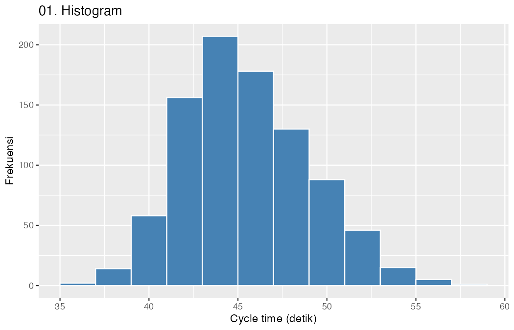


> Ingat: `geom_histogram()` = nama 3.5+. `binwidth` kontrol lebar bin — coba `binwidth = 1` vs `4`.

### 6.2 Density — estimasi kepadatan kontinu (02)

```r
ggplot(inspeksi, aes(x = Defect)) +
  geom_density(fill = "darkorange", alpha = 0.5) +
  labs(title = "02. Density plot", x = "Jumlah defect", y = "Kepadatan")
```

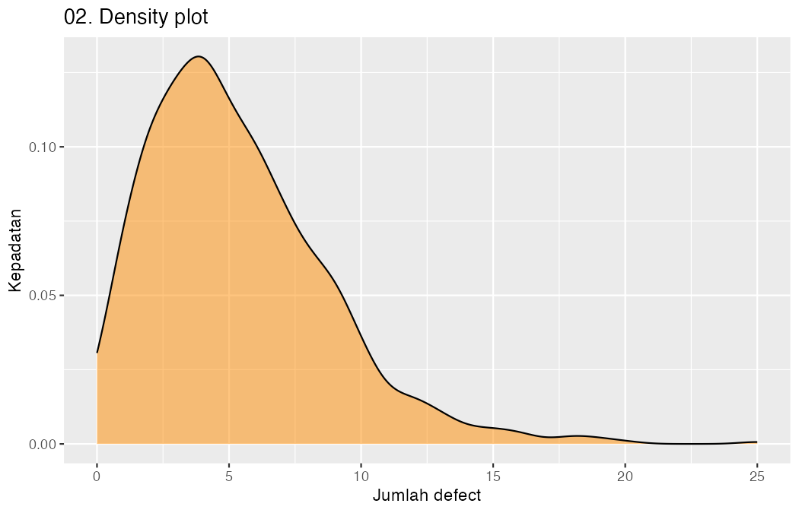


### 6.3 Frequency polygon — perbandingan distribusi antar lini (03)

```r
ggplot(inspeksi, aes(x = Defect, color = Line)) +
  geom_freqpoly(binwidth = 1, linewidth = 1) +
  labs(title = "03. Frequency polygon per lini", x = "Jumlah defect", y = "Frekuensi")
```

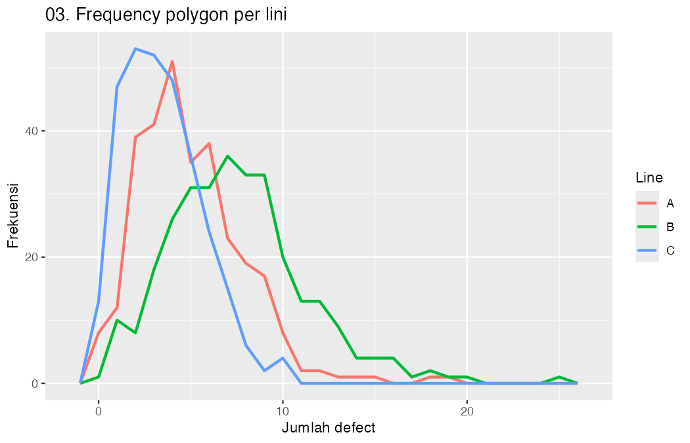


### 6.4 Dotplot — alternatif histogram untuk data kecil (04)

```r
ggplot(inspeksi, aes(x = Defect)) +
  geom_dotplot(binwidth = 1, fill = "seagreen") +
  labs(title = "04. Dotplot", x = "Jumlah defect", y = NULL)
```

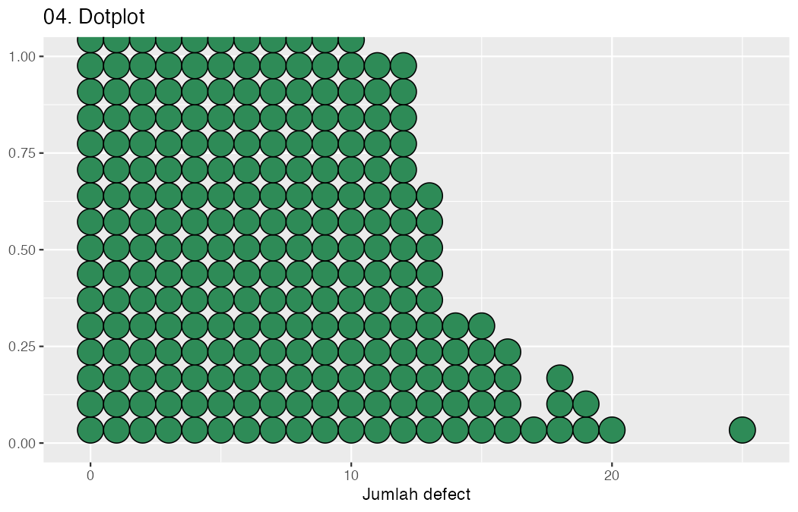


### 6.5 Bar chart — frekuensi kategori diskret (05)

```r
ggplot(inspeksi, aes(x = DefectType)) +
  geom_bar(fill = "darkorange") +
  labs(title = "05. Bar chart (count)", x = "Jenis defect", y = "Jumlah inspeksi")
```

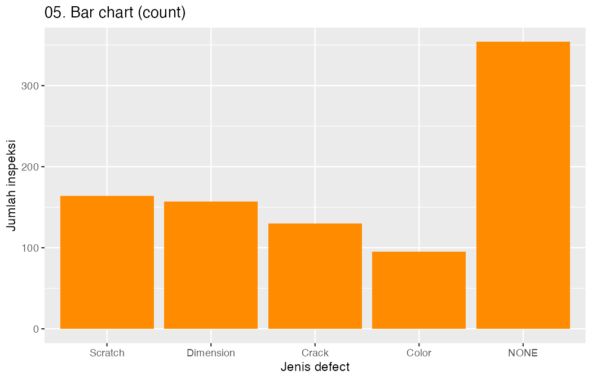


### 6.6 Lollipop — alternatif bar yang ringkas (06)

```r
ggplot(ringkas_tipe, aes(x = DefectType, y = TotalDefect)) +
  geom_segment(aes(xend = DefectType, yend = 0), color = "grey55", linewidth = 1) +
  geom_point(size = 5, color = "steelblue") +
  labs(title = "06. Lollipop chart", x = "Jenis defect", y = "Total defect")
```

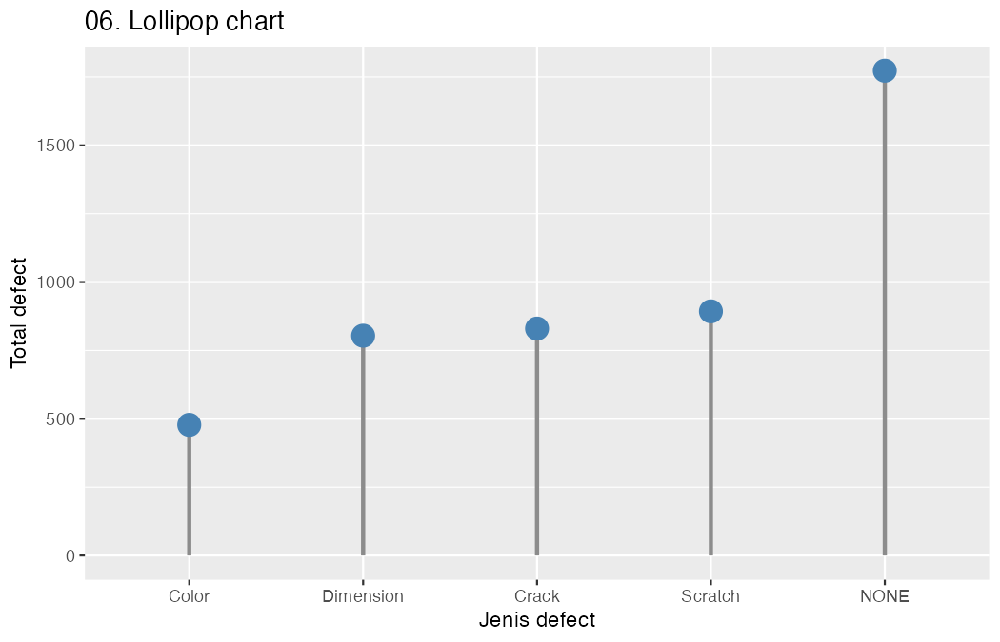


> Lollipop kurangan \"visual weight\" bar + curva label. Butuh data agregat (`ringkas_tipe`).

### 6.7 ECDF — proporsi kumulatif data (07)

```r
ggplot(inspeksi, aes(x = CycleTimeSec)) +
  stat_ecdf(geom = "step", color = "steelblue", linewidth = 1) +
  labs(title = "07. Empirical CDF", x = "Cycle time (detik)", y = "Proporsi kumulatif")
```

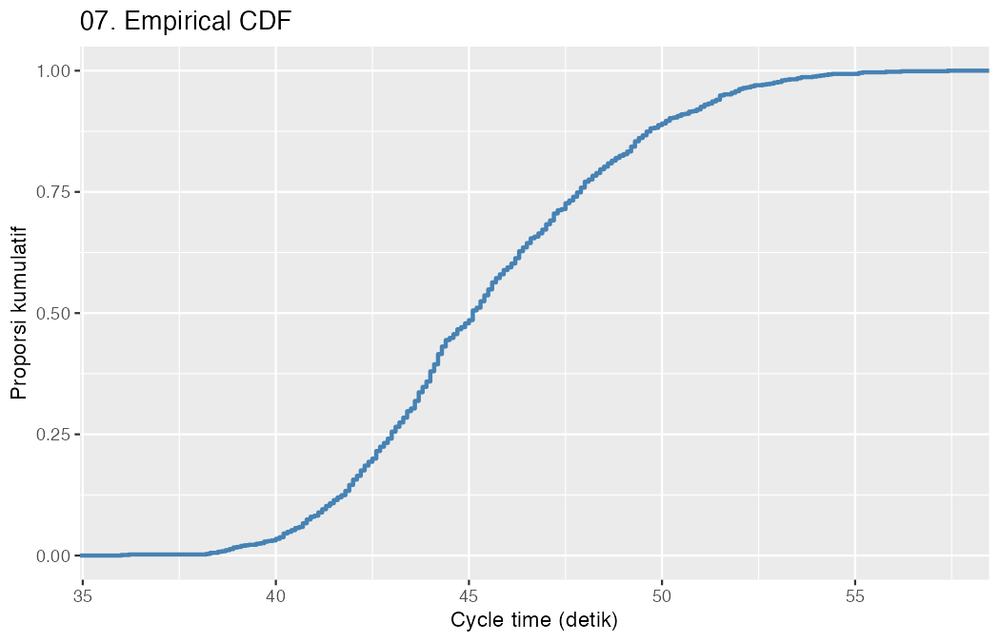


> Bacaan: di x = 48 detik, y ≈ 0.8 = 80% inspeksi bawah 48 detik.

### 6.8 Q-Q plot — cek normalitas (08)

```r
ggplot(inspeksi, aes(sample = Defect)) +
  stat_qq(color = "steelblue") +
  stat_qq_line(color = "darkorange") +
  labs(title = "08. Q-Q plot (normal)", x = "Kuantil teoretis", y = "Kuantil sampel")
```

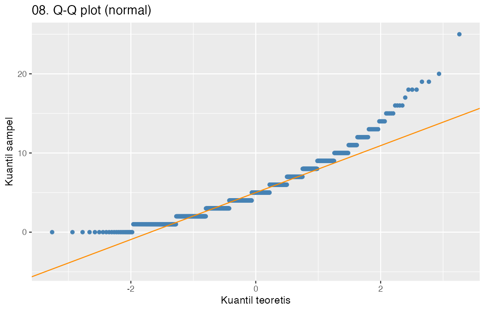


> Titik mengikuti garis diagonal = distribusi ~ normal (presuposisi banyak test statistik di Volume 3, kini di `Archive/`).

### 6.9 Boxplot satu variabel — median & outlier (09)

```r
ggplot(inspeksi, aes(x = "", y = Defect)) +
  geom_boxplot(fill = "lightblue") +
  labs(title = "09. Boxplot (satu variabel)", x = NULL, y = "Jumlah defect")
```

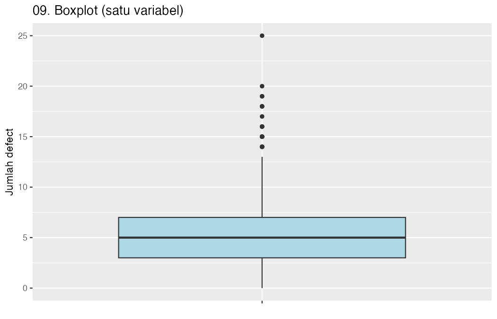


### 6.10 Violin satu variabel — bentuk sebaran (10)

```r
ggplot(inspeksi, aes(x = "", y = CycleTimeSec)) +
  geom_violin(fill = "lightgreen") +
  labs(title = "10. Violin plot (satu variabel)", x = NULL, y = "Cycle time (detik)")
```

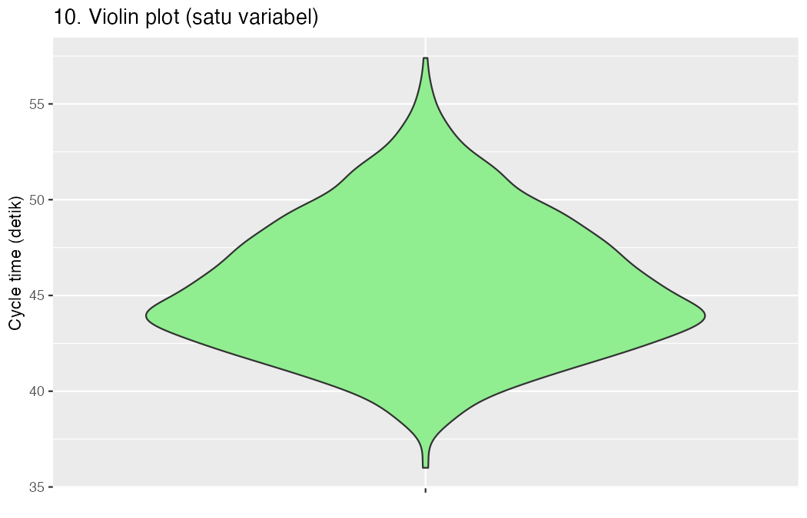


> Boxplot = statistik (median, IQR, outlier); violin = **bentuk penuh** distribusi. Kombinasi keduanya contoh di sample 12.

---

## 7. Grafik Kategori — Diskret vs Kontinu (sample 11–24)

Pertanyaan: **\"sebaran variabel kontinu per kategori\"** / **\"komposisi kategori\"**. Output: `output/V11_*.png` … `output/V24_*.png`.

### 7.1 Boxplot per lini — median, IQR, outlier per grup (11)

```r
ggplot(inspeksi, aes(x = Line, y = CycleTimeSec, fill = Line)) +
  geom_boxplot() +
  labs(title = "11. Boxplot per lini", x = "Lini", y = "Cycle time (detik)")
```

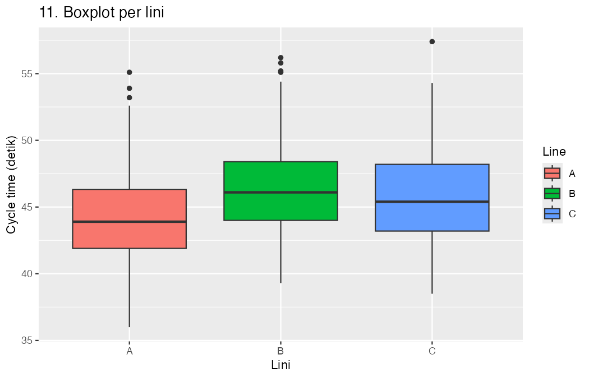


> Bacaan sample data: Line B median lebih tinggi (pola planted: Line B +2 detik). Kotak lebih tinggi = variasi/posisi lebih besar.

### 7.2 Violin + boxplot — bentuk sebaran + statistik (12)

```r
ggplot(inspeksi, aes(x = Line, y = CycleTimeSec, fill = Line)) +
  geom_violin() +
  geom_boxplot(width = 0.15, fill = "white") +
  labs(title = "12. Violin + boxplot per lini", x = "Lini", y = "Cycle time (detik)")
```

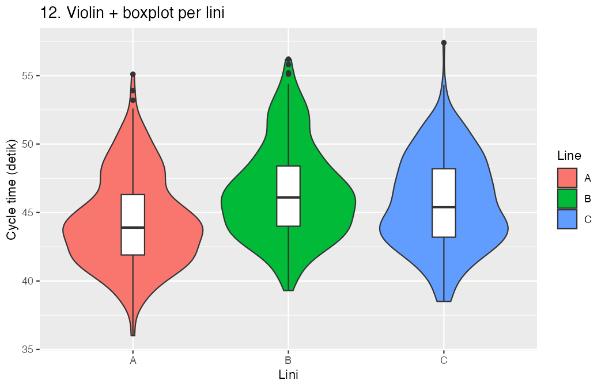


### 7.3 Col chart — bar dari nilai yang diagregat dulu (13)

```r
ggplot(ringkas_tipe, aes(x = DefectType, y = TotalDefect)) +
  geom_col(fill = "steelblue") +
  labs(title = "13. Col chart (nilai agregat)", x = "Jenis defect", y = "Total defect")
```

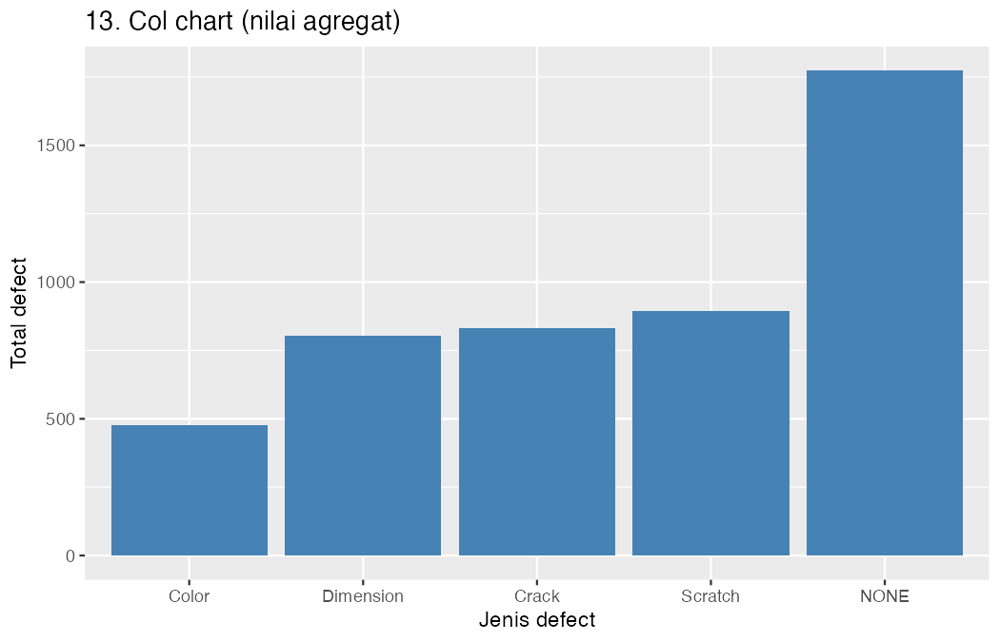


### 7.4 Bar horizontal — `coord_flip()` untuk nama panjang (14)

```r
ggplot(ringkas_tipe, aes(x = DefectType, y = TotalDefect)) +
  geom_col(fill = "tomato") +
  coord_flip() +
  labs(title = "14. Col horizontal (coord_flip)", x = NULL, y = "Total defect")
```

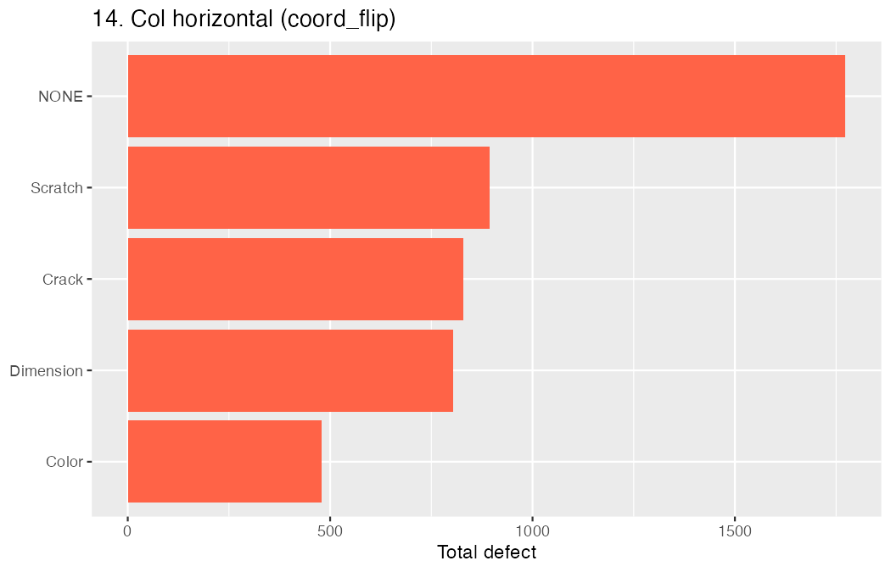


> `coord_flip()` preta x↔y. Untuk kategori banyak/teks panjang, horizontal hampir selalu lebih mudah dibaca.

### 7.5 Dodge — bar per kategori sisalan (15)

```r
ggplot(per_line_tipe, aes(x = Line, y = TotalDefect, fill = DefectType)) +
  geom_col(position = "dodge") +
  labs(title = "15. Col dodge", x = "Lini", y = "Total defect", fill = "Jenis")
```

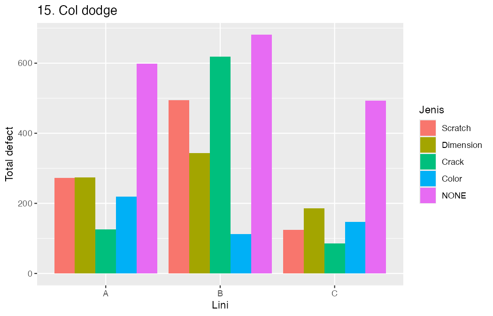


### 7.6 Stack — bar tumpuk (komposisi total) (16)

```r
ggplot(per_line_tipe, aes(x = Line, y = TotalDefect, fill = DefectType)) +
  geom_col(position = "stack") +
  labs(title = "16. Col stack", x = "Lini", y = "Total defect", fill = "Jenis")
```

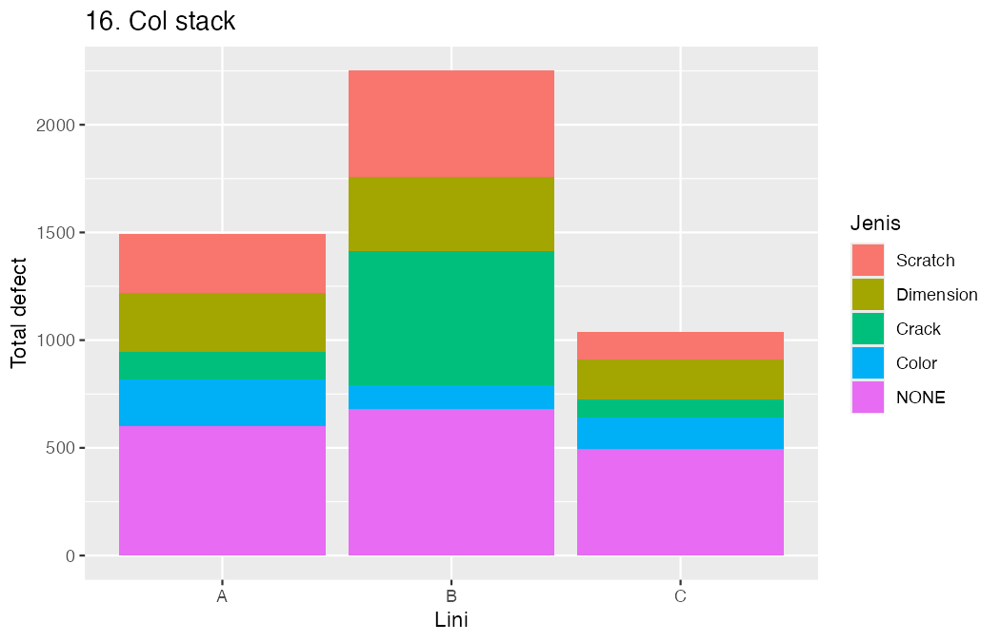


### 7.7 Fill — bar 100% (proporsi per kategori) (17)

```r
ggplot(per_line_tipe, aes(x = Line, y = TotalDefect, fill = DefectType)) +
  geom_col(position = "fill") +
  scale_y_continuous(labels = percent) +
  labs(title = "17. Col fill (100%)", x = "Lini", y = "Proporsi", fill = "Jenis")
```

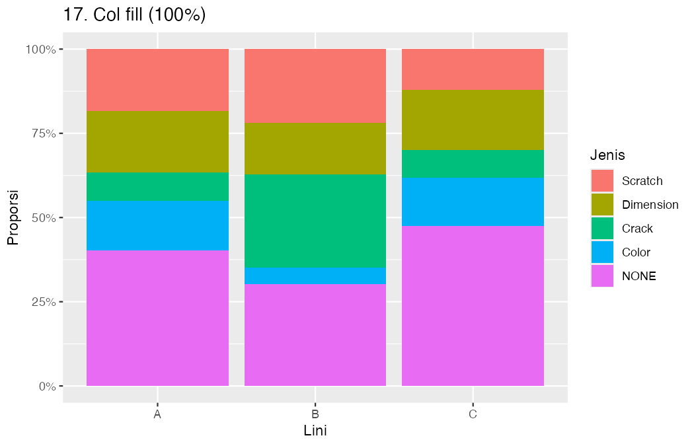


> Stack = perbanding total (Line B terbesar); Fill = perbanding **proporsi** (Line B proporsi Scratch & Crack lebih besar — insight yang dianam di generator data).

### 7.8 Errorbar — rata-rata ± SD (18)

```r
ggplot(ringkas_ct, aes(x = Line, y = rata)) +
  geom_col(fill = "steelblue", alpha = 0.6) +
  geom_errorbar(aes(ymin = rata - sd, ymax = rata + sd), width = 0.3) +
  labs(title = "18. Col + errorbar (SD)", x = "Lini", y = "Rata-rata cycle time")
```

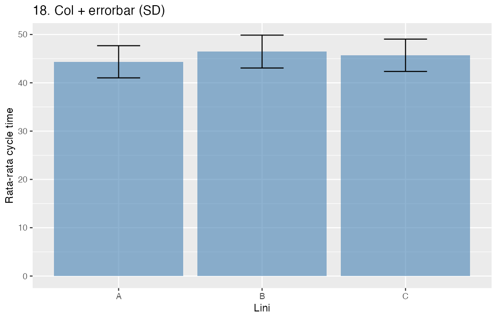


### 7.9 Pointrange — titik rata-rata + rentang min-maks (19)

```r
ggplot(ringkas_ct, aes(x = Line, y = rata)) +
  geom_pointrange(aes(ymin = minim, ymax = maks), color = "seagreen", size = 1.2) +
  labs(title = "19. Pointrange (min-maks)", x = "Lini", y = "Rata-rata cycle time")
```

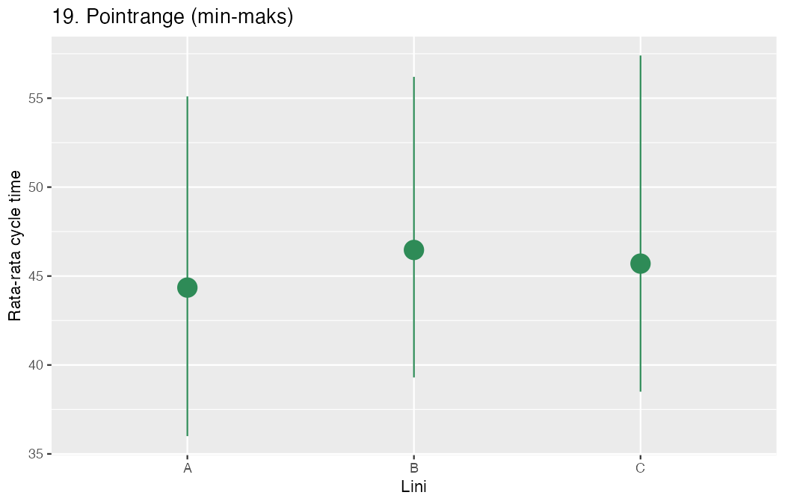


### 7.10 Crossbar — kotak rata-rata ± SD (20)

```r
ggplot(ringkas_ct, aes(x = Line, y = rata, ymin = rata - sd, ymax = rata + sd)) +
  geom_crossbar(fill = "lightblue") +
  labs(title = "20. Crossbar (rata ± SD)", x = "Lini", y = "Cycle time")
```

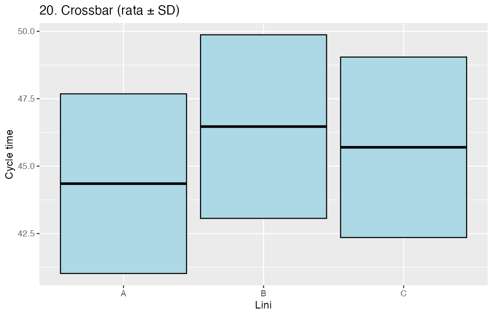


### 7.11 Linerange — garis rentang tanpa dekorasi (21)

```r
ggplot(ringkas_ct, aes(x = Line, y = rata, ymin = minim, ymax = maks)) +
  geom_linerange(color = "steelblue", linewidth = 2) +
  geom_point(size = 3, color = "tomato") +
  labs(title = "21. Linerange (min-maks) + titik", x = "Lini", y = "Cycle time")
```

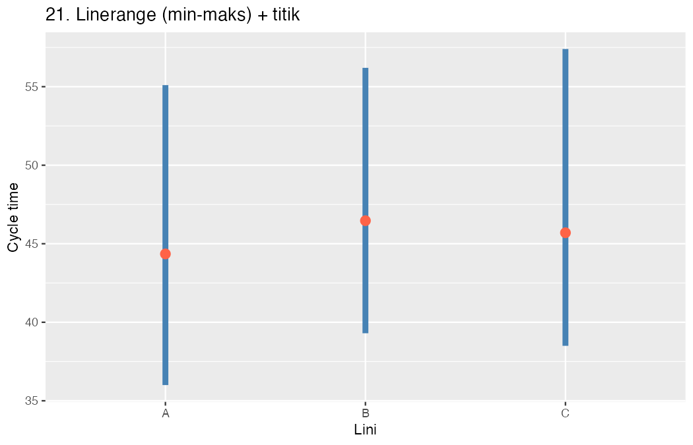


### 7.12 stat_summary — agregasi otomatis per kategori (22)

```r
ggplot(inspeksi, aes(x = Line, y = CycleTimeSec)) +
  geom_jitter(width = 0.2, alpha = 0.3, color = "grey40") +
  stat_summary(fun = mean,
               fun.min = function(x) mean(x) - sd(x),
               fun.max = function(x) mean(x) + sd(x),
               geom = "linerange", color = "tomato", linewidth = 1.2) +
  labs(title = "22. stat_summary (rata-rata ± SD)", x = "Lini", y = "Cycle time (detik)")
```

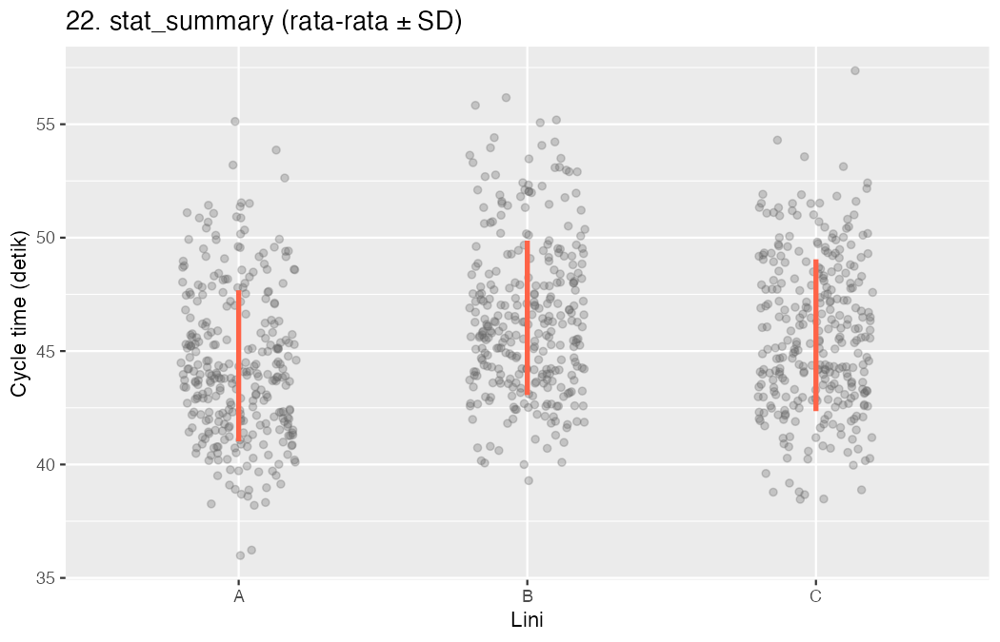


> `stat_summary` = hitung statistik **di dalam grafik**, otomatis per grup — alternatif agregasi dplyr dulu (Bab 5).

### 7.13 Boxplot + jitter — titik asli atas kotak (23)

```r
ggplot(inspeksi, aes(x = Line, y = CycleTimeSec, fill = Line)) +
  geom_boxplot(outlier.shape = NA) +
  geom_jitter(width = 0.2, alpha = 0.4) +
  labs(title = "23. Boxplot + jitter", x = "Lini", y = "Cycle time (detik)")
```

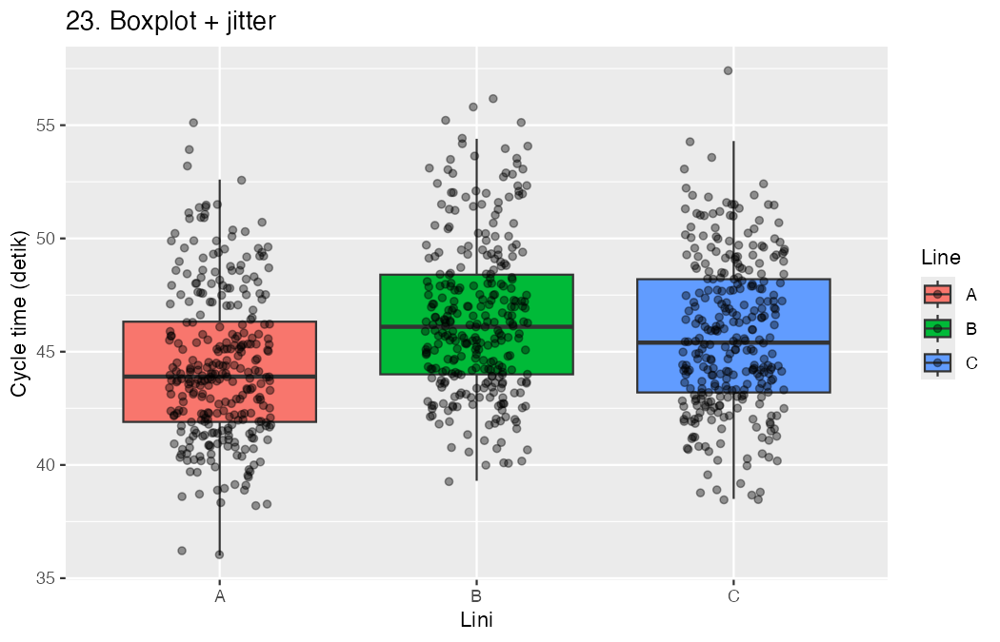


> Jitter menambahkan noise kecil horizontal agar titik tidak tumpang-tindih — kombinasi favorit untuk report.

### 7.14 Heatmap — intensitas relasi dua kategori (24)

```r
ggplot(per_line_tipe, aes(x = Line, y = DefectType, fill = TotalDefect)) +
  geom_tile(color = "white") +
  scale_fill_viridis_c(option = "plasma", name = "Total defect") +
  labs(title = "24. Heatmap (geom_tile)", x = "Lini", y = "Jenis defect")
```

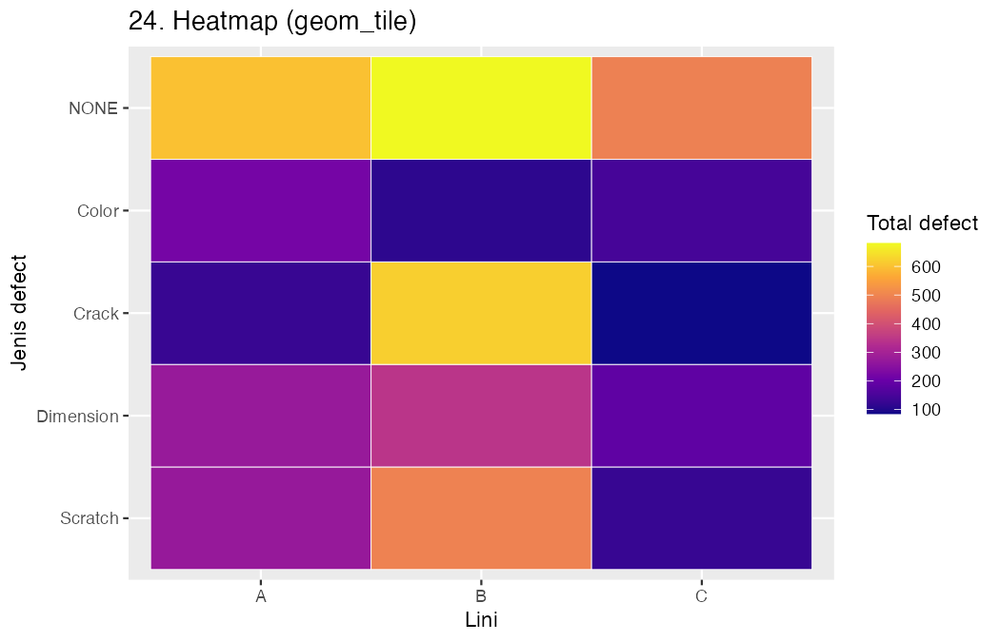


> Heatmap = \"tabla pinta\": dua kategori → satu warna. Variasi dengan tanggal/defect rate di sample 59–60.

---

## 8. Grafik Hubungan & Tren — Kontinu vs Kontinu / Waktu (sample 25–45)

Pertanyaan: **\"apa hubungan dua variabel kontinu?\"** / **\"apa pola dari waktu ke waktu?\"**. Output: `output/V25_*.png` … `output/V45_*.png`.

### 8.1 Scatter — hubungan dua variabel numerik (25)

```r
ggplot(inspeksi, aes(x = Inspected, y = Defect, color = Line)) +
  geom_point(size = 3, alpha = 0.6) +
  labs(title = "25. Scatter plot", x = "Unit diinspeksi", y = "Jumlah defect",
       color = "Lini")
```

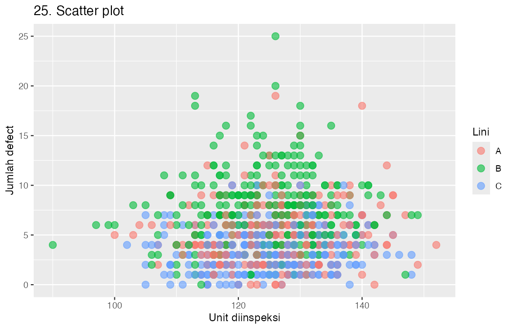


### 8.2 Smooth lm — garis regresi linear + band kepercayaan (26)

```r
ggplot(inspeksi, aes(x = Inspected, y = Defect)) +
  geom_point(alpha = 0.4) +
  geom_smooth(method = "lm", fill = "lightblue") +
  labs(title = "26. Scatter + smooth (lm)", x = "Unit diinspeksi", y = "Jumlah defect")
```

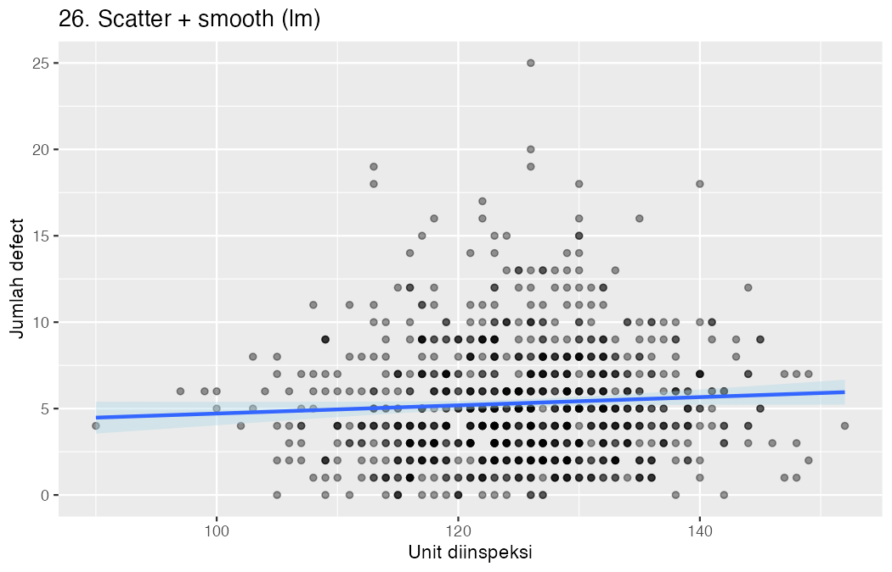


> `geom_smooth(method = "lm")` = `lm(y ~ x)` + band kepercayaan (se = TRUE default). Cek residu di Volume 3 (kini di `Archive/`).

### 8.3 Perbandingan lm vs loess (27)

```r
ggplot(inspeksi, aes(x = Inspected, y = Defect)) +
  geom_point(alpha = 0.5) +
  geom_smooth(aes(color = "Linear"), method = "lm",    se = FALSE) +
  geom_smooth(aes(color = "Loess"),  method = "loess", se = FALSE) +
  scale_color_manual(name = "Model",
                     values = c(Linear = "tomato", Loess = "seagreen")) +
  labs(title = "27. Perbandingan lm vs loess",
       x = "Unit diinspeksi", y = "Jumlah defect")
```

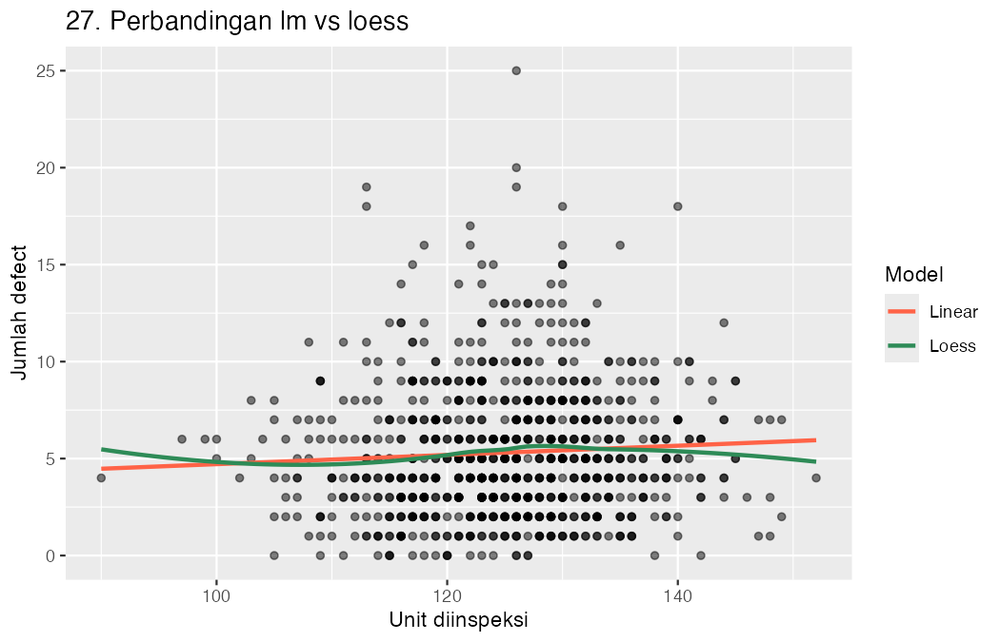


> `loess` = regresi non-linear lokal, lebih fleksibel bila hubungan tidak linear. `aes(color = "Linear")` dalam geom = constante mapping.

### 8.4 Bubble chart — ukuran titik proporsional nilai (28)

```r
ggplot(inspeksi, aes(x = Inspected, y = CycleTimeSec, size = Defect)) +
  geom_point(color = "steelblue", alpha = 0.6) +
  scale_size_area(max_size = 10) +
  labs(title = "28. Bubble chart", x = "Unit diinspeksi",
       y = "Cycle time (detik)", size = "Defect")
```

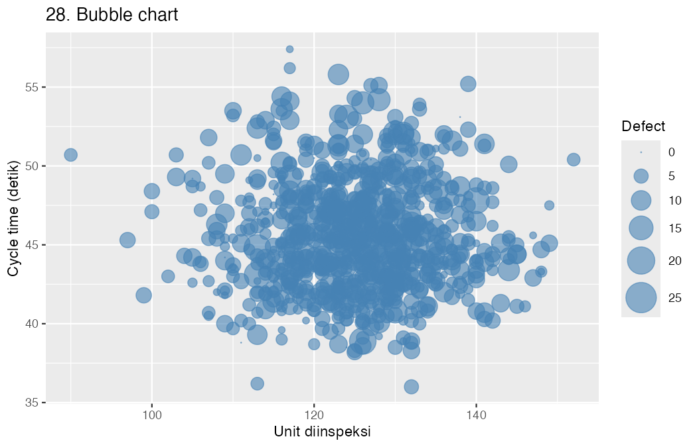


> `scale_size_area()` = ukuran proporsional **area** (jujur perbandingan), bukan radius.

### 8.5 Multi-aesthetics — warna + bentuk + transparansi (29)

```r
ggplot(inspeksi,
       aes(x = Inspected, y = Defect, color = Line,
           shape = Product, alpha = CycleTimeSec)) +
  geom_point(size = 3) +
  scale_alpha(range = c(0.3, 1)) +
  labs(title = "29. Multi-aesthetics (color, shape, alpha)",
       x = "Unit diinspeksi", y = "Jumlah defect")
```

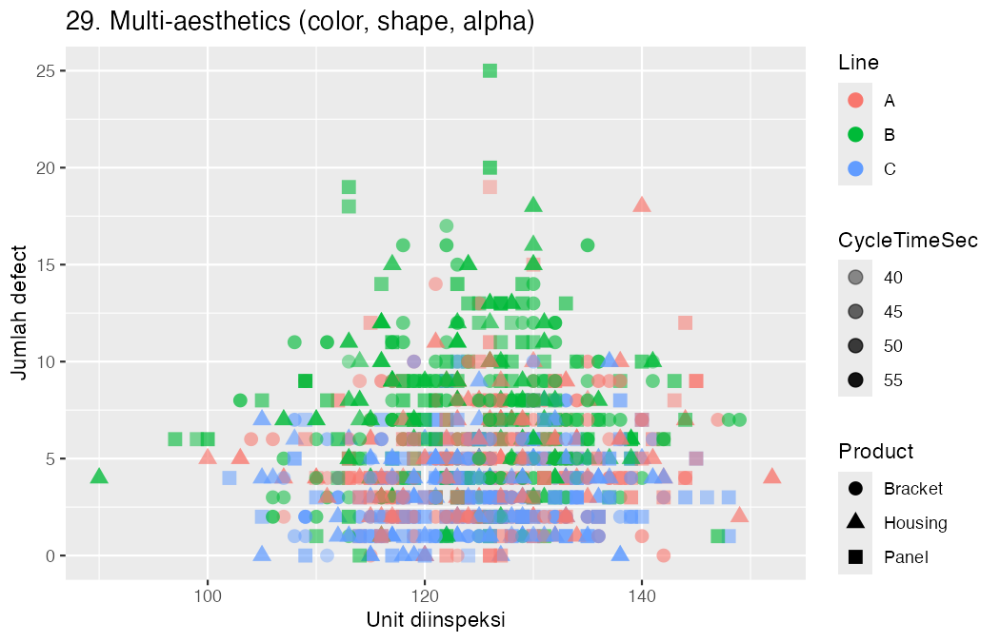


> Prinsip: **variabel tudi → satu aesthetic**. Maks 3-4 dimensi agar tidak menvergaren legend.

### 8.6 geom_count — ukuran otomatis dari titik bertumpuk (30)

```r
ggplot(inspeksi, aes(x = Inspected, y = CycleTimeSec)) +
  geom_count(color = "steelblue") +
  scale_size_area() +
  labs(title = "30. geom_count (frekuensi = ukuran)",
       x = "Unit diinspeksi", y = "Cycle time (detik)")
```

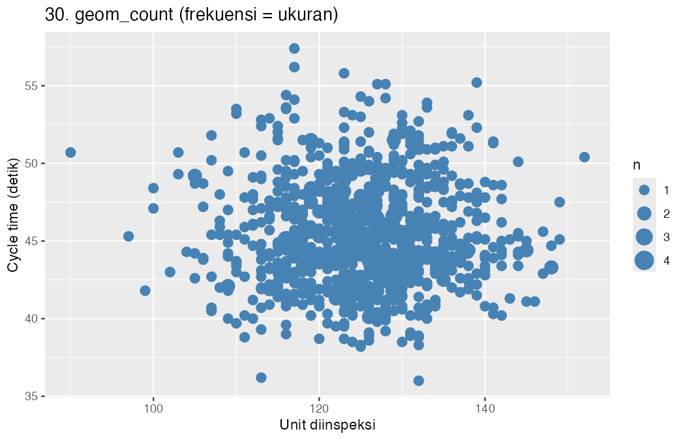


### 8.7 Rug — strip sebaran di pinggir sumbu (31)

```r
ggplot(inspeksi, aes(x = Inspected, y = Defect)) +
  geom_point(alpha = 0.5) +
  geom_rug(color = "darkorange") +
  labs(title = "31. Scatter + rug", x = "Unit diinspeksi", y = "Jumlah defect")
```

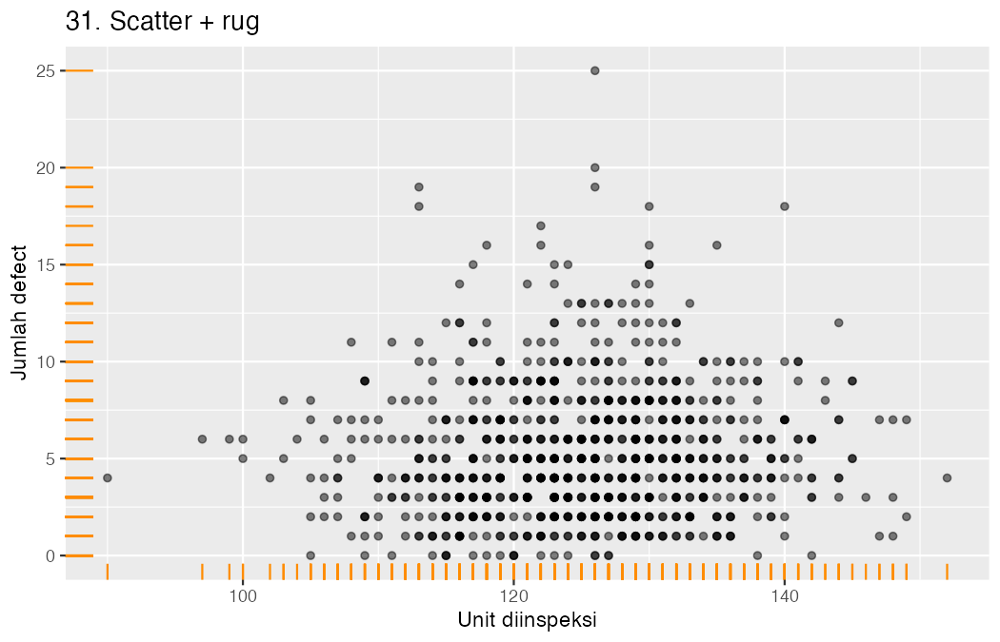


### 8.8 geom_text — label titik tertentu (32)

```r
ggplot(filter(inspeksi, Defect >= 10), aes(x = Inspected, y = Defect)) +
  geom_point(color = "steelblue", size = 3) +
  geom_text(aes(label = paste0("Lini ", Line, " - ", format(InspectionDate, "%d %b"))),
            vjust = -0.9, size = 3, check_overlap = TRUE) +
  labs(title = "32. geom_text pada titik",
       x = "Unit diinspeksi", y = "Jumlah defect")
```

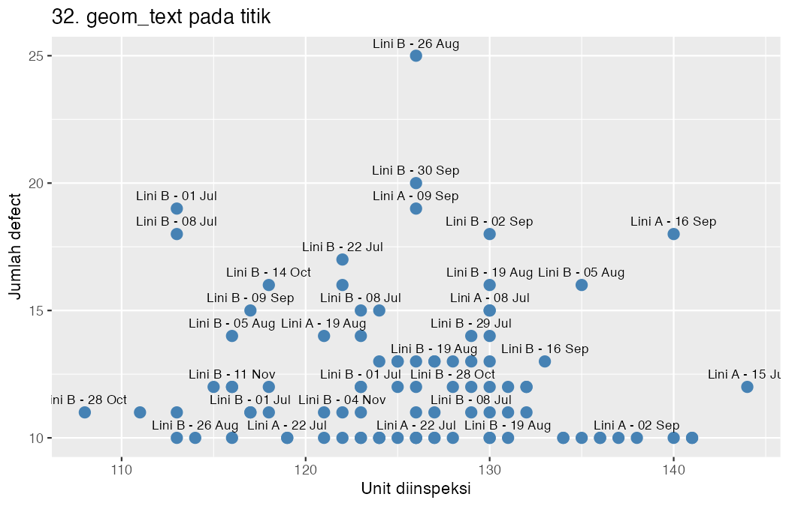


> Bila label banyak tumpang-tindih: `ggrepel::geom_text_repel()` (package tambahan).

### 8.9 Bin 2D — data padat dibagi kotak frekuensi (33)

```r
ggplot(awan, aes(x = x, y = y)) +
  geom_bin2d(bins = 25) +
  scale_fill_viridis_c() +
  labs(title = "33. geom_bin2d", x = NULL, y = NULL)
```

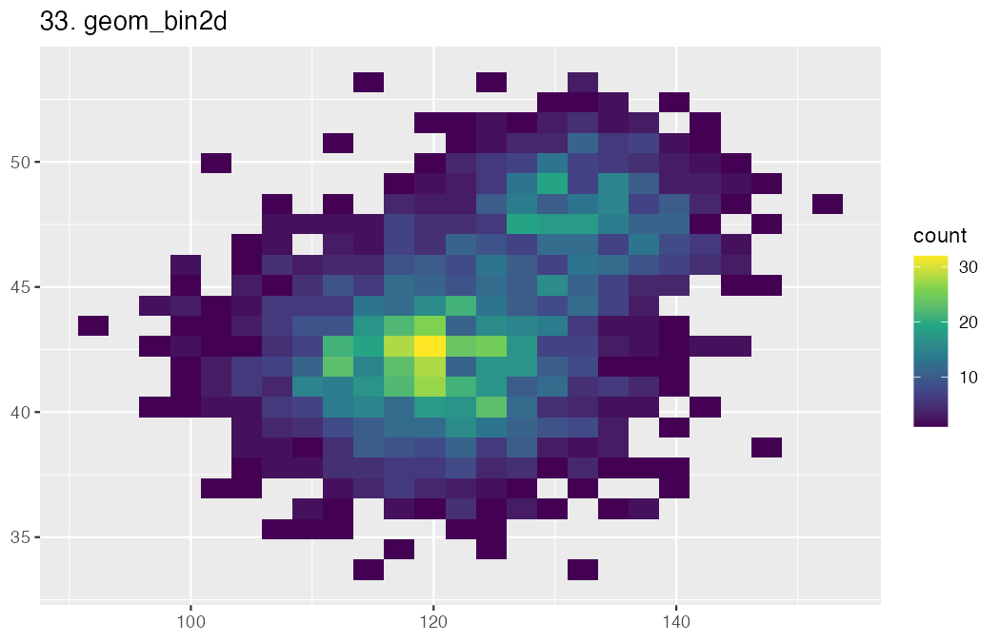


### 8.10 Density 2D — kontur kepadatan (34)

```r
ggplot(awan, aes(x = x, y = y)) +
  geom_point(alpha = 0.2, color = "grey40") +
  geom_density_2d(color = "darkorange") +
  labs(title = "34. geom_density_2d", x = NULL, y = NULL)
```

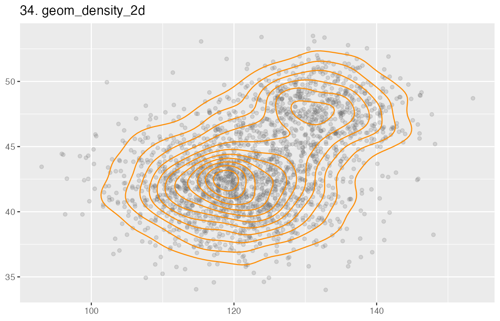


### 8.11 Density 2D filled (35)

```r
ggplot(awan, aes(x = x, y = y)) +
  stat_density_2d_filled(aes(fill = after_stat(level)), geom = "polygon") +
  scale_fill_viridis_d(option = "inferno") +
  labs(title = "35. stat_density_2d_filled", x = NULL, y = NULL)
```

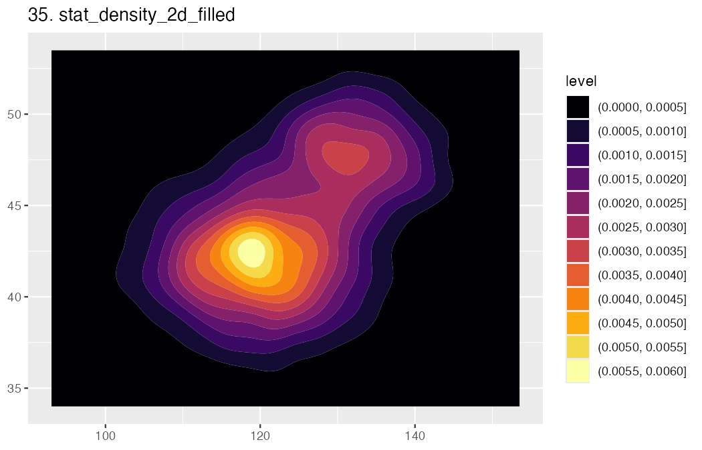

> Objek `awan` = awan titik sintetis (di `R/01_visualisasi_ggplot2.R` bagian 0.4) special untuk contoh kontur/bin2d.

### 8.12 Hex binning (36) — *opsional* package `hexbin`

```r
if (requireNamespace("hexbin", quietly = TRUE)) {
  ggplot(awan, aes(x = x, y = y)) +
    geom_hex(bins = 25) +
    scale_fill_viridis_c() +
    labs(title = "36. geom_hex", x = NULL, y = NULL)
}
```

### 8.13 Quantile regression (37) — *opsional* package `quantreg`

```r
if (requireNamespace("quantreg", quietly = TRUE)) {
  ggplot(inspeksi, aes(x = Inspected, y = Defect)) +
    geom_point(alpha = 0.5) +
    geom_quantile(quantiles = c(0.1, 0.5, 0.9),
                  color = "darkorange", linewidth = 1) +
    labs(title = "37. geom_quantile (kuantil 10/50/90%)",
         x = "Unit diinspeksi", y = "Jumlah defect")
}
```

> Sample 36-37 dihitung otomatis dilewati bila package belum terpasang — install sekali: `install.packages(c("hexbin", "quantreg"))`.

### 8.14 Line chart multi-lini — tren defect rate per lini (38)

```r
ggplot(ringkas_line, aes(x = Bulan, y = DefectRate, color = Line)) +
  geom_line(linewidth = 1) +
  geom_point(size = 2.5) +
  scale_y_continuous(labels = percent) +
  scale_x_date(date_labels = "%b %Y", date_breaks = "1 month") +
  labs(title = "38. Line chart per lini", x = "Bulan",
       y = "Defect rate", color = "Lini") +
  theme(axis.text.x = element_text(angle = 45, hjust = 1))
```

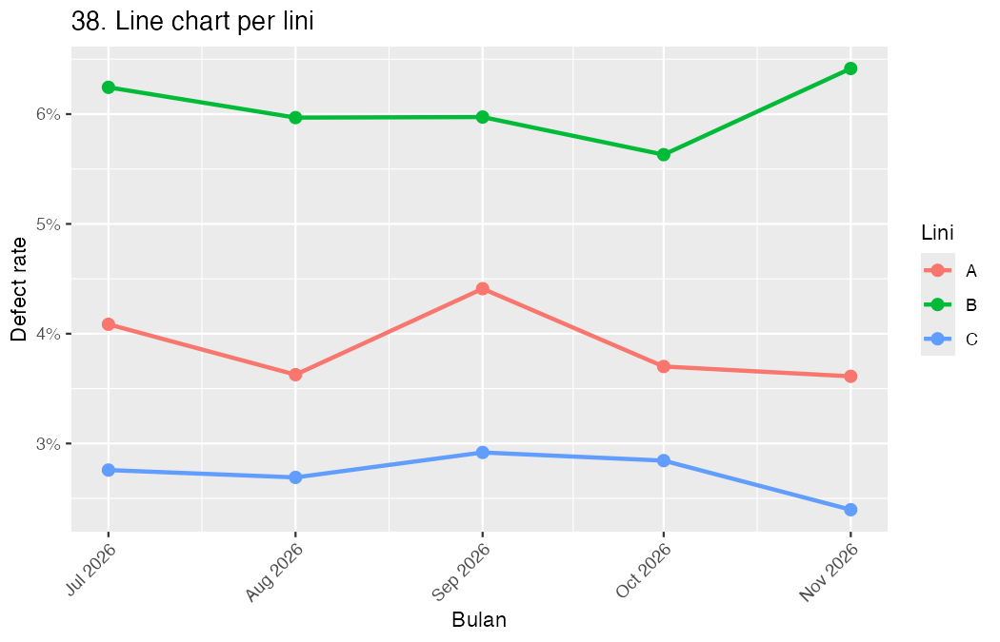


> `scale_x_date(date_labels, date_breaks)` = format label tanggal. `Bulan` di `ringkas_line` via `lubridate::floor_date(..., "month")` (Bab 5).

### 8.15 Line chart + linetype mapping (39)

```r
ggplot(ringkas_line, aes(x = Bulan, y = RataCT, color = Line, linetype = Line)) +
  geom_line(linewidth = 1) +
  scale_x_date(date_labels = "%b", date_breaks = "1 month") +
  labs(title = "39. Line chart (linetype per lini)", x = "Bulan",
       y = "Rata-rata cycle time (detik)")
```

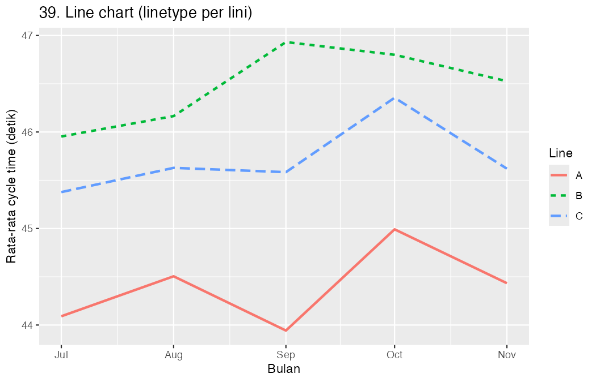


> Linetype berguna untuk colorblind / print hitam-biru.

### 8.16 Area chart — total defect per bulan (40)

```r
ggplot(per_bulan, aes(x = Bulan, y = TotalDefect)) +
  geom_area(fill = "steelblue", alpha = 0.6) +
  scale_x_date(date_labels = "%b %Y", date_breaks = "1 month") +
  labs(title = "40. Area chart", x = "Bulan", y = "Total defect") +
  theme(axis.text.x = element_text(angle = 45, hjust = 1))
```

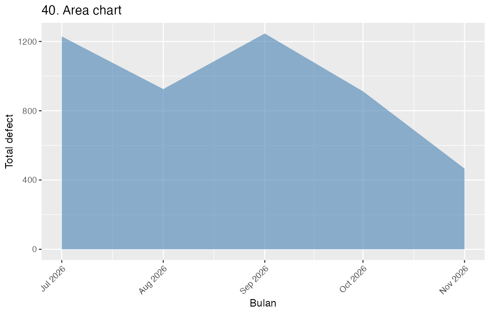


### 8.17 Ribbon — band min-maks antar lini (41)

```r
ggplot(per_bulan, aes(x = Bulan, y = DefectRate)) +
  geom_ribbon(aes(ymin = DR_min, ymax = DR_maks),
              fill = "steelblue", alpha = 0.25) +
  geom_line(color = "steelblue", linewidth = 1) +
  scale_y_continuous(labels = percent) +
  scale_x_date(date_labels = "%b", date_breaks = "1 month") +
  labs(title = "41. Ribbon (rentang min-maks antar lini)",
       x = "Bulan", y = "Defect rate")
```

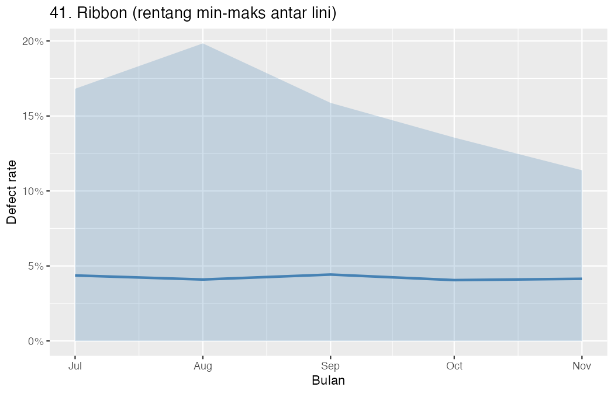


> Ribbon = band kepercayaan/rentang antar grup. `DR_min`/`DR_maks` di `per_bulan` (Bab 5).

### 8.18 Step chart — defect kumulatif (42)

```r
ggplot(kumulatif, aes(x = InspectionDate, y = Kumulatif)) +
  geom_step(color = "seagreen", linewidth = 1, direction = "hv") +
  geom_point(size = 2, color = "seagreen") +
  scale_x_date(date_labels = "%d %b", date_breaks = "2 week") +
  labs(title = "42. Step chart (defect kumulatif)",
       x = "Tanggal inspeksi", y = "Defect kumulatif") +
  theme(axis.text.x = element_text(angle = 45, hjust = 1))
```

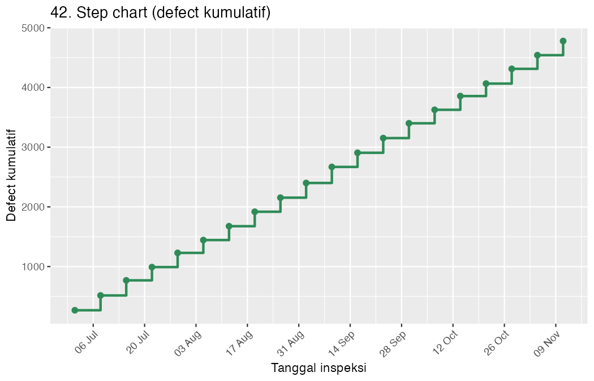


### 8.19 Path — lintasan mengikuti urutan data (43)

```r
ggplot(walk, aes(x = langkah, y = posisi, color = langkah)) +
  geom_path(linewidth = 1) +
  scale_color_viridis_c(option = "plasma") +
  labs(title = "43. geom_path (urutan = warna)",
       x = "Langkah", y = "Posisi", color = "Langkah")
```

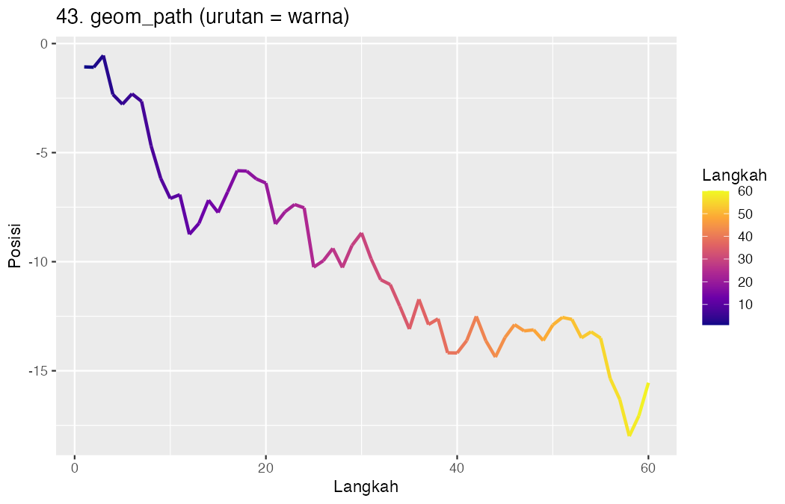


> `geom_path` seperti line chart tapi *mengikuti urutan baris data* — contoh: lintasan material, random walk, pergerakan harga.

### 8.20 Garis referensi + annotasi — target & zona (44)

```r
rata_ct <- mean(inspeksi$CycleTimeSec)
ggplot(inspeksi, aes(x = InspectionDate, y = CycleTimeSec)) +
  geom_line(aes(group = Line), color = "grey60") +
  geom_point(aes(color = Line), size = 2.5) +
  geom_hline(yintercept = rata_ct, linetype = "dashed", color = "tomato") +
  annotate("text", x = min(inspeksi$InspectionDate), y = rata_ct + 0.45,
           label = paste0("Rata-rata: ", round(rata_ct, 1), " dtk"),
           hjust = 0, color = "tomato", size = 3.3) +
  annotate("rect", xmin = as.Date("2026-08-01"),
           xmax = max(inspeksi$InspectionDate),
           ymin = -Inf, ymax = Inf, alpha = 0.08) +
  scale_x_date(date_labels = "%d %b", date_breaks = "2 week") +
  labs(title = "44. geom_hline + annotate", x = "Tanggal",
       y = "Cycle time (detik)", color = "Lini") +
  theme(axis.text.x = element_text(angle = 45, hjust = 1))
```

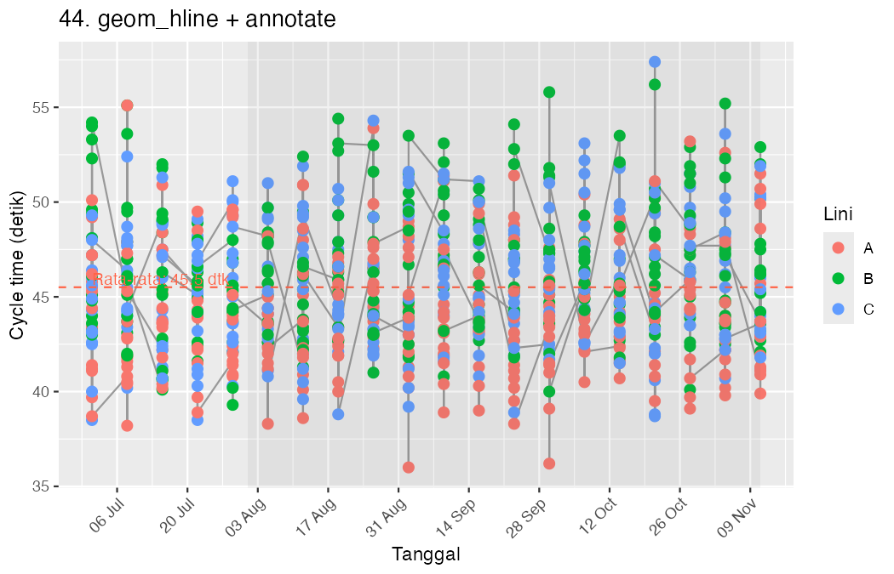


> `geom_hline()` = garis target/referensi; `annotate("rect")` = zona lowsli (ingat kode Volume 0 Bab 8.8 prinsip #6: ambang jelas).

### 8.21 Segment + panah — pergerakan antar periode (45)

```r
tren_ct <- ringkas_line |>
  group_by(Line) |>
  mutate(Bulan_lalu = lag(Bulan), CT_lalu = lag(RataCT)) |>
  ungroup() |>
  filter(!is.na(CT_lalu))

ggplot(tren_ct, aes(x = Bulan_lalu, y = CT_lalu, xend = Bulan, yend = RataCT)) +
  geom_segment(aes(color = Line), linewidth = 1,
               arrow = arrow(length = unit(0.25, "cm"), type = "closed")) +
  labs(title = "45. Segment + panah (pergerakan antar bulan)",
       x = "Bulan", y = "Cycle time (detik)", color = "Lini")
```

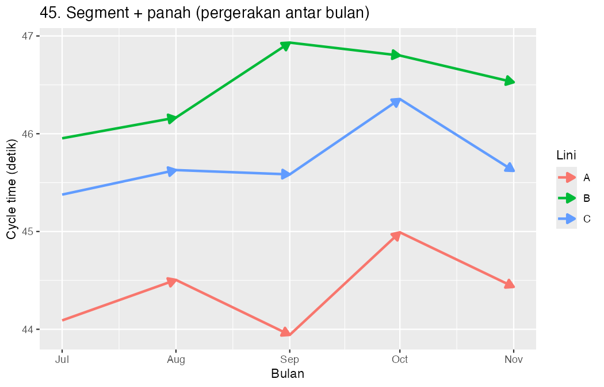


> `lag()` (dplyr) mengambil nilai periode selasa — pergerakan bulan → bulan per lini. `arrow()` di ggplot2 4.0 butuh `unit()` (grid).

---

## 9. Koordinat Khusus (sample 46–52)

Pertanyaan: **\"apa cara representasi non-Cartesian?\"** Output: `output/V46_*.png` … `output/V52_*.png`.

### 9.1 Pie chart — komposisi kategori (46)

```r
ggplot(ringkas_tipe, aes(x = "", y = TotalDefect, fill = DefectType)) +
  geom_col(width = 1, color = "white") +
  coord_polar(theta = "y") +
  scale_fill_brewer(palette = "Set2") +
  labs(title = "46. Pie chart", x = NULL, y = NULL, fill = "Jenis defect")
```

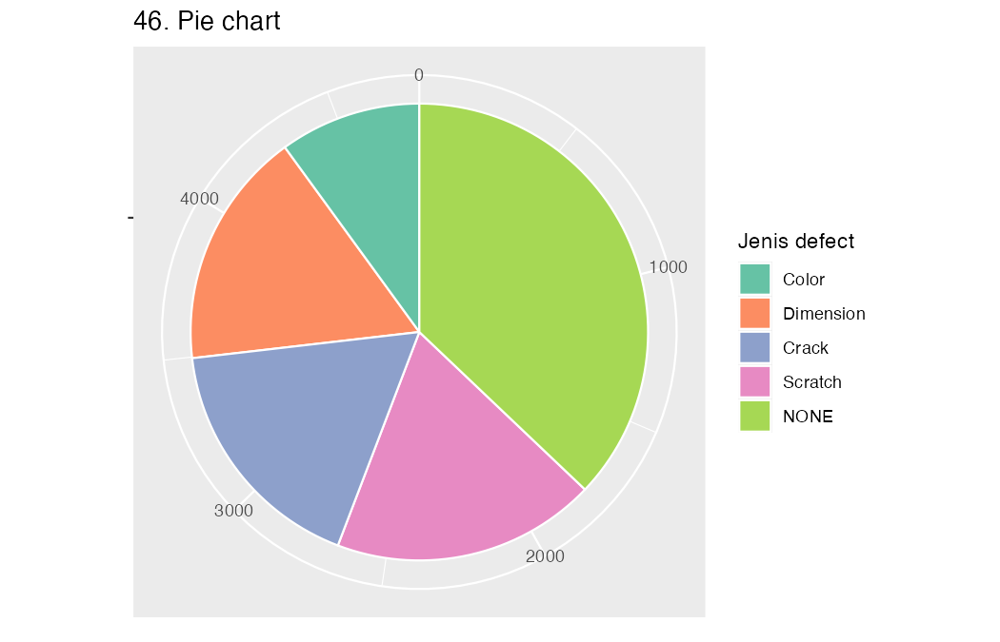


> Pie = coord_polar + stack bar. **Catatan**: pie ambaa untuk perbandingan kecil (kira ~5 kategori max); bar chart lebih jujur per bandingan angle.

### 9.2 Donut — pie dengan lubang tengah (47)

```r
ggplot(ringkas_tipe, aes(x = 2, y = TotalDefect, fill = DefectType)) +
  geom_col(width = 1, color = "white") +
  coord_polar(theta = "y") +
  xlim(0.5, 2.5) +
  scale_fill_brewer(palette = "Set2") +
  labs(title = "47. Donut chart", x = NULL, y = NULL, fill = "Jenis defect")
```

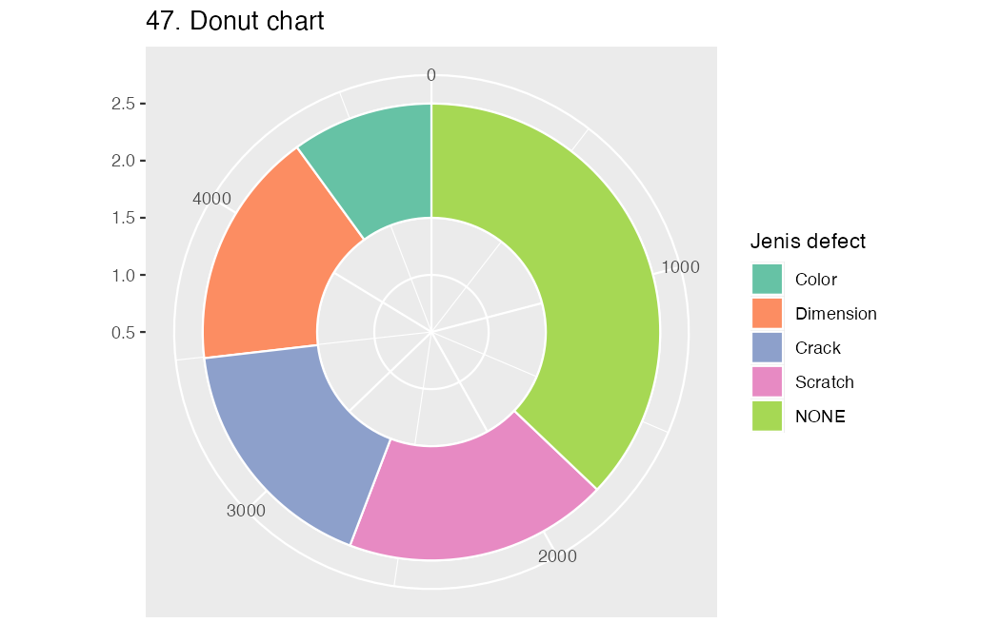


> Lebar sumbu tengah bisa label total atau proporsi — razón banyak dashboard modren prefer donut.

### 9.3 Rose (coxcomb) — bar radian per kategori (48)

```r
ggplot(per_line_tipe, aes(x = DefectType, y = TotalDefect, fill = Line)) +
  geom_col(width = 1) +
  coord_polar() +
  scale_fill_brewer(palette = "Dark2") +
  labs(title = "48. Rose chart (coxcomb)", x = NULL, y = NULL, fill = "Lini")
```

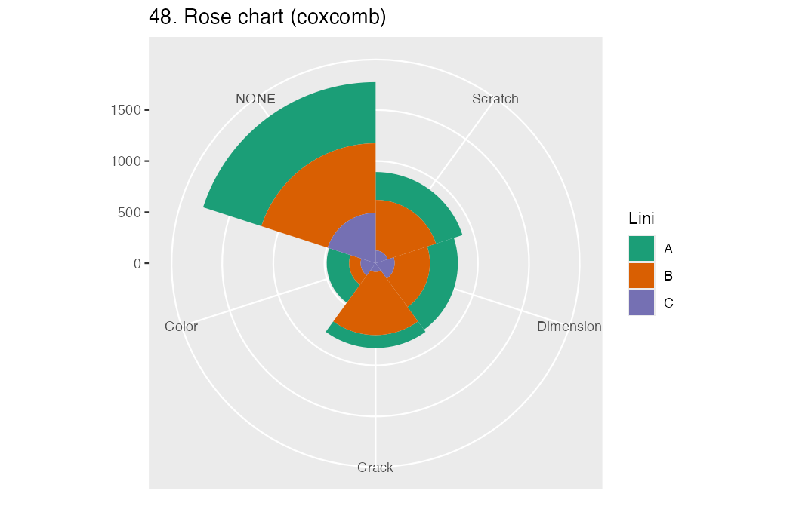


### 9.4 Radar — profil multi-kriteria (49)

```r
profil <- data.frame(
  Kriteria = factor(c("Kualitas", "Kecepatan", "Biaya", "Keandalan", "Fleksibilitas"),
                    levels = c("Kualitas", "Kecepatan", "Biaya", "Keandalan", "Fleksibilitas")),
  Skor     = c(85, 70, 60, 90, 75)
)

ggplot(profil, aes(x = Kriteria, y = Skor, group = 1)) +
  geom_path(linewidth = 1.2, color = "tomato") +
  geom_point(size = 3, color = "tomato") +
  coord_polar(direction = 1) +
  ylim(0, 100) +
  labs(title = "49. Radar chart (profil)", x = NULL, y = "Skor (0-100)")
```

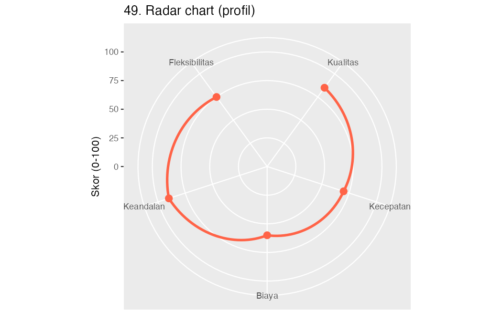


### 9.5 coord_cartesian — zoom tanpa buang data (50)

```r
dasar_zoom <- ggplot(ringkas_line, aes(x = Bulan, y = DefectRate, color = Line)) +
  geom_line(linewidth = 1) +
  geom_smooth(method = "lm", se = FALSE, linewidth = 0.8) +
  scale_y_continuous(labels = percent) +
  labs(x = "Tanggal", y = "Defect rate", color = "Lini") +
  theme(axis.text.x = element_text(angle = 45, hjust = 1))

dasar_zoom + coord_cartesian(ylim = c(0.02, 0.06))   # zoom y
```

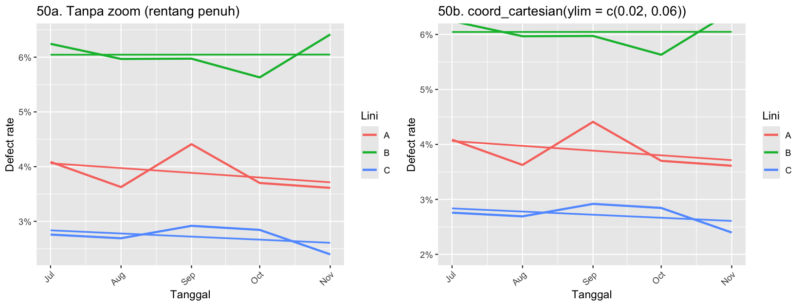


> ⚠️ **Zoom aman** = `coord_cartesian(ylim = ...)`. Bar tidak: `ylim(...)` atau `scale_y_limits()` **membuang data** di luar rentang dan mengubah `geom_smooth`!

### 9.6 coord_fixed — rasio aspek 1:1 (51)

```r
ggplot(awan, aes(x = x, y = y)) +
  geom_point(alpha = 0.2, color = "steelblue") +
  coord_fixed(ratio = 1) +
  labs(title = "51. coord_fixed (1:1)", x = NULL, y = NULL)
```

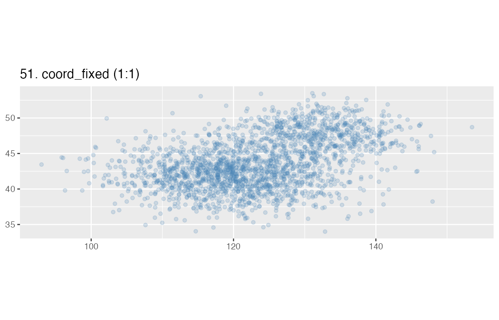


### 9.7 coord_transform — skala sumbu log10 (52)

```r
ggplot(inspeksi, aes(x = Inspected, y = Defect + 1)) +
  geom_point(color = "steelblue") +
  coord_transform(y = "log10") +
  scale_y_continuous(breaks = c(1, 2, 4, 8, 16), labels = c(0, 1, 3, 7, 15)) +
  labs(title = "52. coord_transform(y = 'log10')",
       x = "Unit diinspeksi", y = "Jumlah defect")
```

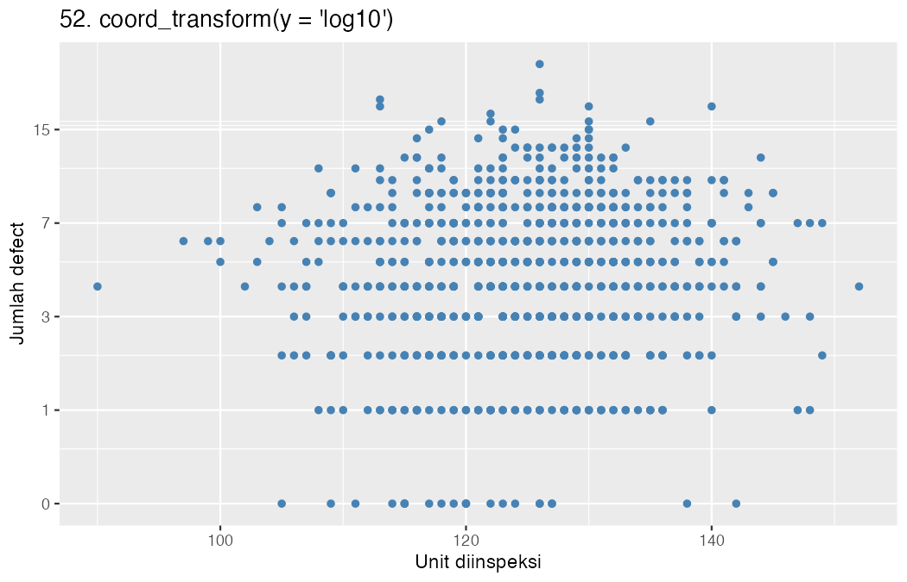


> `coord_transform()` = nama 4.0 (lama: `coord_trans()`). Berguna untuk data spasial/skewed.

---

## 10. Facet — Multi-Panel (sample 53–55)

Pertanyaan: **\"bandingan pola antar grup tanpa tumpang-tindih\"**. Output: `output/V53_*.png` … `output/V55_*.png`.

### 10.1 facet_wrap — panel otomatis (53)

```r
ggplot(inspeksi, aes(x = Inspected, y = Defect)) +
  geom_point(color = "steelblue") +
  geom_smooth(method = "lm", fill = "lightblue") +
  facet_wrap(~ Line, nrow = 1) +
  labs(title = "53. facet_wrap(~ Line)",
       x = "Unit diinspeksi", y = "Jumlah defect")
```

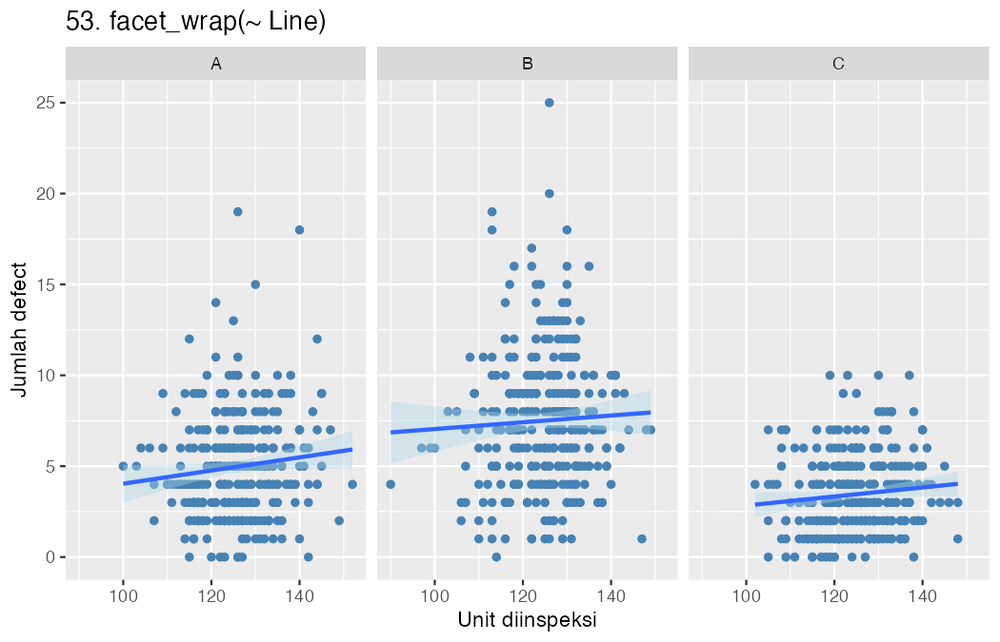


### 10.2 facet_grid — grid dua arah (54)

```r
ggplot(inspeksi, aes(x = DefectType)) +
  geom_bar(fill = "steelblue") +
  facet_grid(Product ~ Line) +
  labs(title = "54. facet_grid(Product ~ Line)",
       x = "Jenis defect", y = "Jumlah inspeksi") +
  theme(axis.text.x = element_text(angle = 45, hjust = 1))
```

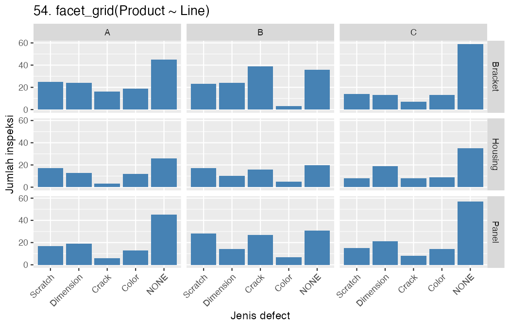


### 10.3 Free scales + labeller kustom (55)

```r
ggplot(inspeksi, aes(x = Defect)) +
  geom_histogram(binwidth = 1, fill = "steelblue", color = "white") +
  facet_wrap(~ Line, scales = "free",
             labeller = labeller(Line = c(A = "Lini A", B = "Lini B", C = "Lini C"))) +
  labs(title = "55. Facet: scales = 'free' + labeller",
       x = "Jumlah defect", y = "Frekuensi")
```

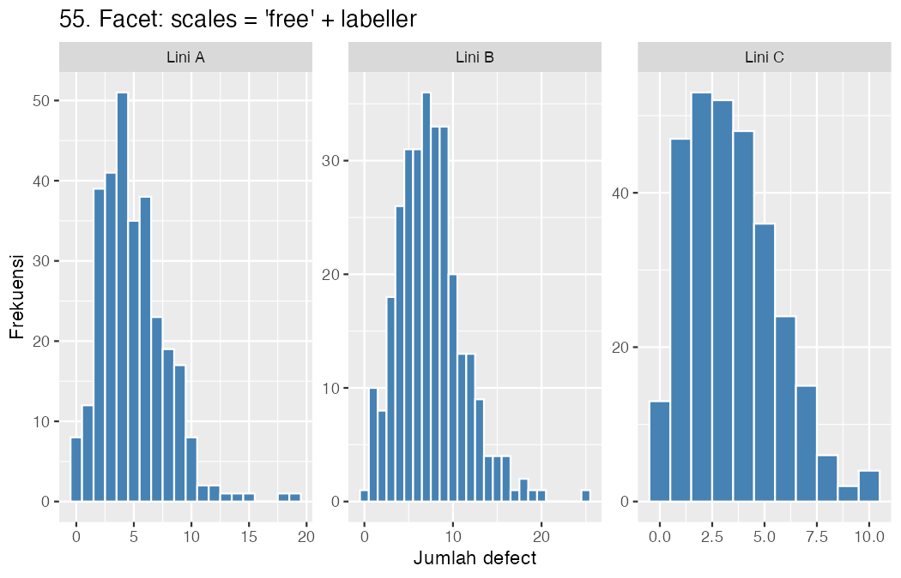


> `scales = "free"` = tiap panel punya skala sendiri (kontrast dibaca di panel kecil); `labeller()` = rename label panel tanpa ubah data.

---

## 11. Scales, Warna & Label (sample 56–62)

Pertanyaan: **\"apa palet warna dan format label paling pas?\"** Output: `output/V56_*.png` … `output/V62_*.png`.

### 11.1 scale_*_manual — warna kustom + label sumbu (56)

```r
ggplot(per_line_tipe, aes(x = Line, y = TotalDefect, fill = DefectType)) +
  geom_col(position = "stack") +
  scale_fill_manual(
    values = c(Scratch = "#E69F00", Dimension = "#56B4E9", Crack = "#009E73",
               Color = "#F0E442", NONE = "#999999"),
    limits = c("Scratch", "Dimension", "Crack", "Color", "NONE"),
    name = "Jenis defect"
  ) +
  scale_y_continuous(name = "Jumlah defect", breaks = pretty_breaks()) +
  scale_x_discrete(name = "Lini", labels = c("Lini A", "Lini B", "Lini C")) +
  labs(title = "56. scale_manual + label sumbu")
```

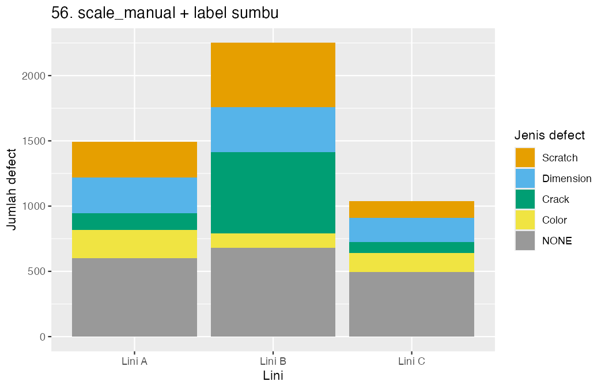


> `scale_*_manual(values = ...)` = warna brand perusahaan/heks kustom. `limits` kontrolla urutan kategori di legenda.

### 11.2 scale_fill_brewer — palet ColorBrewer (57)

```r
ggplot(per_line_tipe, aes(x = DefectType, y = TotalDefect, fill = Line)) +
  geom_col(position = "dodge") +
  scale_fill_brewer(palette = "Blues") +
  labs(title = "57. scale_fill_brewer('Blues')",
       x = "Jenis defect", y = "Total defect", fill = "Lini")
```

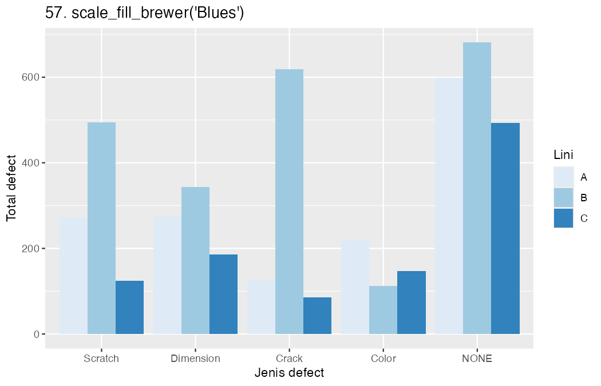


> Palet siap pakai: `Blues`, `Set2`, `Dark2`, `Paired`… explorer: <https://colorbrewer2.org>.

### 11.3 Viridis diskret — colorblind-safe (58)

```r
ggplot(per_line_tipe, aes(x = Line, y = TotalDefect, fill = DefectType)) +
  geom_col(position = "dodge") +
  scale_fill_viridis_d(option = "turbo", name = "Jenis defect") +
  labs(title = "58. scale_fill_viridis_d", x = "Lini", y = "Total defect")
```

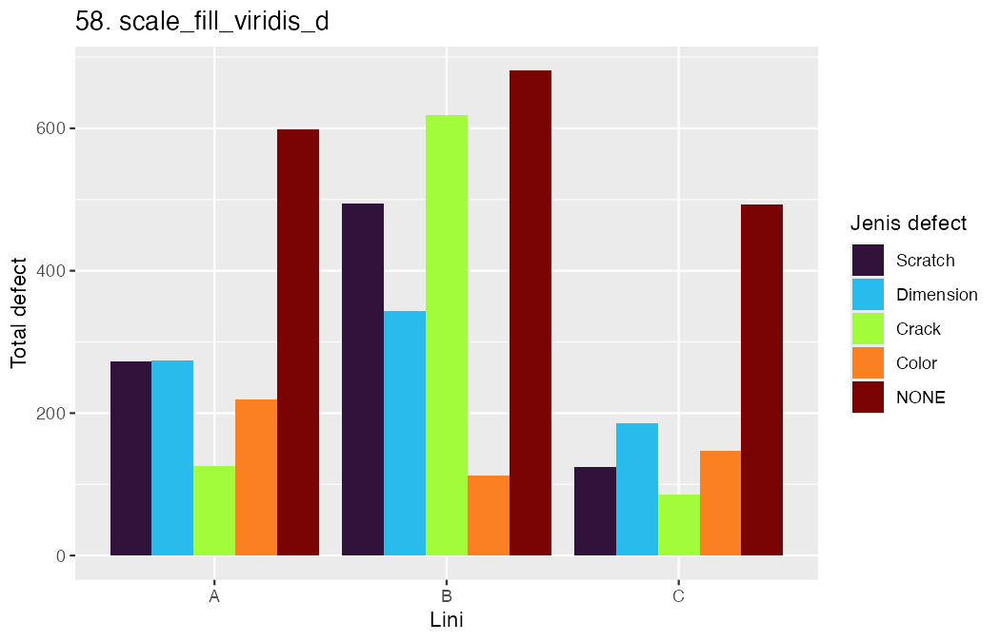


> `viridis`/`turbo`/`magma`/`inferno`/`plasma`/`mako` = colorblind-safe dan print-friendly — **default favorit** per grafik baru.

### 11.4 Viridis kontinu — heatmap gradien (59)

```r
panas_rate <- inspeksi |>
  group_by(Bulan = floor_date(InspectionDate, "month"), Line) |>
  summarize(DefectRate = sum(Defect) / sum(Inspected), .groups = "drop")

ggplot(panas_rate, aes(x = Bulan, y = Line, fill = DefectRate)) +
  geom_tile(color = "white") +
  scale_fill_viridis_c(option = "mako", labels = percent, name = "Defect rate") +
  scale_x_date(date_labels = "%b", date_breaks = "1 month") +
  labs(title = "59. scale_fill_viridis_c (gradien)", x = "Bulan") +
  theme(axis.text.x = element_text(angle = 45, hjust = 1))
```

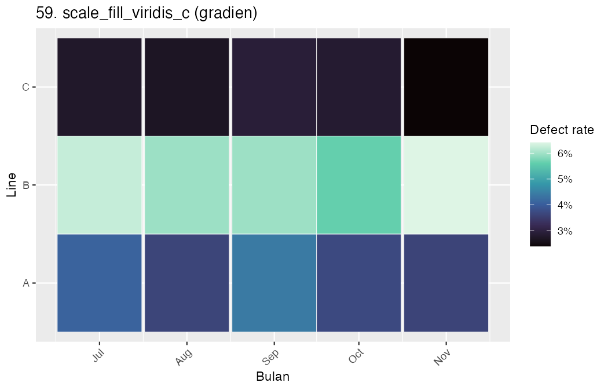


### 11.5 Gradien diverging — selisih vs target (60)

```r
target <- data.frame(Line = c("A", "B", "C"), TargetDR = c(0.03, 0.04, 0.035))

vs_target <- panas_rate |>
  left_join(target, by = "Line") |>
  mutate(Selisih = DefectRate - TargetDR)

ggplot(vs_target, aes(x = Bulan, y = Line, fill = Selisih)) +
  geom_tile(color = "white") +
  scale_fill_gradient2(low = "seagreen", mid = "white", high = "tomato",
                       midpoint = 0, labels = percent, name = "Selisih vs target") +
  scale_x_date(date_labels = "%b", date_breaks = "1 month") +
  labs(title = "60. scale_fill_gradient2 (diverging)", x = "Bulan") +
  theme(axis.text.x = element_text(angle = 45, hjust = 1))
```

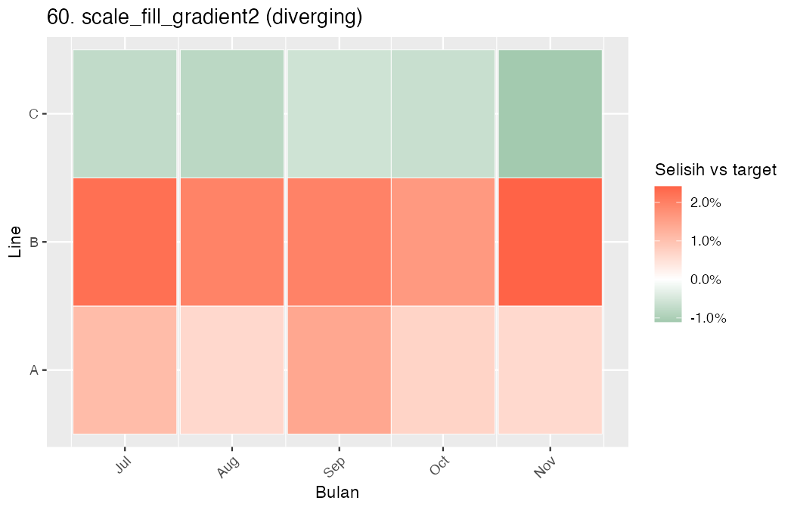


> Diverging (mid = 0) = **vermillon ao/pawah target in satu heatmap** — pattern kuat untuk report quality.

### 11.6 Kontrol breaks / limits / expand (61)

```r
ggplot(ringkas_line, aes(x = Bulan, y = DefectRate, color = Line)) +
  geom_line(linewidth = 1) +
  scale_y_continuous(labels = percent, breaks = seq(0.02, 0.08, 0.01),
                     limits = c(0.015, 0.09), expand = c(0, 0)) +
  scale_x_date(date_breaks = "1 month", date_labels = "%b %y",
               expand = expansion(mult = c(0.02, 0.02))) +
  labs(title = "61. Kontrol breaks / limits / expand",
       x = "Bulan", y = "Defect rate", color = "Lini")
```

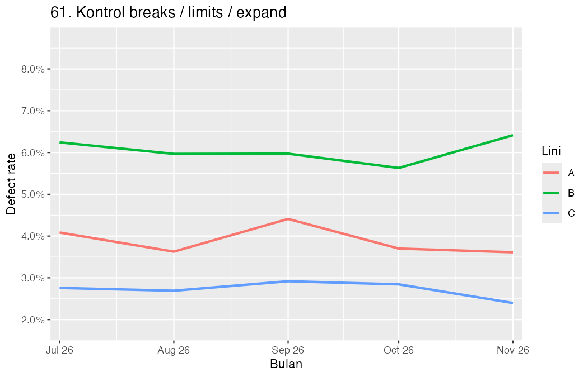


> `breaks` = di mana tick; `limits` = rentang sumbu; `expand` = ruang ekstra (0 di sumbu y = bar mulai tepat nol, jujur perbandingan).

### 11.7 Skala bentuk manual (62)

```r
ggplot(ringkas_line, aes(x = Bulan, y = RataCT, color = Line, shape = Line)) +
  geom_line(linewidth = 0.8) +
  geom_point(size = 3) +
  scale_shape_manual(values = c(15, 17, 19)) +
  scale_color_brewer(palette = "Dark2") +
  labs(title = "62. scale_shape_manual + brewer", x = "Bulan",
       y = "Rata-rata cycle time (detik)")
```

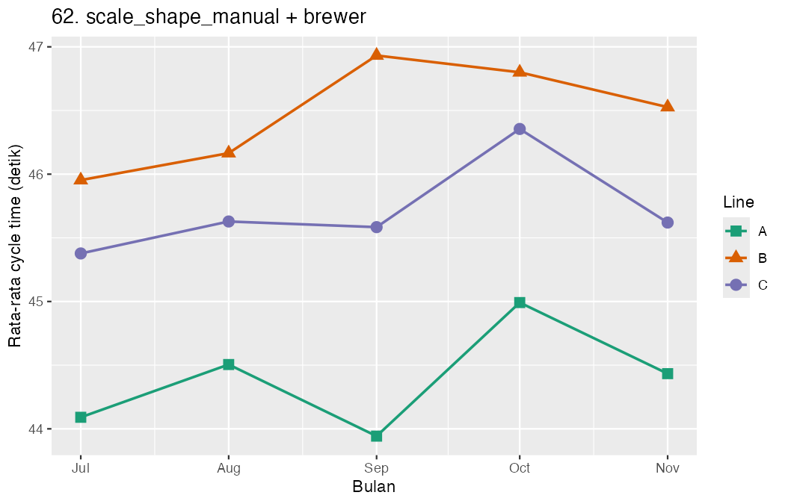


---

## 12. Theme & Kustomisasi Tampilan (sample 63–65)

Pertanyaan: **\"apa gaya default yang paling pas?\"** Output: `output/V63_*.png` … `output/V65_*.png`.

### 12.1 Galeri theme siap pakai (63)

```r
dasar_bar <- ggplot(inspeksi, aes(x = Line, y = Defect, fill = Line)) + geom_col()

dasar_bar + theme_bw()       # latar bitung, grid abu-abu
dasar_bar + theme_minimal()  # minimal, tanpa grid latar (favorit modren)
dasar_bar + theme_classic()  # gaya bisa/Excel
dasar_bar + theme_light()    # abu muda
dasar_bar + theme_dark()     # latar susun, untuk dashboard monitor
dasar_bar + theme_void()     # tanpa dekorasi — hanya geom
```

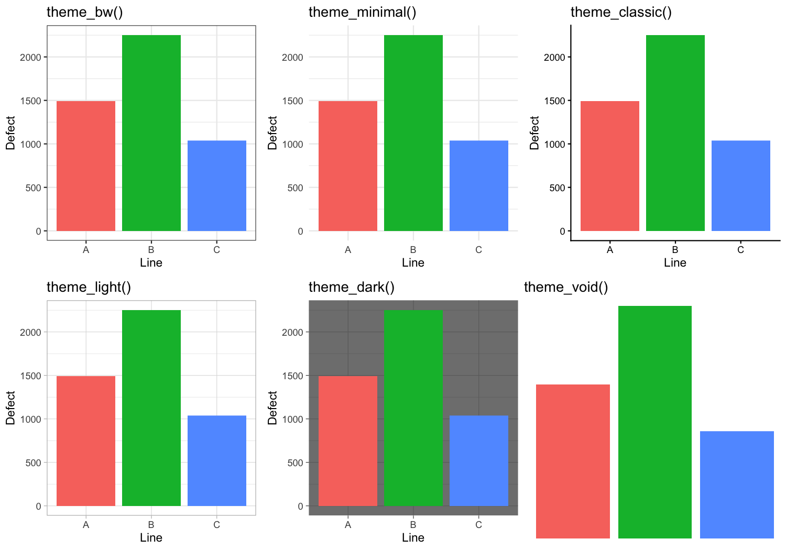


### 12.2 Tema kustom lengkap dengan `theme()` + `element_*` (64)

```r
tema_qc <- theme_minimal(base_size = 11) +
  theme(
    plot.title         = element_text(face = "bold", size = 14, color = "grey15"),
    plot.subtitle      = element_text(color = "grey40", margin = margin(b = 8)),
    plot.caption       = element_text(color = "grey50", size = 8),
    axis.title         = element_text(face = "bold", color = "grey30"),
    axis.text          = element_text(color = "grey30"),
    panel.grid.major.x = element_blank(),
    panel.grid.minor   = element_blank(),
    legend.position    = "bottom",
    legend.title       = element_text(face = "bold"),
    strip.text         = element_text(face = "bold", color = "white"),
    strip.background   = element_rect(fill = "steelblue")
  )

ggplot(ringkas_line, aes(x = Bulan, y = DefectRate, color = Line)) +
  geom_line(linewidth = 1) +
  geom_point(size = 2.5) +
  scale_y_continuous(labels = percent) +
  labs(title = "Profil Defect Rate Bulanan",
       subtitle = "Per lini produksi — Juli–November 2026",
       x = "Bulan", y = "Defect rate", color = "Lini") +
  tema_qc
```

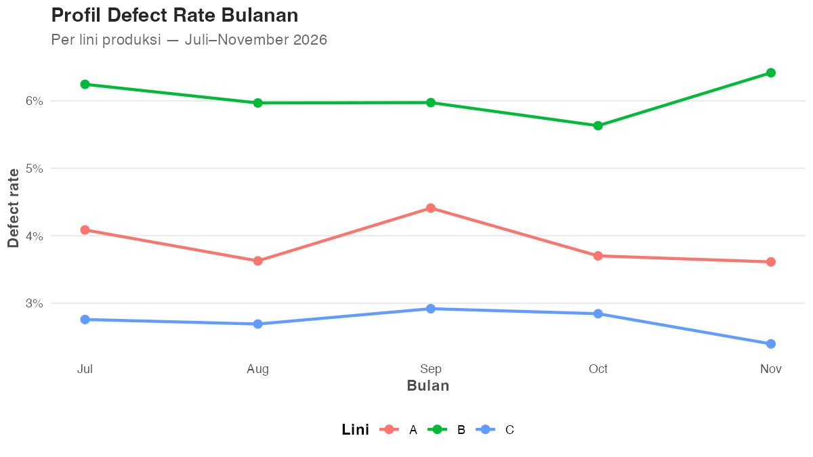


> Save objek `tema_qc` sekali, pakai ulang di semua grafik = **konsistens visual dashboard**. Ini template untuk \"company theme\".

### 12.3 Detail tema — grid, sumbu, facet strip (65)

```r
ggplot(ringkas_line, aes(x = Bulan, y = DefectRate, color = Line)) +
  geom_line(linewidth = 1) +
  geom_point(size = 2.5) +
  scale_y_continuous(labels = percent) +
  facet_wrap(~ Line, nrow = 1) +
  labs(title = "65. Detail tema (facet per lini)", x = "Bulan",
       y = "Defect rate") +
  theme_minimal(base_size = 10) +
  theme(
    panel.grid.major.x = element_blank(),
    panel.grid.minor   = element_blank(),
    axis.text.x        = element_text(angle = 45, hjust = 1, size = 8),
    panel.border       = element_rect(color = "grey60", fill = NA),
    strip.background   = element_rect(fill = "lightblue"),
    strip.text         = element_text(face = "bold", color = "grey20")
  )
```

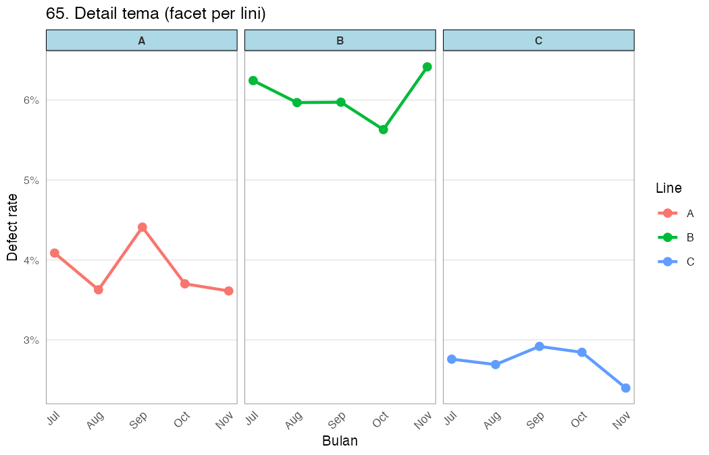


> `strip.background`/`strip.text` = tampilan label facet. Vokabel `element_*`: `element_text()`, `element_rect()`, `element_line()`, `element_blank()`.

---

## 13. Guides & Annotasi (sample 66–67, +44–45)

Pertanyaan: **\"apa kontrol legenda dan annotation tambahan?\"** Output: `output/V66_*.png` … `output/V67_*.png`.

### 13.1 guide_legend — kontrol legenda (66)

```r
ggplot(inspeksi, aes(x = InspectionDate, y = Defect, color = Line)) +
  geom_line(aes(group = Line), color = "grey60") +
  geom_point(size = 2.5) +
  scale_x_date(date_labels = "%b", date_breaks = "1 month") +
  guides(color = guide_legend(
    title = "Lini produksi",
    override.aes = list(size = 4, shape = 21),
    nrow = 1, byrow = TRUE,
    theme = theme(legend.background = element_rect(fill = "grey90"))
  )) +
  theme(legend.position = "top") +
  labs(title = "66. guide_legend (kontrol)", x = "Bulan", y = "Jumlah defect")
```

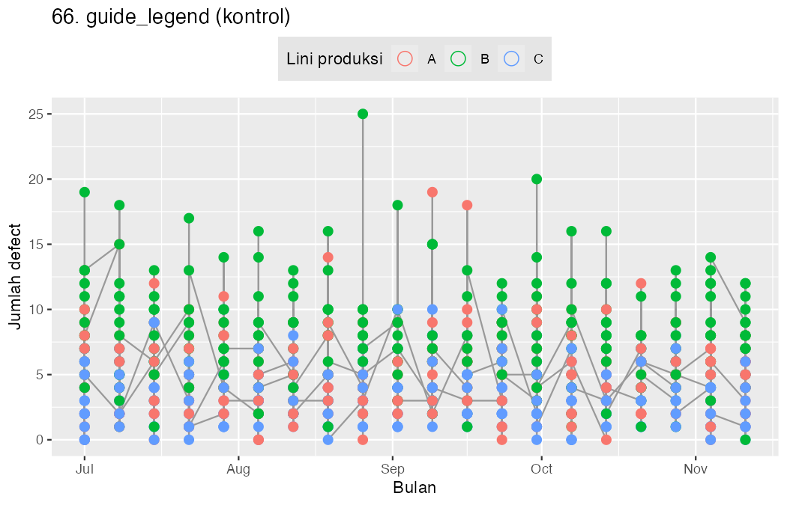


> `override.aes` = ubah simbol legenda (besar titik, bentuk). `nrow = 1` = legenda satu baris di atas.

### 13.2 guide_colorbar — kontrol bar gradien (67)

```r
ggplot(panas_rate, aes(x = Bulan, y = Line, fill = DefectRate)) +
  geom_tile(color = "white") +
  scale_fill_viridis_c(name = "Defect rate", labels = percent) +
  guides(fill = guide_colorbar(barheight = 4, barwidth = 0.6,
                               title.position = "top",
                               theme = theme(legend.title = element_text(angle = 90)),
                               reverse = TRUE)) +
  scale_x_date(date_labels = "%b", date_breaks = "1 month") +
  theme(legend.position = "bottom") +
  labs(title = "67. guide_colourbar", x = "Bulan") +
  theme(axis.text.x = element_text(angle = 45, hjust = 1))
```

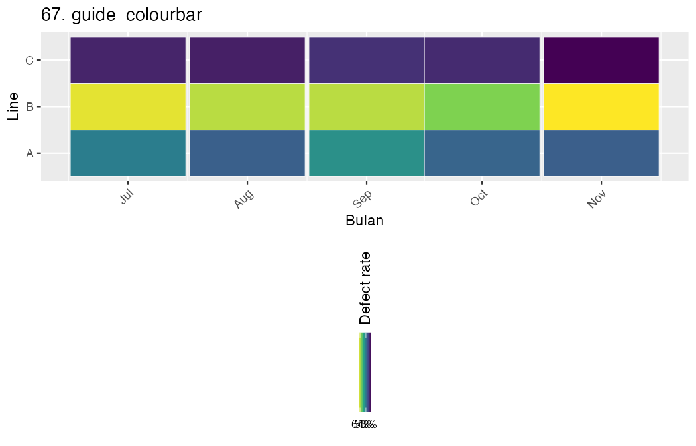


### 13.3 Vokabel annotasi (recap 32, 44, 45)

| Fungsi | Kegunaan | Contoh |
| --- | --- | --- |
| `geom_text()` | label titik/data | sample 32 |
| `geom_label()` | label + kotak latar | sample 44/32 |
| `annotate("text", ...)` | teks bebas | sample 44 |
| `annotate("rect", ...)` | zona lowsli | sample 44 |
| `geom_hline()` / `geom_vline()` | garis target | sample 44 |
| `geom_segment(arrow = ...)` | panah pergerakan | sample 45 |

---

## 14. Stat & after_stat (sample 68–70)

> Stat = transformasi di belakang geom. `after_stat()` = memakai hasil transformasi itu sebagai aesthetic.

### 14.1 stat_count — stat eksplisit di belakang geom_bar (68)

```r
ggplot(inspeksi, aes(x = DefectType)) +
  stat_count(geom = "bar", fill = "steelblue", width = 0.6) +
  labs(title = "68. stat_count(geom = 'bar')",
       x = "Jenis defect", y = "Frekuensi")
```

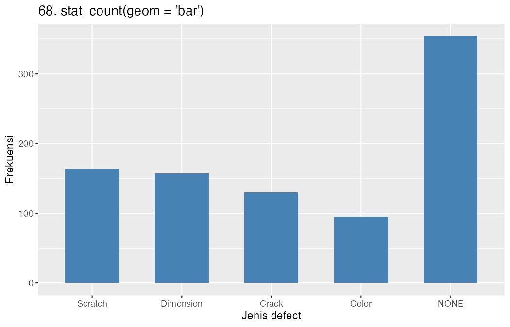


### 14.2 after_stat(count) — warna bar mengikuti frekuensi (69)

```r
ggplot(inspeksi, aes(x = DefectType, fill = after_stat(count))) +
  geom_bar() +
  scale_fill_viridis_c(name = "Frekuensi") +
  labs(title = "69. after_stat(count) sebagai fill",
       x = "Jenis defect", y = "Frekuensi")
```

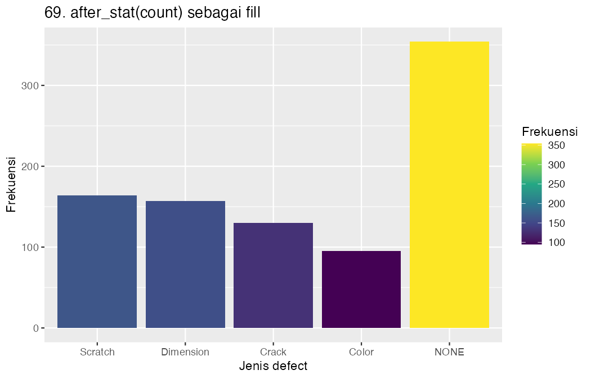


### 14.3 after_stat(density) + geom_density (70)

```r
ggplot(inspeksi, aes(x = CycleTimeSec)) +
  geom_histogram(aes(y = after_stat(density)), binwidth = 2,
                 fill = "lightblue", color = "white") +
  geom_density(color = "tomato", linewidth = 1) +
  labs(title = "70. after_stat(density) + geom_density",
       x = "Cycle time (detik)", y = "Densitas")
```

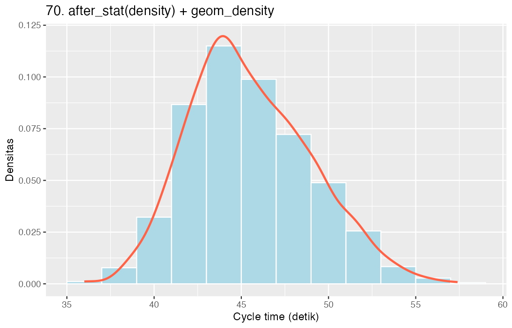


> Histogram default y = count (jumlah), density kurva y = densitas. `after_stat(density)` = histogram di skala densitas sehingga dua layer bisa menempel.

---

## 15. Label Lengkap, Dashboard & Penyimpanan (sample 71–73)

### 15.1 labs() lengkap — tag, title, subtitle, caption (71)

```r
tema_qc <- theme_minimal(base_size = 11)   # dari Bab 12.2 bila perlu

ggplot(inspeksi, aes(x = Line, y = CycleTimeSec, fill = Line)) +
  geom_boxplot(show.legend = FALSE) +
  scale_fill_brewer(palette = "Blues") +
  labs(
    tag      = "Gambar 1",
    title    = "Cycle Time per Lini Produksi",
    subtitle = "Median dan rentang antar-kuartil, Juli-November 2026",
    x = "Lini", y = "Cycle time (detik)",
    caption  = "Sumber: visualisasi_sample.csv"
  ) +
  tema_qc
```

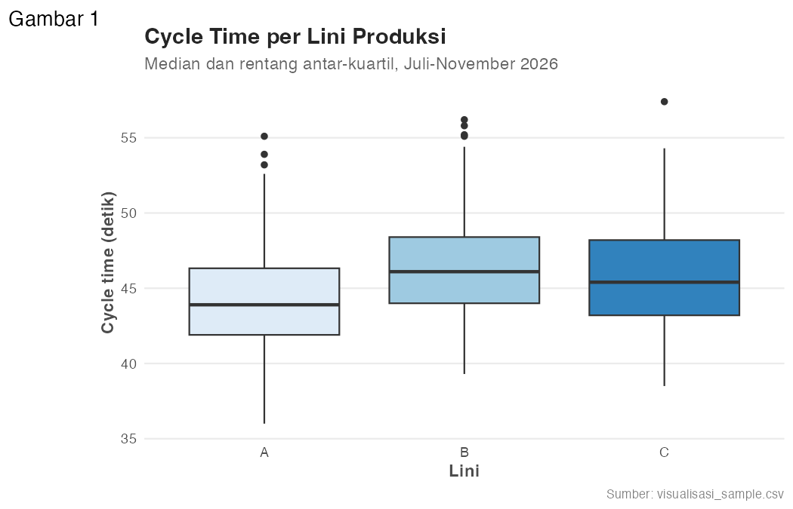


> Judul berbentuk **pertanyaan** (prinsip Bab 16): \"Lini mana cycle time tertinggi?\" — bukan deskriptif saja.

### 15.2 Dashboard 2×2 — gabung grafik dalam satu kanvas (72)

```r
p_box <- ggplot(inspeksi, aes(x = Line, y = CycleTimeSec, fill = Line)) +
  geom_boxplot(show.legend = FALSE) +
  scale_fill_brewer(palette = "Blues") +
  labs(title = "Cycle time per lini", x = NULL, y = "detik")

p_stack <- ggplot(per_line_tipe,
                  aes(x = Line, y = TotalDefect, fill = DefectType)) +
  geom_col(position = "stack") +
  labs(title = "Defect per lini & jenis", x = NULL, y = "total defect",
       fill = "Jenis")

p_scatter <- ggplot(inspeksi, aes(x = Inspected, y = Defect)) +
  geom_point(color = "steelblue") +
  geom_smooth(method = "lm", fill = "lightblue") +
  labs(title = "Inspeksi vs defect", x = NULL, y = "defect")

p_tren <- ggplot(ringkas_line, aes(x = Bulan, y = DefectRate, color = Line)) +
  geom_line(linewidth = 1) +
  scale_y_continuous(labels = percent) +
  labs(title = "Tren defect rate", x = NULL, y = NULL, color = "Lini")
```

Gabung semua 4 plot di satu kanvas (helper `gabung_grid` di `R/01_visualisasi_ggplot2.R`):

```r
library(grid)
gabung_grid <- function(..., ncol = 2) {
  plots <- list(...)
  n_br  <- ceiling(length(plots) / ncol)
  grid.newpage()
  pushViewport(viewport(layout = grid.layout(n_br, ncol)))
  for (i in seq_along(plots)) {
    baris <- ceiling(i / ncol)
    kolom <- ((i - 1L) %% ncol) + 1L
    pushViewport(viewport(layout.pos.row = baris, layout.pos.col = kolom))
    grid.draw(ggplotGrob(plots[[i]]))
    popViewport()
  }
}

gabung_grid(p_box, p_stack, p_scatter, p_tren)
```

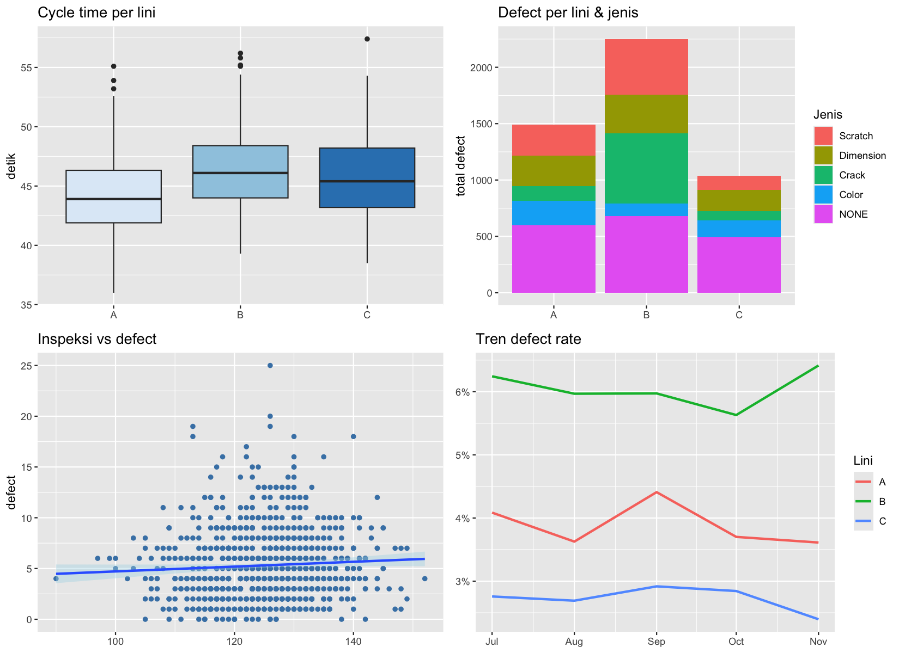


> Alternatif modren bukan butuh grid-manual: package **`patchwork`** → `library(patchwork); (p_box | p_stack) / (p_scatter | p_tren)`. Instal: `install.packages("patchwork")`.

### 15.3 ggsave — simpan multi-format (73)

```r
p <- ggplot(inspeksi, aes(x = DefectType, y = Defect)) +
  geom_boxplot(fill = "lightblue") +
  labs(title = "Contoh ggsave multi-format",
       x = "Jenis defect", y = "Jumlah defect")

ggsave("output/V73_ggsave.png", p, width = 7, height = 4.5, dpi = 150, bg = "white")
ggsave("output/V73_ggsave.pdf", p, width = 7, height = 4.5)
# SVG: install.packages("svglite") lalu ggsave("output/V73_ggsave.svg", p, ...)
```

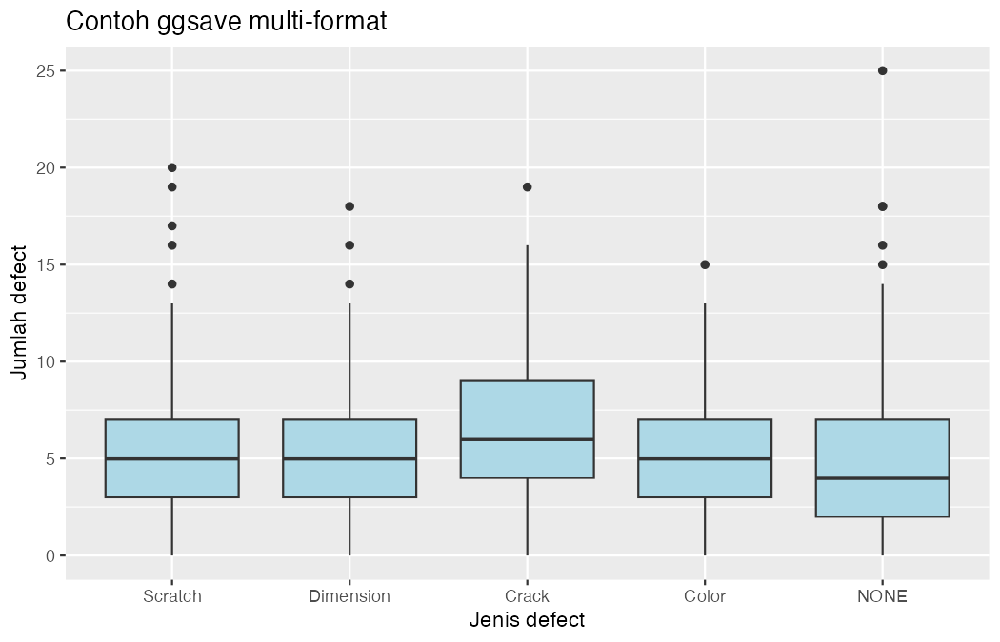

| Format | Kegunaan | Note |
| --- | --- | --- |
| `png` | embed di report/email/Power BI | `dpi = 300` untuk print |
| `pdf` | vector, scale-infinite | ideal untuk publikasi |
| `svg` | vector untuk web/editabel | butuh `svglite` |

---

## 16. Prinsip Visualisasi yang Efektif

Diadaptasi dari Volume 0 Bab 8.8 + galeri volume ini. Ceklist per grafik final:

| # | Prinsip | Cara pen(apa) | Sample anti-pattern |
| --- | --- | --- | --- |
| 1 | Judul berbentuk pertanyaan | \"Lini mana yang paling perlu investigasi?\" | 71 (`labs`) |
| 2 | Sumbu berlabel jelas + unit | `x = "Bulan"`, `y = "Defect rate (%)"` | 56 (`scale_*`) |
| 3 | Bar chart mulai dari nol | `scale_y_continuous(expand = c(0, 0))` | 61 |
| 4 | Warna bermakna, bukan pelangi | viridis/brewer/manual; max 6 kategori odd | 58 |
| 5 | Batasi volume informasi | agregat + label; facet untuk banyak grup | 53 |
| 6 | Ambang/target jelas | `geom_hline(yintercept = target)` | 44 |
| 7 | Legenda jelas + posisi pas | `guide_legend()`; bottom/top untuk ≤4 kategori | 66 |
| 8 | Satu grafik → minimal satu pertanyaan | — | — |
| 9 | Data agregat ekspos di label | `scale_y_continuous(labels = percent)` | 17 |
| 10 | Zoom aman, bukan buang data | `coord_cartesian(ylim = ...)`, tidak `ylim()` | 50 |

> 📌 **Golden rule**: visual yang menjawab pertanyaan biznis dengan jujur (proporsi jujur, warna jujur, skala jujur) > visual yang \"muhawwi\" tetapi menipu mata.

---

## 17. Contoh Alur Lengkap

Kode end-to-end: membaca → metrik → agregasi → 4 grafik berbandingan → temuan. Salin dan run di RStudio:

```r
library(dplyr); library(lubridate); library(ggplot2); library(scales); library(forcats)

# 1. Membaca + tipe
inspeksi <- read.csv("data/visualisasi_sample.csv") |>
  mutate(
    InspectionDate = as.Date(InspectionDate),
    DefectRate = Defect / Inspected,
    Line       = factor(Line, levels = c("A", "B", "C")),
    DefectType = factor(DefectType,
                        levels = c("Scratch", "Dimension", "Crack", "Color", "NONE"))
  )

# 2. Agregasi per lini
per_line <- inspeksi |>
  group_by(Line) |>
  summarise(
    TotalInspected = sum(Inspected),
    TotalDefect    = sum(Defect),
    DefectRate     = TotalDefect / TotalInspected,
    RataCT         = mean(CycleTimeSec),
    .groups = "drop"
  ) |>
  arrange(desc(DefectRate))

# 3. Tren bulanan per lini
per_bulan_line <- inspeksi |>
  group_by(Bulan = floor_date(InspectionDate, "month"), Line) |>
  summarise(DefectRate = sum(Defect) / sum(Inspected), .groups = "drop")

# 4. Grafik 1 — Bar defect rate per lini (judul pertanyaan!)
ggplot(per_line, aes(x = Line, y = DefectRate, fill = Line)) +
  geom_col() +
  geom_text(aes(label = sprintf("%.1f%%", 100 * DefectRate)), vjust = -0.5) +
  scale_y_continuous(labels = percent, expand = expansion(mult = c(0, 0.15))) +
  labs(title = "Lini mana defect rate tertinggi?",
       x = "Lini", y = "Defect rate") +
  theme_minimal() +
  theme(legend.position = "none")
```

```r
# 5. Grafik 2 — Tren defect rate + target 4%
ggplot(per_bulan_line, aes(x = Bulan, y = DefectRate,
                           color = Line, linetype = Line)) +
  geom_line(linewidth = 1) +
  geom_point(size = 2.5) +
  geom_hline(yintercept = 0.04, linetype = "dashed", color = "grey40") +
  annotate("text", x = min(per_bulan_line$Bulan), y = 0.042,
           label = "Target 4%", hjust = 0, color = "grey40", size = 3) +
  scale_y_continuous(labels = percent) +
  labs(title = "Tren defect rate: pola yang dikontrol?",
       x = "Bulan", y = "Defect rate", color = "Lini") +
  theme_minimal() +
  theme(legend.position = "bottom")
```

```r
# 6. Grafik 3 — Boxplot cycle time per lini (variasi + outlier)
ggplot(inspeksi, aes(x = Line, y = CycleTimeSec, fill = Line)) +
  geom_boxplot(outlier.shape = NA) +
  geom_jitter(width = 0.2, alpha = 0.4) +
  scale_fill_brewer(palette = "Set2") +
  labs(title = "Sebaran cycle time per lini",
       x = "Lini", y = "Cycle time (detik)") +
  theme_minimal() +
  theme(legend.position = "none")
```

```r
# 7. Grafik 4 — Komposisi defect type per lini (stack/fill)
ggplot(inspeksi |>
         group_by(Line, DefectType) |>
         summarise(TotalDefect = sum(Defect), .groups = "drop"),
       aes(x = Line, y = TotalDefect, fill = DefectType)) +
  geom_col(position = "stack") +
  scale_fill_viridis_d(option = "turbo") +
  labs(title = "Komposisi jenis defect per lini",
       x = "Lini", y = "Total defect", fill = "Jenis") +
  theme_minimal() +
  theme(legend.position = "bottom")

# 8. Export 4 grafik
ggsave("output/bar.png",  ggplot(per_line, aes(x = Line, y = DefectRate)) + geom_col(),
       width = 7, height = 4.5, dpi = 300)
```

---

## 18. Export Hasil Analisis

| Data/Luaran | Fungsi | Lokasi |
| --- | --- | --- |
| Data sample | `R/00_buat_data.R` | `data/visualisasi_sample.csv` |
| Galeri 73 grafik | `R/01_visualisasi_ggplot2.R` | `output/V*.png` |
| Data agregat (per lini) | `write.csv(per_line, "output/per_line.csv", row.names = FALSE)` | manual |
| Grafik satu | `ggsave("output/myrang.png", p, width = 8, height = 5, dpi = 300)` | manual |
| Grafik vector | `ggsave("output/myrang.pdf", p, width = 8, height = 5)` | manual |

> Konsistens nama: `output/`, `snake_case_`, nomor `V##_kebekripan`. Galeri sudah di folder `output/` siap simpan.

---

## 19. Kesalahan Umum & Solusinya

| Kesalahan | Solusi |
| --- | --- |
| `could not find function "geom_col"` | ggplot2 < 3.5 — install ulang `install.packages("ggplot2")`; atau pakai `geom_col()` ↔ `geom_bar()` |
| `object 'Bulan' not found` | Kolom harus di data frame dulu: `mutate(Bulan = floor_date(...))` atau referensi `ringkas_line$Bulan` |
| Grafik kosong | `str(df)` + `names(df)`; kolom bertipe character/NA |
| Bar tidak tersusun oleh nilai | `fct_reorder()` (forcats) sebelum `geom_col()` |
| Persentase tampil 0.04 bukan 4% | `scale_y_continuous(labels = percent)` (scales) |
| Zoom ubah garis smooth | Gunakan `coord_cartesian(ylim = ...)`, bukan `ylim()` |
| Label tanggal tampil angka | `as.Date()` dulu; `scale_x_date(date_labels = "%b %Y")` |
| Legenda makan semua ruang | `theme(legend.position = "bottom")` + `guide_legend(nrow = 1)` |
| `arrow()` error `'length' must be a unit object` | `arrow(length = unit(0.25, "cm"))` (ggplot2 4.0) |
| Titik tumpang-tindih 10.000 baris | `geom_bin2d()`, `geom_hex()`, `geom_density_2d()`, facet, atau agregat |

---

## 20. Latihan Mandiri

Gunakan `visualisasi_sample.csv`. Coba tanpa lihat galeri dulu; buka kode nomor bila stuck.

### Level 1 — Dasar

1. Histogram `Defect` dengan `binwidth = 1`, fill `steelblue`.
2. Bar count `DefectType` (frekuensi otomatis).
3. Col chart defect rate per `Line` + label persentase.
4. Line chart defect rate per `Bulan` per `Line` + titik.

### Level 2 — Format & Multi

5. Boxplot `CycleTimeSec` per `Line` + `facet_wrap(~ Product)`.
6. Scatter `Inspected` vs `Defect` + `geom_smooth(method = "lm")`.
7. Stack/fill bar `Line` × `DefectType` dengan palet viridis.
8. Heatmap `Bulan` × `Line` fill defect rate (`geom_tile` + `scale_fill_viridis_c(labels = percent)`).
9. Tambahkan target 4% (`geom_hline`) pada line chart + annotasi.

### Level 3 — Kustomisasi

10. Tema kustom (`tema_qc` Bab 12.2) aplikasi ke grafik #1 dan #4.
11. Dashboard 2×2 4 grafik darauff gabung dengan `gabung_grid` atau `patchwork`.
12. Kustom scale warna dengan heks brand lab → `scale_*_manual()`.
13. Ekspor satu grafik PNG dpi 300 + PDF.

---

## 21. Checklist Penyelesaian Volume 1

- [ ] Package `ggplot2`, `dplyr`, `lubridate`, `scales`, `forcats` terpasang.
- [ ] `data/visualisasi_sample.csv` tersedia (via `00_buat_data.R`).
- [ ] Galeri `R/01_visualisasi_ggplot2.R` jalan sampai `Total file PNG: 71` tanpa error.
- [ ] Bab 4–5 dibaca: konsep layer + tabel agregasi `ringkas_*` berfungsi.
- [ ] Minimal 4 jenis grafik sendiri: histogram, col, line, boxplot.
- [ ] Minimal 1 grafik multi-variabel (color + size/shape/facet).
- [ ] Minimal 1 grafik dengan target/annotasi.
- [ ] Tema kustom dipakai di ≥ 2 grafik.
- [ ] Minimal 1 grafik diekspor PNG dpi 300.
- [ ] Can menjelaskan insight dari grafik Line B (defect & cycle time).

---

## 22. Keterkaitan dengan Volume Lain

| Volume | Fokus | Prasyarat dari Volume 1 |
| --- | --- | --- |
| **Volume 0** | Basic R, dplyr, visualisasi dasar | — |
| **Volume 1 (ini)** | Basic Visualization `ggplot2` — galeri 73 sample | Volume 0 |
| **Volume 2 — Power BI** | Dashboard Power BI + **R visual** | Galeri `ggplot2` → skrip R visual |
| **Volume 3 — Case Study Industrial Engineering** (di `Archive/`) | SPC, capability, OEE, hipotesis | Tema + kustomisasi grafik |
| **Volume 4 — Case Study End-to-End** (di `Archive/`) | Analisis end-to-end dengan dplyr + ggplot2 + Power BI | Semua konsep volume ini |
| **Volume 5 — Causal Inference** (di `Archive/`) | DiD / what-if visual | Multi-line, facet, annotasi |

> 💡 Di Power BI, R visual menerima data frame; kode ggplot2 di Bab ini jalan **verbatim** — hanya path data yang diubah menjadi data dari slicer.

---

## 23. Bank Latihan Tambahan (Exercise Bank)

Gunakan `data/visualisasi_sample.csv` + tabel agregasi Bab 5.

**A. Distribusi**

1. Histogram `CycleTimeSec` per `Line` (`fill = Line`, alpha 0.5) — tiga distribusi bertumpuk.
2. Violin `CycleTimeSec` per `Line` + boxplot dalam (kode sample 12).

**B. Kategori**

3. Col chart total defect per `DefectType`, urutkan menurun (`fct_reorder`), warna `steelblue`.
4. Stack fill 100% per `Line` fill `DefectType` — lini mana proporsi Scratch terbesar?

**C. Hubungan & tren**

5. Scatter `Inspected` vs `Defect` per `Shift` (`color = Shift`) + smooth lm.
6. Line chart defect rate per `Bulan` per `Line` + target 4% dashed + annotasi (pattern sample 44).
7. Heatmap `Bulan` × `Shift` fill defect rate (variasi sample 59).

**D. Lanjutan**

8. Radar profil 5 kriteria dari data frame sendiri (sample 49).
9. Facet `facet_grid(Product ~ Line)` histogram defect (variasi sample 54).
10. Dashboard 2×2: bar + line + boxplot + heatmap dalam satu kanvas.

### Kunci jawaban singkat

```r
# 1.  tiga distribusi bertumpuk
ggplot(inspeksi, aes(x = CycleTimeSec, fill = Line)) +
  geom_histogram(binwidth = 2, alpha = 0.6, position = "identity") +
  labs(title = "Distribusi cycle time per lini", x = "detik", y = "Frekuensi")

# 2.  violin + boxplot
ggplot(inspeksi, aes(x = Line, y = CycleTimeSec, fill = Line)) +
  geom_violin() + geom_boxplot(width = 0.15, fill = "white")

# 3.  col urut menurun
inspeksi |> group_by(DefectType) |>
  summarise(TotalDefect = sum(Defect), .groups = "drop") |>
  mutate(DefectType = fct_reorder(DefectType, TotalDefect)) |>
  ggplot(aes(x = DefectType, y = TotalDefect)) +
  geom_col(fill = "steelblue")

# 4.  stack fill 100%
ggplot(per_line_tipe, aes(x = Line, y = TotalDefect, fill = DefectType)) +
  geom_col(position = "fill") + scale_y_continuous(labels = percent)

# 5.  scatter per shift
ggplot(inspeksi, aes(x = Inspected, y = Defect, color = Shift)) +
  geom_point(alpha = 0.5) + geom_smooth(method = "lm", se = FALSE)

# 6.  line + target 4%
ggplot(ringkas_line, aes(x = Bulan, y = DefectRate, color = Line)) +
  geom_line(linewidth = 1) + geom_point(size = 2.5) +
  geom_hline(yintercept = 0.04, linetype = "dashed", color = "grey40") +
  scale_y_continuous(labels = percent)

# 7.  heatmap bulan x shift
inspeksi |> group_by(Bulan = floor_date(InspectionDate, "month"), Shift) |>
  summarise(DefectRate = sum(Defect) / sum(Inspected), .groups = "drop") |>
  ggplot(aes(x = Bulan, y = Shift, fill = DefectRate)) +
  geom_tile(color = "white") + scale_fill_viridis_c(labels = percent)

# 8-10.  variasi dari sample 49, 54, 72 — buka R/01_visualisasi_ggplot2.R
```

---

## 24. Referensi dan Berkas

| Berkas/Materi | Lokasi |
| --- | --- |
| **Cheatsheet Volume 1 (sintaks cepat)** | `CHEATSHEET.md` (di folder ini) |
| Volume 0 — Basic R | `../Volume 0 - Basic R/README.md` + `CHEATSHEET.md` |
| Core Tidyverse — ggplot2 konsep | `../Core Tidyverse/02-ggplot2.md` |
| Galeri 73 sample (R + PNG) | `R/01_visualisasi_ggplot2.R` + `output/` |
| Data sample | `data/visualisasi_sample.csv` |
| Cheatsheet resmi Posit | `../data-visualization.pdf` |
| Dokumentasi ggplot2 | <https://ggplot2.tidyverse.org/> |
| R Graph Gallery | <https://r-graph-gallery.com> |
| ColorBrewer | <https://colorbrewer2.org> |
| Posit Cheatsheets | <https://posit.co/resources/cheatsheets/> |

---

> 💡 Galeri PNG (73 sample) sekarang tampil **inline** di Bab 6–15 — tiap blok kode langsung diikuti hasil visualnya. File PNG juga tersedia di folder `output/`.


*README Volume 1 — Basic Visualization dengan ggplot2: 73 sample siap jalankan, teori layer, dan best practice. Fondasi visual untuk Volume 2 (Power BI + R visual) dan Volume 3–5 (case studies, kini di folder `Archive/`).*
