# 📗 README Volume 2 — Statistics & Inferential Statistics

> Proyek ini adalah **Volume 2** dari rangkaian pelatihan *"Insight to Impact"*. Volume 0 membangun fondasi **Basic R, Data Manipulation, dan Visualisasi**; Volume 1 memperdalam **Basic Visualization dengan ggplot2**; dan **Volume 2 ini** melangkah lebih jauh: dari melihat data menuju **menarik kesimpulan dari data** — menguji hipotesis, membangun interval kepercayaan, dan membedakan **perbedaan yang nyata** dari **kebetulan sampling**.
>
> Semua contoh di sini **bisa dijalankan langsung** dan setiap **visual muncul tepat setelah kodenya**, sehingga Anda bisa langsung melihat hasilnya. Dataset dibuat dengan pola yang sengaja "ditanam" agar setiap uji statistik menemukan sesuatu yang bermakna — seperti data lapangan sungguhan.

---

## 1. Gambaran Umum

| Komponen | Keterangan |
| --- | --- |
| **Nama proyek** | Volume 2 — Statistics & Inferential Statistics |
| **Topik materi** | Statistik deskriptif, distribusi sampling & CLT, estimasi & interval kepercayaan, uji hipotesis (t, proporsi, chi-square, ANOVA), korelasi, regresi, uji non-parametrik, ukuran efek & power |
| **Bahasa** | R, RStudio Desktop |
| **Package utama** | `dplyr`, `tidyr`, `ggplot2`, `scales`, `broom` |
| **Dataset** | `data/statistik_sample.csv` (360 baris) & `data/pelatihan_sample.csv` (30 baris) |
| **Prerequisit** | Volume 0 (Basic R) & Volume 1 (Basic Visualization ggplot2) |
| **Luaran** | Kemampuan memilih uji yang tepat, menjalankannya dengan R, membaca output, dan menulis kesimpulan yang jujur |

### Alur belajar (roadmap)

```text
Fondasi Inferensi
  -> Populasi vs sampel, parameter vs statistik
  -> Distribusi (normal, t, binomial)
  -> Distribusi sampling & Central Limit Theorem
  -> Standard error

Estimasi
  -> Estimasi titik
  -> Interval kepercayaan (mean, proporsi)

Uji Hipotesis
  -> H0 vs H1, alpha, p-value
  -> Type I / Type II error & power
  -> Uji t (1 sampel, 2 sampel, berpasangan)
  -> Uji proporsi & chi-square
  -> ANOVA + post-hoc Tukey

Hubungan Antar Variabel
  -> Korelasi (Pearson, Spearman)
  -> Regresi linear sederhana
  -> Regresi linear berganda + diagnostik

Kapan Asumsi Dilanggar
  -> Uji non-parametrik (Mann-Whitney, Kruskal-Wallis, Wilcoxon)
  -> Ukuran efek & power analysis
```

---

## 2. Tujuan Pembelajaran

Setelah menyelesaikan **Volume 2**, Anda diharapkan mampu:

1. Menjelaskan perbedaan **populasi vs sampel** serta **parameter vs statistik**.
2. Memahami **distribusi sampling** dan mengapa **Central Limit Theorem** penting.
3. Menghitung dan **menginterpretasikan interval kepercayaan**.
4. Merumuskan **H0 dan H1**, lalu menjalankan **uji hipotesis** yang sesuai.
5. Membedakan **signifikansi statistik** dari **signifikansi praktis**.
6. Memilih antara **uji parametrik** dan **non-parametrik** berdasarkan asumsi.
7. Mengukur **besar efek** (Cohen's d, eta squared, R²), bukan hanya p-value.
8. Menulis **kesimpulan statistik** dengan bahasa yang benar dan tidak menyesatkan.

> Volume 2 adalah **jembatan** dari "membuat grafik" menuju "mengambil keputusan berbasis data" — bekal penting untuk **Volume 3 (Case Study Industrial Engineering)** dan **Volume 4 (End-to-End Analytics)**.

---

## 3. Persiapan R, RStudio, dan Package

### 3.1 Package yang digunakan

Instal **sekali saja**:

```r
install.packages(c("dplyr", "tidyr", "ggplot2", "scales", "broom"))
```

Aktifkan setiap awal sesi:

```r
library(dplyr)     # data manipulation
library(tidyr)     # reshape (pivot_longer)
library(ggplot2)   # visualisasi
library(scales)    # format persen / ribuan
library(broom)     # merapikan output uji (tidy)
```

> **Catatan:** seluruh analisis Volume 2 memakai **base R** (`t.test`, `aov`, `chisq.test`, `lm`, `cor.test`, `wilcox.test`, `kruskal.test`, `power.t.test`) sehingga **tidak butuh package tambahan** seperti `car` atau `moments`. Cukup package di atas untuk data & visual.

### 3.2 Struktur folder

```text
Volume 2 - Statistics and Inferential Statistics/
├── README.md                          # file ini (materi + semua contoh)
├── CHEATSHEET.md                      # referensi cepat semua uji
├── data/
│   ├── statistik_sample.csv           # 360 baris — data inspeksi (garis produksi)
│   └── pelatihan_sample.csv           # 30 baris — sebelum/sesudah pelatihan
├── R/
│   ├── 00_buat_data.R                 # generator data (set.seed, reproducible)
│   └── 01_statistik_inferensial.R     # analisis lengkap → output/
└── output/
    ├── V01_*.png … V18_*.png          # 18 visual statistik
    └── tbl_*.csv                      # 7 tabel ringkasan
```

---

## 4. Cara Menjalankan (dari root repo "Power BI dan R")

```r
# 1. (Opsional) buat ulang data — sudah tersedia, tapi bisa di-run ulang
source("Volume 2 - Statistics and Inferential Statistics/R/00_buat_data.R")

# 2. Analisis lengkap → 18 visual PNG + 7 tabel CSV di output/
source("Volume 2 - Statistics and Inferential Statistics/R/01_statistik_inferensial.R")
```

Atau lewat terminal:

```bash
Rscript "Volume 2 - Statistics and Inferential Statistics/R/00_buat_data.R"
Rscript "Volume 2 - Statistics and Inferential Statistics/R/01_statistik_inferensial.R"
```

---

## 5. Dataset — Kamus Data

### 5.1 `data/statistik_sample.csv` — 360 baris × 9 kolom

Satu baris = **satu inspeksi** pada kombinasi tanggal × shift × lini.

| Kolom | Tipe | Keterangan |
| --- | --- | --- |
| `Tanggal` | tanggal | 40 titik inspeksi mingguan (Jul–Apr 2026) |
| `Shift` | kategori | Pagi / Siang / Malam |
| `Line` | kategori | A / B / C |
| `Operator` | kategori | OP01 … OP08 |
| `Product` | kategori | Bracket / Panel / Housing |
| `Inspected` | integer | jumlah unit diperiksa |
| `Defect` | integer | jumlah unit cacat |
| `DefectRate` | numerik | `Defect / Inspected` |
| `CycleTimeSec` | numerik | rata-rata detik per unit |

### 5.2 `data/pelatihan_sample.csv` — 30 baris × 4 kolom

Satu baris = **satu operator**, diukur sebelum & sesudah pelatihan (**data berpasangan**).

| Kolom | Keterangan |
| --- | --- |
| `Operator` | OP01 … OP30 |
| `CycleTimeSebelum` | cycle time sebelum pelatihan (detik) |
| `CycleTimeSesudah` | cycle time sesudah pelatihan (detik) |
| `Selisih` | `Sebelum − Sesudah` (positif = makin cepat) |

### 5.3 Pola yang sengaja ditanam

Supaya setiap uji menemukan sesuatu yang **nyata**, bukan noise:

| Pola yang ditanam | Besaran |
| --- | --- |
| **Lini B paling lambat** | cycle time ~52 s vs A ~45 s, C ~43 s |
| **Lini B paling banyak defect** | defect rate 9,9% vs A 3,4%, C 4,1% |
| **Shift Malam paling buruk** | defect rate 7,7% vs Pagi 4,7%, Siang 5,0% |
| **OP06 & OP04 risiko cacat tinggi** | faktor pengali 1,6 & 1,3 |
| **Cycle time mendorong defect** | korelasi positif r ≈ 0,57 |
| **Pelatihan efektif** | cycle time turun ~4,7 detik (n = 30) |

---

## 6. Populasi vs Sampel — Konsep Paling Dasar

Sebelum menghitung apa pun, pahami dulu **dua dunia** dalam statistika:

| Istilah | Arti | Contoh di Volume 2 |
| --- | --- | --- |
| **Populasi** | seluruh anggota yang ingin disimpulkan | seluruh unit yang diproduksi sepanjang tahun |
| **Sampel** | bagian populasi yang benar-benar diukur | 360 baris inspeksi |
| **Parameter** | ukuran pada populasi (biasanya **tak diketahui**) | μ (mean populasi), σ, p (proporsi populasi) |
| **Statistik** | ukuran pada sampel (**dihitung**) | x̄ (mean sampel), s, p̂ |
| **Inferensi** | menarik kesimpulan tentang parameter dari statistik | "dengan keyakinan 95%, μ ada di [46,4; 47,5]" |

**Inti masalahnya:** kita hanya punya sampel, tetapi ingin bicara tentang populasi. Setiap statistik sampel **bervariasi** dari sampel ke sampel — dan variasi inilah yang dikuantifikasi oleh **standard error** dan **interval kepercayaan**.

```r
inspeksi <- read.csv("data/statistik_sample.csv")

# Statistik sampel (yang bisa kita hitung)
n        <- nrow(inspeksi)
mean_smp <- mean(inspeksi$CycleTimeSec)
sd_smp   <- sd(inspeksi$CycleTimeSec)

cat("Ukuran sampel (n)   :", n, "\n")
cat("Mean sampel (x-bar) :", round(mean_smp, 2), "detik\n")
cat("SD sampel (s)       :", round(sd_smp, 2), "detik\n")
```

**Output:**

```text
Ukuran sampel (n)   : 360
Mean sampel (x-bar) : 46.98 detik
SD sampel (s)       : 5.24 detik
```

> **Baca begini:** mean sampel 46,98 detik adalah **estimasi titik** untuk μ. Ia *bukan* μ — kalau Anda mengambil 360 inspeksi lain, hasilnya akan sedikit berbeda. Pertanyaan berikutnya: **seberapa jauh ia bisa melenceng?** Di situlah peran standard error.

---

## 7. Distribusi, Distribusi Sampling & Central Limit Theorem

### 7.1 Melihat distribusi data (histogram + kurva normal)

Langkah pertama sebelum uji apa pun: **lihat bentuk datanya**.

```r
library(ggplot2)
library(scales)

mu <- mean(inspeksi$CycleTimeSec)
s  <- sd(inspeksi$CycleTimeSec)

ggplot(inspeksi, aes(x = CycleTimeSec)) +
  geom_histogram(aes(y = after_stat(density)), binwidth = 2,
                 fill = "steelblue", color = "white") +
  stat_function(fun = dnorm, args = list(mean = mu, sd = s),
                color = "darkred", linewidth = 1) +
  labs(title = sprintf("Distribusi cycle time (mean %.1f s, sd %.1f s)", mu, s),
       subtitle = "Histogram + kurva normal pembanding",
       x = "Cycle time (detik)", y = "Kepadatan") +
  theme_minimal(base_size = 12)
```

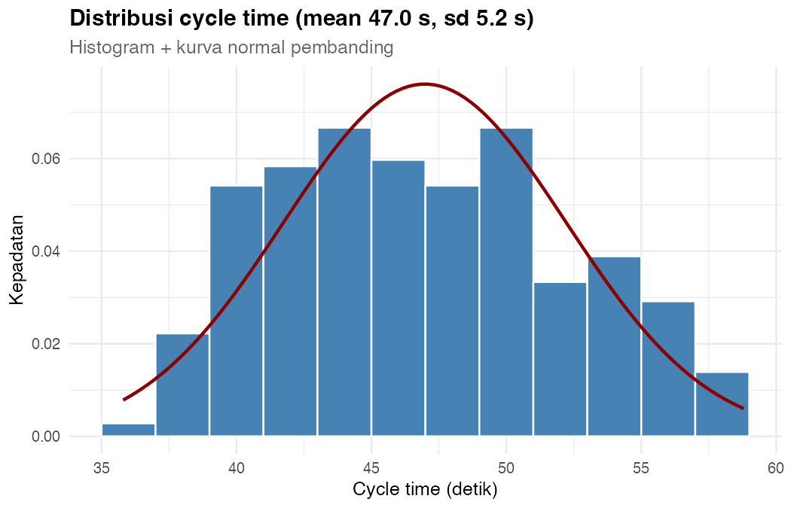

> **Baca begini:** sebaran cycle time kira-kira **simetris dan berbentuk lonceng** (mendekati normal), meski ada sedikit ekor ke kanan. Jarak histogram dari kurva merah menunjukkan seberapa jauh data menyimpang dari normal — ini yang nanti dicek formal dengan uji Shapiro-Wilk.

### 7.2 Q-Q plot — cek normalitas secara visual

Cara lebih presisi: bandingkan **kuantil sampel** dengan **kuantil normal teoretis**.

```r
ggplot(inspeksi, aes(sample = CycleTimeSec)) +
  stat_qq(color = "steelblue", alpha = 0.7) +
  stat_qq_line(color = "darkred", linewidth = 1) +
  labs(title = "Q-Q plot cycle time",
       subtitle = "Titik mengikuti garis = mendekati normal",
       x = "Kuantil teoretis (normal)", y = "Kuantil sampel") +
  theme_minimal(base_size = 12)
```

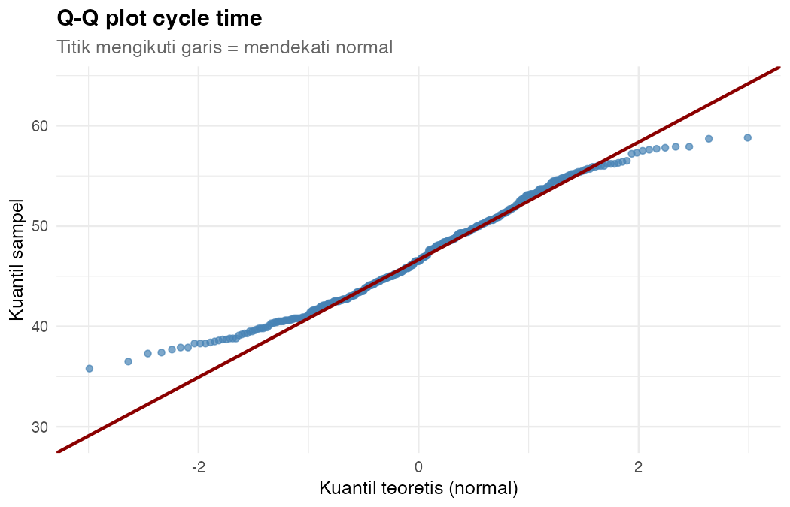

> **Baca begini:** titik-titik mengikuti garis merah dengan cukup baik di tengah, tetapi **melengkung sedikit di kedua ujung** (ekor). Ini sinyal khas data berdistribusi **mendekati normal tapi tidak sempurna** — nanti kita lihat apakah masih aman memakai uji parametrik.

### 7.3 Distribusi sampling & Central Limit Theorem (CLT)

**Ide paling penting dalam inferensi:** rata-rata sampel (x̄) itu sendiri **bervariasi** mengikuti distribusi tertentu. Kalau kita mengambil 1000 sampel dan menghitung rata-ratanya, bentuk sebarannya mendekati **normal** — inilah **Central Limit Theorem**.

```r
set.seed(1)
pop <- inspeksi$CycleTimeSec

clt <- dplyr::bind_rows(lapply(c(5, 30, 100), function(nn) {
  means <- replicate(1000, mean(sample(pop, nn, replace = TRUE)))
  data.frame(n = nn, mean_sampel = means)
}))
clt$n <- factor(clt$n, labels = c("n = 5", "n = 30", "n = 100"))

ggplot(clt, aes(x = mean_sampel)) +
  geom_histogram(bins = 30, fill = "steelblue", color = "white") +
  facet_wrap(~ n, scales = "free") +
  geom_vline(xintercept = mean(pop), color = "darkred", linetype = "dashed") +
  labs(title = "Distribusi sampling rata-rata (simulasi 1000x)",
       subtitle = "Semakin besar n, sebaran makin sempit & makin normal (CLT)",
       x = "Rata-rata sampel cycle time (detik)", y = "Frekuensi") +
  theme_minimal(base_size = 12)
```

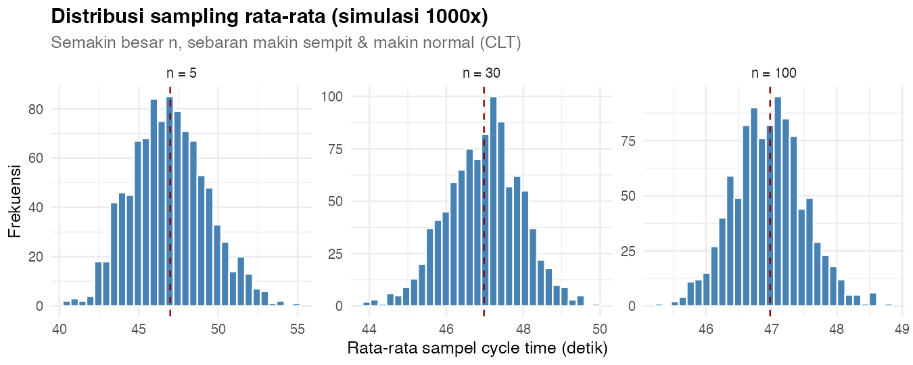

**Standar deviasi dari 1000 rata-rata sampel itu:**

```r
round(tapply(clt$mean_sampel, clt$n, sd), 3)
```

**Output:**

```text
  n = 5  n = 30 n = 100
  2.378   0.965   0.541
```

> **Baca begini:** SD populasi = 5,24 detik, tetapi SD dari **rata-rata sampel** hanya 2,38 (n=5) → 0,97 (n=30) → 0,54 (n=100). Perhatikan: nilainya **mendekati σ/√n** (5,24/√30 ≈ 0,96). Sebaran makin sempit *dan* makin berbentuk lonceng seiring n bertambah — inilah CLT.

### 7.4 Standard error: seberapa "goyah" sebuah estimasi

**Standard error (SE)** mengukur ketidakpastian dari sebuah statistik. Untuk mean: **SE = s / √n**.

```r
se_df <- data.frame(n = 2:200)
se_df$SE <- sd(pop) / sqrt(se_df$n)

ggplot(se_df, aes(x = n, y = SE)) +
  geom_line(color = "steelblue", linewidth = 1) +
  geom_point(data = data.frame(n = c(5, 30, 100), SE = sd(pop) / sqrt(c(5, 30, 100))),
             color = "darkred", size = 2.5) +
  labs(title = "Standard error mengecil seiring bertambahnya n",
       subtitle = "SE = sd / sqrt(n)",
       x = "Ukuran sampel (n)", y = "Standard error (detik)") +
  theme_minimal(base_size = 12)
```

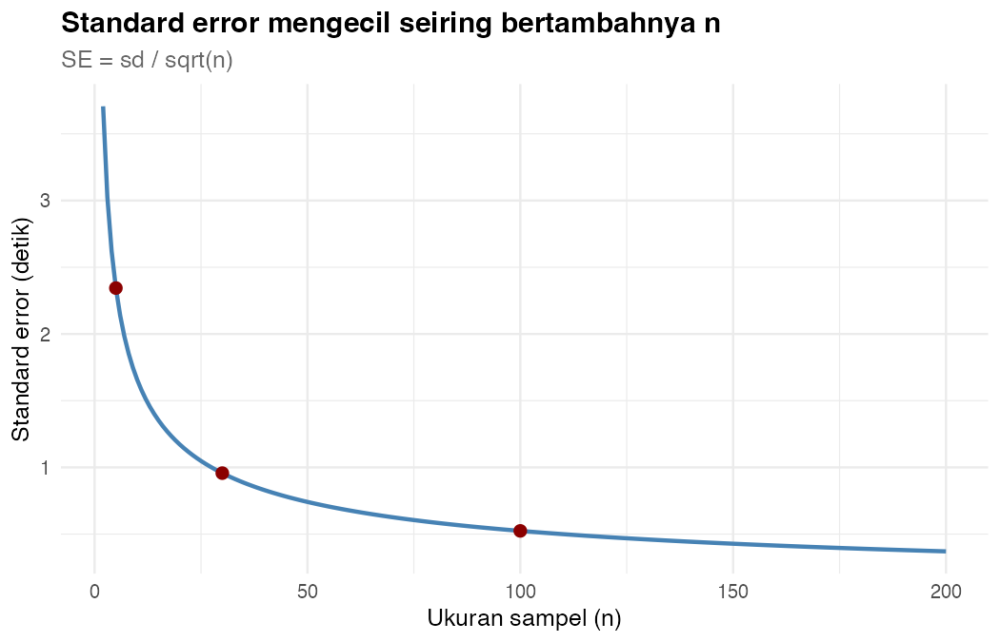

> **Baca begini:** kurva turun tajam sampai n ≈ 30, lalu **melandai**. Konsekuensi praktisnya: menambah sampel dari 10 → 40 memberi perbaikan presisi besar, tetapi dari 200 → 800 nyaris tidak terasa. Inilah alasan *"lebih banyak data"* tidak selalu sebanding dengan usaha.

### 7.5 Distribusi t vs normal

Ketika σ tidak diketahui (hampir selalu) dan n kecil, kita memakai **distribusi t** yang ekornya lebih tebal.

```r
x <- seq(-4, 4, length.out = 400)
dist_df <- dplyr::bind_rows(
  data.frame(x = x, y = dnorm(x), Dist = "Normal(0,1)"),
  data.frame(x = x, y = dt(x, df = 5), Dist = "t (df = 5)")
)
krit <- qt(0.975, df = 5)

ggplot(dist_df, aes(x = x, y = y, color = Dist)) +
  geom_line(linewidth = 1) +
  geom_area(data = subset(dist_df, Dist == "t (df = 5)" & abs(x) >= krit),
            aes(y = y), fill = "darkred", alpha = 0.3, color = NA) +
  scale_color_manual(values = c("Normal(0,1)" = "grey30", "t (df = 5)" = "steelblue")) +
  labs(title = "Distribusi t vs normal",
       subtitle = "Area merah = daerah penolakan (alpha 5%, dua arah)",
       x = "Nilai statistik", y = "Kepadatan", color = NULL) +
  theme_minimal(base_size = 12)
```

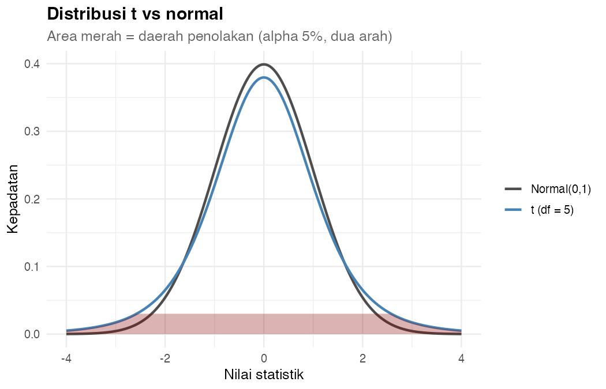

> **Baca begini:** distribusi t (biru) **lebih gemuk di ekor** daripada normal (hitam), sehingga nilai kritis t = 2,57 lebih jauh daripada normal = 1,96. Artinya: dengan sampel kecil, kita **lebih sulit** menyatakan signifikan — konsekuensi jujur dari data yang sedikit.

---

## 8. Estimasi & Interval Kepercayaan

### 8.1 Dari estimasi titik ke interval

Estimasi titik (mis. x̄ = 46,98) tidak memberi tahu **ketidakpastiannya**. Interval kepercayaan (CI) melengkapinya:

```text
CI 95% = x̄ ± t(kritis, df = n-1) × SE,   dengan SE = s / √n
```

```r
ci_mean <- function(x, conf = 0.95) {
  n  <- length(x); m <- mean(x); se <- sd(x) / sqrt(n)
  tc <- qt(1 - (1 - conf) / 2, df = n - 1)
  c(mean = m, se = se, lwr = m - tc * se, upr = m + tc * se)
}

round(ci_mean(inspeksi$CycleTimeSec), 3)          # hitung manual
t.test(inspeksi$CycleTimeSec)$conf.int            # cara instan
```

**Output:**

```text
  mean     se    lwr    upr
46.980  0.276 46.436 47.523

[1] 46.436 47.523
```

> **Baca begini:** kita **95% yakin** rata-rata cycle time populasi ada di antara **46,44 dan 47,52 detik**. "95% yakin" berarti: kalau kita mengulang prosedur ini pada banyak sampel, 95% di antaranya akan memuat μ yang sebenarnya.

### 8.2 CI per lini + visual

```r
ci_per_line <- inspeksi |>
  group_by(Line) |>
  summarise(rata = mean(CycleTimeSec), s = sd(CycleTimeSec), n = n(), .groups = "drop") |>
  mutate(se = s / sqrt(n),
         lwr = rata - qt(0.975, n - 1) * se,
         upr = rata + qt(0.975, n - 1) * se)

ggplot(ci_per_line, aes(x = Line, y = rata, color = Line)) +
  geom_hline(yintercept = mean(inspeksi$CycleTimeSec),
             linetype = "dashed", color = "grey40") +
  geom_point(size = 3.5) +
  geom_errorbar(aes(ymin = lwr, ymax = upr), width = 0.15, linewidth = 1) +
  scale_color_manual(values = c(A = "#4C72B0", B = "#C44E52", C = "#55A868")) +
  labs(title = "Rata-rata cycle time per lini dengan CI 95%",
       subtitle = "Garis putus-putus = rata-rata keseluruhan; CI Lini B tidak menyentuhnya",
       x = "Lini", y = "Cycle time (detik)", color = "Lini") +
  theme_minimal(base_size = 12)
```

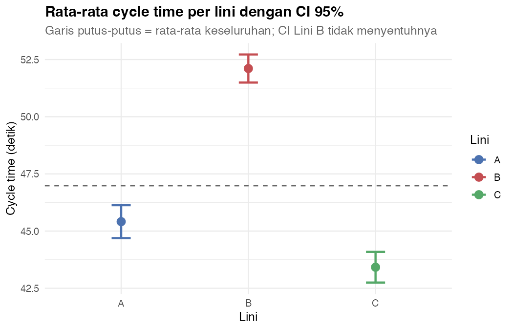

| Line | rata-rata | SE | CI 95% |
| --- | --- | --- | --- |
| A | 45,4 | 0,363 | [44,7; 46,1] |
| B | **52,1** | 0,310 | [51,5; 52,7] |
| C | 43,4 | 0,339 | [42,7; 44,1] |

> **Baca begini:** interval Lini B **jauh di atas** garis rata-rata keseluruhan (46,98) dan **tidak tumpang tindih** dengan A maupun C. Tumpang tindih interval adalah petunjuk visual cepat: **kalau dua CI tidak beririsan, biasanya perbedaannya signifikan**. (Ini heuristik, bukan uji formal — uji formalnya di Bab 10.)

---

## 9. Uji Hipotesis — Kerangka Berpikir

### 9.1 Anatomi sebuah uji hipotesis

| Komponen | Arti | Contoh di Volume 2 |
| --- | --- | --- |
| **H₀ (hipotesis nol)** | "tidak ada efek / tidak ada perbedaan" | μ_A = μ_B |
| **H₁ (hipotesis alternatif)** | "ada efek / ada perbedaan" | μ_A ≠ μ_B |
| **α (taraf signifikansi)** | risiko salah menolak H₀ | 0,05 (5%) |
| **p-value** | peluang melihat data *seekstrem ini* bila H₀ benar | dihitung R |
| **Keputusan** | p < α → tolak H₀; p ≥ α → gagal tolak H₀ | — |

### 9.2 Dua jenis kesalahan — jangan hanya lihat α

| | H₀ benar | H₀ salah |
| --- | --- | --- |
| **Tolak H₀** | ❌ **Type I error** (α) | ✅ Benar (power) |
| **Gagal tolak H₀** | ✅ Benar | ❌ **Type II error** (β) |

- **Type I error (α):** menyatakan "ada efek" padahal tidak ada → *false alarm*.
- **Type II error (β):** menyatakan "tidak ada efek" padahal ada → *melesetkan temuan nyata*.
- **Power = 1 − β:** peluang mendeteksi efek yang benar-benar ada. Standar umum **≥ 0,80**.

> **Catatan penting:** "p = 0,03" **bukan** berarti "95% yakin H₁ benar", dan "gagal tolak H₀" **bukan** berarti "H₀ benar" — hanya "bukti belum cukup". Power & ukuran efek dibahas di Bab 16.

### 9.3 Alur 5 langkah (pakai ini selalu)

```text
1. Rumuskan pertanyaan bisnis + H0/H1
2. Pilih uji (lihat pohon keputusan di Bab 15)
3. Cek asumsi (normalitas, varians, independensi)
4. Jalankan uji → baca statistik, p-value, CI
5. Simpulkan + ukur besar efek + kaitkan ke keputusan
```

---

## 10. Uji t — Membandingkan Rata-rata

### 10.1 Uji t satu sampel

**Pertanyaan:** apakah rata-rata cycle time berbeda dari target 45 detik?

```r
tt1 <- t.test(inspeksi$CycleTimeSec, mu = 45)
tt1
```

**Output:**

```text
1-sampel (mu=45): t = 7.17, df = 359, p = 4.41e-12, CI [46.44; 47.52]
```

> **Baca begini:** p = 4,4×10⁻¹² « 0,05 → **tolak H₀**. Rata-rata cycle time **signifikan berbeda** dari 45 detik. CI [46,44; 47,52] tidak menyentuh 45, memperkuat kesimpulan: proses rata-rata **lebih lambat** dari target.

### 10.2 Uji t dua sampel independen (A vs B)

**Pertanyaan:** apakah cycle time Lini A dan B benar-benar berbeda — atau kebetulan sampling?

```r
ct_a <- inspeksi$CycleTimeSec[inspeksi$Line == "A"]
ct_b <- inspeksi$CycleTimeSec[inspeksi$Line == "B"]

var.test(ct_a, ct_b)                          # cek varians sebanding?
tt2 <- t.test(ct_a, ct_b, var.equal = TRUE)   # var.equal TRUE karena varians sebanding
tt2
```

**Output:**

```text
Uji varians (var.test): p = 0.0853
2-sampel A vs B: t = -14.02, df = 238, p = < 2.2e-16, selisih = 6.69, CI [-7.63; -5.75]
```

> **Baca begini:**
> - `var.test` p = 0,085 > 0,05 → varians kedua lini **sebanding**, maka `var.equal = TRUE` sah.
> - t = −14,02, p < 2,2×10⁻¹⁶ → **tolak H₀**. Lini B rata-rata **6,69 detik lebih lambat**.
> - CI [−7,63; −5,75] **tidak memuat nol** → perbedaan nyata, besarnya antara 5,8 dan 7,6 detik.

### 10.3 Visual uji t dua sampel

```r
sub_ab <- subset(inspeksi, Line %in% c("A", "B"))
sum_ab <- sub_ab |>
  group_by(Line) |>
  summarise(rata = mean(CycleTimeSec), s = sd(CycleTimeSec), n = n(), .groups = "drop") |>
  mutate(se = s / sqrt(n),
         lwr = rata - qt(0.975, n - 1) * se, upr = rata + qt(0.975, n - 1) * se)

ggplot(sub_ab, aes(x = Line, y = CycleTimeSec, fill = Line)) +
  geom_boxplot(alpha = 0.55, width = 0.5, outlier.shape = NA) +
  geom_jitter(width = 0.12, alpha = 0.3, size = 1) +
  geom_pointrange(data = sum_ab, aes(y = rata, ymin = lwr, ymax = upr),
                  color = "black", size = 0.8, linewidth = 0.8) +
  scale_fill_manual(values = c(A = "#4C72B0", B = "#C44E52")) +
  labs(title = "Cycle time Lini A vs B - uji t dua sampel",
       subtitle = "t = -14.02, p < 2.2e-16, selisih mean 6.69 detik (Cohen's d = 1.81)",
       x = "Lini", y = "Cycle time (detik)", fill = "Lini") +
  theme_minimal(base_size = 12)
```

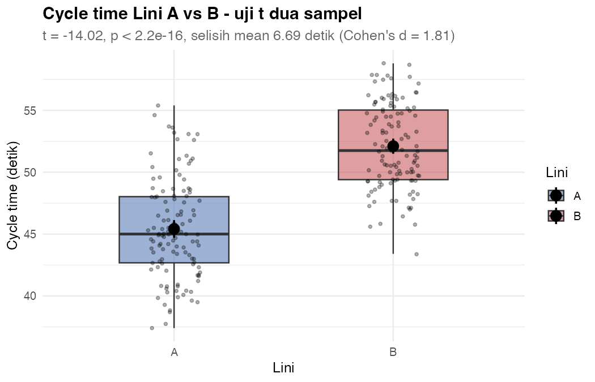

> **Baca begini:** kotak (IQR) kedua lini **nyaris tidak bertumpuk**, dan titik hitam (rata-rata ± CI 95%) terpisah jauh. Ini perbedaan yang **kasat mata sekaligus terverifikasi secara statistik**. Cohen's d = 1,81 tergolong **efek sangat besar**.

---

### 10.4 Uji t berpasangan (data sebelum–sesudah)

**Pertanyaan:** apakah pelatihan **benar-benar** menurunkan cycle time? Karena operator yang sama diukur dua kali, kita **wajib** memakai uji berpasangan (bukan dua sampel independen).

```r
tt3 <- t.test(pelatihan$CycleTimeSebelum, pelatihan$CycleTimeSesudah, paired = TRUE)
tt3
```

**Output:**

```text
Berpasangan: t = 13.56, df = 29, p = 4.43e-14, selisih = 4.70, CI [3.99; 5.41]
```

```r
library(tidyr)
long_pel <- pelatihan |>
  pivot_longer(c(CycleTimeSebelum, CycleTimeSesudah),
               names_to = "Waktu", values_to = "CT") |>
  mutate(Waktu = factor(Waktu, levels = c("CycleTimeSebelum", "CycleTimeSesudah"),
                        labels = c("Sebelum", "Sesudah")))

ggplot(long_pel, aes(x = Waktu, y = CT, group = Operator)) +
  geom_line(alpha = 0.3, color = "steelblue") +
  geom_point(alpha = 0.45, color = "steelblue", size = 1.5) +
  stat_summary(aes(group = 1), fun = mean, geom = "line", color = "darkred", linewidth = 1.4) +
  stat_summary(aes(group = 1), fun = mean, geom = "point", color = "darkred", size = 3.5) +
  labs(title = "Cycle time sebelum vs sesudah pelatihan (berpasangan, n = 30)",
       subtitle = "Selisih mean 4.70 detik; t = 13.56; p = 4.43e-14",
       x = NULL, y = "Cycle time (detik)") +
  theme_minimal(base_size = 12)
```

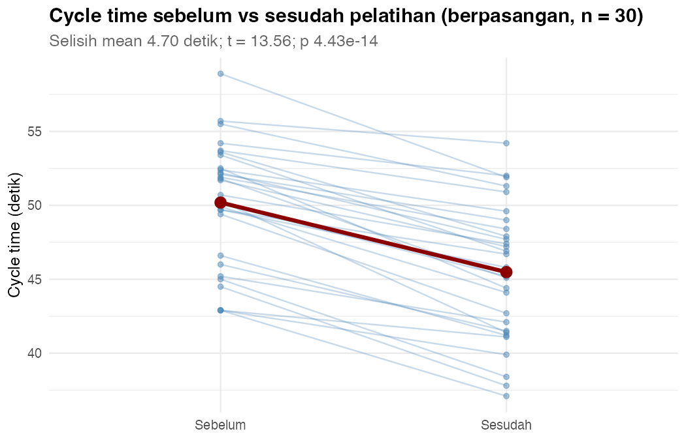

> **Baca begini:** hampir **semua garis operator turun** dari Sebelum → Sesudah, dan garis merah tebal (rata-rata) turun **4,70 detik**. Karena tiap orang jadi "kontrol bagi dirinya sendiri", variasi antar-operator tersingkir — inilah mengapa uji berpasangan jauh lebih sensitif. Mengapa tidak pakai uji dua sampel biasa? Karena data **tidak independen**; memaksakannya akan membuat kesimpulan terlalu percaya diri.

**Ringkasan tiga uji t:**

| Uji | Pertanyaan | Statistik | p-value | Kesimpulan |
| --- | --- | --- | --- | --- |
| 1 sampel | μ = 45 s? | t = 7,17 | 4,41×10⁻¹² | berbeda dari 45 s |
| 2 sampel | μ_A = μ_B? | t = −14,02 | < 2,2×10⁻¹⁶ | B lebih lambat 6,69 s |
| berpasangan | μ_sebelum = μ_sesudah? | t = 13,56 | 4,43×10⁻¹⁴ | turun 4,70 s |

---

## 11. Uji Proporsi & Chi-Square

### 11.1 Data defect bersifat proporsi

Cycle time diukur sebagai **angka**, tapi defect diukur sebagai **proporsi** (`Defect / Inspected`). Untuk itu kita pakai **uji proporsi** dan **chi-square**, bukan uji t.

```r
agg_line <- inspeksi |>
  group_by(Line) |>
  summarise(Defect = sum(Defect), Inspected = sum(Inspected), .groups = "drop") |>
  mutate(Rate = Defect / Inspected)
agg_line
```

**Output:**

```text
  Line  Defect Inspected   Rate
1 A        524     15478 0.0339
2 B       1541     15561 0.0990
3 C        645     15566 0.0414
```

### 11.2 Uji proporsi dua lini (A vs B)

```r
prop_ab <- prop.test(
  x = c(agg_line$Defect[1], agg_line$Defect[2]),
  n = c(agg_line$Inspected[1], agg_line$Inspected[2])
)
prop_ab
```

**Output:**

```text
prop.test A vs B: X2 = 529.71, df = 1, p = < 2.2e-16, selisih rate = 0.0652
```

> **Baca begini:** dengan ~15,5 ribu unit per lini, selisih defect rate **3,39% vs 9,90% (6,52 poin persen)** menghasilkan χ² = 529,7 dan p « 0,001. Perbedaan ini **pasti bukan kebetulan** — defect Lini B bersifat **sistemik**.

### 11.3 Uji proporsi satu sampel: apakah defect rate = 5%?

```r
prop.test(sum(inspeksi$Defect), sum(inspeksi$Inspected), p = 0.05)
```

**Output:**

```text
prop.test 1-sampel (target 5%): X2 = 64.97, p = 7.6e-16, CI [0.0560; 0.0603]
```

> **Baca begini:** defect rate keseluruhan **5,8%**, dan CI [5,60%; 6,03%] **tidak memuat 5%** → secara statistik proses **melampaui** ambang 5%. Contoh menarik: selisih 0,8 poin persen tampak "kecil", tetapi dengan sampel 46 ribu unit ia **signifikan secara statistik**. Apakah *signifikan secara praktis*? Itu keputusan manajemen, bukan R.

### 11.4 Chi-square: hubungan dua kategori (Shift × kategori defect)

Klasifikasikan tiap inspeksi sebagai **"Tinggi"** bila `DefectRate > 0.05`, lalu uji apakah **Shift** dan **kategori defect** saling terkait.

```r
inspeksi2 <- inspeksi |>
  mutate(DefectCat = ifelse(DefectRate > 0.05, "Tinggi", "Rendah"))

tab <- table(inspeksi2$Shift, inspeksi2$DefectCat)
prop.table(tab, 1)          # proporsi per baris
chisq.test(tab)
```

**Output (tabel & proporsi):**

```text
        Rendah Tinggi
  Pagi      77     43
  Siang     72     48
  Malam     40     80

        Rendah Tinggi
  Pagi   0.642  0.358
  Siang  0.600  0.400
  Malam  0.333  0.667

X-squared = 26.93, df = 2, p-value = 1.42e-06
```

```r
# Cramer's V — ukuran kekuatan hubungan (0 = tak ada, 1 = sempurna)
sqrt(as.numeric(chisq.test(tab)$statistic) / (sum(tab) * (min(dim(tab)) - 1)))
```

**Output:**

```text
Cramer's V = 0.274
```

> **Baca begini:** p = 1,4×10⁻⁶ → **tolak H₀**, **Shift dan kategori defect tidak independen**. Lihat proporsinya: shift Malam **66,7%** masuk kategori "Tinggi", nyaris dua kali shift Pagi (35,8%). Tapi Cramer's V = 0,27 menunjukkan hubungan ini **lemah–sedang** — signifikan ≠ kuat.

### 11.5 Defect rate per shift + CI

```r
prop_df <- inspeksi |>
  group_by(Shift) |>
  summarise(Defect = sum(Defect), Inspected = sum(Inspected), .groups = "drop") |>
  mutate(Rate = Defect / Inspected,
         se = sqrt(Rate * (1 - Rate) / Inspected),
         lwr = Rate - 1.96 * se, upr = Rate + 1.96 * se)

ggplot(prop_df, aes(x = Shift, y = Rate, fill = Shift)) +
  geom_col(alpha = 0.85, width = 0.6) +
  geom_errorbar(aes(ymin = lwr, ymax = upr), width = 0.15, linewidth = 0.9) +
  scale_y_continuous(labels = percent_format(accuracy = 0.1)) +
  scale_fill_manual(values = c(Pagi = "#55A868", Siang = "#DD8452", Malam = "#C44E52")) +
  labs(title = "Defect rate per shift dengan CI 95%",
       subtitle = "Chi-square Shift x kategori defect: p = 1.42e-06",
       x = "Shift", y = "Defect rate", fill = "Shift") +
  theme_minimal(base_size = 12)
```

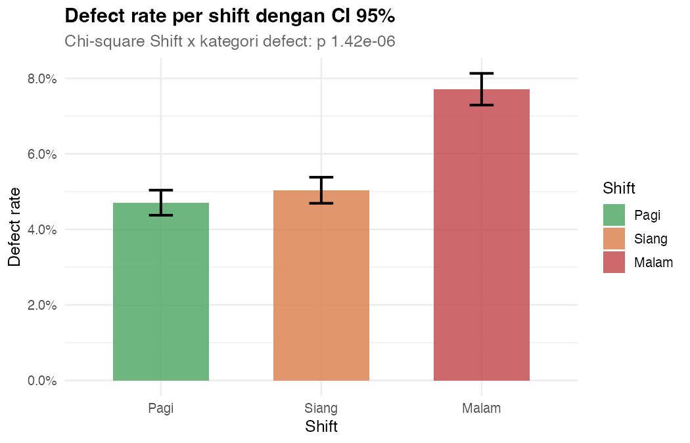

| Shift | Defect | Inspected | Defect rate | CI 95% |
| --- | --- | --- | --- | --- |
| Pagi | 736 | 15.635 | 4,71% | [4,38%; 5,04%] |
| Siang | 780 | 15.487 | 5,04% | [4,69%; 5,38%] |
| Malam | 1.194 | 15.483 | **7,71%** | [7,29%; 8,13%] |

> **Baca begini:** batang Malam **jauh lebih tinggi**, dan CI-nya **tidak menyentuh** CI Pagi maupun Siang. Bukti visual dan statistik sepakat: **shift malam adalah sumber risiko utama**.

---

## 12. ANOVA Satu Arah & Post-hoc Tukey

### 12.1 Mengapa bukan tiga kali uji t?

Untuk membandingkan **3 lini atau lebih**, menjalankan uji t berpasangan-pasangan itu **salah**: setiap uji menambah risiko Type I error, sehingga peluang *false alarm* membengkak jauh di atas 5%. **ANOVA** menguji semuanya sekaligus dengan satu tingkat α.

| Pengujian | H₀ |
| --- | --- |
| ANOVA | μ_A = μ_B = μ_C (semua sama) |
| H₁ | minimal satu lini berbeda |

```r
anova_fit <- aov(CycleTimeSec ~ Line, data = inspeksi)
summary(anova_fit)
```

**Output:**

```text
             Df Sum Sq Mean Sq F value Pr(>F)
Line          2   4970  2484.8   181.3 <2e-16 ***
Residuals   357   4894    13.7
```

```r
# Eta squared — proporsi variasi yang dijelaskan oleh Line
summary(anova_fit)[[1]][["Sum Sq"]][1] / sum(summary(anova_fit)[[1]][["Sum Sq"]])
```

**Output:**

```text
Eta squared = 0.504
```

> **Baca begini:** F = 181,3, p < 2×10⁻¹⁶ → **tolak H₀**, **minimal satu lini berbeda**. Eta squared = 0,50 berarti **50,4% variasi cycle time dijelaskan oleh lini** — efek yang sangat besar.

### 12.2 Visual ANOVA

```r
ggplot(inspeksi, aes(x = Line, y = CycleTimeSec, fill = Line)) +
  geom_boxplot(alpha = 0.6, width = 0.55, outlier.shape = NA) +
  geom_jitter(width = 0.13, alpha = 0.25, size = 1) +
  stat_summary(fun = mean, geom = "point", shape = 23, size = 3, fill = "white") +
  scale_fill_manual(values = c(A = "#4C72B0", B = "#C44E52", C = "#55A868")) +
  labs(title = "Cycle time per lini - ANOVA satu arah",
       subtitle = "F = 181.3; p < 2e-16; eta squared = 0.50 (efek besar)",
       x = "Lini", y = "Cycle time (detik)", fill = "Lini") +
  theme_minimal(base_size = 12)
```

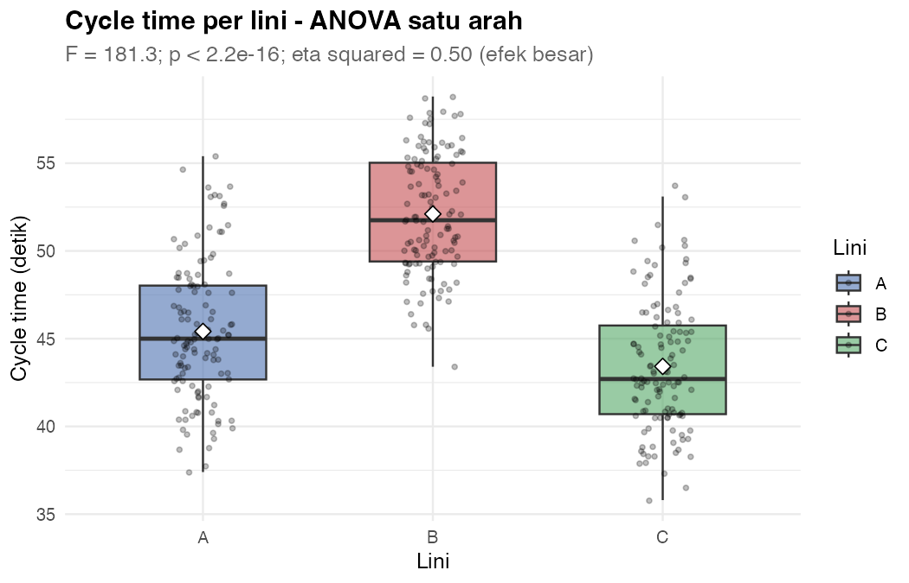

> **Baca begini:** kotak Lini B jelas **bergeser ke atas**, sementara A dan C lebih rendah dan berdekatan. ANOVA berkata "ada perbedaan" — tetapi **belum berkata yang mana**. Untuk itu perlu post-hoc.

### 12.3 Post-hoc Tukey HSD — pasangan mana yang berbeda?

```r
tukey <- TukeyHSD(anova_fit)
tukey
```

**Output:**

```text
$Line
         diff       lwr        upr     p adj
B-A  6.694167  5.569235  7.8190980 0.0000000
C-A -1.992500 -3.117431 -0.8675686 0.0001138
C-B -8.686667 -9.811598 -7.5617353 0.0000000
```

> **Baca begini:** **ketiga pasangan berbeda signifikan** (semua `p adj` < 0,001):
> - **B − A = +6,69 s** → B lebih lambat
> - **C − A = −1,99 s** → C lebih cepat
> - **C − B = −8,69 s** → C jauh lebih cepat
>
> Urutan kecepatan: **C (43,4 s) < A (45,4 s) < B (52,1 s)**. Tukey mengoreksi p-value untuk banyak perbandingan (*family-wise error*), sehingga tetap dapat dipercaya.

```r
library(broom)
tukey_df <- tidy(tukey) |>
  mutate(pair = gsub("-", " vs ", contrast),
         signif = ifelse(adj.p.value < 0.05, "Signifikan", "Tidak signifikan"))

ggplot(tukey_df, aes(x = estimate, y = reorder(pair, estimate), color = signif)) +
  geom_vline(xintercept = 0, linetype = "dashed", color = "grey50") +
  geom_pointrange(aes(xmin = conf.low, xmax = conf.high), linewidth = 1, size = 0.8) +
  scale_color_manual(values = c("Signifikan" = "#C44E52", "Tidak signifikan" = "grey60")) +
  labs(title = "Post-hoc Tukey HSD - selisih cycle time antar lini",
       subtitle = "Interval yang tidak memuat nol = berbeda nyata",
       x = "Selisih rata-rata (detik)", y = NULL, color = NULL) +
  theme_minimal(base_size = 12)
```

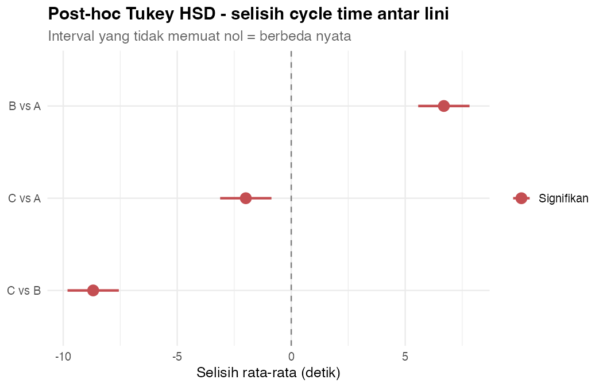

> **Baca begini:** ketiga interval **tidak ada yang menyentuh garis nol** → semua pasangan berbeda nyata. Cara membaca Tukey secara visual: **kalau CI memuat nol, berarti "tidak bisa dibedakan"**.

### 12.4 Cek asumsi ANOVA

```r
shapiro.test(resid(anova_fit))                       # normalitas residual
var.test(inspeksi$CycleTimeSec[inspeksi$Line == "A"],
         inspeksi$CycleTimeSec[inspeksi$Line == "C"]) # homogenitas varians
```

**Output:**

```text
Shapiro-Wilk residual: p = 0.00393
Levene/var.test A vs C: p = 0.447
```

> **Baca begini:** homogenitas varians **aman** (p = 0,447 > 0,05). Normalitas residual **menyimpang sedikit** (p = 0,004), tetapi ingat: ANOVA **cukup tangguh (robust)** terhadap pelanggaran normalitas ringan selama n tiap kelompok besar & seimbang (di sini n = 120 per lini). Bila ragu, bandingkan dengan **Kruskal-Wallis** di Bab 15 — hasilnya akan sama-sama signifikan.

---

## 13. Korelasi

### 13.1 Korelasi Pearson vs Spearman

| Ukuran | Mengukur | Asumsi |
| --- | --- | --- |
| **Pearson (r)** | hubungan **linear** dua variabel numerik | normal, tanpa outlier ekstrem |
| **Spearman (ρ)** | hubungan **monotonik** (berbasis peringkat) | tidak butuh normal |

```r
cor.test(inspeksi$CycleTimeSec, inspeksi$DefectRate, method = "pearson")
cor.test(inspeksi$CycleTimeSec, inspeksi$DefectRate, method = "spearman")
```

**Output:**

```text
Pearson : r = 0.573, p = < 2.2e-16, CI [0.499; 0.639]
Spearman: rho = 0.563, p = < 2.2e-16
R-squared = 0.329 (cycle time menjelaskan 32.9% variasi defect rate)
```

> **Baca begini:** r = 0,57 → hubungan **positif sedang**: makin lama cycle time, makin tinggi defect rate. Nilai Spearman (0,56) **hampir sama** → hubungannya cukup linear dan tidak digerakkan oleh outlier. `r² = 0,33` artinya **33% variasi** defect rate "menempel" pada cycle time; sisanya 67% dijelaskan faktor lain.

### 13.2 Visual korelasi

```r
ggplot(inspeksi, aes(x = CycleTimeSec, y = DefectRate)) +
  geom_point(alpha = 0.4, color = "steelblue") +
  geom_smooth(method = "lm", formula = y ~ x, color = "darkred", se = TRUE) +
  scale_y_continuous(labels = percent_format(accuracy = 1)) +
  labs(title = "Korelasi cycle time vs defect rate",
       subtitle = "Pearson r = 0.57 (p < 2.2e-16); R-squared = 0.33",
       x = "Cycle time (detik)", y = "Defect rate") +
  theme_minimal(base_size = 12)
```

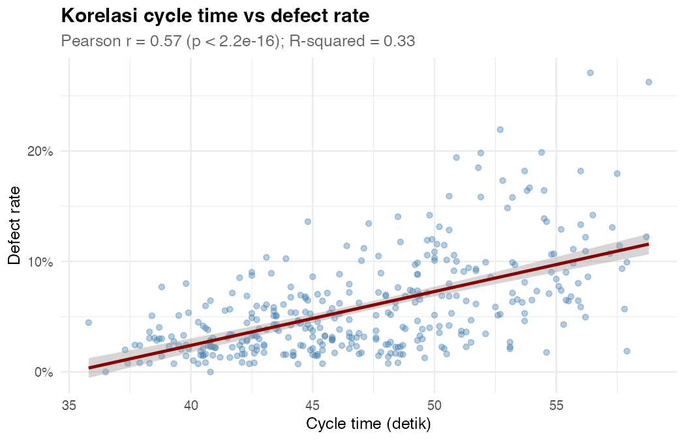

> **Baca begini:** awan titik cenderung **naik ke kanan**, dengan pita abu-abu (CI 95% garis) yang sempit — hubungan cukup mantap. Namun awan tetap **lebar**: pada cycle time yang sama, defect rate masih bisa bervariasi banyak *(ingat: korelasi ≠ kausalitas!)*.

### 13.3 Heatmap matriks korelasi

```r
num <- inspeksi |> select(Inspected, Defect, DefectRate, CycleTimeSec)
cor_long <- as.data.frame(as.table(cor(num)))
names(cor_long) <- c("Var1", "Var2", "r")

ggplot(cor_long, aes(x = Var1, y = Var2, fill = r)) +
  geom_tile(color = "white") +
  geom_text(aes(label = sprintf("%.2f", r)), size = 3.5) +
  scale_fill_gradient2(low = "#4C72B0", mid = "white", high = "#C44E52",
                       midpoint = 0, limits = c(-1, 1)) +
  labs(title = "Matriks korelasi variabel numerik", x = NULL, y = NULL, fill = "r") +
  coord_fixed() + theme_minimal(base_size = 12)
```

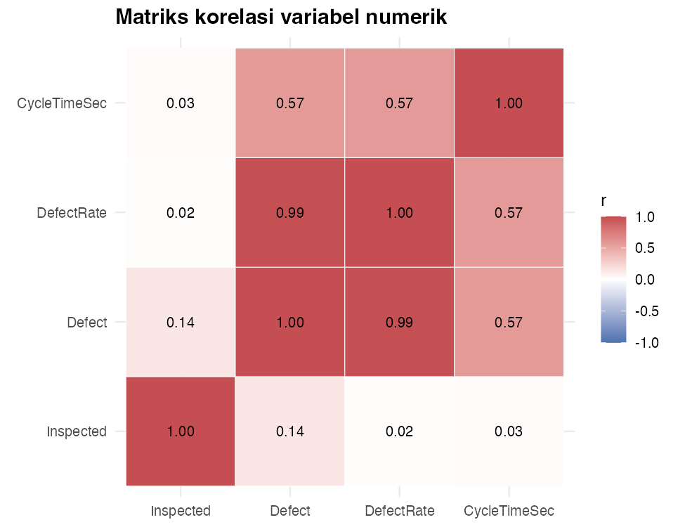

> **Baca begini:** merah = korelasi positif, biru = negatif. Perhatikan `Defect` dan `DefectRate` berkorelasi tinggi (keduanya memang sekandung), sedangkan `CycleTimeSec` vs `DefectRate` sedang (0,57). Heatmap ini cara cepat memindai **multikolinearitas** sebelum membangun regresi.

---

## 14. Regresi Linear

### 14.1 Regresi sederhana: memprediksi defect rate dari cycle time

Korelasi hanya menyatakan "ada hubungan"; **regresi** memberi tahu **besar dan arah** hubungan dalam satuan nyata, plus kemampuan memprediksi.

```r
reg1 <- lm(DefectRate ~ CycleTimeSec, data = inspeksi)
summary(reg1)
```

**Output (inti):**

```text
               Estimate Std. Error t value Pr(>|t|)
(Intercept)  -0.1709250  0.0174104  -9.817   <2e-16 ***
CycleTimeSec  0.0048746  0.0003683  13.235   <2e-16 ***

Residual standard error: 0.03658 on 358 degrees of freedom
Multiple R-squared:  0.3285,	Adjusted R-squared:  0.3267
F-statistic: 175.2 on 1 and 358 DF,  p-value: < 2.2e-16
```

```r
# Prediksi defect rate pada cycle time tertentu
predict(reg1, newdata = data.frame(CycleTimeSec = c(40, 45, 50, 55)),
        interval = "confidence")
```

**Output:**

```text
  CycleTimeSec    fit    lwr    upr
1           40 0.0241 0.0177 0.0304
2           45 0.0484 0.0444 0.0525
3           50 0.0728 0.0684 0.0772
4           55 0.0972 0.0902 0.1041
```

> **Baca begini:**
> - **Intercept = −0,1709:** nilai teoretis saat cycle time = 0 (tidak bermakna secara praktis — ini hanya titik potong).
> - **Slope = +0,00487:** setiap **+1 detik** cycle time menaikkan defect rate sekitar **0,49 poin persen**.
> - **R² = 0,329:** model menjelaskan **32,9%** variasi defect rate; 67% sisanya dari faktor lain.
> - Prediksi pada 50 detik: defect rate ≈ **7,28%** (CI [6,84%; 7,72%]).

### 14.2 Visual garis regresi

```r
ggplot(inspeksi, aes(x = CycleTimeSec, y = DefectRate)) +
  geom_point(alpha = 0.35, color = "steelblue") +
  geom_smooth(method = "lm", formula = y ~ x, color = "darkred", fill = "darkred",
              alpha = 0.15) +
  scale_y_continuous(labels = percent_format(accuracy = 1)) +
  labs(title = "Regresi sederhana: defect rate ~ cycle time",
       subtitle = "DefectRate = -0.1709 + 0.00487 x CycleTimeSec (R-squared = 0.33)",
       x = "Cycle time (detik)", y = "Defect rate") +
  theme_minimal(base_size = 12)
```

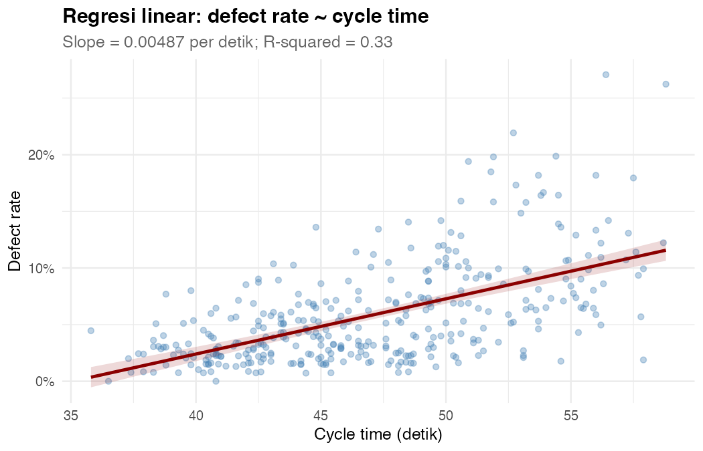

> **Baca begini:** garis merah miring ke atas, dengan pita CI 95% yang sempit di tengah (dekat rata-rata data) dan melebar di ujung. **Jangan mengekstrapolasi** jauh di luar rentang data — garis hanya "terbukti" di rentang pengamatan (~36–59 detik).

### 14.3 Cek asumsi regresi — diagnostik residual

Empat asumsi klasik: **(1) linearitas, (2) normalitas residual, (3) homogenitas varians (homoskedastisitas), (4) independensi.**

```r
par(mfrow = c(2, 2))
plot(reg1)
par(mfrow = c(1, 1))
```

```r
# Versi ggplot2 yang bisa disimpan
diag_df <- data.frame(fitted = fitted(reg1), resid = resid(reg1),
                      std_resid = rstandard(reg1))

ggplot(diag_df, aes(x = fitted, y = std_resid)) +
  geom_point(alpha = 0.4, color = "steelblue") +
  geom_hline(yintercept = 0, color = "darkred", linetype = "dashed") +
  geom_smooth(method = "loess", formula = y ~ x, color = "orange", se = FALSE) +
  labs(title = "Residual vs fitted",
       subtitle = "Pola acak di sekitar nol = asumsi linearitas & homoskedastisitas wajar",
       x = "Nilai fitted", y = "Residual terstandardisasi") +
  theme_minimal(base_size = 12)
```

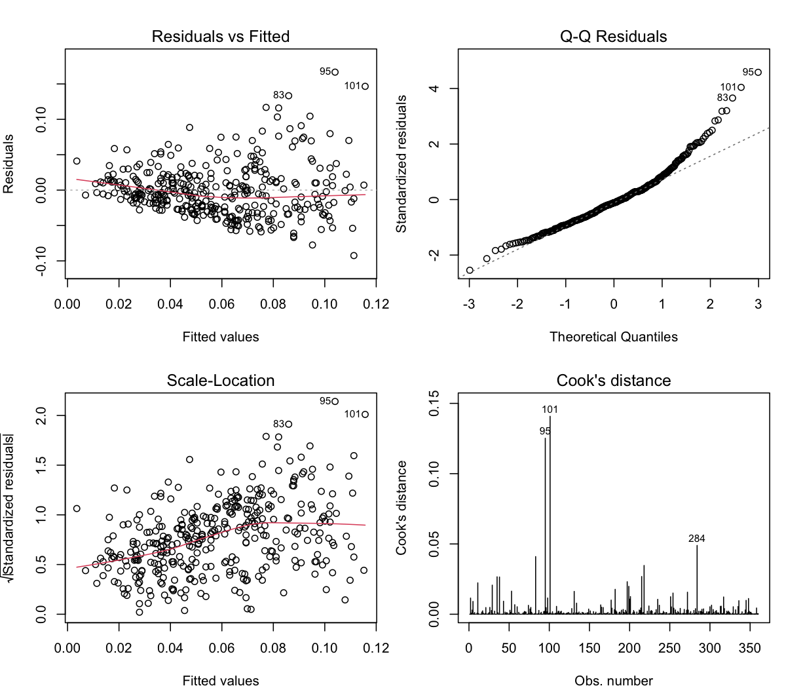

> **Baca begini:** titik-titik **menyebar acak** di sekitar garis nol tanpa pola corong/melengkung → asumsi linearitas & varians **wajar**. Bila muncul pola corong (melebar ke kanan), itu tanda heteroskedastisitas → pertimbangkan transformasi `log()` atau *robust standard errors*.

---

### 14.4 Regresi berganda: tambah Line & Shift

Regresi sederhana mengabaikan bahwa Line & Shift juga memengaruhi defect. **Regresi berganda** memasukkan semuanya sekaligus → mengungkap efek **masing-masing faktor** setelah dikontrol faktor lain.

```r
reg2 <- lm(DefectRate ~ CycleTimeSec + Line + Shift, data = inspeksi)
summary(reg2)
```

**Output (inti):**

```text
               Estimate Std. Error t value Pr(>|t|)
(Intercept)  -0.0407639  0.0210822  -1.934  0.05396 .
CycleTimeSec  0.0014529  0.0004776   3.042  0.00253 **
LineB         0.0551110  0.0051083  10.788  < 2e-16 ***
LineC         0.0105536  0.0040961   2.576  0.01039 *
ShiftSiang    0.0004054  0.0041544   0.098  0.92233
ShiftMalam    0.0256915  0.0042910   5.987 5.24e-09 ***

Multiple R-squared:  0.5274,	Adjusted R-squared:  0.5207
```

> **Baca begini — ini yang penting:**
> - **R² naik 0,329 → 0,527.** Menambah Line & Shift menaikkan daya jelas model **20 poin persen**. Jadi cycle time **bukan** satu-satunya cerita.
> - **Slope cycle time menyusut** dari 0,00487 → 0,00145 setelah dikontrol. Artinya: **sebagian besar korelasi cycle time–defect sebenarnya "titipan" dari Line**. Ini contoh nyata **confounding** — variabel ketiga yang memengaruhi keduanya.
> - **LineB = +5,51 poin persen** (p < 2×10⁻¹⁶): setelah mengontrol cycle time & shift, Lini B **tetap** lebih buruk. Bukti kuat bahwa masalah Lini B bukan sekadar "prosesnya lambat".
> - **ShiftMalam = +2,57 poin persen** (p = 5,2×10⁻⁹): efek shift malam juga **nyata** dan mandiri.
> - **ShiftSiang = 0,0004** (p = 0,92): **tidak signifikan** — shift siang praktis sama dengan pagi.

```r
library(broom)
tidy(reg2, conf.int = TRUE) |>
  filter(term != "(Intercept)") |>
  mutate(term = recode(term, "CycleTimeSec" = "Cycle time (+1 s)",
                       "LineB" = "Line B (vs A)", "LineC" = "Line C (vs A)",
                       "ShiftSiang" = "Shift Siang (vs Pagi)",
                       "ShiftMalam" = "Shift Malam (vs Pagi)"),
         signif = ifelse(p.value < 0.05, "Signifikan", "Tidak signifikan")) |>
  ggplot(aes(x = estimate, y = reorder(term, estimate), color = signif)) +
  geom_vline(xintercept = 0, linetype = "dashed", color = "grey50") +
  geom_pointrange(aes(xmin = conf.low, xmax = conf.high), linewidth = 1, size = 0.7) +
  scale_color_manual(values = c("Signifikan" = "#C44E52", "Tidak signifikan" = "grey60")) +
  labs(title = "Koefisien regresi berganda (with CI 95%)",
       subtitle = "Interval yang tidak memuat nol = prediktor signifikan",
       x = "Perubahan defect rate", y = NULL, color = NULL) +
  theme_minimal(base_size = 12)
```

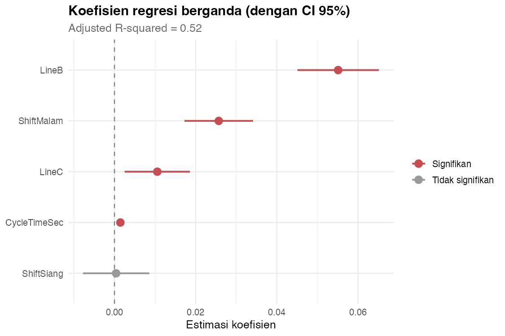

> **Baca begini:** tiap titik = besar efek, garis = CI 95%. **Line B** punya interval terjauh dari nol (efek terbesar), menyusul **Shift Malam** dan **Cycle time**. **Shift Siang** memotong garis nol → **tidak signifikan**. Ini gambar "ringkasan laporan manajemen" paling cepat: sekali lihat, tahu faktor mana yang benar-benar bergerak.

---

## 15. Uji Non-Parametrik & Uji Normalitas

### 15.1 Kapan pakai non-parametrik?

Uji parametrik (t, ANOVA) mengasumsikan normalitas. Bila data **menyimpang jauh** dari normal, punya **outlier ekstrem**, atau berskala **ordinal/peringkat**, gunakan padanan non-parametrik.

| Situasi | Parametrik | Non-parametrik |
| --- | --- | --- |
| 2 sampel independen | uji t | **Mann-Whitney U** |
| 3+ sampel | ANOVA | **Kruskal-Wallis** |
| 2 sampel berpasangan | t berpasangan | **Wilcoxon signed-rank** |
| Ukuran asosiasi | Pearson r | **Spearman ρ** |

### 15.2 Uji normalitas

```r
shapiro.test(inspeksi$CycleTimeSec)                              # H0: data normal
ks.test(inspeksi$CycleTimeSec, "pnorm",
        mean = mean(inspeksi$CycleTimeSec), sd = sd(inspeksi$CycleTimeSec))
```

**Output:**

```text
Shapiro-Wilk cycle time: p = 3.5e-05
Kolmogorov-Smirnov cycle time: p = 0.188
```

> **Baca begini:** kedua uji **berbeda kesimpulan** (p = 0,000035 vs 0,188). Mengapa? Uji **Shapiro** sangat sensitif pada n besar (di sini n = 360) — perbedaan kecil dari normal bisa jadi "signifikan". Karena itu, **jangan hanya mengandalkan p-value normalitas**: lihat juga **Q-Q plot** (V02) yang tadi titiknya hampir lurus. Dalam praktik, dengan n besar ANOVA tetap aman.

### 15.3 Non-parametrik sebagai pembanding

```r
wilcox.test(ct_a, ct_b)                                    # Mann-Whitney (A vs B)
kruskal.test(CycleTimeSec ~ Line, data = inspeksi)         # Kruskal-Wallis (3 lini)
wilcox.test(pelatihan$CycleTimeSebelum,
            pelatihan$CycleTimeSesudah, paired = TRUE)     # Wilcoxon berpasangan
```

**Output:**

```text
Mann-Whitney A vs B: W = 1532, p = < 2.2e-16
Kruskal-Wallis (Line): chi-sq = 180.41, df = 2, p = < 2.2e-16
Wilcoxon berpasangan: V = 465, p = 1.86e-09
```

> **Baca begini:** **kesimpulan sama** dengan versi parametrik — parametrik dan non-parametrik saling memperkuat. Ini prinsip yang baik: **bila dua pendekatan berbeda pada asumsi memberi kesimpulan sama, keyakinan kita naik**. (Mann-Whitney A vs B: uji t tadi t = −14,02 p < 2×10⁻¹⁶; kini W = 1532, p < 2×10⁻¹⁶ — sepakat.)

### 15.4 Visual: parametrik vs non-parametrik

```r
perbandingan <- data.frame(
  Uji = c("t-test\n(2 sampel)", "Mann-Whitney", "ANOVA", "Kruskal-Wallis",
          "t-test\n(berpasangan)", "Wilcoxon"),
  p_neg_log = -log10(c(2.2e-16, 2.2e-16, 2.2e-16, 2.2e-16, 4.43e-14, 1.86e-09)),
  Kelompok = c("Parametrik", "Non-parametrik", "Parametrik", "Non-parametrik",
               "Parametrik", "Non-parametrik")
)

ggplot(perbandingan, aes(x = Uji, y = p_neg_log, fill = Kelompok)) +
  geom_col(alpha = 0.85, width = 0.65) +
  geom_hline(yintercept = -log10(0.05), linetype = "dashed", color = "darkred") +
  coord_flip() +
  scale_fill_manual(values = c(Parametrik = "#4C72B0", `Non-parametrik` = "#DD8452")) +
  labs(title = "Kesepakatan uji parametrik vs non-parametrik",
       subtitle = "Batang lebih tinggi = p-value lebih kecil (semakin signifikan)",
       x = NULL, y = "-log10(p-value)") +
  theme_minimal(base_size = 12)
```

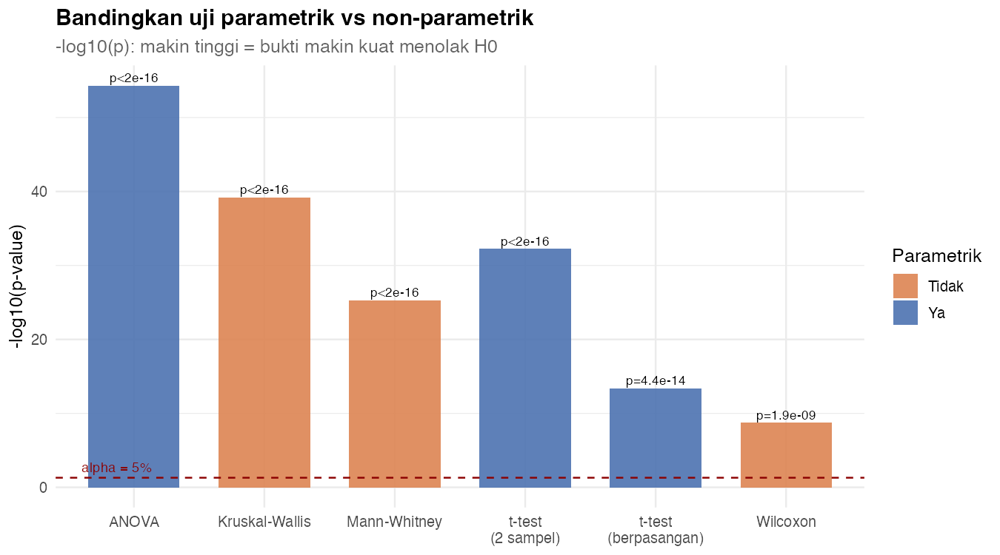

> **Baca begini:** semua batang **jauh melampaui** garis putus-putus (ambang α = 0,05) dan pasangan parametrik/non-parametrik berdampingan setara tinggi. Kesimpulan: **temuan kita tidak bergantung pada pilihan uji** — tanda kesimpulan yang kokoh.

---

## 16. Ukuran Efek & Power

### 16.1 Mengapa p-value saja tidak cukup

| p-value menjawab | p-value **tidak** menjawab |
| --- | --- |
| "Apakah efeknya nyata (bukan kebetulan)?" | "Seberapa **besar** efeknya?" |
| — | "Apakah efeknya **penting** secara praktis?" |

Sampel besar membuat efek **sangat kecil** pun terlihat "signifikan" (lihat Bab 11.3!). Karena itu selalu laporkan **ukuran efek**.

### 16.2 Ukuran efek yang dipakai di Volume 2

```r
# Cohen's d — selisih mean dalam satuan SD
d_ab <- (mean(ct_b) - mean(ct_a)) / {
  sp <- sqrt(((length(ct_a) - 1) * var(ct_a) + (length(ct_b) - 1) * var(ct_b)) /
               (length(ct_a) + length(ct_b) - 2))
  sp
}
d_paired <- mean(pelatihan$Selisih) / sd(pelatihan$Selisih)
```

**Output:**

```text
Cohen's d (A vs B)      = 1.81
Cohen's d (berpasangan) = 2.47
Eta squared (ANOVA)     = 0.504
```

| Ukuran efek | Kecil | Sedang | Besar |
| --- | --- | --- | --- |
| **Cohen's d** | 0,20 | 0,50 | ≥ 0,80 |
| **Eta squared (η²)** | 0,01 | 0,06 | ≥ 0,14 |
| **Cramer's V** | 0,10 | 0,30 | ≥ 0,50 |

> **Baca begini:** d = 1,81 (≈ dan B vs A) dan d = 2,47 (berpasangan) **jauh melewati** ambang 0,80 → efek **sangat besar**. η² = 0,50 → line menjelaskan separuh variasi cycle time. Artinya, selisih ini bukan hanya "signifikan", tapi **besar secara praktis**: layak jadi prioritas perbaikan.

### 16.3 Power & ukuran sampel minimal

**Power = 1 − β** = peluang mendeteksi efek yang benar-benar ada. Bila power rendah, kamu bisa **gagal menemukan masalah nyata** (Type II error).

```r
power.t.test(delta = 4.5, sd = 2.0, sig.level = 0.05, power = 0.80,
             type = "paired")
```

**Output:**

```text
n minimal dibutuhkan (power 80%, delta 4,5, sd 2,0): 4 pasang
```

```r
pwr_seq <- data.frame(n = 2:40) |>
  mutate(power = sapply(n, function(k)
    power.t.test(n = k, delta = 4.5, sd = 2.0, sig.level = 0.05,
                 type = "paired")$power))

ggplot(pwr_seq, aes(x = n, y = power)) +
  geom_line(color = "steelblue", linewidth = 1) +
  geom_hline(yintercept = 0.80, linetype = "dashed", color = "darkred") +
  geom_vline(xintercept = 4, linetype = "dotted", color = "darkred") +
  labs(title = "Kurva power untuk uji t berpasangan",
       subtitle = "delta = 4,5 detik; sd = 2,0; alpha = 5% (garis putus-putus = power 80%)",
       x = "Ukuran sampel (n pasang)", y = "Power") +
  theme_minimal(base_size = 12)
```

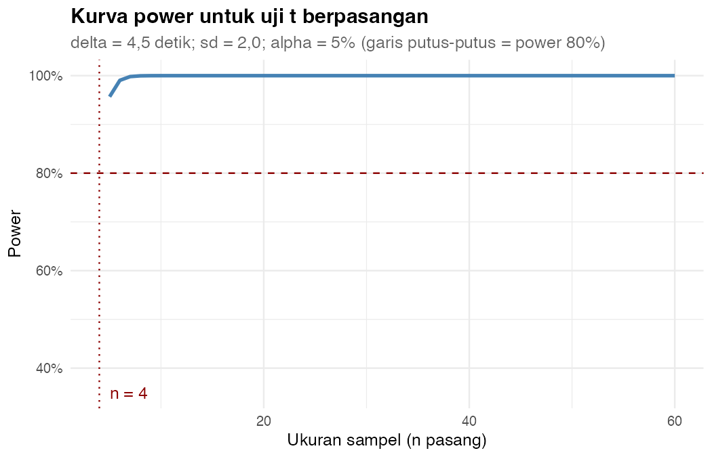

> **Baca begini:** kurva naik cepat lalu mendatar. Dengan **efek besar** (delta 4,5; sd 2,0 → d ≈ 2,25), hanya **4 pasang** cukup untuk power 80%. Inilah gunanya power analysis **sebelum** studi: bila efek kecil (d ≈ 0,2), kamu butuh ratusan sampel — lebih baik tahu sekarang daripada membuang waktu mengumpulkan data yang tak cukup.

**Langkah menghitung power (praktik normal):**

```text
1. Tentukan delta (efek terkecil yang bermakna secara praktis)
2. Estimasi sd dari studi pilot / literatur
3. Tetapkan alpha (0,05) & power (0,80)
4. power.t.test() -> n minimal
```

---

## 17. Menu Cepat: Memilih Uji yang Tepat

### 17.1 Pohon keputusan

```text
Apa tipe variabel hasilmu?
|
|- KATEGORI (ya/tidak, jenis defect)
|   |- 1 kelompok vs target       -> prop.test (1 proporsi)
|   |- 2 kelompok independen      -> prop.test (2 proporsi) / chisq.test
|   |- 2+ kelompok: hubungan      -> chisq.test (+ Cramer's V)
|
|- ANGKA (cycle time, defect rate)
    |- 1 kelompok vs target       -> t.test (1 sampel)
    |- 2 kelompok independen      -> t.test (2 sampel) | Wilcoxon/Mann-Whitney
    |- 2 kelompok berpasangan     -> t.test (paired)   | Wilcoxon
    |- 3+ kelompok                -> aov() + TukeyHSD  | kruskal.test
    |- Hubungan 2 variabel        -> cor.test / lm()   | cor(Spearman)
```

### 17.2 Tabel pemetaan: pertanyaan → uji

| Pertanyaan bisnis | Uji | Fungsi R | Visual |
| --- | --- | --- | --- |
| Rata-rata cycle time melampaui target 45 s? | t 1 sampel | `t.test(x, mu=45)` | V06 |
| Lini A vs B lebih lambat? | t 2 sampel | `t.test(a, b)` | V07 |
| Pelatihan menurunkan cycle time? | t berpasangan | `t.test(a, b, paired=TRUE)` | V08 |
| Defect rate A vs B berbeda? | proporsi 2 sampel | `prop.test()` | V09 |
| Shift & kategori defect terkait? | chi-square | `chisq.test()` | V09 |
| Ada lini yang berbeda? | ANOVA | `aov()` + `TukeyHSD()` | V10, V11 |
| Cycle time & defect berkaitan? | korelasi | `cor.test()` | V12, V13 |
| Bisakah defect diprediksi? | regresi | `lm()` | V14–V16 |
| Data tidak normal / ordinal? | non-parametrik | `wilcox.test()`, `kruskal.test()` | V17 |
| Berapa sampel yang saya butuh? | power | `power.t.test()` | V18 |

---

## 18. Alur Analisis Statistik End-to-End

Inilah alur lengkap yang mengikat semua bab — dari file mentah sampai keputusan manajemen.

```r
suppressMessages({
  library(dplyr); library(tidyr); library(ggplot2)
  library(scales); library(broom)
})

inspeksi <- read.csv("Volume 2 - Statistics and Inferential Statistics/data/statistik_sample.csv") |>
  mutate(Line  = factor(Line, levels = c("A", "B", "C")),
         Shift = factor(Shift, levels = c("Pagi", "Siang", "Malam")))

# LANGKAH 1 — Deskriptif & visual awal
inspeksi |>
  group_by(Line) |>
  summarise(Rate = sum(Defect) / sum(Inspected),
            CT = mean(CycleTimeSec), n = n(), .groups = "drop") |>
  arrange(desc(Rate))

# LANGKAH 2 — Pilih uji & periksa asumsi
shapiro.test(inspeksi$CycleTimeSec)

# LANGKAH 3 — Jalankan uji utama
agg <- inspeksi |>
  group_by(Line) |>
  summarise(d = sum(Defect), n = sum(Inspected), .groups = "drop")

prop.test(agg$d[1:2], agg$n[1:2])          # proporsi A vs B
summary(aov(CycleTimeSec ~ Line, data = inspeksi))
TukeyHSD(aov(CycleTimeSec ~ Line, data = inspeksi))

# LANGKAH 4 — Ukuran efek & kaitkan ke keputusan
summary(lm(DefectRate ~ CycleTimeSec + Line + Shift, data = inspeksi))
```

**Format kesimpulan (kondisi → bukti → tindakan):**

> **Kondisi:** Lini B menyumbang defect terbesar (9,90% vs 3,39% di Lini A).
> **Bukti:** uji proporsi χ² = 529,7 (p < 0,001); ANOVA F = 181,3 (p < 0,001); Tukey menunjukkan B − A = +6,69 s signifikan; regresi berganda tetap menunjukkan LineB = +5,51 poin persen setelah dikontrol.
> **Tindakan:** prioritaskan kaizen Lini B; audit proses shift Malam (defect 7,71% vs 4,71% Pagi); jadikan cycle time > 50 s sebagai trigger inspeksi tambahan.

---

## 19. Sepuluh Prinsip Statistik Inferensial yang Benar

1. **Mulai dari pertanyaan, bukan dari uji.** Tentukan dulu H₀/H₁, baru pilih metode.
2. **Data, bukan opini.** Selalu lihat sebaran (histogram/boxplot) sebelum menghitung.
3. **p-value ≠ besar efek.** Laporkan ukuran efek & CI bersama p-value.
4. **"Tidak signifikan" ≠ "tidak ada efek".** Bisa jadi power kurang (Bab 16).
5. **Signifikan ≠ penting.** Dengan n besar, efek sepele bisa "signifikan" (Bab 11.3).
6. **Cek asumsi, tapi tahu batasnya.** ANOVA tangguh pada n besar; non-parametrik sebagai jaring pengaman.
7. **Korelasi ≠ kausalitas.** Confounding (Bab 14.4) bisa menipu; butuh desain eksperimen untuk klaim sebab.
8. **Waspadai uji berulang.** Untuk 3+ kelompok pakai ANOVA, bukan t-test berkali-kali.
9. **Rencanakan power.** Hitung n minimal sebelum mengumpulkan data.
10. **Reproducible.** Simpan skrip + `set.seed()`; angka di laporan harus bisa dibuat ulang.

---

## 20. Kesalahan Umum dan Solusinya

| Kesalahan | Gejala | Solusi |
| --- | --- | --- |
| Uji t untuk data berpasangan | memakai `t.test(a, b)` tanpa `paired=TRUE` | tambahkan `paired = TRUE` |
| 3× uji t untuk 3 lini | inflasi Type I error | pakai `aov()` + `TukeyHSD()` |
| Uji t untuk proporsi | membandingkan defect rate dengan `t.test` | pakai `prop.test()` / `chisq.test()` |
| Melaporkan p tanpa efek | "p < 0,05, jadi bagus" | tambahkan Cohen's d / η² / CI |
| Mengekstrapolasi regresi | prediksi di luar rentang data | batasi pada rentang pengamatan |
| `NA` di hasil `cor()`/`lm()` | ada baris NA | `na.omit()` atau `use = "complete.obs"` |
| Kolom terbaca `character` | angka jadi teks | `mutate(x = as.numeric(x))` |
| p-value `shapiro` "gagal" padahal n besar | sensitif pada n | kombinasikan dengan Q-Q plot |
| Data tak independen | mis. 1 operator diukur berulang | pakai model berpasangan / mixed model |

---

## 21. Latihan Mandiri (Exercise Bank)

Gunakan `statistik_sample.csv` dan `pelatihan_sample.csv`. Kerjakan dulu tanpa melihat kunci.

### 21.1 Level 1 — Deskriptif & Distribusi

1. Hitung rata-rata, median, dan SD `CycleTimeSec` **per shift**.
2. Buat Q-Q plot `Defect` (bukan rate). Apakah lebih menyimpang dari normal?
3. Simulasi 2000×: ambil sampel n = 50 dari `CycleTimeSec`, hitung SD rata-rata sampel. Bandingkan dengan `sd(pop)/sqrt(50)`.

### 21.2 Level 2 — Estimasi & Uji t

4. Hitung CI 95% rata-rata cycle time untuk **setiap shift** secara manual.
5. Uji apakah rata-rata cycle time shift Malam berbeda dari 45 detik (`t.test`, `mu = 45`).
6. Uji cycle time **shift Pagi vs Malam** (2 sampel independen). Berapa Cohen's d?

### 21.3 Level 3 — Proporsi, ANOVA, Regresi

7. Uji apakah defect rate shift Malam berbeda dari Pagi dengan `prop.test`.
8. Buat ANOVA `CycleTimeSec ~ Product` + Tukey. Produk mana yang paling lambat?
9. Regresi `DefectRate ~ CycleTimeSec` hanya untuk **Lini B**. Apakah slope masih signifikan? Bandingkan R²-nya dengan model seluruh data.

### 21.4 Level 4 — Ukuran Efek & Power

10. Hitung power bila kamu hanya punya n = 10 pasang untuk efek delta = 4,5, sd = 2,0.
11. Berapa n dibutuhkan untuk mendeteksi efek **kecil** (delta = 0,5; sd = 2,0)?

---

### 21.5 Kunci jawaban singkat

```r
# 1
inspeksi |> group_by(Shift) |>
  summarise(rata = mean(CycleTimeSec), med = median(CycleTimeSec),
            sd = sd(CycleTimeSec), .groups = "drop")

# 2
ggplot(inspeksi, aes(sample = Defect)) + stat_qq() + stat_qq_line()

# 3
set.seed(7)
sd(replicate(2000, mean(sample(inspeksi$CycleTimeSec, 50, replace = TRUE))))
sd(inspeksi$CycleTimeSec) / sqrt(50)   # hampir sama -> CLT bekerja

# 4
inspeksi |> group_by(Shift) |>
  summarise(rata = mean(CycleTimeSec), s = sd(CycleTimeSec), n = n(), .groups = "drop") |>
  mutate(lwr = rata - qt(0.975, n - 1) * s / sqrt(n),
         upr = rata + qt(0.975, n - 1) * s / sqrt(n))

# 5
t.test(inspeksi$CycleTimeSec[inspeksi$Shift == "Malam"], mu = 45)

# 6
pagi  <- inspeksi$CycleTimeSec[inspeksi$Shift == "Pagi"]
malam <- inspeksi$CycleTimeSec[inspeksi$Shift == "Malam"]
t.test(pagi, malam)
(mean(malam) - mean(pagi)) / sqrt((var(pagi) + var(malam)) / 2)

# 7
inspeksi |> group_by(Shift) |>
  summarise(d = sum(Defect), n = sum(Inspected), .groups = "drop") -> sh
prop.test(sh$d[c(3, 1)], sh$n[c(3, 1)])   # Malam vs Pagi

# 8
summary(aov(CycleTimeSec ~ Product, data = inspeksi))
TukeyHSD(aov(CycleTimeSec ~ Product, data = inspeksi))

# 9
inspeksi_b <- subset(inspeksi, Line == "B")
summary(lm(DefectRate ~ CycleTimeSec, data = inspeksi_b))

# 10
power.t.test(n = 10, delta = 4.5, sd = 2.0, sig.level = 0.05, type = "paired")$power

# 11
power.t.test(delta = 0.5, sd = 2.0, sig.level = 0.05, power = 0.80, type = "paired")$n
```

---

## 22. Checklist Penyelesaian Volume 2

- [ ] Dataset `statistik_sample.csv` & `pelatihan_sample.csv` terbentuk (`00_buat_data.R`)
- [ ] Deskriptif & Q-Q plot dibuat (V01, V02)
- [ ] Paham distribusi sampling & CLT (V03, V04, V05)
- [ ] CI rata-rata dihitung & divisualkan (V06)
- [ ] Uji t 1 sampel, 2 sampel, berpasangan dijalankan (V07, V08)
- [ ] Uji proporsi & chi-square dijalankan (V09)
- [ ] ANOVA + Tukey + cek asumsi (V10, V11)
- [ ] Korelasi Pearson/Spearman + heatmap (V12, V13)
- [ ] Regresi sederhana + diagnostik residual (V14, V15)
- [ ] Regresi berganda + visual koefisien (V16)
- [ ] Non-parametrik sebagai pembanding (V17)
- [ ] Ukuran efek & power analysis (V18)
- [ ] Bisa memilih uji yang tepat (Bab 17)
- [ ] Menulis kesimpulan format kondisi–bukti–tindakan

---

## 23. Referensi dan Berkas

| Berkas/Materi | Lokasi |
| --- | --- |
| **Cheatsheet Volume 2 (sintaks uji statistik)** | `CHEATSHEET.md` (di folder ini) |
| Generator data | `R/00_buat_data.R` |
| Skrip analisis lengkap | `R/01_statistik_inferensial.R` |
| Dataset inspeksi | `data/statistik_sample.csv` (360 × 9) |
| Dataset pelatihan (berpasangan) | `data/pelatihan_sample.csv` (30 × 4) |
| Galeri visual | `output/` (18 PNG + 7 tabel CSV) |
| Volume 0 — Basic R | `../Volume 0 - Basic R/README.md` |
| Modul statistik dasar | `../README_Basic_R.md` (Bab 9) |
| Volume 1 — Basic Visualization ggplot | `../Volume 1 - Basic Visualization ggplot/README.md` |
| Volume 3 — Case Study Industrial Engineering | `../Volume 3 - Case Study Industrial Engineering/README.md` |
| OpenIntro Statistics (gratis) | <https://www.openintro.org/book/os/> |
| R for Data Science (2e) | <https://r4ds.hadley.nz/> |
| Dokumentasi `stats` (base R) | <https://stat.ethz.ch/R-manual/R-devel/library/stats/html/00Index.html> |
| broom (tidy model) | <https://broom.tidymodels.org/> |

---

*README Volume 2 — Statistics & Inferential Statistics: dari deskriptif, distribusi sampling, uji hipotesis, ANOVA, korelasi–regresi, hingga ukuran efek & power. Bagian dari rangkaian pelatihan "Insight to Impact".*

